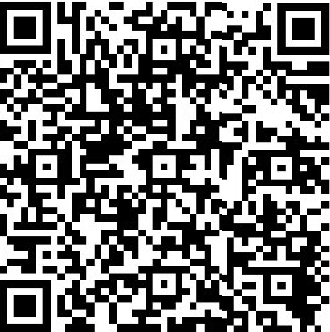

# 奇怪的TTL字段

[题目地址](https://adworld.xctf.org.cn/challenges/details?hash=64c4b8ed-41fb-42d7-b24b-0fb24be3d919_2)

misc我恨你。

附件是一个txt。里面记录了一段ttl，共有4种值：127，191，63，255。肯定不是ascii，已经超出范围了。我还在想有啥密码可以用四种值来表示的，连模密码都想了，就是没想到正确的(⌒-⌒; )。

没思路了，查wp。大佬们说是二进制。想想也有道理，0和1正好有四种组合。还是经验少了，没法联想到二进制上。把这四种值转为二进制就很明显了。

- 00111111 63<br>01111111 127<br>10111111 191<br>1111111 255

提取出来拼在一起会变成16进制，以ffd8开头，那就是jpg图片了。快乐冲浪找到了一个不错的实现。

```python
import binascii
with open('./ttl.txt', 'r') as file:
    lines = file.readlines()
    ttl_data = ''
    for line in lines:
        prefix = "{0:b}".format(int(line[4:])).zfill(8)
        ttl_data += prefix[0:2]
flag = ''
for i in range(0, len(ttl_data), 8):
    flag += chr(int(ttl_data[i:i + 8], 2))
flag = binascii.unhexlify(flag)
with open('.res.jpg', 'wb') as file:
    file.write(flag)
```

- ### zfill
  > 返回指定长度的字符串，原字符串右对齐，前面填充0。
  - 语法：str.zfill(width)
  - 参数：width -- 指定字符串的长度。原字符串右对齐，前面填充0。

"{0:b}".format(int(line[4:]))是python里面的格式化字符串，{0:b}表示将format里的内容转为二进制,跟bin函数的效果一样，但是bin转换前面会有个0b。补0的原因是无论format还是bin转换时都会把开头的0省略掉，比如63会转成111111，而不是00111111，正好把我们想要的省略掉了可不行。zfill完美解决问题。

然后每8位作为一个字符，拼接到flag上。hex解码后写入res.jpg。


这一小块二维码是什么意思？binwalk可以发现里面有隐藏更多的jpg，但是无法提取，需要foremost。我又没有，于是找到了个在线[foremost](https://www.aperisolve.com/394d11f98aac2fdd66a1d8f20648dbc2)，还可以搞其他的隐写内容。

下载foremost结果就得到了二维码拼图。才六块还好，要是更多我打死出题人。拼的时候要注意大的三个方块在左上，右上和坐下，同时注意剩下的小方块呈九宫格分布。拼出来扫就完事了。



最后有个简单的密码。key也给你了，直接[放到这](https://www.dcode.fr/autoclave-cipher)就真的结束了。

- ### Flag
  > flag{2028ab39927df1d96e6a12b03e58002e}