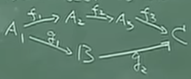
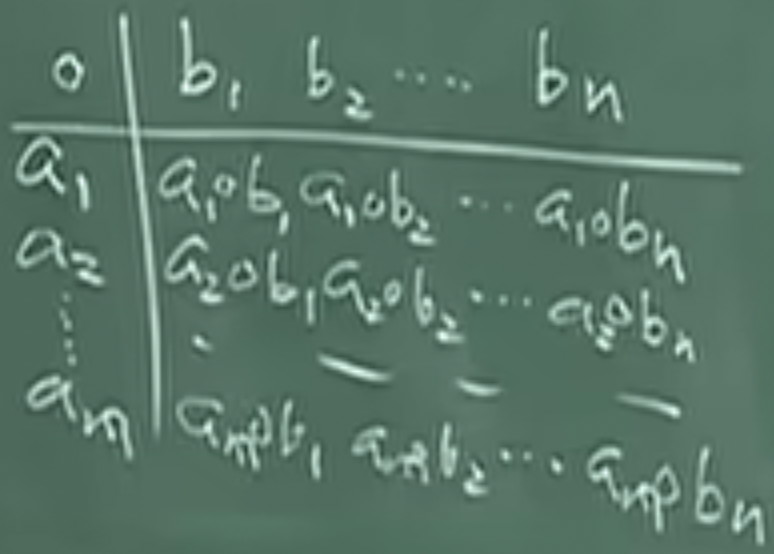

# 抽象代数

[课程地址](https://www.bilibili.com/video/BV1eE411b7Xq/)

抽象代数中有一个代数体系，简单的解释就是集合+运算。一切都要从运算和关系开始。集合和映射的概念是基础中的基础，不过这里要说明一点，集合不给出定义，否则会出现悖论。

## 2-1-1运算及关系2

定义 1.1.1:设 $A_0$ 为A的子集，定义 $A_0$ 到A的映射 $i:A_0\rightarrow A$ 使i(x)=x, $x\in A_0$ 。这类型的映射似乎啥也没干，有个名字：i为 $A_0$ 到A的嵌入式映射。

定义1.1.2:设 $A_0$ 为A的子集，f为A到B的映射，g为 $A_0$ 到B的映射。如果f(x)=g(x)， $\forall x\in A_0$ ，则称f为g的开拓，g为f（在 $A_0$ 上）的限制，记为 $g=f|_{A_0}$ 。还有一个很关键的东西：交换图。假如我们有：

$f_1:A_1\rightarrow A_2$ 
$f_2:A_2\rightarrow A_3$ 
$f_3:A_3\rightarrow C$ 

则 $f_3f_2f_1:A_1\rightarrow C$ 。如果又有：

$g_1:A_1\rightarrow B$ 
$g_2:B\rightarrow C$ 

则 $g_2g_1:A_1\rightarrow C$ 。这种情况下， $f_3f_2f_1=g_2g_1$ ，有交换图：

当映射关系复杂时，交换图的表示方式会比公式简单。例1：设 $A_0$ ，A，B关系如1.1.2，f为g的开拓，则交换图为：

其中i为1.1.1中的嵌入式映射，由此可看出嵌入式映射的作用。

定义1.1.3:设 $A_1,A_2$ 为两个集合，则 $A_1\times A_2=\{(a,b)|a\in A_1,b\in A_2\}$ 。集合 $A_1\times A_2$ 称为 $A_1$ 与 $A_2$ 的直积。类似定义 $A_1,A_2...A_n$ 的直积。注意(a,b)是有序对。

接着是运算。运算从小学就有接触了，但是你能给出一个准确的定义吗？无论是加减还是乘除，它们的本质都是两个元素经过某种法则得到一个元素。于是有定义1.1.4:设A，B，D为三个非空集合，一个映射f， $A\times B\rightarrow D$ ，称为A与B到D的一个代数运算。 $A\times B$ 刚才学过，结果是有序对的集合，完全符合刚才说的“两个元素经过某种法则得到一个元素”。

例2:设V位线性空间，数域为P。V中的加法为 $V\times V\rightarrow V$ ；P与V的[数乘](https://zh.wikipedia.org/wiki/%E6%A0%87%E9%87%8F%E4%B9%98%E6%B3%95)（也叫纯量乘法）为 $P\times V\rightarrow V$ 。

例3:P为数域， $P^{n\times n}$ 为P上n阶方阵集合。矩阵加法，乘法都是 $P^{n\times n}$ 与 $P^{n\times n}$ 到 $P^{n\times n}$ 的代数运算。

特别地，如果A，B，D都相同，代数运算f被称为A上的二元运算。既然代数运算这么重要，有专门的符号表示才好。如果按照定义里面的映射方式，假如4个元素a，b，c，d运算，结果可能是 f(d,f(f(a,b),c))，太麻烦了。我们完全可以将两个元素间的运算简写为 $a\circ b$ ，甚至于直接ab（这里的ab不仅仅是乘法，也可以是加法等任意运算）。那刚才的结果就能写为d((ab)c)，假如有结合律的话还能简化为dabc。

运算有了，运算规律可不能少。定义1.1.5:设A上定义了二元运算，满足ab=ba， $\forall a,b\in A$ 。称二元运算满足交换律。

定义1.1.6:设A上定义了运算，满足a(bc)=(ab)c, $\forall a,b,c\in A$ ，称运算满足结合律。

定义1.1.7:设A上定义了两种运算 $\circ,+$ ，满足 $a\circ(b+c)=a\circ b+a\circ c,\forall a,b,c\in A$ 。称满足" $\circ$ "对“+”的左分配律。因为" $\circ$ "在“+”左边，相应的还有右分配律。以后统一称分配律。

如果A上有代数运算并满足结合律， $a^n,n\in N$ 就有了定义。如果进一步满足交换律，更有 $(ab)^n=a^nb^n$ 这一重要定理。

## 3-1-1运算及关系3

假如 $A\times B\rightarrow D$ ，且|A|< $\infty$ ,|B|< $\infty$ （||不是绝对值而是集合的阶，也就是元素数量），就能写出运算表。让 $A=\{a_1,a_2...a_m\},B={b_1,b_2...b_n}$ ，运算表如下：

如果A和B相等，得到的结果就是一个N\*N的方阵。这种情况下如果想看是否满足交换律，只需要看对角线是否对称。

那么如何构造集合？介绍一种构造新集合的方法——关系。关系指非空集合A中一种对两个元素而言的一种性质，使A中任何两个元素或有这种性质，或没有这个性质。简单来说就是“二者必居其一”。如A=R，有关系“>","="," $\geq$ "，随便选取 $a,b\in R$ ，这两个元素要么满足关系，要么不满足，不会出现看不出来的情况。如果我们将关系用R表示，a与b有关系R能记为aRb；无关系R记为 $a\not{R}b$ (R中间有一撇，打不出来)。将有元素的关系对构成 $A\times A$ 的子集R， $R=\{(a,b)|aRb\}$ 。反之， $A\times A$ 中一个子集R，则可定义关系R，使 $aRb\leftrightarrow (a,b)\in R$ 。明白这点后，前面那个啰嗦复杂的定义就能被简写为：

定义1.1.9:设A为非空集合，A中一个关系为 $A\times A$ 中的一个子集R。将关系抽象为一个集合，妙啊妙啊。

定义1.1.10:设非空集合A中定义了关系R。若R满足条件：

1. 反射性: $\forall a\in A,aRa$
2. 对称性: $aRb\rightarrow bRa$
3. 传递性: $aRb,bRc\rightarrow aRc$

则称R为等价关系。

例8: $P^{n\times n}$ 中的“[相似](https://zh.wikipedia.org/wiki/%E7%9B%B8%E4%BC%BC%E7%9F%A9%E9%99%A3)”关系是等价关系。 $A=T'ST$ ，T取单位矩阵即可满足反射性； $T'AT=S$ ，满足对称性；传递性也没有问题。

定义1.1.11: 设有非空集合A，A的一个划分（分类）是指A中一些子集合的集合，满足 $\forall a\in A$ ，a包含且只包含在一个子集合中。A中一个划分就是将A写成一些不相交的非空集合的并。 $A=\cup A_i,i\in I$ 。对于每一个i， $A_i$ 都不能是空集。以及， $\forall i,j\in I,i\not ={j},A_i\cap A_j$ 为空集，即不相同的两个子集中元素不能重复。

把分类和等价关系联系起来就得到了本课第一个定理。

定理1.1.1: A的一个分类决定A中一个等价关系。

定理自然需要证明一下。设 $A=\cup_{i\in I}A_i$ ，任意一个 $A_i$ 都非空集； $A_i\cap A_j$ 得到空集合， $i\not ={j}$ 。定义关系R： $aRb\leftrightarrow \exist i$ ，使 $a,b\in A_i$ （a与b在同一个类里）。关系很容易看出，但一定是等价关系吗？需要一条一条地看条件。

1. 反射性。这个肯定，a和a肯定是落到同一个类里面。
2. 对称性。如果a和b落到同一个类里，b与a自然也是落到同一个类里。
3. 传递性。有aRb，bRc。 $aRb\rightarrow \exist i,a,b\in A_i$ ; $bRc\exist j,b,c\in A_j$ 。马上就能看出 $A_i\cap A_j$ 不为空集合，那只能是i=j了。说明 $a,c\in A_j$ ，故aRc。

证明完毕，R为等价关系。