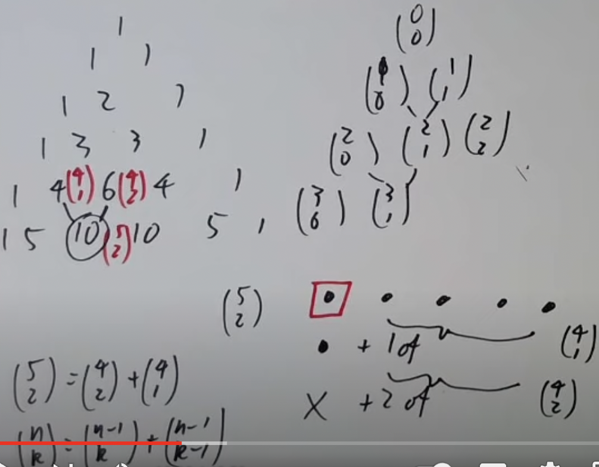
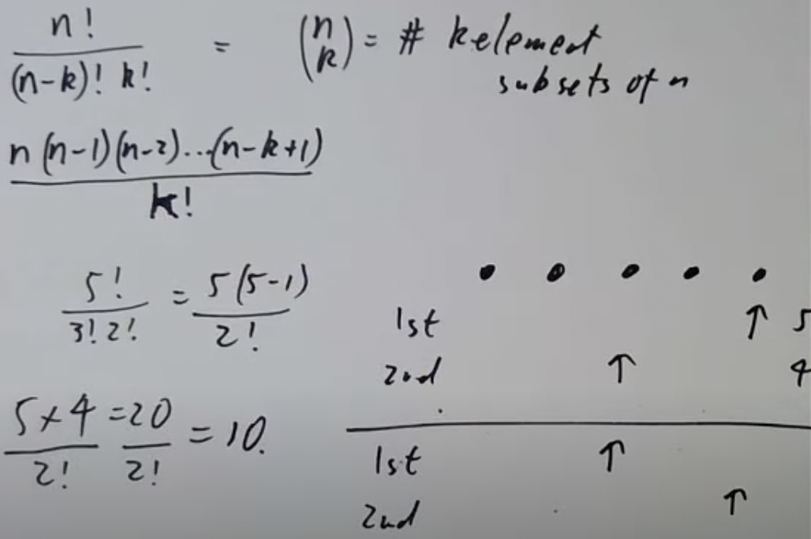
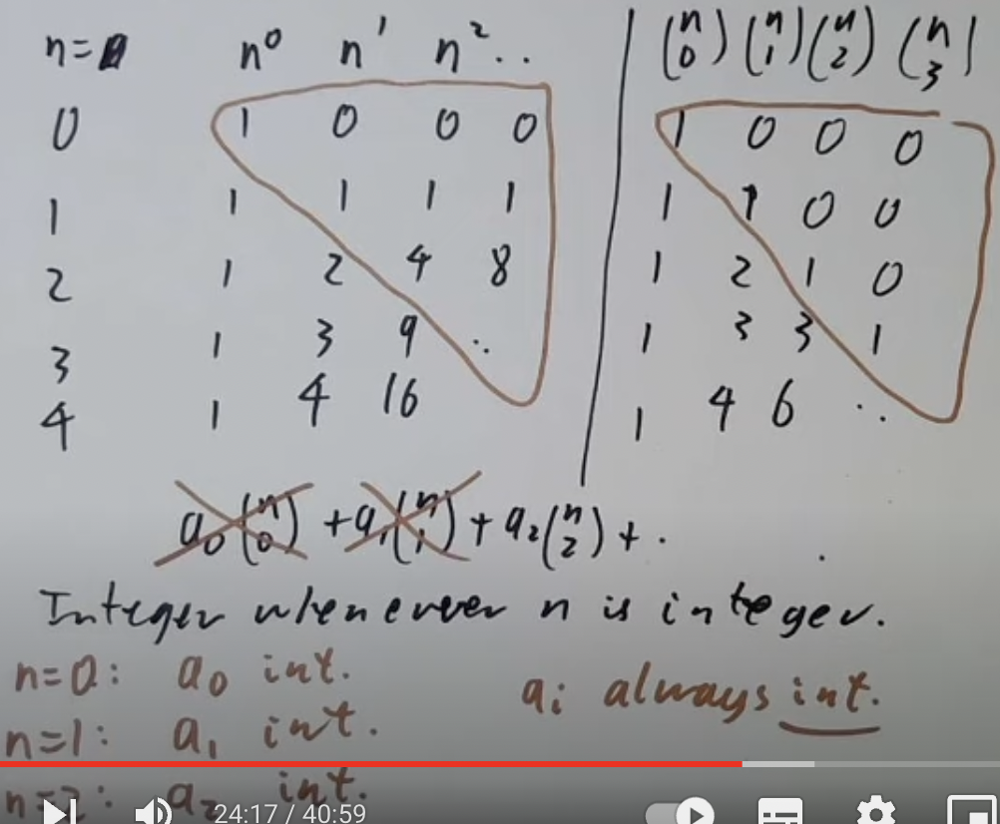

# 数论学习

我又来学数论了，因为抽象代数真的太难了，英语又差，听又听不懂，学也学不好。撑了一会还是决定放弃转数论。使用这个[课程](https://www.youtube.com/watch?v=EzE6it9kAsI&list=PL8yHsr3EFj53L8sMbzIhhXSAOpuZ1Fov8)，仍然和学群论时是一个教授。虽然我群论啥也没听懂，但是听不懂数学顶级教授的课绝对是我太菜的问题。现在开始吧。

github对数学公式的支持很迷，因此文章内很多数学公式都没法展示。可以拷贝下来用另外的markdown渲染引擎看。我自己就是这样的，用vscode的markdown all in one插件写和看。直到今天我发现github的markdown其实已经支持公式了，只是美元符号需要与其他字符空格开来。我慢慢改，一天改一篇。

## Introduction to number theory

说到数论不得不提到质数。先介绍一种名叫Eratosthenes的方法。这个方法非常简单粗暴，把所有数字写在一张纸上，然后排除一定不是质数的0和1，于是第一个质数是2。接着把之后所有是2的倍数的数字全部划掉，它们不可能再是质数了。划完后找下一个没有被划掉的数字3，圈起来并继续划掉3的倍数。下一个圈起来的数是5……如此往复找质数就很容易了。但是一共有多少个质数呢？由此牵扯到数论的第一个定理：质数的数量是无限的。

这最早由Euclid提出，不过他最开始不是这么说的。希腊人不喜欢“无限”的概念，于是他换了一种说法：取有限的质数$P_1...P_n$，可以找到另外一个不在此集合中的质数。他求出这些质数的乘积后加1，$P_1*P_2*...*P_n+1$，然后找到这个数的一个素数因子$P_{n+1}$。会发现这个素数因子不可能在已有的质数集合$P_1...P_n$中，因为在已有的质数集合中的质数无论如何都不可能整除于其乘积+1。由此得出$P_{n+1}$是一个新质数。


上图展示了这一流程。注意所有已知质数的乘积+1不一定是一个质数，比如最后一步。目前我们有了找质数的稳定方法，可是这个方法生成的质数不一定一个比一个大，怎么找大质数呢？有种Mersenne质数，其形如$2^n-1$。试一下，$2^2-1=3,2^3-1=7,2^4-1=15=3*5$,不对啊，这哪是质数？确实不是，因为使用的n不是质数。$2^{ab}-1=(2^a-1)*(2^{ab-a}+...+1)$，会被$2^a-1$整除。好，从现在开始我们只取n为质数，$2^5-1=31,2^4-1=127,2^11-1=2047=23*199$。又不是质数了。没错这个方法就是这样，虽然$2^n-1$，n为质数时很多时候都是质数，不过总有一些例外。其实也是个不错的生成质数的方法了。不过这个方法可以一直用吗？换句话说，是否有无数多个Mersenne质数？这个问题目前还没有被解决，所以我就等着各位在国际数学界一展风采了:D

另一种长得很像的质数是费马质数，形如$2^n+1$。$2^0+1=2,2^1+1=3,2^2+1=5,2^3+1=9=3*3$。这个不是质数，因为当$2^{ab}+1$的a是奇数时，整个式子整除$2^a+1$。为了防止这种情况发生，我们可以取这种质数，$2^{2^m}+1$。$2^{2^0}+1=3,2^{2^1}+1=5,2^{2^2}+1=17,2^{2^3}+1=257,2^{2^4}+1=65537$。这些数都被称为费马质数。费马曾经以为所有形如$2^{2^m}+1$构建的数都是质数，但是$2^{2^5}+1$整除641。我们都知道费马也算数学界的传奇人物了，这个小错误完全有可能是因为他算错了，就这么朴实无华。至于费马质数的应用，你会在一个八杆子打不着的地方发现它们的身影——哪些正多边形可以只用尺子和圆规来构造？高斯发现如果一个数是费马质数，那么就可以。甚至说，所有你可以只用尺子和圆规来构造的多边形都是不同的费马质数于2的幂的乘积。人们往后推了几个情况，都没有再发现新的费马质数。关于费马质数是否有无限多个的问题仍然值得探讨，不过我们可以笃定，费马提出的这种方法并不是那么容易找质数。

到底有没有简单的方法来生成大质数？比如一个多项式f(n),结果永远是质数。这个多项式不能是f(n)=3这种无聊的玩意，即不能为常数项。欧拉找到一个，$n^2+n+41$，然而仅适用于41之前的情况。当n=41时，整个多项式自然就能整除41了。事实证明这样的多项式不存在。让$f(n)=an^k+...+bn+c$，假如常数项c大于1，那么在n=c时f(n)绝对整除c，毕竟整个式子每一个项都是c的倍数。说明常数项只能等于1。但是常数项等于1时我们可以将$f(n)$转为$f(n+j)$，让常数项不等于1，重复刚才的论点。至此我们知道没有非平凡的多项式能永远生成质数。甚至说，人们到现在还没有找到能稳定生成质数的捷径，搞到最后第一种看起来傻瓜的方法竟然是最好用的。

看了这么久“是否有无限质数”，不如把目光放到有限的世界上来。有多少小于x的质数？这个问题可以用$\Pi(x)$表示，此处的$\Pi$不是3.14159那个，而是希腊字母里表示P的字母。正如无法找到永远生成质数的多项式，我们也无法准确知道$\Pi(x)$的值，但是我们可以粗略估计。高斯提出了一个式子，$\Pi(x)\cong \frac{x}{log(x)}$。注意在数学的世界里，log总是代表以e为底的对数。这个式子直到19世纪才被证明，高斯确实牛逼。用不正规的理解就是，n是质数的几率大概为$\frac{1}{log(n)}$。你可能会觉得，n要么就是质数，要么不是，怎么还有机率的？说n是质数的机率是xxx多少有点毛病。也对，这就靠意会了。

这个公式可以应用于刚刚提到的Mersenne质数：Mersenne质数的数量是无限的吗？按照公式和Mersenne质数的定义，$\frac{1}{log(2^n-1)}=\frac{k}{n}$,这是其中一个Mersenne数是质数的机率。把所有机率加起来，$\sum_n \frac{k}{n}=k(1+\frac{1}{2}+\frac{1}{3}+...)=\infin$，微积分经典调和级数，和为无限，那一共就有无限个Mersenne质数？有点问题，这个论点假设Mersenne质数是随机的，可是它们显然不是，都是$2^n-1$结构的。更离谱的问题在于，当我们拿同样的方法找形如$2^n-2$的数中有多少是质数时，结果应该也是无限个。这不是在搞笑吗，$2^n-2$明显整除2，除了n=2的情况时是个质数。所以这种机率只能用做一个方向指导，实际证明时要谨慎使用，你不知道能搞出来什么幺蛾子。这也是数论中的一个经验法则，所有用上概率参数的证明都非常简单，然而完全不严谨，还有可能给出错误答案，基本没用。

到底有多不严谨和模糊呢？拿费马质数举例子。$2^{2^n}+1$，$\sum \frac{1}{log(2^{2^n}+1)}\approx k\frac{1}{2^n}<\infin$。这说明费马质数的数量应该是有限的。但是我们换种说法，$2^n+1$,$\sum \frac{1}{log(2^n+1)}\approx k\frac{1}{n}=\infin$,这回又有无限多个了。两种形式都是费马质数，所以到底哪个是对的？谁也不知道。

另一位数学家同样发现了求小于x的质数的数量的公式$Li(x)=\int^x_0\frac{1}{log(x)}dx$。此处的等于号并不是完全等于，有“大概”的意思，因为当x=1时，整个积分是发散的。黎曼更是有特别的想法，既然数质数这么难，不如我们数质数幂吧？$p^n$应该算作质数的$\frac{1}{n}$。由此有定义$\Pi'(x)=$小于x的质数幂数量($p^n$算作$\frac{1}{n}$)。黎曼真的找到了这个式子，$Li(x)-\sum_\rho Li(x^p)$。接着我们知道$Li(x)\approx \frac{x}{log(x)}$，这也能解释上一个数学家的式子是哪里来的了。很神奇的地方是，$\Pi'(x)$明显为一个非连续函数，但是它竟然可以用一系列连续函数的和表示。sum使用的$\rho$不是p，这在数学中一般表示一个变量，这里特别表示[zeta函数](https://zh.wikipedia.org/wiki/%E9%BB%8E%E6%9B%BC%CE%B6%E5%87%BD%E6%95%B8)的零项(zeros of zeta function)。

我表示还是不懂$\rho$是什么东西。首先要知道zeta函数长啥样：$\Zeta(s)=\frac{1}{1^s}+\frac{1}{2^s}+\frac{1}{3^s}+...$，$\rho$就是满足$\Zeta(\rho)=0$条件的数。

似乎有点困难，温习算术基本定理来休息一下。任何大于等于1的整数都可以以独特的方式表达为素数的乘积。这在zeta函数中有使用，欧拉发现$\frac{1}{1^s}+\frac{1}{2^s}+\frac{1}{3^s}+...+\frac{1}{90^s}=\frac{1}{1-2^{-s}}\frac{1}{1-3^{-s}}\frac{1}{1-5^{-s}}...$，这是所有质数的积。乍一看觉得很神奇，不过把式子写成级数后就很容易了。$(1+\frac{1}{2^s}+\frac{1}{4^s}+\frac{1}{8^s}...)(1+\frac{1}{3^s}+\frac{1}{9^s}...)(1+\frac{1}{5^s}+...)$，把原式每一项写为一个级数之和，然后取出每个级数的一个项相乘。比如在第一个级数中取$\frac{1}{2^s}$,第二个级数中取$\frac{1}{9^s}$,第三个级数中取$\frac{1}{5^s}$，剩下的级数都取1，就得到了$\frac{1}{2^s}*\frac{1}{(3^s)^2}*\frac{1}{5^s}=\frac{1}{2*3^2*5}=\frac{1}{90}$。不难猜测第一个式子中的每一项都可以由无限级数乘积中的独特组合来表示，正是因为任何整数都能以唯一的方式写成素数幂的乘积。这个神奇的分解是欧拉给出的，他还将第一个式子用来证明质数有无限多个。取s=1，第一个式子就成了简单的调和级数，和无限，发散。既然第一个式子是无限的，第二个式子的素数乘积必然也是无限的。如果不是，其乘积一定是非0有限数，不可能等同于第一个式子的无限，因此素数的数量是无限多个。

接下来看看丢番图方程（Diophuntine equations)。此类方程专注于找整数解，最著名的一个莫过于$x^2+y^2=z^2$，勾股定理；线性方程同样很常见，$27x+11y=1$；二次方程总不可能被排除,$2x^2=y^2$。这个方程变换一下相当于问$\frac{y}{x}=\sqrt{2}$，根号2是有理数吗？换句话说，证明这个式子没有非0整数解等同于证明根号2不可能是有理数。还是很好解的，根据方程可以看出y一定是偶数，因为左项很明显就是偶数，如果是奇数就不可能有整数解了。两边同时除以2，得到$x^2=\frac{y^2}{2}$，又出现了一个满足原方程的解。如果一个方程有解，那一定会有一个最小解，但是这么除下去没有个头，只能说明原方程根本无解。很经典的一个证明方法，[无穷递降法](https://zh.m.wikipedia.org/zh-cn/%E6%97%A0%E7%A9%B7%E9%80%92%E9%99%8D%E6%B3%95)。

气氛都到这里了不介绍一下“臭名昭著”的费马大定理我不是很认可。$x^n+y^n=z^n$，要求n大于等于3，x，y，z都是非0项。自从费马家的书空白页太少，这个问题就一直是数学界最著名的问题之一。直到1990年被Wiles证明。这有很多变种，比如$x^4+y^4+z^4=z^4$，你能看出来这个方程有没有解吗？答案是有，就是有亿点大。判断一个丢番图方程有没有解很困难，要么难以证明无解，要么有解但是很大，简直太难找了。不禁让人想问个问题：有没有一种算法可以解出所有丢番图方程？比如f(x,y,z...)，算法会直接告诉你无解或者给出解。然而是不可能的，已经有人证明了。

最后一种介绍的丢番图方程是[佩尔方程](https://zh.wikipedia.org/wiki/%E4%BD%A9%E5%B0%94%E6%96%B9%E7%A8%8B)……的变种。形如$x^2=Dy^2\pm 1$，比如$x^2=94y^2+1$。佩尔方程邪恶的地方在于看起来人畜无害的小系数最后可能会有大得离谱的解。

## Survey

暂时不知道这集的名称survey是什么意思，但是我知道要从模的同余开始。模的应用非常广泛，比如$1234567=x^2$有解吗？这题太简单了，没有，因为任何一个平方数的个位只能是$0^2,1^2,2^2...9^2$的个位，即0，1，4，9，6，5，6，9，4，1之间的一个，7不是，自然就不可能是平方数了。这涉及到模10的同余,同余记做$a\equiv b\mod m$，意味着a-b整除于m。$1，2，3，4，5，6，7\equiv 7\mod 10$，$x^2\not\equiv 7 \mod 10$。

有了同余这一利器，我们可以解决更复杂的问题。$1000003=x^2+y^2$是否有解？倒是可以一个一个试，但是有简单方法不用不是傻子吗？$x^2\equiv 0,1\mod 4,x^2+y^2=(01)+(01)=0,1,2\mod 4$，然而1000003模4不与0，1，2同余，故无解。至于为什么选模4，教授没有明说，个人觉得选别的也行，只要模的结果好算就得了。1000003模4一眼就看得出来是3，模10应该也是可以得出来一样的结论的。

说到同余怎么能不带费马小定理玩？当p为质数时，$x^p\equiv x\mod p$，另一种形式是$x^{p-1}\equiv 1\mod p$。欧拉也有一个很像的定理，当x，m互质时，$x^{\phi(1)}\equiv 1\mod m$。$\phi$是一个函数，$\Phi(m)=$1,...m-1中与m互质的数的数量。这两个定理堪称数论的基石，非常有用也不是很难。比如在n很大时，用于测试n是否是一个质数。使用费马小定理，验证$2^n\equiv 2\mod n$？如果不满足，n绝对不是一个质数；如果满足，n也许是一个质数。满足的情况如果想进一步验证，可以将底数2换成别的继续试。同余还能和丢番图方程扯上关系。如果f(x,y,z)=0，那么$f(x,y,z)\equiv 0\mod m$。这表示如果我们能以整数解的形式解出f(x,y,z)=0这样的多项式，那么任意找一个m都能满足同余条件。Hasse定理大概是其逆定理，不过不完全正确。对于线性方程大多数情况下逆定理成立，然而更高次的方程就不太行了。

看一个基础的二次方程，$x^2\equiv a\mod p$。这里的a也叫二次剩余。当p=7时，$0^2=0,1^2=1,2^2=4,3^2=9\equiv 2,4^2=16\equiv 2...$，能看出a的可能值只有0，1，2，4。有一个很好玩的符号，$(^a_p)$，当a是p的二次剩余时等于1，不是时等于-1，a能被p整除时等于0。二次剩余很重要的一个定理是二次互反律（quadratic reciprocity）：p,q都为质数时，$(^p_q):(^q_p)$之间有某种神奇的关系。如果$x^2=p+qy$有解，$(^p_q)$为1；如果$x^2=q+py$有解，$(^q_p)$为1。这俩方程很像，但好像真没别的联系了……吗？欧拉发现，当q或者p中有一个模4与1同余，则$(^p_q)=(^q_p)$;当p，q模4都与3同余时，$(^p_q)\not =(^q_p)$。这恰恰说明两个式子之间有着奇妙的联系。

练习一下新学的二次互反律吧。3是71的二次剩余吗？我们将描述转换成方程的形式，$x^2\equiv 3\mod 71$,问题就变成了更数学的问题：$(^3_{71})=1$?又根据二次互反律，等同于问$(^{71}_3)=1$?可是无论是3还是71，它们模4都和3同余，只能是相反的情况。$71\equiv 2\mod 3$，2不是一个平方数，所以$(^{71}_3)=-1$。既然两者相反，原问题$(^3_{71})=1$。

现在让我们放宽视野，粗略认识数论的一个分支：加法数论（additive number theory)。论如其名，这是个讨论把东西加在一起会发生什么的分支。一个著名的问题goldback：是否所有大于等于4的偶数都是2个质数的和？比如12=5+7，14=7+7，16=5+11...这个问题非常难解决，有两位数学家证明了它的弱化版本——任何足够大的奇数都是3个素数的和。时间再往后推一点，又有一位数学家证明了其没那么弱化的版本——每个偶数都可以写为p+qr的形式，p，q，r都是质数。两个质数的乘积和单纯质数很接近了，然而还是弱化版本，这也是人类目前为止在这个领域的所有进展。另一个相似的未解之谜是孪生素数（twin prime）问题：在p为质数的前提下，是否能找到无限个形如p，p+2的质数？目前数学家们倒是证明了p，p加上几百的情况，可惜离2还有很长的路要走。以及素数的算术级数（arithmetic progressions)问题。一个素数算术级数的例子是5，11，17，23，29，长度为5，差为6。问题在于你能找到任意长度的算术级数吗？在你还没开始想之前，狄利克雷再甩给你一个问题：对形如a+nb的数取其算术级数，比如1+10n，要求所有个位为1的数。证明在任意算术级数中都有无限多个素数，当然a，b互质。

狄利克雷的问题其实是下面这个一般定理在1次时的特例($a_0+a_1n$,能随意拆）。有多项式$a_0+a_1n+a_2n^2+...$，这个多项式是否表示了无限多个质数？$n^2+n=n(n+1)$的情况肯定不行，除了某些特殊的n值外，原多项式可以被因式分解，分解了不就很明显不是质数了吗？因此我们还要加个限制，多项式不能被因式分解。结果还是不行，$n^2+n+4$不会被分解，但是$n^2+n$明显是个偶数，偶数加偶数还是偶数，整个多项式总是偶数，更不可能是质数了。那我们就直接假设当算术级数不能被分解，无法整除大于1的数时，是否能表示无限数量的素数？$n^2+1$看起来满足这些要求，却也掩盖不了$8^2+1=65$不是质数的事实。这个问题目前无人解答，学到这里这么多未解之谜出现了你不去试一下？

试完了吗？有点累？那推荐给你休闲数论（recreational number theory），下班放学休闲必备。完美数（perfect number）代表所有恰当因数（proper divisor，数字本身不算在内）之和是本身的数。6=1+2+3，28=1+2+4+7+14。休闲数论的创始人很会取名字，诸如友好数字（amicable numbers）。220和284是一对友好数字，220的所有真除数（proper divisor）相加等于284，284的所有真除数相加等于220。真除数指的是小余被除数的除数，这个除数必须整除于被除数且是正整数。比如20的5个真除数是1，2，4，5，10。玩了一会休闲数论，你的灵魂一定会问你：“啊这有什么用吗？”也许跟其他分支比起来就是没有用，但是休闲，不就是玩吗，玩要什么意义呢？ᶘ ᵒᴥᵒᶅ

代数数论（algebraic number theory）。一个很经典的代数例子是复数m+ni，$i=\sqrt{-1}$。这类数字被称为高斯整数（Gaussian ints），和普通整数很相似，比如它们都可以被拆分为独特的质数之积。不过高斯整数的质数就不是5什么的了，因为5=(2+i)(2-i)。这么看下来高斯整数简直太适合处理两个平方的和了，$(m+ni)(m-ni)=m^2+n^2$。平时熟悉的数也可以用奇奇怪怪的方式分解，$65=8^2+1^2=7^2+4^2=(8+i)(8-i)=(7+4i)(7-4i)$，进一步分解还能得到(2+i)(2-i)(3+2i)(3-2i)，最后一种是高斯整数的素数分解方式。费马继续来插一脚，如果p是质数，$p\equiv 1\mod 4$，则$p=n^2+m^2$。

最后看一下组合数论（combinatorial number theory）就收工。n的partition表示所有能将n写为更小的正整数的和的形式的数量。$p(n)=a_1+a_2+a_3$。我真不懂这个怎么表达，看例子。5=5=4+1=3+2=3+1+1=2+2+1=2+1+1+1=1+1+1+1+1,一共7种，所以p(5)=7。尝试证明这个定理：p(5n+4)整除5。一定要试试，因为教授说大概率做不出来ʕ •ᴥ•ʔ

## Divisibility and Euclid's algorithms

定义a|b为a整除于b，或者说b=xa，对于某些整数x。根据这个特性，a|0是板上钉钉的事，但是0|a是不可能的，除非a也是0。还能用整除符号定义某一类型数字，比如2|a对于所有偶数a都成立，6|n(n+1)(n+2)对于任何整数n都成立。这个似乎不是特别明显，但是仔细一想，n，n+1表示了两个相邻的数字，因此两者中必有一个是2的倍数，乘积自然也是2的倍数。同理，n,n+1,n+2表示了3个相邻的数据，类似地乘积必然是3的倍数。这个数既是2的倍数，也是3的倍数，2和3互质，故这个数也是6的倍数。虽然教授还没有讲这条定理，但相信大家不难看出这层关系。

有点感觉了？来试试证明这个：$8|n^2-1$。首先我们先代入几个数字，这也是数论中很重要的一部分—防止自己脑抽。代入0，1，2都成立，可以开始证明了。按照整除的定义，我们可以考虑把$n^2-1$写成8x的形式来证明。原式想破脑袋都不可能拆出8来，于是我们从题目条件入手：n为奇数。怎么表达一个奇数？2m+1。现在代入事情就变得有点微妙了。$(2m+1)^2-1=4m^2+4m+1-1=4(m^2+m)$。可以啊，这回是4的倍数了，能不能说完成了一半了呢？再仔细看括号里的式子，有点眼熟，因数分解得m(m+1)。这是偶数，刚刚见过了。至此我们证明了原式是4和2的倍数，可惜不能直接说是8的倍数，因为两者不互质。如果我们再变形一下式子呢？$8\frac{m^2+m}{2}$,这不就是8的倍数了吗？而且由于$m^2+m$是偶数，其除以2一定是整数。证明完成。

顺便了解一个关于正整数中理想数集（idea of Z）的定义。满足d｜x的所有x的集合被称为自然数的理想数集，在加法和减法下闭合。毋庸置疑，如果两个数都整除d，那相加相减后也会整除d，毕竟不可能突然冒出来个余数。

在我们了解欧拉除法（Elucid's division algorithm)前，我们需要理解一个理想数集的定理：假设I是一个理想数集，则I=某个d的所有倍数的集合（d来自定义的d｜x）。听起来有点废话，大多数人的直觉都能感知这一点。然而还是要实实在在证明一下的。首先我们需要一个前提，I中必须有大于0的元素。否则I=｛0｝，没有意思啊。接下来找到I中最小的正整数元素a，和任意一个不相同元素b。假设两者不是倍数关系，相除会得到b=aq+r，数论中除法的常见表示。根据除法的定义，余数r一定大于等于0，小于a。接着做个变形，r=b-aq。现在你看出来了吗？I根据理想数集的定义在减法下闭合，所以b-aq在I中，进而r也在I中。变形这步就是为了证明r在I中，因为这样我们就能发现一个矛盾点：r在I中，r小于a，但是我们已经假设a是I中最小的了。只有一种可能—r等于0，则a和b是倍数关系，证明原定理成立。

中场休息时间，最大公因数的定义是什么？这里就不写了，小学玩意大家都会。仔细想想，最大公因数的定义有没有不严谨的地方？比如a和b都是0？这种情况下没有概念上的最大公因数，因为任意数都整除于0。数学家们只好规定特殊情况：gcd(0,0)=0。还是不够，因为其中一个是0又是死胡同了。再加一条，gcd(0,a)=a,就算a等于0时同样成立。

下一个问题是如何找到最大公因数gcd(a,b)？笨方法：枚举1，2，3...a，找到最大整除于b的数。绝对有用，但是这也太慢了，假如a和b都有上百位呢？这么找下来都能到宇宙的尽头了。小学教了另一种方法，将a，b分解为质数乘积，后面干啥肯定都懂了吧。这个方法比上一个简单多了，然而分解这件事本身就很难，到几百位数字的情况后效率也不高。我们要找的高效方法就是大名鼎鼎的欧拉辗转相除法（Euclid‘s algorithm）。

尝试找gcd（78，14）：

78=14\*5+8<Br>
14=8\*1+6<br>
8=6\*1+2<br>
6=2*3

那么最大公因数就是2。不难看出我们先用78/14，然后除数除以余数，循环往复，直到没有余数时，那一项的除数就是最大公因数。为什么这样可以找到gcd呢？要知道gcd（78，14）等同于gcd（14，8），因为8=78-14k，我们从原来的大数78减去14的倍数，这样肯定不会改变gcd。gcd（14，8）又等于gcd（8，6），一个道理。化简到最后等于gcd（2，0），根据之前的定理，便得到2。此算法可以保证给出一个结果，因为每次相除得到的余数都在递减，归功于每次被除数都在减小，而余数不能超过被除数。

那么辗转相除法到底有多快？嘴上说说而已吗？我们应该考虑该算法的最差情况用时。最差情况下gcd（a，b）每次得到的都是a=1\*b+r，即商次次都是1，这样我们往下递减的速度是最慢的。这类数有8和13，可以感受一下递减的速度。每次得到的余数为$r_1,r_2,r_3;r_i=r_{i+1}+r_{i+2}$。有点熟悉，如果一时间想不起来就把满足这个条件的数列写出来：0，1，1，2，3，5，8，13，21，34...，$F_n=F_{n-1}+F_{n-2}$，著名的斐波那契数列。它的上限是$2^n$，数列里每一项数字都小于或者等于$2^n$数列里的内容；下限是$2^{\frac{n}{2}}$，数列里每一项数字都大于或者等于$2^{\frac{n}{2}}$数列里的内容。记为$2^\frac{n}{2}<F_n<2^n$。辗转相除法所需要的步骤n约等于某个常数项\*log $F_n$，记为# steps of Euclid $\leq$ const*log n=const * #digits。

斐波那契数列这么有名，你知道它的通用公式吗？复习每一项的递归定义：$F_n=F_{n-1}+F_{n-2},F_0=0,F_1=1$。这其实是[有限差分](https://baike.baidu.com/item/%E6%9C%89%E9%99%90%E5%B7%AE%E5%88%86/2768735)的一个例子，和有限微分方程很像，除了这里是整数而不是实数。具有常数系数的一般有限差分方程看起来像$F_n=a_1F_{n-1}+a_2F_{n-2}+a_3F_{n-3}$,$a_1,a_2,a_3$都是常数。解这类型方程的通用办法就是“猜答案”。“猜”这个动词完全体现不出我们的水平，于是我们换一个动词——ansate。确实太高级了我甚至都找不到翻译。ansate其实表示的也是猜测，但这回是利用一些未知系数来猜测答案的形式。什么叫猜测答案的形式？有很多种办法，比如取$n^\lambda$（我不是很懂教授这里用lambda作为指数是否有什么特殊意义）。写得更详细一点就是$a_{\lambda}n^\lambda+a_{\lambda-1}n^{\lambda-1}...$。把$\lambda$看作实数，我们就有了几个未知系数$\lambda,a_\lambda,a_{\lambda-1}...$。现在要做的就是调整这个式子让其能给出答案。顺便提一下解方程的通用思路，如果你有任何方程，例如微分方程或者差分方程，第一个要做的只是尝试一些简单的可能解，比如$n^\lambda$这类的。而对于差分方程，$\lambda^n$非常有效，问题转化为$\lambda$的什么值让式子有效。

原方程是$F_n=F_{n-1}+F_{n-2}$，改成$F_n=\lambda^n$。这意味着$\lambda^n=\lambda^{n-1}+\lambda^{n-2}$。整体除以$\lambda^{n-2}$，得到$\lambda^2=\lambda+1$。就把$\lambda$当成跟x一样的普通未知数来解，用求根公式得到$\lambda=(\frac{1\pm \sqrt{5}}{2})$。这个答案怎么看起来怪怪的，确定这玩意的n次方是个整数？n=2时就已经不成立了。都到这了可不能放弃，我们对两个得到的答案进行[线性组合](https://zh.m.wikipedia.org/zh-cn/%E7%BA%BF%E6%80%A7%E7%BB%84%E5%90%88)，$a(\frac{1+\sqrt{5}}{2})^n+b(\frac{1-\sqrt{5}}{2})^n$，调整a，b的值尝试得到斐波那契数。那就从最简单的已知情况开始，$F_0=0$，这时a+b=0；$F_1=1$，这时$a\frac{1+\sqrt{5}}{2}+b\frac{1-\sqrt{5}}{2}=1$。解这个二元一次方程，得到$\sqrt{5}a=1,b=-a$。获得公式$F_n=\frac{1}{\sqrt{5}}((\frac{1+\sqrt{5}}{2})^n-(\frac{1-\sqrt{5}}{2})^n)$。有趣的地方在于斐波那契数列都是整数，然而它的公式和整数八杆子打不着。

斐波那契额数列有很多有趣的特性。1，1，2，3，5，8，交替取$5{F_n}^2\pm 4$：

$5*1^2+4=9$<br>
$5*2^2-4=16$<br>
$5*3^2+4=49$<br>
$5*4^2-4=121$

发现它们都是平方数。还有一个，取间隔数的乘积：

$1*3=3$<Br>
$2*5=10$<Br>
$3*8=24$<Br>
$5*13=65$

都和中间夹着的那个数的平方相差一。用数学语言表达就是${F_n}^2=F_{n-1}F_{n+1}\pm 1$。斐波那契数列还有很多有趣的特性，证明都不难，就当家庭作业了。

## More on Euclid's algorithm

上节课提到辗转相除法，可用于找gcd（a，b）。让gcd（a，b）=d，引出一个著名的方程ax+by=d。


上图展示了如何利用辗转相除法找方程的解。关键思路在于每个式子的余数可以用上一个式子来表达。2=2\*1+0，这里的除数1正好是上一个式子的余数，所以可以被表达为1=3-1\*2。仔细一看，2又可以利用17=5\*3+2来表示。这样往上推并化简，得到1=6\*71-25*17。正常试错法需要大概a步，而辗转相除法仅log a步。

形如ax+by=c的方程都可以用辗转相除法解吗？例如72x+26y=1？这个明显不可以，72和26都是偶数，线性组合怎么搞都搞不出1来。如果一个这样的方程可解，并且d|a,d|b，可得到d|c。d代表gcd（a，b），说明c能被gcd(a,b)整除。反过来可以说如果gcd(a,b)|c，那么方程可解。刚刚用辗转相除法直接解了ax+by=d的情况，但是ax+by=c，d｜c的情况改怎么做呢？这倒是不难，由条件可以直接得出gcd（a，b）z=c，z是正整数中的任意一个数。整体乘上这个z，得到axz+byz=dz=c。只需要先找到这个z，把原方程转换为ax+by=d，再代回去并把z乘回来就是解了。

总结一下，ax+by=c可解，当且仅当gcd(a,b)|c时。并且解不止一个，如果已经有了一组x，y解，通过x+kb，y-ka就能构造出更多的解。这个结论也适用于实数上有1个变量的多项式，ap+bq=c，a,b,c,p,q都是以x作为变量的多项式。该方程当且仅当gcd(a,b)|c成立时有解。简单说就是刚刚的规律推广到多项式也是可用的，别忘了多项式之间也可以做除法。但是这套规律在2个变量的多项式上就不成立了。xp+yq=1，p和q都是变量为x,y的多项式(不过不是式子里的x和y，那俩也是多项式）。方程里的gcd(x,y)是1，因为没有变量数高于1的多项式同时整除于其他两个高项多项式，这时候问题就来了。xp和yq的的常数项是0，方程右边却有常数项1，没有常数项怎么凭空变出来常数项？说明辗转相除法适用于变量数为1多项式，但不适用于2个变量的多项式，就算x和y是互质多项式。

做道例题尝试一下。如何解3个变量的线性方程？6x+10y+15z=1。观察题目，如果我们能找到两个互质的数，就能通过忽略剩下的一个变量直接解方程。可惜不行，6，10和15里没有互质的数。那考虑一下别的方法，先解6x+10y=2，构造这个方程源于gcd(6,10)=2。这要是不会刚刚的就白学了，解出6\*2+10\*(-1)=2。接下来构造2w+15z=1方程，2还是来自gcd(6,10)。gcd(2,15)=1，此方程可解，得2\*(-7)+15\*1=1。这不就有东西了吗？第二个方程的2可以用6\*2+10\*(-1)代替，代入并化简得6\*(-14)+10\*7+15\*1=1，简简单单解个线性方程，我感觉自己又行了。再总结一下，ax+by+cz=n当且仅当gcd(a,b,c)|n时有解，通过构造gcd(gcd(a,b),c)的辗转相除方程（这名字我自己编的，用于指代辗转相除法可解的方程。其实那种方程自己就有个名字的，但是我忘了(･･;)）求解。实际上学了辗转相除法的我们已经是这种线性方程的king了。同样的方法可用来解n个变量的线性方程。$$a_1x_1+a_2x_2+...+a_nx_n=m$，当且仅当$gcd(a_1,...,a_n)|m$时可解。多个方程的线性方程组也行，不过教授没有介绍，他说我们用不到。好的，此时的我已经无脑相信教授了，正好我也懒得看:D。

这个算法挺不错的，效率也挺高，然而有个问题：用的是长除法，长除法的缺点在于慢和实现算法复杂。本着精益求精的精神，我们来学个更好的找gcd(a,b)的算法，避免长除法。

1. 从a，b拿出所有2的倍数（take out factors of 2，个人感觉意思和除以2的倍数差不多，下面所有相似内容的原文都是这句话），或者说除以所有2的倍数。这步过后可以假设a和b都是奇数（除以2的倍数），a大于等于b（两者可以交换顺序）。
2. 将a用a-b代替，现在a-b就是奇数了。
3. 如果a-b结果等于0，算法结束。
4. 如果不等于0，继续除以2的倍数，回到第2步。

该算法需要的步骤大概是log(a)，和欧几里得算法差不多，都是某个常数项乘以对数。这个算法需要的步骤可能会比欧几里得算法多一点，因为前者每次都要做减法然后除以2的倍数，而后者直接做除法。所以怎么看出来这个算法比欧几里得算法好的？这就是长除法的锅了，这个算法把步骤拆解为减法和除以2，对于电脑都是小菜一碟，需要的时间不多。而长除法复杂多了，省下来的步骤和时间全部在这里还回去了。实际使用要根据a和b的大小及硬件来决定。只要你愿意，这个算法也能用来解线性方程。


结果并不是1而是2，最后1-1=0中的1要乘上2，因为之前一直都在除以2。想解68x+142y=2的话，反着来就行了。

gcd的概念小学就学了，当时是不是还提到了个最大公倍数lcm？有没有什么办法可以快速找到两个数的lcm？ab保证是公倍数，但不一定是最小的。比如12和18，直接乘起来就太大了。lcm的算法很简单，lcm(a,b)=$\frac{ab}{gcd(a,b)}$。gcd学过高效算法，那剩下的还难吗？问题只有这个定理哪里来的。

提前用一下算术基本定理，之后的课程会有详细证明。

$a=2^{m_2}*3^{m_3}*5^{m_5}*...$<br>
$b=2^{n_2}*3^{n_3}*5^{n_5}*...$<br>
$ab=2^{n_2+m_3}*...$<br>
$gcd(a,b)=2^{min(m_2,n_2)}*3^{min(m_3,n_3)}*...$<Br>
$lcm(a,b)=2^{max(m_2,n_2)}*3^{max(m_3,n_3)}*...$<br>
$n+m=min(n,m)+max(n,m)\rightarrow ab=gcd*lcm$<br>

min(a,b)表示取a，b中的最大值，min(a,b）则是两者的最小值。教授的证明写的很清晰，都不用多说什么，抄下来就完事了。


## Primes

质数p是大于1且无法被除了1和本身的数整除的整数。根据质数的定义，1不是质数。这个小学就会了，1不是质数的根本原因是我们定义它不是质数；而我们定义它不是质数的原因很快就能知道了。

质数的定义允许负整数的存在，-2，-3，-5等。质数还有另一种我们不是特别熟悉的定义：1个不等于0的质数p，满足如果p=ab，a或者b是单位（unit，代表着有逆元的数）。整数中的单位是有1和-1。

回顾一下如何检查素数，比如101。笨方法是一个一个检查2，3...100的数中是否有整除于101的数。完全没有必要，我们可以简化一下。

1. 只检查素数。因为如果6整除于一个数，其素数因子2和3必定整除那一个数。
2. 只检查小余等于$\sqrt{101}$的数。这是因为101=ab，如果a和b都大于等于$\sqrt{101}$，那么ab一定大于101，矛盾了。

由此我们只需要检查2，3，5，7是否整除于101。不能，因此101是一个素数。用这种方法检查素数仅需要最多$\sqrt{101}$步。

上节课挖算术基本定理的坑现在填。如果N大于等于1，N等于一组独特的素数组合的乘积。立刻就有人发现问题了：1呢？1总不可能是某些素数的乘积了吧？注意1是素数空集的乘积，因为按照惯例，空素数集合的总和为0等同于说空素数集合的乘积等于1。这个惯例方便了接下来的许多证明。

算术基本定理还有另一种说法。N不等于0，则N等于独特排列方式下的质数和单位的乘积。两种定义的“独特”忽略排列和单位，意为2\*3=3\*2=-2\*(-3)，这三种属于一种排列方式。

这里就证明第一种了，毕竟两种表达的意思是一样的，没必要都证明一遍。证明的简单部分为证明N=pqr；困难部分为证明其独特性。先来简单的吧。N大于等于1，如果N直接等于1或者某个素数，该情况下证明已经完成了。更普遍的情况是N=ab，a和b都大于1小于N。根据归纳法，$a=p_1p_2...$,$b=q_1q_2...$，因为我们确定这些数都小于N，所以可以直接应用我们的归纳假设，把数字都表达为素数的乘积。于是$N=p_1p_2...q_1q_2...$。到这里简单部分就结束了，每个正整数都是素数的乘积。

证明独特性需要攻克一个关键性质：p是质数，p|ab,则p|a或者p|b。证明如下，假设p不整除于a，那么gcd(a,p)=1，因为p是质数。根据辗转相除法，一定有某x和y，满足ax+py=1。整体乘上b，得到bax+bpy=b。p一定整除于bax，上面已经假设p整除于ab了；p也整除于bpy毕竟p肯定整除于自身。由此得到p整除于b。

有了上面的性质，独特性的证明倒也没那么难了。假设$N=p_1p_2...=q_1q_2q_3...$，那么$p_1|q_1q_2q_3...$（其实就是把$p_1|N$换了种说法）。推广上面的性质，如果p整除于很多数的乘积，那么其必定整除于其中一个数。由此得到$p_1|q_i$，对于某个i。然而$q_i$也是质数，只有可能$p_i=q_i$。由此我们把$p_1$和$q_i$都从刚才的分解列表中划掉，现在$N=p_2p_3...=q_1_q_2q_3...$。重复刚才的步骤，得到分解方式是唯一的的证明。

R上的多项式同样有相似结果。试想多项式$f(x)=a_0+a_1x+...$，如果你不能将一个多项式写为更小阶的多项式的乘积，那么这个多项式就是多项式世界中的“素数”。多项式也有单位：常数项多项式（不等于0）。任何非0多项式都能写为素数多项式和常数项多项式的乘积，且也是唯一的。

还记得欧几里得质数生成法吗？（我都不记得我在这篇笔记里有没有写了(･_･;）用这种方法可以生成2，3，7，43，13等质数。问题是，这个方法可以生成全部的质数吗？这个问题很难，不过很简单（茅盾文学奖），因为几乎可以直接看出答案是“当然”。比如，101会出现在生成列表中吗？首先在第N步得到101的几率大概是$\frac{1}{101}$，那么第N步得不到101的几率就是$1-\frac{1}{101}$。由此得到小于等于N步得不到101的概率大约是$(1-\frac{1}{101})^N$。只要N够大，整个式子接近于0。这就相当于你掷一个101面的骰子，掷几次可能得不到101，但是你掷它个几百万次，还得不到吗？相同的证明方法适用于任意其他数字，暗示着所有质数都会出现在欧几里得质数生成表中。既然这么明显，为什么还要说这个命题很难证明呢？想一下，算概率时我们假设得出的数字都是随机的，可是实际情况并不是这样。也许欧几里得生成法生成的数字中有不为人知的奇妙结构呢？这就是这个命题直觉上那么明显，然而却没有人能够给出证明的原因。

除了2和5，其余的质数个位一定都是1，3，7，9，因为如果不是就能被2或者5整除了。但是有没有无限个个位数是1的质数？换句话说，是否有无限个形如10n+1的质数？这个问题已被狄利克雷证明，后续课程会给出证明。现在要做的仅仅是看一些简单的情况。别看10n+1了，假如给出a和b，gcd(a,b)=1，a不等于0，有没有无数个形如an+b的质数？随便找一组a和b，那就4n+3吧。我们可以用一种欧几里德证明法的变体。假设我们找到一组$p_1p_2...p_k$形成4n+3，然后整体乘上4减去1，得到$4p_1p_2...p_k-1$，这个式子会形成4m+3。注意到4m+3不整除$p_1p_2...p_k$，因为如果整除，那$p_1p_2...p_k$就要整除$4p_1p_2...p_k-1$，也就是要整除-1。同时整个式子一定有一个大于等于1的因子，其形式不是4m+1。这是因为以4m+1形式的数字的乘积的形式还是4m+1。既然式子很明显也不能被2整除，其必定有形如4m+3的素数因子。这个素数因子不能是我们之前已经知道的，得到一定有无限个形如4m+3的素数因子。3n+2形式的证明也差不多，就当作业了。

4n+1呢？这个更加棘手，需要利用到一个定理：如果$p|m^2+1$，则p=2或者p=4n+1（继续挖坑后面填）。现在就能借助这一利器搭配欧几里得证明法来证明了。假设有$p_1,p_2,...,p_k$，任何$p_i$都形如4n+1。现在把它们乘起来再加1，得到$p_1p_2...p_k+1$。现在没啥进展，这只能说明如果一个数整除平方数，那么这个数形为4n+1。于是我们做个平方，$(p_1p_2...p_k)^2+1$。然而这一步有被2整除的风险，通过往里面塞个2来解决：$(2p_1p_2...p_k)^2+1$。现在我们得到这个式子的所有因子：

1. 都形如4n+1或者2（刚才那个定理）
2. 不等于2（里面塞了个2）
3. 不等于$p_1,p_2,...,p_k$

那只能是形如4n+1的新质数了。稍微推广一下得到的结论，有无限个个位是3或者7的质数。如果m和n的个位是1或者9，两者的乘积的各位同样是1或者9。形如$(10p_1...p_k)+3$的数字一定有个位是3或者7的素数因子。因此如果把$p_1...p_k$设为迄今为止你知道的所有个位数是3或者7的素数，最终会得到一个新的个位是3或者7的素数。问题是很难分开这两者，万一其中一个是有限的呢？不过狄利克雷已经解决了，继续挖坑后面看（这节课挖了三个坑了）。

另一个问题是素数间的差距。2和3中间差了1，23和29中间差了6。这个间隙有时候很大，有时候又特别小。我们能找到间隙的的上限吗？答案是没有，让我们取数字n的阶乘和某个小余等于n的数字的和，n!+2,3,4...n表示n!加上2或者3或者4等。明显这不是个质数，因为n!+k整除k，如果k大于等于1小余等于n。n-1稍微小于log(n!)，间隙的“平均”大小大概是log(N)。更进一步，有人证明了有无数个小于等于70000000的间隙，对于某些大数N。反过来，我们还能问有没有大于70000000的间隙。有一个猜想，有时候间隙的大小大约在$(log N)^2$。这些目前都不是人类能证明的问题。

## Multiplicative functions

这节课是上节课的延伸，主题为算术函数（Arithmetical functions）。算术函数的定义很简单，这类函数的域为正整数，1，2，3……值域就比较广了，复数，实数，或者又是正整数。从一个简单的例子看起，  $f(n)=n^k$ 。这个函数很明显满足f(mn)=f(m)f(n)，这个特点也叫strictly multiplicative（不知道咋翻译的屑）。很快我们就会看到non-strictly multiplicative函数是什么样的。

给出strictly multiplicative函数的另外一个例子。

```
n      1  2  3  4  5  6  7  8  9 ...
f(n)   1  0 -1  0  1  0 -1  0  1 ...
```

大佬肯定已经看出来了，f(n)的值取决于n：

```
1  如果 n=4m+1
-1 如果 n=4m+3
0  如果 n是偶数
```

关于strictly multiplicative的性质，之后的课程会有更详细例子。提前透露一点信息，其中一个很重要的符号为legendre符号, $f(n)=(^n_p)$ ，代表n模p是否为一个平方数。

再来一个strictly multiplicative函数的例子：Liouville函数，写为 $\lambda(n)=(-1)^\Omega(n)$ 。其中 $\Omega(n)=n$ 的质数因子数量（包括重复的）。"包括重复"意味着 $\Omega(60)=4$，因为 $60=2^2\*3\*5$ 。如果不想把重复的算上，可以用小写omega函数， $\omega(60)=3$ 。可以注意到 $\Omega(mn)=\Omega(m)+\Omega(n)$ ,意味着 $\lambda(mn)=\lambda(m)\lambda(n)$ 。另外小写omega函数是没有大写omega函数的性质的。

所以什么是non-strictly multiplicative函数呢（直接叫做multiplicative函数好了）？它的定义与strictly multiplicative函数完全一致，只不过多了一个条件：f(mn)=f(m)f(n),如果gcd(m,n)=1。乍一看会觉得，这条件能约束到多少函数？事实上很多函数都遵循这个性质。

第一个例子，因子函数（divisor function），记作 $d(n)=\sigma(n)$ 。 $\sigma(n)$ 代表n的因子数量。这个函数下，如果n是质数，则d(n)=2。如果n不是质数，情况就有点烦人了。d(60)是多少？为了得到答案，我们需要列出60全部的因子。那就趁现在练习一下之前学的算术基本定理，把60写为 $2^2\*3\*5$ 。由此可以得到60的因子一定形如 $2^a3^b5^c$ ,a小于等于2，b和c小于等于1。别忘了0的情况，最后得到60共有3\*2\*2=12个因子。同样的方法可以用作任何整数，只要我们知道其质数分解。通过60的例子，很容易得到下面的公式：

$n=p_1^{n_1}p_2^{n_2}...$<br>
$d=(n_1+1)(n_2+1)(...)$

通过公式就能清楚地看到d(mn)=d(m)d(n)，如果gcd(m,n)=1。如果两个数不互质，最简单的例子为d(4)=3,d(2)=2,然而d(4)不等于d(2)\*d(2)。

多来一点multiplicative函数的例子。 $\sigma(n)=$ n的全部因子的和。还是拿60做例子， $60=2^2\*3\*5$ ，因子形如 $2^a3^b5^c$ 。将全部可能加起来，得到 $(1+2+2^2)\*(1+3)\*(1+5)$ 。如果稍微有点难理解，把这个式子拆开，拆出前几项就能看出来为啥了。开始总结公式：

$n=p_1^{n_1}p_2^{n_2}...$<br>
$\sigma(n)=(1+p_1+...+p_1^{n_1})(1+p_2+...+p_2^{n_2})(1+...)$

注意到括号内是序列，求它们的和可以直接用公式：

$sum=\frac{t_1(r^n-1)}{r-1},r\not ={1}$ ，其中 $t_1$ 是序列的第一项，r是序列两项之间的比例差值。

回到我们手上的例子，应用公式可以化简为：

$\sigma(n)=\frac{p_1^{n_1+1}-1}{p_1-1}\frac{p_2^{n_2+1}-1}{p_2-1}...$

求出 $\sigma(n)$ 的难度和找到n的质数分解的难度差不多。试想这个情况，n=pq，此时 $\sigma(n)=(p+1)(q+1)=n+p+q+1$ 。如果你恰巧知道n是两个质数的积，又知道n的全部质数因子的和，你就可以构造二元一次方程来求出p和q。

下一个例子是rsa的老熟人。 $\phi(n)$ 等于小于等于n的数中与n互质的数的数量。如果n为质数，那么 $\phi(n)$ 固定等于n-1。经过一番证明可以得到 $\phi(mn)=\phi(m)\phi(n)$ ，如果gcd(m,n)=1。后面学到中国剩余定理时再提供详细证明。

刚刚给出的几个例子都可以一眼看出multiplicative，那么下面这个函数你能不能一眼看出呢？

$q(1-q)^{24}(1-q^2)^{24}(1-q^3)^{24}...$

很奇怪的一个函数。把它拆开得到：

$q-24q^2+252q^3+1472q^4+4830q^5-6048q^6$<br>
$=\sum \tau(n)q^n$

另外我不是很懂 $\tau$ 是什么函数，我只搜到了一个[类似的](https://math.fandom.com/zh/wiki/%E9%99%A4%E6%95%B0%E5%87%BD%E6%95%B0?variant=zh)。 $\tau(2)=24,\tau(3)=252,\tau(6)=6048$ 。就算不懂这是什么函数的我，也能算出来 $\tau(6)=\tau(2)*\tau(3)$ 。 $\tau$ 是一个multiplicative函数， $\tau(mn)=\tau(m)\tau(n)$ ，如果gcd(m,n)=1。既然那个奇怪的函数是 $\tau$ 的和，自然也是一个multiplicative函数了。

接下来又是一个奇奇怪怪的函数：Moebius。

$\mu(n)=0$ ，如果n整除大于1的平方数。<br>
$\mu(n)=(-1)^{\omega(n)}$ ，如果n整除 $\omega(n)$ 个素数。

在探究这么个玩意有什么用之前，我们可以知道至少这是个multiplicative函数， $\mu(mn)=\mu(m)\mu(n)$ ，如果gcd(m,n)=1。不仅如此，它还和另一个臭名昭著的函数有关系。

$\zeta(n)=\frac{1}{1^n}+\frac{1}{2^n}+\frac{1}{3^n}+...$

当我们取这个函数的倒数时（注意下方使用s而不是n作为变量，因为这个变量可以是其他复杂的数）：

$\frac{1}{\zeta(s)}=\frac{1}{1^s}+\frac{\mu(2)}{2^s}+\frac{\mu(3)}{3^s}+...$

moebius函数神奇地出现在倒数中。考虑到$\zeta$是数论界非常重要的函数之一，我们也不能小看moebius函数。

实战时间。回顾一下之前提过的完美数。

```
6=1+2+3
28=1+2+4+7+14
```

完美数要求一个数的恰当因子（因子最大只能是数字的一半，数字自己不算）之和等于数字本身。根据这个定义，能写出用于表达完美数的通用式子：

$2n=\sigma(n)$

n可以分解为 $p_1^{n_1}p_2^{n_2}...$ , $\sigma(n)=(1+p_1+...+p_1^{n_1})(1+p_2+...)...$ 。欧几里得由此提出了完美数的公式：

$2^{p-1}(2^p-1)$

当p是质数且 $2^p-1$ 也是质数时，得到的结果是一个完美数。这个挺好证明的，第一步肯定是利用 $\sigma$ 拆开式子看看是什么：

$(1+2+4+...+2^{p-1})(2^p-1+1)$<br>
$=(2^p-1)*2^p$<br>
$=2n$

别忘了第一个括号内的和直接用序列求和公式就能得到：

$\sum _1^{p-1}\:2^p=-2\left(1-2^{p-1}\right)$

这样得到 $-2+2^p$ ，加上最前面的1就是 $2^p-1$ 了。第二步化简得到的式子正好是2n，满足完美数字的要求。

欧拉提出了逆定理：所有偶完美数字都是这个形式的。让：

$n=2^ap^bq^c...$

p，q等都是奇素数。假设n是完美数字，那么它全部的因子就为：

$\{1,2,4,...,2^a\}\*\{1,p,p^2...p^b\}\*...$

取出特别的因子如 $p^b,p^{b-1}$ 和 $q^c$ 等，这些因子之和为：

$(1+2+...+2^a)(p^b+p^{b-1})q^c..$

化简得到：

$(2^{a+1}-1)(p+1)p^{b-1}q^c...$

整个式子又等同于：

$2n*(1-\frac{1}{2^{a-1}})(1+\frac{1}{p})$

注意到 $(1-\frac{1}{2^{a-1}})(1+\frac{1}{p})$ 这部分只能小于等于1，因为想要满足完美数的定义的话，全部因子之和必须为2n，而前面已经有了个2n了。又注意到 $(1+2+...+2^a)$ 这个表达式是奇数，既然 $(1+2+...+2^a)(p^b+p^{b-1})q^c..$ 的结果为2n，那 $1+2+...+2^a$ 必须能被n的某个质因数整除。如果p是n的最小质因数，p一定小于等于 $1+2+...+2^a$ ，也即小于等于 $2^{a+1}-1$ 。这就意味着 $1+\frac{1}{p}$ 必须大于等于1。一边说最大为1，一边说最小为1，那唯一的可能只有1了。由于 $(1-\frac{1}{2^{a-1}})(1+\frac{1}{p})$ 只能等于1，意味着b必须等于1，代表我们不能有更多的质因数（还记得 $n=2^ap^bq^c...$ 吗，如果b是1，后续的c等等就不能比其更大了，也就没有更多质因数）。最后得到 $n=2^a*2^{a-1}$ 。

有没有无限个偶完美数？这相当于问有没有无限个形如 $2^p-1$ 的素数。怎么感觉这种问题问了好多次了，反正都解不出来就对了。类似的问题还有“有没有奇完美数字？”，都是古老且无人可证明的问题。

## Binomial coefficients

首先肯定要看看二项式系数长什么样。

$(^n_k)$

读作n选k（n choose k）。第一个定义为，n个元素的集合中拥有k个元素的子集的数量（# k element of subsets of n-element set)。比如 $(^5_2)=10$,代表从5个元素中选2个元素有不重复的10种选法。第二种定义为取展开的二项式的系数，也是二项式系数名称的来源。把二项式这个名字拆开来看，“项”代表变量名。因此二项式自然有两个变量，通常是两个变量的和，如x+y。取x+y的n次幂再展开，就能得到：

$(x+y)^n=(^n_0)x^n+(^n_1)x^{n-1}y+(^n_2)x^{n-2}y^2+...$

第一眼看到这个的我直接懵了。还是要用一个具体的例子来学习，让n=5。

$(x+y)^5=x^5+5x^4y+10x^3y^2+...$

注意到系数1，5，10正好为 $(^n_0),(^n_1),(^n_2)$ 的值。定义二项式系数的第三种方法为公式直接定义。

$(^n_k)=\frac{n!}{(n-k)!k!}$

没啥特别的，就是个公式而已，方便计算。比如：

$(^5_2)=\frac{5!}{(5-2)!2!}=\frac{120}{6*2}=10$

二项式系数还出现在杨辉三角中。刚刚粗略地看了一遍二项式系数出没的地方，现在教授要告诉你，这几种定义本质上是一样的。仔细看展开二项式 $(x+y)^5$ 的例子。


这张图展示了如何找 $(x+y)^5$ 展开后 $x^3y^2$ 的系数。每个(x+y)展开后都有两种选择，x和y。 $x^3y^2$ 可以看作拿出3个x 2个y，此时就能排列组合了。因此找 $x^3y^2$ 的系数等同于找从5个元素里取两个元素的搭配的数量，这不就和n选k那个定义是一样的吗？



然后是杨辉三角的例子。杨辉三角中，上面两个数字的和是下面一个数字。把注意点放在其中一个小部分。

```
4    6
  10
```

不难发现 $(^4_1)=4,(^4_2)=6,(^5_2)=10$。这并不是巧合，如果我们在5个元素中选一个特别的元素（上图给的例子是第一个元素），然后再剩下4个元素中选1个与其搭配，就一共有 $(^4_1)$ 种搭配。接着我们把特殊元素扔掉，在剩下4个元素里选2个元素搭配，共有 $(^4_2)$ 种可能。最后我们会发现，$(^4_1)$ 和 $(^4_2)$ 加在一起完整表达了 $(^5_2)$ 的所有可能，由此 $(^5_2)=(^4_2)+(^4_1)$。推广到所有情况，$(^n_k)=(^{n-1}_k)+(^{n-1}_{k-1})$。

我们只剩下最后一种情况了，公式。



把公式展开得到：

$\frac{n(n-1)(n-2)...(n-k+1)}{k!}$

这个公式本质在于，如果我们有5个元素，随便选一个当第一个元素，选择第一个元素时就有5种选择。然后选第二个元素，这个元素肯定不能和第一个一样，那就有4种选择。我们应该有5*4=20种选择，实际上却只有10种，说明我们数多了某些排列。假设我们选第5个元素为第一个，第3个元素为第二个，这种排列和选第3个元素为第一个，第5个元素为第二个是一样的。这告诉我们有k!种方式重新排序已有的组合，因此要除以k!。

至此我们发现所有定义本质上是一家人。其实二项式的情况还能推广到三项式。


下方那个箭头表示n-i=j。此处不过多介绍，了解一下就好了，因为我们并不需要三项式系数。



把二项式系数写出来，可以发现呈三角形状。这个特性可以用于下面的式子：

$a_0(^n_0)+a_1(^n_1)+a_2(^n_2)+...$

我们想让这个式子在n为整数时值也是整数。利用上面的特性可以看出，当n=0时， $a_0$ 必须也是整数，因为后面的 $(^n_1),(^n_2)...$ 都是0，此时整个式子的值完全取决于 $a_0$ 。把 $a_0$ 划掉，当n=1时，同样的方法得到 $a_1$ 必须是整数。一直往后推，得到 $a_i$ 永远是一个整数。由此，当有人说形如 $a_0(^n_0)+a_1(^n_1)...$ 这样的式子对于所有整数n值都为n时，相当于说 $a_i$ 都是整数。

二项式系数还有什么别的用处吗？当然，前提是我们需要知道怎么相加二项式系数：

$(^0_k)+(^1_k)+(^2_k)+...+(^n_k)=(^{n+1}_{k+1})$

利用杨辉三角可以看得更清楚。取杨辉三角斜着的一列，这一列最后一个数字的右下角就是整列的和。知道了二项式系数的加法，可以尝试用其找到下面这个式子的和：

$0^2+1^2+2^2+...+n^2=?$

这是大学里练习归纳法的一个经典例子，答案是 $\frac{n(n+1)(2n+1)}{6}$ 。问题在于当你真的拿归纳法去推导时，过程会十分混乱，相比于用二项式系数的方法。我们可以将式子用二项式系数来表达，比如：

$n^2=2\frac{n(n-1)}{2}+n=2(^n_2)+(^n_1)$

那么：

$1^2+...+n^2=2((^1_2)+...+(^n_2))+(^1_1)...(^n_1)=2(^{n+1}_3)+(^{n+1}_2)=\frac{n(n+1)(2n+1)}{6}$

当你想要相加很多多项式时，可以考虑一下将其写为二项式系数而不是n的幂这种形式。

补充一些二项式系数的性质。

$(^n_k)=(^n_{n-k})$

每当你在5个元素中选2个元素形成一种组合时，剩下的3个元素也会形成一种组合。既然有 $(^5_2)$ 种方式组合2个元素，那么也会有 $(^5_2)$ 种方式剩下3个元素。剩下的元素也能被表达为 $(^5_3)$ ，两者的值是一样的。

还是那个杨辉三角，如果你把每一行加起来，其结果一定是2的n次方。可以用二次项系数证明，刚才的叙述等同于：

$(^n_0)+(^n_1)+...+(^n_n)$

这个式子又等同于说，“拥有0个元素的集合的数量+拥有1个元素的集合的数量+...+拥有n个元素的集合的数量”。这意味着最后的结果是n的所有子集的数量。拥有n个元素的集合的子集数量只能是 $2^n$ ，组合证明完成。还有更简单的方法，我们把 $(x+y)^n$ 的值写为这样：

$(x+y)^n=\sum (^n_k)x^{n-k}y^k$

如果让x=y=1，这个式子就变成了：

$2^n=\sum_k (^n_k)$

正是我们想要的。


又又又是杨辉三角，这次是交替求和。可以发现除了第一行，剩下的行进行交替求和的结果都是0。因为每一行的交替求和相当于干这么一件事：“拥有偶数个元素的子集数量-拥有奇数个元素的子集数量”。继续让n=5，第一个元素为特殊元素。形成子集时我们可以考虑带上这个特殊元素或者不带上这个特殊元素，因此每一对奇偶子集的数量都是配对的，数量相减一定为0。

有很多关于二项式系数的求和公式，不过下面这个可能是最常见的。


公式如下：

$\sum_i (^m_i)(^n_{k-i})=(^{m+n}_k)$

这个其实很好理解，假设我们有个大小为m的集合和另一个大小为n的集合，有多少种办法在两个集合里选出5个元素？很多，m选0个n选5个，m选1个n选4个……注意到第一种选法用二项式系数表示为 $(^m_0)(^n_5)$，第二种选法用二项式系数表示为 $(^m_1)(^n_4)$ 。一直往下写，就能得到 $\sum (^m_i)(^n_{k-i})$ 。别忘了我们最初的目的，从大小为m的集合和另一个大小为n的集合选出5个元素，那它们的和自然等于 $(^{m+n}_5)$ 。

最后用一个很巧妙的找方程有多少个解的办法收尾。


有5个海盗分100个金币，能写出方程a+b+c+d+e=100,其中a,b,c,d,e都是整数且大于等于0。这个方程的解的数量为 $(^{104}_4)$ 。为什么？我们把100个金币铺开，分配金币的问题等同于在这100个金币里放4条竖线。100个金币加4条竖线是104个东西，方程的解的数量就是找104个东西里放4条竖线的不同方式的数量。
  
## Applications of binomial coefficients
  
要用什么开头呢，嗯……杨辉三角，但是变异版本。这个版本的杨辉三角当顶上两个数的和为偶数时为0，奇数时为1。所以这玩意大概长这样：
  

  
有点像一个很有名的分形。如果让第一行的编号是0，就会发现每当行号是2次幂时，我们会得到一行的0（排除两边的，那个无论怎样都是1）。用二项式系数表达就是， $(^n_k)=0$ ，如果 $n=2^k$ ,0<k<n。让三角再变异一次，变异成另一个质数3，当顶上两个数的和是3的倍数时为0。写出来就会是这样：
  
```
   1
  1 1
 1 2 1 
1 0 0 1
```
  
发现编号为3的行出现了整行0。这个规律适用于所有质数：当p为质数时， $(^p_k)=0$ ,0<k<p。再补充一点, $(^p_0)=(^p_p)=1$ 。注意此处的二项式系数得到的结果是模p后的，所以结果为0代表二项式系数的结果是p的倍数，结果为1代表二项式系数的结果模p余1。可以通过将二项式系数拆成公式来证明这一点。
  
$(^p_k)=\frac{p!}{k!(p-k)!}$
  
p!肯定是p的倍数，里面已经有了个p了。 $\frac{p!}{k!(p-k)!}$ 则不是p的倍数，除非k=p或者k=0。一个整除p的数除以一个不整除p的数，得到的结果一定整除p。因为q=ab，如果a不是p的倍数，想满足结果q是p的倍数的话，b就必须是p的倍数了。于是我们得到， $(^p_k)=\frac{p!}{k!(p-k)!}$ 整除p，如果0<k<p。
  
根据上面的三角形每当是质数的幂时此行为0的特性，我们可以猜测 $(^{p^n}_k)$ 整除p，如果 0<k< $p^n$ 。证明之前要了确一个因式分解的结果：
  
$(x+y)^p=x^p+y^p+p(m)$
  
那个m代表分解后所有系数为5的东西。比如：
  
$(x+y)^5=x^5+y^5+[5(x^4y+2x^3y^2...)]$
  
单纯p次幂之前已经证明结果整除p了（还记得上节课说这种形式的二项式系数等同于杨辉三角形式的二项式系数吗？既然我们已经证明了杨辉三角，这种情况自然也一样）。现在看看 $p^2$ 次幂的情况。
  
$(x+y)^{p^2}$<br>
$=((x+y)^p)^p$<br>
$=(x^p+y^p+p(m))^p$<br>
$=x^{p^2}+y^{p^2}+p(n)$ ,此处的n表示p次幂后的m，不一样了然而还是不重要。
  
$p^2$ 次幂的情况经过变形与第一种情况无本质区别，并且我们可以对p的任何次幂使用一样的方法。由此得证 $(^{p^n}_k)=0$ ，如果0<k< $p^n$ 。
  
有时候人们想知道某个数的阶乘能除以多少次某个数。先用简单的情况练练手，8!可以除以多少次2？我们知道8!=2\*3\*4\*5\*6\*7\*8，里面有4个2的倍数，那么8!至少能除以 $2^4$ 。但是还不够，4和8里面还有 $2^2$ ，拿掉一个后都还剩下一个2，于是要再除以 $2^2$ 。还没完，8还藏着个 $2^3$ ，把 $2^2$ 拿掉后还剩一个2。最后把结果加起来，得到 $2^4\*2^2\*2=2^7$ 。这是最大整除于8!的2次幂。
  
当有人问你，n!可以除以多少次p时，你需要一个公式帮你估计这个数量。把n!展开，得到：
  
```
1...2...p...2p...n
```
  
根据8!那个例子的经验，至少可以整除 $[\frac{n}{p}]$ 个p。中括号表示取结果的整数部分，不是四舍五入，[5.9]=5。这样会漏掉那些包含 $p^2$ 的数字，所以我们还要加上 $[\frac{n}{p^2}]$ 部分。但是那些包含 $p^3$ 的数字怎么办呢？很明显这里有一个无限序列。n!可以除以以下这么多次p：
  
$[\frac{n}{p}]+[\frac{n}{p^2}]+[\frac{n}{p^3}]+...$
  
不给出具体数字的情况下我们无法知道这个序列的和。不过我们知道它肯定小于等于这个序列，由于[]符号的性质。
  
$\frac{n}{p}+\frac{n}{p^2}+\frac{n}{p^3}+...$<br>
$=\frac{n}{p-1}$
  
现在有人问你上面的问题，你就可以告诉他绝对不会大于 $\frac{n}{p-1}$ 这个数了。让我们看看谁会这么无聊问这个问题（doge）。
  
即使现实中你没有一个这么无聊的朋友，但是数学考试里可就不一样了，全是卧龙凤雏。某一天出题人在计算器上按出了1000!,却无法得到答案。出题人很生气，把计算器砸了接着问你1000!末尾有多少个0。两件事并没有任何的关系，总之题目在这了。这相当于问1000!里有5的多少次幂和2的多少次幂，取最小的数为结果。先算5：
  
$[\frac{1000}{5}]=200$<br>
$[\frac{200}{5}]=40$<br>
$[\frac{40}{5}]=8$<br>
$[\frac{8}{5}]=1$<br>
$[\frac{1}{5}]=0$<br>
$=249$
  
理论上第二步应该算 $[\frac{1000}{5^2}]$ 的,但是 $[\frac{200}{5}]$ 是等效的，还更容易算。2的情况不用多看， $[\frac{1000}{2}]=500$ ,这已经超过5的全部数量了。最后我们得到，1000!末尾正好有249个0。

人们不满足于知道某个数的阶乘能除以多少次某个数，人们又想探讨某个二项式系数能除以多少次某个数。这种情况仅是刚刚情况的延伸，通过一道题就能掌握方法了。请找到 $(^{100}_{40})$ 可以整除7的多少次幂。
  
$[\frac{100}{7}]=14$<br>
$[\frac{14}{7}]=2$<br>
$=16$<br><Br>
$[\frac{40}{7}]=5$<br><br>
$[\frac{60}{7}]=8$<br>
$[\frac{8}{7}]=1$<br>
$=9$<Br><br>
$16-5-9=2$
  
最大只能整除 $7^2$ 。结合公式看会更清楚。
  
$(^p_k)=\frac{p!}{k!(p-k)!}$
  
100是p，40是k，60是p-k。挺直白的对吧？问题继续升级， $(^n_k)$  大概有多大？我们有一种粗略的估计：
  
$(^n_k)\leq 2^n$

这个式子给出了二项式系数的上限，因为杨辉三角中第n行的和是 $2^n$ ，二次项系数再大也不会大于这个数。下限也是有的，放在一起就是：

$2^{2n}\geq (^{2n}_n)\geq \frac{2^{2n}}{2n+1}$

此处换为了2n，影响不大。上限和下限都可以用一个基本事实串起来。 $2^{2n}$ 等于2n+1个系数 $(^{2n}_0),(^{2n}_1)...$ 的和。因为二项式系数和阶乘密切相关，因此对阶乘的估计越准确，二项式系数的结果就越准确，利用stierling公式:

$n!$
