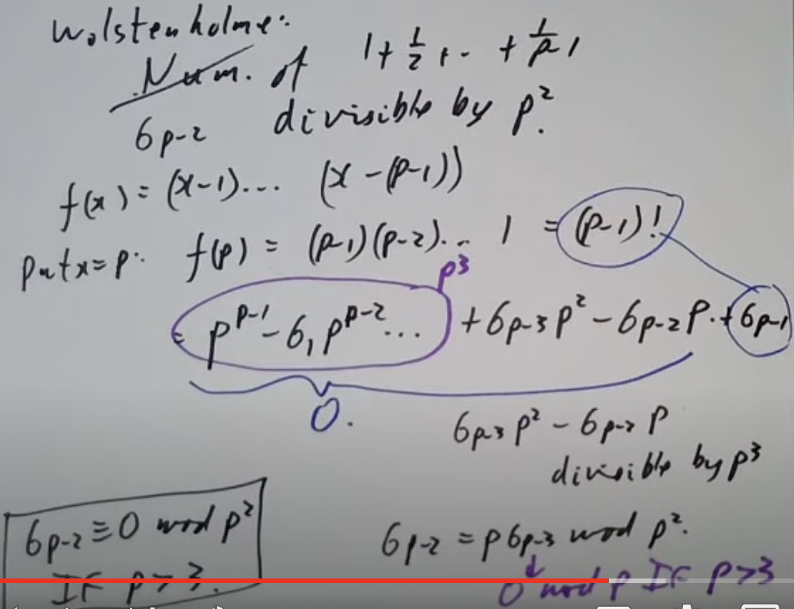

# 数论学习

## Congruences modulo a prime

如何解方程 $f(x)\equiv 0\mod m$ ？有3种情况：

1. 将模m转换为模质数p的n次幂 $p^n$ （CRT）
2. 将 $p^n$ 转换为p （牛顿法/hensel引理）
3. 当p为质数时就可以解了。

今天就来看看第三种情况。有笨方法，直接代入x=0,1,2...p-1看哪个满足方程。这个方法就不用过多考虑了。在探讨比较好的方法前，我们需要停下来思考一下，用了这么多节课把一个方程缩减到模质数的情况是为了什么？相比普通的数，质数有什么优点吗？

1. 没有0除数（no zero divisors）。我们知道如果 $ab\equiv 0\mod p$ ，就暗示着要么 $a\equiv 0\mod p$ ，要么 $b\equiv 0\mod p$ 。
2. 有逆元。如果 $a\equiv 0\mod p$ ，就能找到逆元b满足 $ab\equiv 1\mod p$ 
3. n次的多项式的根小于等于n。我们在代数中学过，一个n次多项式最多有n个根，但是放到模里面就不一定了。 $x^2-1\mod 8$ 有4个根，1，3，5，7。如果模数不是质数，一个n次的多项式指不定能有多少根。模质数就不一样了，根的数量保证小余等于n。
4. 有费马小定理 $x^p\equiv x\mod p$ 可用。
5. 模质数p有原根（primitive roots）。这个会在后面的课程中讲到。

第三点也是一个定理。这个定理之前没见过，证明一下。假设有n次多项式f(x)，其根为a，即f(a)=0。接着我们把f(x)除以另一个多项式(x-a)，商为g(x),余数是r。即f(x)=(x-a)g(x)+r。如果让x=a，就有f(a)=(a-a)g(a)+r，因为f(a)=0,(a-a)明显也是0，r也只能是0。说明当a是一个多项式的根时，多项式可被(x-a)整除，f(x)=(x-a)g(x)。利用归纳法，多项式f有小于等于n个根，多项式g有小于等于n-1个根，因为g是n-1次多项式。如果f还有一个根b满足f(b)=0，说明(b-a)g(b)=0，告诉我们b=a或者b是g的一个根。这里运用了模质数p没有0除数的性质。从`b=a或者b是g的一个根`这点就能立刻看出多项式f的根的数量只能小于等于n。

wolstenholme定理说， $1+\frac{1}{2}+\frac{1}{3}+...+\frac{1}{p-1}$ 的分子可被大于2的质数p整除。这个定理其实很好证明， $1,\frac{1}{2},...,\frac{1}{p-1}$ 全部都是模p的非零数。如果取它们的倒数1，2，3，...,p-1，这些数也会以某种顺序同余上方的数。并不是说倒数之间互相同余，都看得出来 $\frac{1}{2}$ 不和2同余，只是说2会与其中某一个数同余，其余的数也是这样。也就是说 $1+\frac{1}{2}+...+\frac{1}{p-1}\equiv 1+2+...+p-1=\frac{p(p-1)}{2}\equiv 0$ ，如果p=2，分数的上下就会抵消，因此原式当p不等于2时成立。

wolstenholme定理还有更好的变种， $1+\frac{1}{2}+\frac{1}{3}+...+\frac{1}{p-1}$ 的分子可被 $p^2$ 整除。证明我直接截图了，已超出能力范围。



这节课还剩三分之一，开始考虑方程 $f(x)\equiv 0\mod p$ 。要问自己三个问题：

1. 是否有解？
2. 有多少个解？
3. 解是什么？

有一种巧妙的方法解答第一个问题。我们求 $gcd(f(x),x^p-x)$ 就能知道了，因为 $x^p-x=x(x-1)...(x-(p-1)),f(x)=\prod_{f(a)=0} (x-a)$ 。对于第二个问题，解的数量就等于 $gcd(f,x^p-x)$ 的次数。

举个例子就会清晰很多了。请找出 $x^3-x^2+x-1\mod 3$ 的解的数量。方法告诉我们要找 $gcd(x^3-x^2+x-1,x^3-x)$ ，这个 $x^3-x$ 是根据模数3构造出来的。根据欧几里得法，我们要拿 $x^3-x$ 除以 $x^3-x^2+x-1,x^3-x$ ，得到 $x^3-x=1\*(x^3-x^2+x-1)+x^2+x+1$ 。除数拿出来继续除以余数，得到 $x^3-x^2+x-1=(x+1)(x^2+x+1)-(x-1)$ 。重复以上步骤，得到 $x^2+x+1=(x-1)(x-1)+0$ ，余数为0，那么gcd就是x-1。x-1是1次多项式，所以有1个根。

这个方法确实很巧妙，然而有个致命问题。使用欧几里得法找到gcd(f,g)的时间大概等于f的次数+g的次数， $x^p-x$ 这个多项式可有p次，p大了还是慢，可能还不如直接爆破找根呢。

我们需要加快找gcd的速度。关键点在于 $x^p-x$ 是一个[稀疏多项式](https://www.zhihu.com/question/55656686)，f(x)的次数很小。当我们有一个稀疏多项式和另一个小次数多项式时，可以利用俄罗斯农民法加速找gcd。将问题转换为 $x^p\mod f(x)$ ，接着用俄罗斯农民法找到 $x^p$ 。找到后再减去x就是答案了。这样的速度还是挺快的。

$f(x)=x^2-a$ ，什么时候a模p（奇数）是一个平方数？还是先找 $gcd(x^2-a,x^p-x)$ ,不过把 $x^p-x$ 换成 $x^{p-1}-1$ 比较好，x=0时有点烦。继续欧几里得， $x^{p-1}-1=(x^2-a)(x^{p-3}+ax^{p-5}+a^2x^{p-7}+...+a^{(p-3)/2})+a^{(p-1)/2}-1$ 。余数是 $a^{(p-1)/2}-1$ ，所以如果 $a^{(p-1)/2}-1\not\equiv 0\mod p$ ，原方程无根；如果 $a^{(p-1)/2}-1\equiv 0$ ，原方程有根。

于是我们就有了下面的结论。 $a^{(p-1)/2}\equiv 1$ ，如果a模p是平方数； $a^{(p-1)/2}\equiv -1$ ,如果a模p不是平方数。至此我们有了一个比较快的方法来检查a是否是平方数。不过这个方法其实不够好，后期会学一个更快的方法。

例子：如果d整除于p-1，则方程 $x^d-1\equiv 0\mod p$ 恰好有d个根。如果d|p-1，那么 $(x^{p-1}-1)$ 能被 $x^d-1$ 整除，这是因为如果 $y=x^d,n=\frac{p-1}{d}$ , $(y^n-1)$ 能被y整除。那么就有 $gcd(x^{p-1},x^d-1)=x^d-1$ ，这是个d次多项式，根据之前学的内容，原方程一定有d个根。

最后看看模7和11的立方。如果模11，全部数字都是立方， $x^3\equiv 1$ 有1个解。如果模7， $1^3=2^3=4^3=1,3^3=5^3=6^3=6$ 。因为3|7-1,所以有3个同余1的立方。结合两者，说明模某个质数同余1的立方的数量取决于p-1是否可被3整除。

## Chevalley-Warning theorem

标题的定理阐述了以下事实：如果 $f(x_1...x_n)$ 是d次多项式且d小于变量的数量，则 $f(x_1...x_n)\equiv 0\mod p$ 的解的数量能被p整除。证明这个定理需要借助另一个引理：如果i小于p-1，则有 $0^i+1^i+2^i+...+(p-1)^i\equiv 0\mod p$ 。先把主线搁置在一边，证明支线定理。

让 $s=0^i+1^i+2^i+...+(p-1)^i$ ，我们要证明当i小于p-1时， $s\equiv 0$ 。首先我们选择一个a，满足 $a\not\equiv 0,a^i\not\equiv 1$ 。我们确定能够找到这样一个a，因为 $a^i\equiv 1$ 是个i次多项式，根据前提条件，i小于p-1。总共有p-1个值不同余0，也就是说一定能找到一个不是 $a^i\equiv 1$ 的根的值。确定a存在后，把0，1...p-1拿出来，分别乘上a，得到0，a,2a...(p-1)a。由于a有一个逆，所以这两个集合是一样的，只不过顺序乱了。既然它们是一样的，其i次方的和也是一样的。

$0^i+1^i+2^i+...+(p-1)^i=0^i+a^i+(2a)^i+...$

第二个式子可以分解为 $a^i(0^i+1^i+...)$ ，所以有 $s=a^is$ ，等同于说 $(a^i-1)s=0$ 。前面已经限定 $a^i\not\equiv 1\mod p$ ， $(a^i-1)s=0$ 就能告诉我们 $s\equiv 0$ ，完成。

回到主线。次数小于n的多项式f满足 $f(x_1...x_n)\equiv 0\mod p$ 的解有多少？注意到 $1-f(x_1...x_n)^{p-1}$ 有两种情况：

1. 如果 $f(x_1...x_n)$ 同余0，则 $1-f(x_1...x_n)^{p-1}\equiv 1$
2. 如果 $f(x_1...x_n)\not\equiv 0$ ,则 $1-f(x_1...x_n)^{p-1}\equiv 0$ 。因为根据费马小定理， 如果 $f(x_1...x_n)\not\equiv 0$ 。其p-1次幂模p就会同余1。

现在我们就可以通过求和获取解的数量了。 $\sum_{x_1,x_2...x_n} 1-f(x_1...x_n)^{p-1}$ ，因为 $1-f(x_1...x_n)^{p-1}$ 这个表达式总会在 $x_1,x_2...x_n$ 里面有一个是解时等于1，反之等于0，所以其结果同余解的数量。把它展开就得到了 $\sum_{x_1...x_n} \*x_1^{n_1}x_2^{n_2}...$ ， \*是每一项展开时的系数。 $x_1^{n_1}x_2^{n_2}...$ 这个部分的次数为 $n_1+n_2...+n_n$ ，小于f的次数n乘上p-1（最开始整体抬升了p-1的幂）。所以一定有一个 $n_i$ 小于p-1。

如果这是我们继续求总和， $\sum_{x_1,x_2,...,x_n} x_1^{n_1}...x_i^{\*}x_n^{n_n}$ ，有一个 $x_i$ 的幂\*将会小于p-1。根据刚才学的引理，由于\*小于p-1，就有 $sum_{x_i} x_i^\*\equiv 0\mod p$ 。 $x_1^{n_1}...x_i^{*}x_n^{n_n}$ 里有一项是0，整体就是0，总和也是0，故整体模p同余0，得出 $f(x_1...x_n)\equiv 0\mod p$ 这个方程的解的数量能被p整除。

## Primitive roots

原根的概念有关阶和欧拉定理。当gcd(a,m)=1时，回忆a模m的阶，是满足 $a^n\equiv 1\mod m$ 的最小正整数。欧拉定理则是 $a^{\phi(m)}\equiv 1\mod m$ 。a的阶整除于 $\phi(m)$ 。原根的定义是，当a的阶等于 $\phi(m)$ 时，a就被称作原根。也可以换个定义方式，a的所有幂 $a^0,a^1,...,a^{\phi(m)-1}$ 正好形成于m互质的剩余类。

必须要问的问题是，什么数字有原根？有多少原根？举例子是最笨但也是最好理解的方法。


红圈圈起来的是原根。发现8是第一个没有原根的数，最下面也能检验这一点。 $x^2\equiv 1\mod 8$ 有4个解，如果一个数有原根的话，那么 $x^2\equiv 1$ 这个方程的解只可能是 $g^{\phi(m)}$ 和 $$g^{\frac{\phi(m)}{2}}$ 。

接着看9。如果g是9的一个原根，说明g也是3的一个原根。因为g的所有幂可以形成模9的所有剩余类，3又整除于9，里面肯定也包含3的剩余类。所以找9的原根应该从3看起。3有原根2，5和8，9的原根则是2和5，8不是。剩下的看都不用看，连3的原根都不是何来是9的原根。

然后是10。

```
10:   1   3   7   9
5:    1   2   3   4
```

10和5的数字互相对应上了，只不过是以不同的顺序：3对3，7对2。中国剩余定理让我们可以把10拆为2\*5，所以模10的数字可以用模5结合模2的数字替代。模2后与2互质的数只有1，那么模10与10互质的剩余类就等于模5与5互质的剩余类。既然5有2个原根2和3，对应着10就有两个原根3和7。事实上这对所有形如2n的模数都适用。如果n是奇数，模n与n互质的剩余类对应着模2n与2n互质的剩余类。如果g是模n的一个原根，那么g或者g+n（都是奇数）里有一个是模2n的原根。也就是说，如果n是奇数且n有原根，则2n也有原根。

现在是11。阶一定整除于 $\phi(11)=10$ ，所以可能的阶只有1，2，5，10。如果g有阶d，那么 $g^d\equiv 1$ 这个方程最多有d个解（之前提了一嘴，d次多项式模质数时解的数量不会大于次数）。那么在与11互质的数里面，阶为1的数最多有1个，阶为2的数最多有2个，阶为5的数最多有5个。也就是最多有1+2+5=8个数的阶不等于10。总共有10个数，意味着最少有10-8=2个数阶为10，这些数就是我们要找的原根了。

12没有原根。把12拆成4\*3，再代入方程 $x^2\equiv 1$ 。模4的解有2，模3的解至少有2个，那模12的解至少有4个。之前说过，这种情况下是不可能有原根的。适用于所有形如`4*奇数`的m，这样的m没有原根。

13照葫芦画瓢。阶整除于 $\phi(13)=12$ ，可能的阶为1，2，3，4，6，12。具有这些阶的元素加起来得到 1+2+3+4+6=16。16？这已经大于12了。看来之前我们算的有些草率，需要更仔细一点。我们判断最多有6个阶为6的元素，但不一定。先假设最少有1个阶为6的元素g，再看g的所有可能幂 $1,g,g^2,g^3,g^4,g^5$ ，是 $x^6\equiv 1$ 的所有可能根。那么6阶的元素必须是 $1,g,g^2,g^3,g^4,g^5$ 其中一个。但是仔细看这些数字，只有g和 $g^5$ 的阶是6，也就是说6阶的元素最多只有2个。这里告诉我们最多只有 $\phi(d)$ 个d阶元素。因为如果g是d阶元素， $x^d\equiv 1$ 的解有可能是g的所有次幂 $g^0,g^1...g^{d-1}$ 。 从里面选一个 $g^k$ ，这个 $g^k$ 仅当gcd(k,d)=1时是d阶元素。现在回到原来算元素的地方， $\phi(1)+\phi(2)+\phi(3)+\phi(4)+\phi(6)=1+1+2+2+2=8$ 。那就有至少12-8=4个12阶的元素。

有一个相关定理等待我们证明。如果p是质数，p有原根。这个定理的证明基于以下两个定理：

1. $x^d\equiv 1\mod p$ 有最多d个根（p是质数）。
2. $\sum_{d|n} \phi(d)=n$ ，这条对于任何n都成立，后面再证明。

第一步先看那些阶为d且d|p-1的元素，候选数字有1,2...d,p-1。阶为d的元素的数量最多有 $\phi(1)+\phi(2)+...+\phi(d)...$ 个。根据第二条定理， $\phi(1)+\phi(2)+...+\phi(d)...$ 总和为p-1（这里把p-1看为定理里的n）。全部满足d|p-1的数字d最多也有 $\phi(1)+\phi(2)+...+\phi(d)...$ 个。这时就说明阶为d的元素的数量必须等于 $\phi(1)+\phi(2)+...+\phi(d)...$ 了。如果是更小的数量，那 $\phi(1)+\phi(2)+...+\phi(d)...$ 的和就会小于p-1，无法同时满足”d|p-1的数字d最多也有 $\phi(1)+\phi(2)+...+\phi(d)...$ 个“这个条件。总结一下，如果d|p-1，就有正好 $\phi(d)$ 个元素阶为d。如果让d=p-1， $\phi(p-1)\geq 1$ ，至少有一个原根。

现在证明刚才用的定理 $\sum_{d|n} \phi(d)=n$ 。让n=12，写出12的所有剩余类i。尝试找到k，满足 $ki\equiv 0$ 。

```
i   0   1   2   3   4   5   6   7   8   9   10   11
k   1  12   6   4   3  12   2  12   3   4    6   12
```

能发现有 $\phi(d)$ 个元素阶为d，d|12。比如d=6，正好有两个元素2和10阶为6。2=2\*1,10=2\*5，发现1和5都是与6互质的数字。类似地，让d=4，两个阶为4的元素为3和9。3=3\*1,9=3\*3，1和3都是与4互质的数。这样的规律适用于任何n。对于加法阶k的元素模n，k|n，数量为 $\phi(k)$ 。因为这些数字由 $\frac{n}{k}\*(1,...)$ 给出，括号里的数字是与k互质的数。完成定理 $\sum_{d|n} \phi(d)=n$ 的证明。

14=2\*奇质数，有原根。15没有原根，15=3\*5，3和5在 $x^2\equiv 1$ 这个方程上均有2个解，2\*2=4，模15由4个解，无原根。如果m=pq且pq都是奇偶数，p不等于q，则m无原根。

16也没有原根。8|16，如果ab有原根，a也有原根，但我们已经知道8没有原根，说明16也没有。

整理目前知道的内容。如果m能被8，4p，pq整除且p不等于q，都是奇质数时，m没有原根。把满足这些条件的数字拿掉后，还剩下1，2，4， $p^n,2p^n$ (p是奇数)。

讲了那么久原根的存在性，到底怎么找原根啊？当模数是p时，尝试分解 $p-1=q_1,q_2...$ ，然后随机选择一个a，计算 $a^{\frac{p-1}{q_1}},a^{\frac{p-1}{q_2}}...$ 。如果全部都不同余1，则a是一个原根。比如11,p-1=10=2\*5。随机选择2，计算 $2^{\frac{10}{2}}\equiv -1,2^{\frac{10}{5}}\equiv 4$  。都不是1所以2时是一个原根。如果用这个方法找到一个原根后，找到其他的就不用这么麻烦了。假设a是模m的一个原根，a的阶是 $\phi(m)$ ，想让 $a^b$ 的阶也是 $\phi(m)$ 的前提是b和 $\phi(m)$ 互质。借助这个结论继续找11的原根。 $\phi(11)=10$ ,找满足 $gcd(b,10)=1$ 的b，有1，3，7，9。刚才找到的原根是2，剩下的原根就是 $2^1,2^3,2^7,2^9\mod 11$ 。顺便得到计算原根数量的公式： $\phi(\phi(m))$ ，前提是已知原根数量不等于0。

## Primitive roots for prime powers

上节课说到，有原根的数字一定在 $1,2,4,p^n,2p^n$ 中（p为奇质数）。这节课来看n大于1的情况。先看 $p^2$ 是否一定有原根。

选择p的一个原根g，根据原根的定义可得 $g^{p-1}\equiv 1\mod p$ 。 $\phi(p)=p-1,\phi(p^2)=p(p-1)$ 。既然g的阶模p是p-1，那么g模 $p^2$ 的阶可能为p-1或者p(p-1)，因为根据欧拉定理其阶必须整除于p(p-1)，又因为它是模p的一个原根，其阶必须整除p-1。如果阶是p(p-1)，那证明完成，阶等于 $\phi(p^2)$ ，g也是 $p^2$ 的一个原根。如果阶是p-1，

如果阶是p-1，即 $g^{p-1}\equiv 1\mod p^2$ 这种情况，就构造 $(g+p)^{p-1}$ 。利用泰勒级数展开，得到 $(g+p)^{p-1}=g^{p-1}+(p-1)p+(^{p-1}_2)p^2+...$ ，整个式子与 $1+(p-1)p\mod p^2$ 同余。 1+(p-1)p 肯定不与1同余，说明g+p的阶不是p-1，那g+p的阶只能是p(p-1)了。两种情况下都有原根，得到结论：模 $p^2$ 下g和g+p中至少有一个是原根。

$p^2$ 证明完了证 $p^n$ ，这次关注所有大于等于3的n且p是奇质数，因为 $2^3$ 次方之前已经看过是没有原根的。这条的证明等同于证明下面的定理：如果g是模 $p^2$ 的原根且p是奇质数，则g也是模 $p^n$ 的原根（n大于等于1）。如果要用归纳法的话，我们需要证明g是模 $p^n$ 的原根，然后证明g是模 $p^{n+1}$ 的原根。可以通过证明 $g^{(p-1)p^{n-1}}=1+tp^n$ （t不整除p）来做到这点，因为这将表明 $g^{(p-1)p^{n-1}}$ 是模 $p^{n+1}$ 的原根。该式子在n=1时成立，提高两边的幂，得到 $g^{(p-1)p^{n}}=1+ptp^m+(^{p}_2)t^2p^{2m}+...$ 。这里就看出来为什么p不能等于2了，如果p=2， $(^{p}_2)$ 就不能整除p了，就算剩下的项都能被p的较大幂整除也没用。只要p大于2， $1+ptp^m+(^{p}_2)t^2p^{2m}+...$ 就等于 $1+tp^{m+1}+(...)$ ，又回到了我们要的形式。

例题：请找出 $3^7$ 的原根。3的原根是-1，然而-1不是 $3^2$ 的原根。没关系，g不是原根g+p就是原根，-1+3=2，2是 $3^2$ 的原根。于是2将是3的任何次幂的原根，包括 $3^7$ 。

现在的我们有5种方式告诉别人一个数字有原根。

1. m有原根（平平淡淡才是真）
2. m有 $\phi(\phi(m))$ 个原根。如果这条不满足就是0个原根。
3. $m=1,2,4,p^n,2p^n$ ，p为奇质数
4. $x^2\equiv 1\mod m$ ，这点告诉我们 $x\equiv \pm 1\mod m$
5. 满足威尔逊定理 $\prod_{a\mod m} a\equiv -1\mod m,gcd(a,m)=1$ 。

之前学中国剩余定理时，我们可以把m简化到 $p^n$ 的情况。如果是奇质数还好，一定有原根；假如我们把m简化成了 $2^n$ 呢？在n很大的情况下，5“差点”成为一个原根，“差点”指的是任何模 $2^n$ 与 $2^n$ 互质的数字都形如 $\pm 5^k$ 。如果同余正的 $5^k$ ，则数字模4同余1；如果同余负的 $5^k$ ，则数字模4同余-1。一个一个试：

$5\equiv 5\mod 8$<br>
$5^2\equiv 9\mod 16$<br>
$5^4\equiv 17\mod 32$<br>
$5^8\equiv 33\mod 64$

总结出 $5^{2^n}\equiv 1+2^{n+2}\mod 2^{n+3}$ ，表明5模 $2^{n+3}$ 有阶 $2^{n+1}$ 。模 $2^{n+3}$ 与其互质的数共有 $2^{n+2}$ 个，每个数字都形如 $\pm 5^k$ 。

讲了这么多原根，这个原根有什么用吗？当然，你可以用原根求对数，不过在数论里被称为指数（indices）。假如g是模p的一个原根，任何模p不同余0的数字a都形如 $g^n\mod p$ 。也就是说我们可以基于此求个对数 $n=log_g a$ 。在计算机还没有被发明的年代，人们会借助对数算乘法。比如两个数a和b， $a=g^n,b=g^m$ ，那么 $ab=g^{m+n}$ 。幂也可以这么算， $a^k=(g^n)^k=g^{nk}$ 。

原根还可用于检测一个数p是否是质数。质因数分解p-1，然后找p的原根g，其阶为p-1。怎么证明阶是p-1？只需要检查g是否有整除于 $\frac{p-1}{q}$ 的阶，q是p-1的一个质因数。如果能找到 $g^{\frac{p-1}{q}}\not\equiv \mod p$ ，说明g的阶恰好是p-1，意味着p必须是素数。比如101， $101-1=2^2\*5^2$ ，找g满足 $g^{100/2}\not\equiv 1,g^{100/5}\not\equiv 1$ 。如果能找到说明101是质数。这个方法其实不是特别好，因为其依赖p-1的质因数分解结果，数字一大还是难以分解。