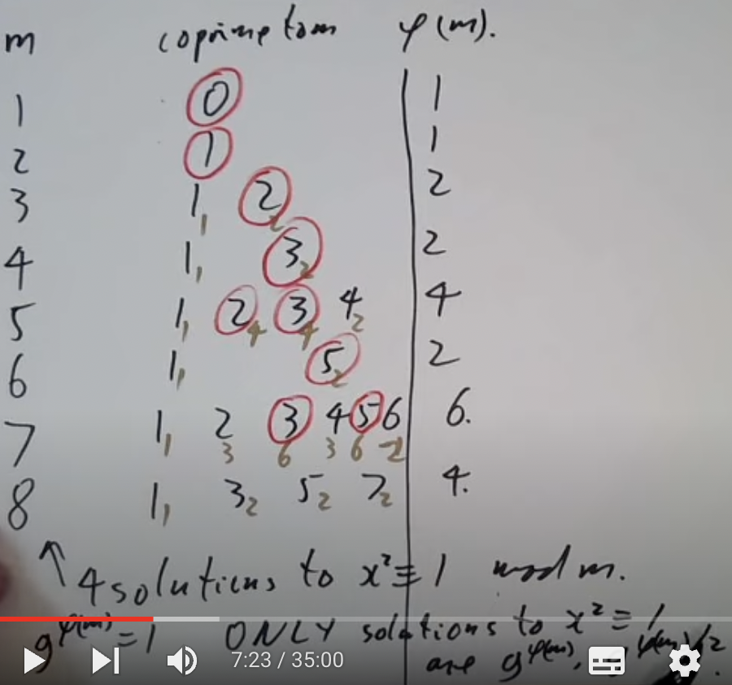
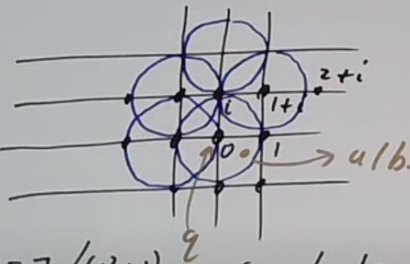
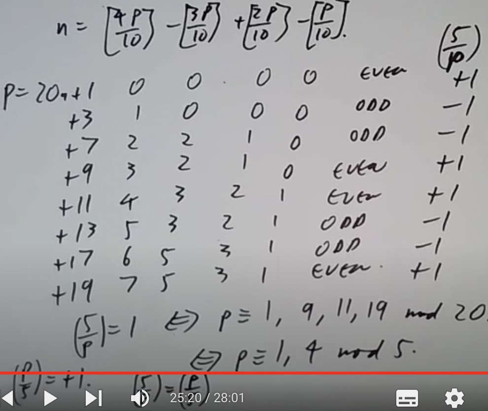
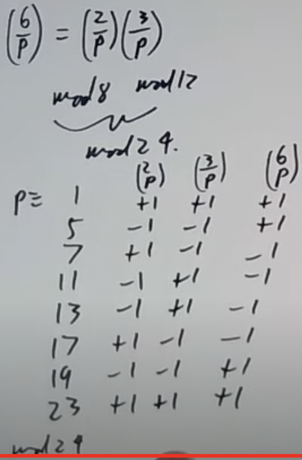
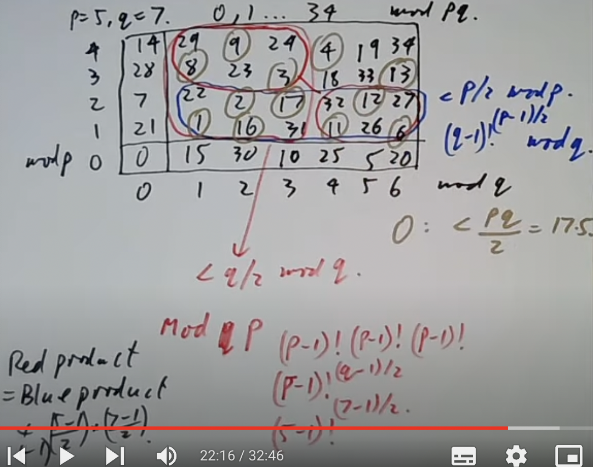
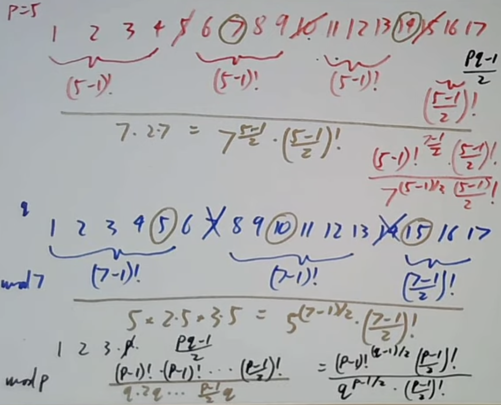
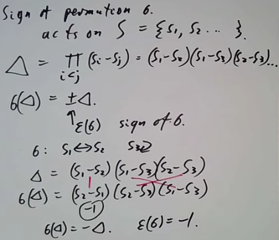

# 数论学习

## Congruences modulo a prime

如何解方程 $f(x)\equiv 0\mod m$ ？有3种情况：

1. 将模m转换为模质数p的n次幂 $p^n$ （CRT）
2. 将 $p^n$ 转换为p （牛顿法/hensel引理）
3. 当p为质数时就可以解了。

今天就来看看第三种情况。有笨方法，直接代入x=0,1,2...p-1看哪个满足方程。这个方法就不用过多考虑了。在探讨比较好的方法前，我们需要停下来思考一下，用了这么多节课把一个方程缩减到模质数的情况是为了什么？相比普通的数，质数有什么优点吗？

1. 没有0除数（no zero divisors）。我们知道如果 $ab\equiv 0\mod p$ ，就暗示着要么 $a\equiv 0\mod p$ ，要么 $b\equiv 0\mod p$ 。
2. 有逆元。如果 $a\equiv 0\mod p$ ，就能找到逆元b满足 $ab\equiv 1\mod p$ 
3. n次的多项式的根小于等于n。我们在代数中学过，一个n次多项式最多有n个根，但是放到模里面就不一定了。 $x^2-1\mod 8$ 有4个根，1，3，5，7。如果模数不是质数，一个n次的多项式指不定能有多少根。模质数就不一样了，根的数量保证小余等于n。
4. 有费马小定理 $x^p\equiv x\mod p$ 可用。
5. 模质数p有原根（primitive roots）。这个会在后面的课程中讲到。

第三点也是一个定理。这个定理之前没见过，证明一下。假设有n次多项式f(x)，其根为a，即f(a)=0。接着我们把f(x)除以另一个多项式(x-a)，商为g(x),余数是r。即f(x)=(x-a)g(x)+r。如果让x=a，就有f(a)=(a-a)g(a)+r，因为f(a)=0,(a-a)明显也是0，r也只能是0。说明当a是一个多项式的根时，多项式可被(x-a)整除，f(x)=(x-a)g(x)。利用归纳法，多项式f有小于等于n个根，多项式g有小于等于n-1个根，因为g是n-1次多项式。如果f还有一个根b满足f(b)=0，说明(b-a)g(b)=0，告诉我们b=a或者b是g的一个根。这里运用了模质数p没有0除数的性质。从`b=a或者b是g的一个根`这点就能立刻看出多项式f的根的数量只能小于等于n。

wolstenholme定理说， $1+\frac{1}{2}+\frac{1}{3}+...+\frac{1}{p-1}$ 的分子可被大于2的质数p整除。这个定理其实很好证明， $1,\frac{1}{2},...,\frac{1}{p-1}$ 全部都是模p的非零数。如果取它们的倒数1，2，3，...,p-1，这些数也会以某种顺序同余上方的数。并不是说倒数之间互相同余，都看得出来 $\frac{1}{2}$ 不和2同余，只是说2会与其中某一个数同余，其余的数也是这样。也就是说 $1+\frac{1}{2}+...+\frac{1}{p-1}\equiv 1+2+...+p-1=\frac{p(p-1)}{2}\equiv 0$ ，如果p=2，分数的上下就会抵消，因此原式当p不等于2时成立。

wolstenholme定理还有更好的变种， $1+\frac{1}{2}+\frac{1}{3}+...+\frac{1}{p-1}$ 的分子可被 $p^2$ 整除。证明我直接截图了，已超出能力范围。


这节课还剩三分之一，开始考虑方程 $f(x)\equiv 0\mod p$ 。要问自己三个问题：

1. 是否有解？
2. 有多少个解？
3. 解是什么？

有一种巧妙的方法解答第一个问题。我们求 $gcd(f(x),x^p-x)$ 就能知道了，因为 $x^p-x=x(x-1)...(x-(p-1)),f(x)=\prod_{f(a)=0} (x-a)$ 。对于第二个问题，解的数量就等于 $gcd(f,x^p-x)$ 的次数。

举个例子就会清晰很多了。请找出 $x^3-x^2+x-1\mod 3$ 的解的数量。方法告诉我们要找 $gcd(x^3-x^2+x-1,x^3-x)$ ，这个 $x^3-x$ 是根据模数3构造出来的。根据欧几里得法，我们要拿 $x^3-x$ 除以 $x^3-x^2+x-1,x^3-x$ ，得到 $x^3-x=1\*(x^3-x^2+x-1)+x^2+x+1$ 。除数拿出来继续除以余数，得到 $x^3-x^2+x-1=(x+1)(x^2+x+1)-(x-1)$ 。重复以上步骤，得到 $x^2+x+1=(x-1)(x-1)+0$ ，余数为0，那么gcd就是x-1。x-1是1次多项式，所以有1个根。

这个方法确实很巧妙，然而有个致命问题。使用欧几里得法找到gcd(f,g)的时间大概等于f的次数+g的次数， $x^p-x$ 这个多项式可有p次，p大了还是慢，可能还不如直接爆破找根呢。

我们需要加快找gcd的速度。关键点在于 $x^p-x$ 是一个[稀疏多项式](https://www.zhihu.com/question/55656686)，f(x)的次数很小。当我们有一个稀疏多项式和另一个小次数多项式时，可以利用俄罗斯农民法加速找gcd。将问题转换为 $x^p\mod f(x)$ ，接着用俄罗斯农民法找到 $x^p$ 。找到后再减去x就是答案了。这样的速度还是挺快的。

$f(x)=x^2-a$ ，什么时候a模p（奇数）是一个平方数？还是先找 $gcd(x^2-a,x^p-x)$ ,不过把 $x^p-x$ 换成 $x^{p-1}-1$ 比较好，x=0时有点烦。继续欧几里得， $x^{p-1}-1=(x^2-a)(x^{p-3}+ax^{p-5}+a^2x^{p-7}+...+a^{(p-3)/2})+a^{(p-1)/2}-1$ 。余数是 $a^{(p-1)/2}-1$ ，所以如果 $a^{(p-1)/2}-1\not\equiv 0\mod p$ ，原方程无根；如果 $a^{(p-1)/2}-1\equiv 0$ ，原方程有根。

于是我们就有了下面的结论。 $a^{(p-1)/2}\equiv 1$ ，如果a模p是平方数； $a^{(p-1)/2}\equiv -1$ ,如果a模p不是平方数。至此我们有了一个比较快的方法来检查a是否是平方数。不过这个方法其实不够好，后期会学一个更快的方法。

例子：如果d整除于p-1，则方程 $x^d-1\equiv 0\mod p$ 恰好有d个根。如果d|p-1，那么 $(x^{p-1}-1)$ 能被 $x^d-1$ 整除，这是因为如果 $y=x^d,n=\frac{p-1}{d}$ , $(y^n-1)$ 能被y整除。那么就有 $gcd(x^{p-1},x^d-1)=x^d-1$ ，这是个d次多项式，根据之前学的内容，原方程一定有d个根。

最后看看模7和11的立方。如果模11，全部数字都是立方， $x^3\equiv 1$ 有1个解。如果模7， $1^3=2^3=4^3=1,3^3=5^3=6^3=6$ 。因为3|7-1,所以有3个同余1的立方。结合两者，说明模某个质数同余1的立方的数量取决于p-1是否可被3整除。

## Chevalley-Warning theorem

标题的定理阐述了以下事实：如果 $f(x_1...x_n)$ 是d次多项式且d小于变量的数量，则 $f(x_1...x_n)\equiv 0\mod p$ 的解的数量能被p整除。证明这个定理需要借助另一个引理：如果i小于p-1，则有 $0^i+1^i+2^i+...+(p-1)^i\equiv 0\mod p$ 。先把主线搁置在一边，证明支线定理。

让 $s=0^i+1^i+2^i+...+(p-1)^i$ ，我们要证明当i小于p-1时， $s\equiv 0$ 。首先我们选择一个a，满足 $a\not\equiv 0,a^i\not\equiv 1$ 。我们确定能够找到这样一个a，因为 $a^i\equiv 1$ 是个i次多项式，根据前提条件，i小于p-1。总共有p-1个值不同余0，也就是说一定能找到一个不是 $a^i\equiv 1$ 的根的值。确定a存在后，把0，1...p-1拿出来，分别乘上a，得到0，a,2a...(p-1)a。由于a有一个逆，所以这两个集合是一样的，只不过顺序乱了。既然它们是一样的，其i次方的和也是一样的。

$0^i+1^i+2^i+...+(p-1)^i=0^i+a^i+(2a)^i+...$

第二个式子可以分解为 $a^i(0^i+1^i+...)$ ，所以有 $s=a^is$ ，等同于说 $(a^i-1)s=0$ 。前面已经限定 $a^i\not\equiv 1\mod p$ ， $(a^i-1)s=0$ 就能告诉我们 $s\equiv 0$ ，完成。

回到主线。次数小于n的多项式f满足 $f(x_1...x_n)\equiv 0\mod p$ 的解有多少？注意到 $1-f(x_1...x_n)^{p-1}$ 有两种情况：

1. 如果 $f(x_1...x_n)$ 同余0，则 $1-f(x_1...x_n)^{p-1}\equiv 1$
2. 如果 $f(x_1...x_n)\not\equiv 0$ ,则 $1-f(x_1...x_n)^{p-1}\equiv 0$ 。因为根据费马小定理， 如果 $f(x_1...x_n)\not\equiv 0$ 。其p-1次幂模p就会同余1。

现在我们就可以通过求和获取解的数量了。 $\sum_{x_1,x_2...x_n} 1-f(x_1...x_n)^{p-1}$ ，因为 $1-f(x_1...x_n)^{p-1}$ 这个表达式总会在 $x_1,x_2...x_n$ 里面有一个是解时等于1，反之等于0，所以其结果同余解的数量。把它展开就得到了 $\sum_{x_1...x_n} \*x_1^{n_1}x_2^{n_2}...$ ， \*是每一项展开时的系数。 $x_1^{n_1}x_2^{n_2}...$ 这个部分的次数为 $n_1+n_2...+n_n$ ，小于f的次数n乘上p-1（最开始整体抬升了p-1的幂）。所以一定有一个 $n_i$ 小于p-1。

如果这是我们继续求总和， $\sum_{x_1,x_2,...,x_n} x_1^{n_1}...x_i^{\*}x_n^{n_n}$ ，有一个 $x_i$ 的幂\*将会小于p-1。根据刚才学的引理，由于\*小于p-1，就有 $sum_{x_i} x_i^\*\equiv 0\mod p$ 。 $x_1^{n_1}...x_i^{*}x_n^{n_n}$ 里有一项是0，整体就是0，总和也是0，故整体模p同余0，得出 $f(x_1...x_n)\equiv 0\mod p$ 这个方程的解的数量能被p整除。

## Primitive roots

原根的概念有关阶和欧拉定理。当gcd(a,m)=1时，回忆a模m的阶，是满足 $a^n\equiv 1\mod m$ 的最小正整数。欧拉定理则是 $a^{\phi(m)}\equiv 1\mod m$ 。a的阶整除于 $\phi(m)$ 。原根的定义是，当a的阶等于 $\phi(m)$ 时，a就被称作原根。也可以换个定义方式，a的所有幂 $a^0,a^1,...,a^{\phi(m)-1}$ 正好形成于m互质的剩余类。

必须要问的问题是，什么数字有原根？有多少原根？举例子是最笨但也是最好理解的方法。



红圈圈起来的是原根。发现8是第一个没有原根的数，最下面也能检验这一点。 $x^2\equiv 1\mod 8$ 有4个解，如果一个数有原根的话，那么 $x^2\equiv 1$ 这个方程的解只可能是 $g^{\phi(m)}$ 和 $g^{\frac{\phi(m)}{2}}$ 。

接着看9。如果g是9的一个原根，说明g也是3的一个原根。因为g的所有幂可以形成模9的所有剩余类，3又整除于9，里面肯定也包含3的剩余类。所以找9的原根应该从3看起。3有原根2，5和8，9的原根则是2和5，8不是。剩下的看都不用看，连3的原根都不是何来是9的原根。

然后是10。

```
10:   1   3   7   9
5:    1   2   3   4
```

10和5的数字互相对应上了，只不过是以不同的顺序：3对3，7对2。中国剩余定理让我们可以把10拆为2\*5，所以模10的数字可以用模5结合模2的数字替代。模2后与2互质的数只有1，那么模10与10互质的剩余类就等于模5与5互质的剩余类。既然5有2个原根2和3，对应着10就有两个原根3和7。事实上这对所有形如2n的模数都适用。如果n是奇数，模n与n互质的剩余类对应着模2n与2n互质的剩余类。如果g是模n的一个原根，那么g或者g+n（都是奇数）里有一个是模2n的原根。也就是说，如果n是奇数且n有原根，则2n也有原根。

现在是11。阶一定整除于 $\phi(11)=10$ ，所以可能的阶只有1，2，5，10。如果g有阶d，那么 $g^d\equiv 1$ 这个方程最多有d个解（之前提了一嘴，d次多项式模质数时解的数量不会大于次数）。那么在与11互质的数里面，阶为1的数最多有1个，阶为2的数最多有2个，阶为5的数最多有5个。也就是最多有1+2+5=8个数的阶不等于10。总共有10个数，意味着最少有10-8=2个数阶为10，这些数就是我们要找的原根了。

12没有原根。把12拆成4\*3，再代入方程 $x^2\equiv 1$ 。模4的解有2，模3的解至少有2个，那模12的解至少有4个。之前说过，这种情况下是不可能有原根的。适用于所有形如`4*奇数`的m，这样的m没有原根。

13照葫芦画瓢。阶整除于 $\phi(13)=12$ ，可能的阶为1，2，3，4，6，12。具有这些阶的元素加起来得到 1+2+3+4+6=16。16？这已经大于12了。看来之前我们算的有些草率，需要更仔细一点。我们判断最多有6个阶为6的元素，但不一定。先假设最少有1个阶为6的元素g，再看g的所有可能幂 $1,g,g^2,g^3,g^4,g^5$ ，是 $x^6\equiv 1$ 的所有可能根。那么6阶的元素必须是 $1,g,g^2,g^3,g^4,g^5$ 其中一个。但是仔细看这些数字，只有g和 $g^5$ 的阶是6，也就是说6阶的元素最多只有2个。这里告诉我们最多只有 $\phi(d)$ 个d阶元素。因为如果g是d阶元素， $x^d\equiv 1$ 的解有可能是g的所有次幂 $g^0,g^1...g^{d-1}$ 。 从里面选一个 $g^k$ ，这个 $g^k$ 仅当gcd(k,d)=1时是d阶元素。现在回到原来算元素的地方， $\phi(1)+\phi(2)+\phi(3)+\phi(4)+\phi(6)=1+1+2+2+2=8$ 。那就有至少12-8=4个12阶的元素。

有一个相关定理等待我们证明。如果p是质数，p有原根。这个定理的证明基于以下两个定理：

1. $x^d\equiv 1\mod p$ 有最多d个根（p是质数）。
2. $\sum_{d|n} \phi(d)=n$ ，这条对于任何n都成立，后面再证明。

第一步先看那些阶为d且d|p-1的元素，候选数字有1,2...d,p-1。阶为d的元素的数量最多有 $\phi(1)+\phi(2)+...+\phi(d)...$ 个。根据第二条定理， $\phi(1)+\phi(2)+...+\phi(d)...$ 总和为p-1（这里把p-1看为定理里的n）。全部满足d|p-1的数字d最多也有 $\phi(1)+\phi(2)+...+\phi(d)...$ 个。这时就说明阶为d的元素的数量必须等于 $\phi(1)+\phi(2)+...+\phi(d)...$ 了。如果是更小的数量，那 $\phi(1)+\phi(2)+...+\phi(d)...$ 的和就会小于p-1，无法同时满足”d|p-1的数字d最多也有 $\phi(1)+\phi(2)+...+\phi(d)...$ 个“这个条件。总结一下，如果d|p-1，就有正好 $\phi(d)$ 个元素阶为d。如果让d=p-1， $\phi(p-1)\geq 1$ ，至少有一个原根。

现在证明刚才用的定理 $\sum_{d|n} \phi(d)=n$ 。让n=12，写出12的所有剩余类i。尝试找到k，满足 $ki\equiv 0$ 。

```
i   0   1   2   3   4   5   6   7   8   9   10   11
k   1  12   6   4   3  12   2  12   3   4    6   12
```

能发现有 $\phi(d)$ 个元素阶为d，d|12。比如d=6，正好有两个元素2和10阶为6。2=2\*1,10=2\*5，发现1和5都是与6互质的数字。类似地，让d=4，两个阶为4的元素为3和9。3=3\*1,9=3\*3，1和3都是与4互质的数。这样的规律适用于任何n。对于加法阶k的元素模n，k|n，数量为 $\phi(k)$ 。因为这些数字由 $\frac{n}{k}\*(1,...)$ 给出，括号里的数字是与k互质的数。完成定理 $\sum_{d|n} \phi(d)=n$ 的证明。

14=2\*奇质数，有原根。15没有原根，15=3\*5，3和5在 $x^2\equiv 1$ 这个方程上均有2个解，2\*2=4，模15由4个解，无原根。如果m=pq且pq都是奇偶数，p不等于q，则m无原根。

16也没有原根。8|16，如果ab有原根，a也有原根，但我们已经知道8没有原根，说明16也没有。

整理目前知道的内容。如果m能被8，4p，pq整除且p不等于q，都是奇质数时，m没有原根。把满足这些条件的数字拿掉后，还剩下1，2，4， $p^n,2p^n$ (p是奇数)。

讲了那么久原根的存在性，到底怎么找原根啊？当模数是p时，尝试分解 $p-1=q_1,q_2...$ ，然后随机选择一个a，计算 $a^{\frac{p-1}{q_1}},a^{\frac{p-1}{q_2}}...$ 。如果全部都不同余1，则a是一个原根。比如11,p-1=10=2\*5。随机选择2，计算 $2^{\frac{10}{2}}\equiv -1,2^{\frac{10}{5}}\equiv 4$  。都不是1所以2时是一个原根。如果用这个方法找到一个原根后，找到其他的就不用这么麻烦了。假设a是模m的一个原根，a的阶是 $\phi(m)$ ，想让 $a^b$ 的阶也是 $\phi(m)$ 的前提是b和 $\phi(m)$ 互质。借助这个结论继续找11的原根。 $\phi(11)=10$ ,找满足 $gcd(b,10)=1$ 的b，有1，3，7，9。刚才找到的原根是2，剩下的原根就是 $2^1,2^3,2^7,2^9\mod 11$ 。顺便得到计算原根数量的公式： $\phi(\phi(m))$ ，前提是已知原根数量不等于0。

## Primitive roots for prime powers

上节课说到，有原根的数字一定在 $1,2,4,p^n,2p^n$ 中（p为奇质数）。这节课来看n大于1的情况。先看 $p^2$ 是否一定有原根。

选择p的一个原根g，根据原根的定义可得 $g^{p-1}\equiv 1\mod p$ 。 $\phi(p)=p-1,\phi(p^2)=p(p-1)$ 。既然g的阶模p是p-1，那么g模 $p^2$ 的阶可能为p-1或者p(p-1)，因为根据欧拉定理其阶必须整除于p(p-1)，又因为它是模p的一个原根，其阶必须整除p-1。如果阶是p(p-1)，那证明完成，阶等于 $\phi(p^2)$ ，g也是 $p^2$ 的一个原根。如果阶是p-1，

如果阶是p-1，即 $g^{p-1}\equiv 1\mod p^2$ 这种情况，就构造 $(g+p)^{p-1}$ 。利用泰勒级数展开，得到 $(g+p)^{p-1}=g^{p-1}+(p-1)p+(^{p-1}_2)p^2+...$ ，整个式子与 $1+(p-1)p\mod p^2$ 同余。 1+(p-1)p 肯定不与1同余，说明g+p的阶不是p-1，那g+p的阶只能是p(p-1)了。两种情况下都有原根，得到结论：模 $p^2$ 下g和g+p中至少有一个是原根。

$p^2$ 证明完了证 $p^n$ ，这次关注所有大于等于3的n且p是奇质数，因为 $2^3$ 次方之前已经看过是没有原根的。这条的证明等同于证明下面的定理：如果g是模 $p^2$ 的原根且p是奇质数，则g也是模 $p^n$ 的原根（n大于等于1）。如果要用归纳法的话，我们需要证明g是模 $p^n$ 的原根，然后证明g是模 $p^{n+1}$ 的原根。可以通过证明 $g^{(p-1)p^{n-1}}=1+tp^n$ （t不整除p）来做到这点，因为这将表明 $g^{(p-1)p^{n-1}}$ 是模 $p^{n+1}$ 的原根。该式子在n=1时成立，提高两边的幂，得到 $g^{(p-1)p^{n}}=1+ptp^m+(^{p}_2)t^2p^{2m}+...$ 。这里就看出来为什么p不能等于2了，如果p=2， $(^{p}_2)$ 就不能整除p了，就算剩下的项都能被p的较大幂整除也没用。只要p大于2， $1+ptp^m+(^{p}_2)t^2p^{2m}+...$ 就等于 $1+tp^{m+1}+(...)$ ，又回到了我们要的形式。

例题：请找出 $3^7$ 的原根。3的原根是-1，然而-1不是 $3^2$ 的原根。没关系，g不是原根g+p就是原根，-1+3=2，2是 $3^2$ 的原根。于是2将是3的任何次幂的原根，包括 $3^7$ 。

现在的我们有5种方式告诉别人一个数字有原根。

1. m有原根（平平淡淡才是真）
2. m有 $\phi(\phi(m))$ 个原根。如果这条不满足就是0个原根。
3. $m=1,2,4,p^n,2p^n$ ，p为奇质数
4. $x^2\equiv 1\mod m$ ，这点告诉我们 $x\equiv \pm 1\mod m$
5. 满足威尔逊定理 $\prod_{a\mod m} a\equiv -1\mod m,gcd(a,m)=1$ 。

之前学中国剩余定理时，我们可以把m简化到 $p^n$ 的情况。如果是奇质数还好，一定有原根；假如我们把m简化成了 $2^n$ 呢？在n很大的情况下，5“差点”成为一个原根，“差点”指的是任何模 $2^n$ 与 $2^n$ 互质的数字都形如 $\pm 5^k$ 。如果同余正的 $5^k$ ，则数字模4同余1；如果同余负的 $5^k$ ，则数字模4同余-1。一个一个试：

$5\equiv 5\mod 8$<br>
$5^2\equiv 9\mod 16$<br>
$5^4\equiv 17\mod 32$<br>
$5^8\equiv 33\mod 64$

总结出 $5^{2^n}\equiv 1+2^{n+2}\mod 2^{n+3}$ ，表明5模 $2^{n+3}$ 有阶 $2^{n+1}$ 。模 $2^{n+3}$ 与其互质的数共有 $2^{n+2}$ 个，每个数字都形如 $\pm 5^k$ 。

讲了这么多原根，这个原根有什么用吗？当然，你可以用原根求对数，不过在数论里被称为指数（indices）。假如g是模p的一个原根，任何模p不同余0的数字a都形如 $g^n\mod p$ 。也就是说我们可以基于此求个对数 $n=log_g a$ 。在计算机还没有被发明的年代，人们会借助对数算乘法。比如两个数a和b， $a=g^n,b=g^m$ ，那么 $ab=g^{m+n}$ 。幂也可以这么算， $a^k=(g^n)^k=g^{nk}$ 。

原根还可用于检测一个数p是否是质数。质因数分解p-1，然后找p的原根g，其阶为p-1。怎么证明阶是p-1？只需要检查g是否有整除于 $\frac{p-1}{q}$ 的阶，q是p-1的一个质因数。如果能找到 $g^{\frac{p-1}{q}}\not\equiv \mod p$ ，说明g的阶恰好是p-1，意味着p必须是素数。比如101， $101-1=2^2\*5^2$ ，找g满足 $g^{100/2}\not\equiv 1,g^{100/5}\not\equiv 1$ 。如果能找到说明101是质数。这个方法其实不是特别好，因为其依赖p-1的质因数分解结果，数字一大还是难以分解。

## Quadratic equations mod p

之前解的都是1次同余方程，是时候尝试一下二次同余方程 $ax^2+bx+c\equiv 0\mod p$ 了。根据我们平时解二次同余方程的方法，先凑平方（compeleting the square），得到 $a(x+b/2)^2\equiv \frac{b^2-4ac}{4a}$ 。这一步有除以2的操作，要是p是奇质数还好，没有影响；要是p=2呢？这确实是个问题，不过p=2时可能的根只有0和1，都不用除以2了，直接代入试一下是不是根就好了。因此后续我们只考虑p是奇质数的情况。 $b^2-4ac$ 这段是我们平时熟悉的判别式，称作d，然后解 $x^2\equiv d$ 。只有判别式能找到根的情况下原式才能找到根，因为解原式的下一步是把a移到右边，形成 $(x+b/2)^2\equiv \frac{b^2-4ac}{4a^2}$ ，上下都有平方，判别式能找到根才有解。

正式解之前先判断是否有解。利用判别式d，检查是否 $d^{(p-1)/2}\equiv 1\mod p,d\not\equiv 0$ 。只有同余1了才有解。假设我们检查了有解，那该用什么方法解 $x^2\equiv d$ 呢？

1. 试错法。让x=0，1，2...时间长了总能找到的。这个方法似乎解各种方程都能见到，总之不好就对了。
2. 套方法。有几种方法可以解任何多项式方程 $f(x)\equiv 0$ 。分别为Berlekamp方法和Cantor-Zassenhouse方法。
3. 猜答案。为了让我们听起来专业一点，把这个方法称为“ansatz”。

第三种方法让x等于某个关于d的函数，比如 $x=\*^d,d^{\*},a_0+a_1d+a_2d^2$ ，什么都行，只要后期能找到答案。由于原式可以转换为 $x=d^{1/2}$ ，或许 $d^{\*}$ 比较好。让 $x=d^k$ ，k某个整数。乍一看觉得有点问题，都已有 $x=d^{1/2}$ 了，k是整数怎么行呢？不急，数学就是有化腐朽为神奇的能力。结合 $x^2\equiv d$ 和  $x=d^k$ ，得到 $d^{2k}\equiv d$ ，也就是 $d^{2k-1}\equiv 1$ 。怎么有点眼熟，我们已经知道 $d^{(p-1)/2}\equiv 1$ ，两者结合一下，很容易就能解出 $k=(\frac{p-1}{2}+1)/2$ 。如果想让k是整数的话， $\frac{p-1}{2}$ 就要是奇数，即 $p\equiv 3\mod 4$ 。这个猜法可不得了，一下子就得出了一半方程的解。

要是 $p\equiv 1\mod 4$ 呢？那 $d^{(p-1)/2}\equiv 1$ 中的(p-1)/2就是偶数，两边开方得到 $d^{(p-1)/4}\equiv \pm 1$ 。两边再乘上d， $d^{(p+3)/4}\equiv \pm d$ 。假设是正d且(p+3)/4是偶数，那就把左边开方， $(d^{(p+3)/8})^2\equiv d$ ，这样就找到d的平方根了。对于两个特殊的条件(p+3)/4是偶数和结果是正d，前者要求 $p\equiv 5\mod 8$ ，后者不是什么大问题。我们知道-1也有平方根，也学过怎么找，只要不断尝试 $a^{(p-1)/4}$ ，每次都有50%的概率找到-1的平方根。找到-1的平方根后再找-d的平方根，两者相乘就有 $\sqrt{d}=\sqrt{-d}\sqrt{-1}$ ，把负数的情况转换为正数的情况。

最差的情况是 $p\equiv 1+2^k$ ,也就是费马质数。解 $x^2\equiv d\mod p$ 时先找原根g，使 $g^{2^k}\equiv 1$ 。d的阶一定是2的某次幂，因为它整除于 $2^k$ ，那就假设d的阶为 $2^i,i\in Z$ 。注意到 $g^{2^{k-i}}$ 的阶也是 $2^i$ ， $d=g^{2^{k-i}\*a}$ （a是奇数），因为两者的阶都是 $2^i$ 。两边乘上 $g^{2^{k-i}}$ ，得到 $g^{2^{k-i}}d=g^{2^{k-i}\*b}$ (b是偶数) 。变形一下就能求d的平方根了： $\sqrt{d}=g^{-2^{k-i-1}}\times \sqrt{g^{2^{k-i}\*b}}$ 。

一般情况下，假设 $p-1=2^k\*n$ ，n是奇数。选择g满足g的阶为 $2^k$ 。这个不难找，只要我们一直尝试 $g=a^n$ （a是随机数），总有一个g的阶会是 $2^k$ 。接着用欧几里得法解 $2^k\*s+nt=1$ ，利用这个方程就可以每个元素写为2次幂阶的元素与奇数阶元素的积了。例如：

$y=y^1=(y^n)^t\times (y^{2^k})^s$

$(y^n)$ 的阶是2次幂， $(y^{2^k})$ 是奇数次阶。前者可用之前的方法解，后者可用方法3解。找到这两个的平方根后y的平方根也不难找了。

来个实例，解方程 $x^2\equiv 2\mod 41$ 。 $p-1=40=2^3\times 5$ 。找阶为 $2^3$ 次方的元素，随便拿一个随机数a，求其5次方，比如3， $3^5\equiv 38\mod 41$ ，38的阶是 $2^3$ 。欧几里得法解方程 $2^3\*s+5t=1$ ，得到s=-3，t=5。把2写为 $(2^8)^{-3}\times (2^5)^5$ ，目标转换为求 $2^8$ 和 $2^5$ 的平方根。前者很简单， $\sqrt{2^8}=2^4$ ，但是 $2^5$ 的平方根是多少？

为了找到这个平方根，我们要解个新的方程 $x^2\equiv 32$ 。可以通过不断平方来得到1：

$32^2\equiv 40$<br>
$40^2\equiv 1$

因此32的阶为4。让 $32=38^2$ 乘上某个数，即 $32=38^2\times 40$ 。 $38^2$ 的平方根明显就是38，40不知道但是其阶一定小于4。 $40=38^4$ 乘上某个数，发现这回 $40=38^4\times 1$ 。这下简单了， $38^4$ 的平方根就是 $38^2$ 。现在我们成功将32写为各种数的乘积， $32=38^2\times 38^4,\sqrt{32}=38\*38^2\equiv 14$ 。回到上面一个方程， $\sqrt{2}=(2^4)^{-3}\times 14^5\equiv 24$ 。

## Roots of polynomials modulo a prime

介绍适用于 $f(x)\equiv 0\mod p$ 的算法，也就是上节课提到的Cantor-Zassenhouse法。

1. 使用欧几里得法找两个多项式f和g的最大公因数gcd(f,g)。这个方法在f和g的次数很小时很快，如果两者是那种30次多项式就很慢了。这时就需要Russian-Peasant算法加速幂乘速度。
2. 回忆一下Russian-Peasant算法。如果我们想计算 $a^n$ ，首先把n写为二进制， $n=2^{a_0}+2^{a_1}+2^{a_2}...$ ，然后计算 $a^1,a^2,a^4,a^8...$ 。最后把相应的乘起来就好了。比如 $a^{13}=a^8\*a^4\*a^1,13=2^3+2^2+2^0$ 。如果是模p，记得每一步缩减p；模多项式则是每一步缩减多项式。

结合两者就有了快速除法。多项式f除以多项式g，f次数非常大但大多数系数都是0；g次数则较小。假设 $f=x^n+...$ ，n非常大，算除法时我们不是直接除，而是利用Russian-Peasant先算 $x^n\mod g$ ，速度非常快。如果f里面有几个非零系数，就对每个系数都用Russian-Peasant。

所以如何找f的根呢？回忆之前学的 $x^p-x=x(x-1)(x-2)...(x-(p-1))$ (由费马小定理得来， $x^p-x$ 这个式子从x到p-1都是根，于是就能根据根写出后面的式子)，那么 $gcd(x^p-x,f)=(x-r_1)(x-r_2)...$ ， $r_1,r_2$ 是f的根且不相同。这样就能快速找到根的数量等于 $gcd(x^p-x,f)$ 的次数。就算 $x^p-x$ 次数很高，我们也能通过Russian-Peasant模f来快速计算出最大公因数。

根的数量解决了，根是什么？注意到我们可以分解 $x^p-x=x(x^{p-1}-1)=x(x^{(p-1)/2}-1)(x^{(p-1)/2}+1)$ ,还是有前提p为奇质数，如果p=2直接尝试根0，1就好了，做这么多没有意义。 $x(x^{(p-1)/2}-1)$ 和 $(x^{(p-1)/2}+1)$ 都会是f的一些根的乘积，但不是全部。接着计算 $gcd(f,x^{(p-1)/2}-1)$ 和 $gcd(f,x^{(p-1)/2}+1)$ ,两者的结果都是 $\prod (x-r_i)$ , $r_i$ 是不同的根。If we are lucky,some roots of f roots of $x^{(p-1)/2}-1$ ,some roots of $x^{(p-1)/2}+1$ 。（这段我看不懂，大家看英文原文吧）。求gcd就能得到一个次数小于f的多项式，然后重复以上步骤就能得到根。如果f的根都是 $x^{(p-1)/2}-1$ 的根，这时求gcd不会有任何进展， $gcd(f,x^{(p-1)/2}-1)=f$ 。我们需要将f(x) 改为f(x+1)，再求 $gcd(f(x+1),x^{(p-1)/2}-1)=f$ 。还是有几率无法降低次数，再不行就f(x+2)，增加的数字可以是随机的，直到能够降低次数为止。

例子：解方程 $x^4-x^2-2\equiv 0\mod 5$ 。分解 $x^5-1=x(x^2-1)(x^2+1)$ ,能得到 $x(x^{\frac{p-1}{2}}-1)(x^{\frac{p-1}{2}}+1)$ 。看一下有多少个根, $gcd(f,x^5-1)=x^2+1$ ，看来有2个根。求gcd找根， $gcd(x^2+1,x^{\frac{5-1}{2}}-1)=1$ ，这个不行，没有得到任何有意义的信息。将x变为x+1，继续求 $gcd((x+1)^2+1,x^{\frac{5-1}{2}}-1)=x+1$ , $(x+1)^2+$ 的根是x=-1。那么原来式子 $x^2+1$ 的根就是-1-1=-2。

还可以通过分解多项式为不可约因子来找根。不会详细解释，只会介绍一些大致思路。1次因子中(x-a)整除于 $x^p-x$ ，(x-a)是任意的一个1次因子。任何2次不可约多项式整除于 $x^{p^2}-x$ 。基本是同样的方法，把 $x^{p^2}-x$ 写为 $x(x^{\frac{p^2-1}{2}}-1)(x^{\frac{p^2-1}{2}}+1)$ ，求 $gcd(f,x^{\frac{p^2-1}{2}}-1)$ ，如果我们幸运的话，这样就能得到f的因式分解结果；如果不走运，就把f改为f+1。一般的，任何n次不可约多项式都整除于 $x^{p^n}-x$ 。一切的前提都是p不等于2。

## Groups and number theory

（我就是因为学不会群论才来学数论的，给我整这一出？）

群是具有二元运算的集合，例如 $a\times b,a\*b,ab,a+b$ 等。还要满足以下几个条件：

1. 有恒等元素（Identity）。比如乘法的群里面，恒等元素是1，1\*a=a\*1=a;加法的群里面，恒等元素是0，0+a=a+0=a。
2. 有逆元（Inverse）。乘法群里如果a的逆元是 $a^{-1}$ ，则两者满足 $aa^{-1}=1=a^{-1}a$ 。加法群里则是-a，a+(-a)=(-a)+a=0。
3. 满足结合律（Associative）。乘法群里(ab)c=a(bc)；加法群里(a+b)+c=a+(b+c)。
4. 对于初等群论，大部分的群都满足交换律（Commutative），满足这一条的群被称为阿贝尔群。ab=ba，a+b=b+a。

在数论中，对于我们最重要的群有以下两个：

1. 加法下的整数模m，写为Z/mZ。Z表示整数，mZ表示整数是m的倍数。
2. 乘法下的整数模m与m互质的数，写为 $(Z/mZ)^/*$ 。\*表示我们使用与m互质的数。

复习一下子群的定义。 $H\in G$ ，H可以看作是同样操作下G的子集，粗略看就是子集+群的结合体。比如一个群Z/6Z,包含元素0，1，2，3，4，5。它的子集可以是Z/6Z群本身，也可以只有0这个元素，或者0，3，再或者0，2，4。这也是取子群的常见方式，选定一个元素，然后取它的所有正负幂；如果是在加法下，就取它的所有和与差。比如我们选2，就取它的所有倍数，2，4，6，6又回到0。

群论的基本定理之一为拉格朗日定理（lagrange）。该定理说，子群H的阶整除于群G的阶。阶表示群里元素的数量。H的陪集的定义为 $aH=\{ah_1,ah_2...\},H=\{h_1,h_2...\}$ 。任意两个陪集有相同的阶，比如陪集H和aH，H里面的元素h乘上a可以得到aH里面的元素ah，ah乘上逆元 $a^{-1}$ 也可以映射回h。如果我们随机取出两个陪集，这两个陪集要么是一样的，要么不相交。可以简单证明一下，假设两个陪集H和aH有相同的元素， $ah_1\in H$ ，意味着 $a_h1$ 等于陪集H里的某个元素， $ah_1=h_2$ ，那么 $a=h_2h_1^{-1}\in H$ ，说明aH完全等于H。最后我们能得到，G由相同大小的不相交的陪集组成，因此陪集的阶整除于G的阶。

拉格朗日定理有一个常见的应用：元素 $g\in G$ 的阶整除于G的阶（G的阶可写为|G|)。元素g的阶表示满足 $g^n=1$ 的最小的正整数n。比如有一个元素g，我们取它的幂来形成一个子群 $1,g,g^2,g^3...g^{n-1}$ ，乘到 $g^n=1$ 。那么除去 $g^n=1$ 这个元素，前面的元素形成一个阶为n的子群。所以g的阶整除于G的阶。

可以利用群得出费马小定理。取群 $(Z/pZ)^{\*}$ ，即模p与p互质的整数，其阶为p-1，又有元素x满足 $x^n=1$ 的阶整除于p-1，就有 $x^{p-1}\equiv 1$ 。欧拉定理同样可以这么得出。 $x^{\phi(m)}\equiv 1\mod m,gcd(m,x)=1$ 。让 $\phi(m)$ 等于 $(Z/mZ)^{\*}$ 群的阶，套用刚才证明便可得到结果。

关于阿贝尔群还有一个小小的证明。 $a^{|G|}\equiv 1$ 。证明这个要看 $g_1,g_2...g_n,n=|G|$ ， $g_1,g_2...g_n$ 都是G的元素。注意到 $ag_1,ag_2...ag_n$ 也是G的元素，因此有 $g_1,g_2...g_n=ag_1,ag_2...ag_n=a^ng_1...g_n$ 。 $g_1,g_2...g_n$ 等元素都有逆元，两边乘山逆元就有 $1=a^n,n=|G|$ 。

介绍一下循环群的概念。如果一个群有一个生成器（generator），那么这个群是循环群。生成器指的是群内所有元素都是g的幂（乘法下）。如果是加法下，比如Z，生成器就指的是元素g的倍数。Z群的生成器是1和-1，任何其他元素都可以被写为n\*1的形式。类似地，Z/mZ也是一个循环群，生成器是1。也可以是别的满足 $gcd(a,m)=1$ 的元素a，所以Z/mZ有 $\phi(m)$ 个生成器。

刚刚都是很明显的循环群，也有不明显的。如 $(Z/pZ)^{\*}$ ，这个群的生成器是原根。例如 $(Z/7Z)^{\*}$ 的生成器是3。 $(Z/p^nZ)^{\*}$ 对于奇数的p是循环群。

同构的定义有点抽象。G和H是同构的，如果两者“本质上是一样的”。这个“本质上一样”表示当我们将元素重新标记（relabel）并保持加或乘法时一样。例如 $(Z/7Z)^{\*}$ 与Z/6Z是同构的。

```
Z/6Z    0       1       2       3       4       5
Z/7Z    1       3     3^2=2   3^3=6   3^4=4   3^5=5
        1       3       2       6       4       5
```

Z/6Z在加法下，Z/7Z在乘法下。Z/6Z的恒等元素是0，Z/7Z的恒等元素是1，对应上。Z/6Z的生成器是1，Z/7Z的生成器是3，对应上。Z/6Z剩下的元素由n倍的1组成，Z/7Z的元素由n次幂的3组成。发现都能对应上，因此两者是同构的， $3^{a+b}=3^a3^b$ 。Z/4Z和 $(Z/8Z)^{\*}$ 则不是同构的，虽然它们有相同的元素，但不能意义对应上。Z/4Z有生成器1， $(Z/8Z)^{\*}$ 没有。

群论还能证明威尔逊定理。群论里的威尔逊定理表示为：G是有限阿贝尔群，其全部元素的积是g，如果正好有1个元素g的阶是2，反之积是1。威尔逊定理是一种特殊情况，如果让 $G=(Z/pZ)^{\*}$ ，则里面的元素有1，2，3...p-1，积就是(p-1)!，结果要看有多少个二阶元素，解方程 $x^2\equiv \mod p$ ，既然p是质数，x只能等于正负1。1的阶是1，那二阶元素只有-1了。因此(p-1)!的结果是二阶元素g，-1。

证明如下。查看G的元素，有 $1,g,g^{-1},h,h^{-1},a=a^{-1},b=b^{-1}...$ ，代表有恒等元素1，任意有逆的元素g和h等，一些逆等于其本身的元素a和b等。因为有逆的元素与其逆相乘等于1，所以全部元素的积等于那些逆等于自身的元素，即满足 $g^2=1(g=g^{-1})$ 的元素g。那我们就要找有多少个这样的g，或者说 $g^2=1$ 有多少个解。如果是一个解，那乘积就是1；如果是两个解，这两个解必定为1和g，乘积是1\*g=g。如果有两个以上的解，除了1和g还有个a和ag，这种情况就有4个解，乘积等于1\*g\*a\*ag=1。如果有4个以上的解，b,bg,ba,bag;c,cg,ca,cag，每4个一组，b那组的乘积就是 $b^4\*g\*a\*ag=1$ ，因为 $b^2=1$ ，所以 $b^4=1$ ，剩下的 $g^2,a^2$ 也是1。其余的组也一样，乘积都是1。因此解再多，乘积都是1。

## Products of groups

如果我们有两个群G和H，就能取它们的乘积来形成另一个群。 $G\times H(g,h),g\in G,h\in H,(g_1,h_1)\*(g_2,h_2)=(g_1g_2,h_1h_2)$ 。加法操作下的群同理， $(g_1,h_1)+(h_2,h_2)=(g_1+g_2,h_1+h_2)$ 。例如乘法下的实数群 $R^{\*}$ 就能被看为两个群的乘积： $\pm 1\times$ 正实数。或者说 $R^{\*}\cong \{-1,+1\}\times$ 正实数。

群论下的CRT有两种形式。一种在加法下， $Z/mnZ\cong Z/mZ\times Z/nZ$ ；一种在乘法下， $(Z/mnZ)^{\*}\cong (Z/mZ)^{\*}\times (Z/nZ)^{\*}$ 。一般的，如果阿贝尔群G阶为mn，gcd(m,n)=1，那么 $G=A\times B$ ，其中A等于满足ma=0的元素a的集合，B等于满足nb=0的元素b的集合。有以下几个特性：

1.  $A\cap B=\{0\}$ 。假设还有另一个g也在 $A\cap B$ 里，意味着mg=ng=0，说明g=0。
2.  A+B=G。任何元素 $g\in G$ 可被写为g=a+b的形式， $a\in A,b\in B$ 。

如果G是一个有限阿贝尔群，那么可以被写为质数幂阶的群的乘积。还能更进一步，说G可以被写为循环群的乘积。比如 $(Z/41Z)^{\*}$ 的阶为 $40=2^3\*5$ ，那么就可以被写为8阶的循环群和5阶的循环群的乘积，就有 $(Z/41Z)^{\*}\cong Z/5Z\times Z/8Z$ 。又比如 $(Z/8Z)^{\*}$ 阶为4，就能被写为两个阶为2的群，{1,-1}和{1,5}的乘积。事实上形如 $(Z/2^nZ)^{\*}$ 的群都能被写为一个2阶群与一个 $2^{n-2}$ 阶群的乘积。2阶群指的是{1,-1}， $2^{n-2}$ 阶群指的是模 $2^n$ 下5的幂的群。

做道题练练手。请找到满足 $x^n\equiv 1\mod 1000000$ ，gcd(x,1000000)=1,的最小整数n。第一感肯定是用欧拉定理， $\phi(1000000)=\phi(2^6\*5^6)=2^5\*(5-1)\*5^5$ 。但是不对，这个答案不是最小的。正确做法是把 $(Z/1000000Z)^{\*}$ 写为几个循环群的乘积。根据CRT，这个群与 $(Z/2^6Z)^{\*}\times (Z/5^6Z)^{\*}$ 同构。既然5是一个奇素数， $(Z/5^6Z)^{\*}$ 这个群有原根，能被写为 $Z/(5-1)\*5^5Z$ ，再用CRT就能拆解为 $Z/4Z\times Z/5^5Z$ 。 $(Z/2^6Z)^{\*}$ 群也能拆解为 $Z/2Z\times Z/2^4Z$ 。原群被拆解为4个群的乘积，那满足原方程的n至少是 $2^2,2^4,4,5^5$ 的lcm，即 $2^4\*5^5$ ，这个答案比欧拉定理得出的小多了。

## Rings in number theory

"复习"一下环的定义。环是可以做加、减乘法并满足通常的代数规则的东西。常见的环有整数，实数，复数，整数模n等。更准确地说，是加法下的阿贝尔群，满足以下性质：

1. 0+a=a+0=a
2. a+(-a)=0=(-a)+a
3. (a+b)+c=a+(b+c)

乘法下满足以下性质（我们只考虑交换环，即满足交换律的环）：

1. a\*1=1\*a=a
2. (ab)c=a(bc)
3. ab=ba
4. a(b+c)=ab+ac

准备看商环，却发现商群还没讲。补一下商群的定义。假设H是加法下G的子群，G/H等于等价类的集合，或着说是等价类的代表的集合（set of representativves of equivalence)，有点“让H的所有元素等于0（make all elements of H equal to 0）”的意思。群内元素也有同余的概念， $a\equiv b\mod H$ ，表示a-b的结果在H里。且群里的同余也有类似的性质：

1. $a\equiv b\rightarrow b\equiv a$
2. $a\equiv a$
3. $a\equiv b,b\equiv c\rightarrow a\equiv c$
4. $a\equiv b,c\equiv d,a+c\equiv b+d,ac\equiv bd$

举个例子。让G为整数（Z），H为m乘上整数（mZ）。G/H就等于模m的整数（Z/mZ）。其等价类有：

{-2m,-m,0,m,2m...}<Br>
{-2m+1,-m+1,1...}

第一个等价类模m都是0，第二个则都是1。考虑等价类是一件有点烦人的事情，于是我们选择从每个类里找出代表。第一个等价类选0，第二个等价类选1，这些代表组成的集合就是G/H的商。G/H={0,1...m-1}。

环的情况其实也差不多，只不过需要考虑更多细节。假设R是一个环，如何定义R/I呢？这里就不能简单定义I是R的子环了，需要让I是理想的（Ideal）。

1. I是R在加法下的子群，这样加法下的R/I就能被很好定义了。
2. 乘法需要被明确定义。即满足 $a\equiv b,c\equiv d,ac\equiv bd$ 。易证当I在乘法下对于R的所有元素封闭（就是I里的任意元素乘上R里的任意元素都会得到I里的元素，不会超出I的范围。平时说的I乘法下封闭是指I里的元素乘上另外的I里的元素不会超出I的范围）时有该性质。

满足这两条后R/I就是一个环了。比如R=Z，I=mZ，Z/mZ就是一个环。又比如让R=R[x]，实数上的多项式； $I=x^2+1$ 的倍数。通常把 $x^2+1$ 的所有倍数用 $(x^2+1)$ 表示，这么写表示 $f(x^2+1)$ （括号的千种用法）。这时的R/I是什么呢？我们知道任何多项式都是 $x^2+1$ 的倍数加上一些线性多项式，所以R/I就是形如a+bx的元素的集合。a和b都是实数，x从哪里来呢？构造 $x^2+1=0$ ，这样解出来就能得到 $x=\sqrt{-1}$ ，x=i（ $i^2=-1$ ) ，R/I是形如a+bi元素的集合，R/I是复数。

有没有考虑过环上的CRT？群上的CRT说， $Z/mnZ\cong Z/mZ\times Z/nZ,gcd(m,n)=1$ 。这里的mZ和nZ都是Z上的理想，那么就选出R的两个理想I和J，有映射关系 $R\rightarrow R/I\times R/J$ 。这里涉及到了环的乘法，假设有两个环R和S， $R\times S$ 就等于所有(r,s)对的集合， $r\in R,s\in S$ 。(r,s)对之间的加法和乘法也很明显， $(r_1,s_1)+(r_2,s_2)=(r_1+r_2,s_1+s_2),(r_1,s_1)(r_2,s_2)=(r_2r_2,s_2s_2)$ 。

$R\rightarrow R/I\times R/J$ 这个映射关系何时是满射呢？答案是当I+J=R时。I+J是i+j的集合， $i\in I,j\in J$ 。这也意味着有某 $i\in I,j\in J$ ，满足i+j=1。假设 $(a,b)\in R/I\times R/J$ ，能否找到 $r\in R$ ，满足其像 $a\in R/I,b\in R/J$ ？可以，不过要让r=a+i=b+j。这个式子倒是可以解出 $i\in I,j\in J$ ，变形一下就有i-j=b-a了。

目前我们进一步完善了映射关系。当I+J=R， $R\rightarrow R/I\times R/J$ ，还是一个满射关系。但是我们更需要同构关系，当前的满射不是同构，因为有很多 $r\in R$ 会在 $r\in I\cap J$ 时映射到0。注意到 $I\cap J$ 也是R的理想，我们让R除去这个就能得到同构关系了， $R/I\cap J\rightarrow R/I\times R/J$ 。当我们让R为整数时，就能得到 $\frac{Z}{mnZ}\cong \frac{Z}{mZ}\times \frac{Z}{nZ}$ （ $mZ\cap nZ=mnZ,gcd(m,n)=1$ ）,这就是CRT。

在整数Z里我们学过，每一个整数都有独特的质因数分解形式。由4步思路证明：

1. 除法的定义：a=qb+r,|r|<|b|
2. 欧几里得法找gcd(a,b)
3. 如果p是质数且p|ab,就有p|a或p|b
4. 得到每一个整数都有独特的质因数分解形式

现在我们要将这些步骤一般化为环。R是一个欧几里得环，如果它具有带余除法操作。在R中，如果我们有a和b，能够把a写为bq+r， |r|<|a|。但是R上的绝对值是什么？定义||为一个函数，将R映射为大于等于0的整数，且有 $|x|=0\leftrightarrow x=0$ 。解决了第一步的除法定义，接下来是第二步。

欧几里得法的定义为，假设有a和b，能找到线性组合c=ax+by,满足c整除a，b。欧几里得算法本身和平时的没有区别，直接快进到下一步。

第三步是证明如果p是质数，不是单位（unit）或者0，则当p=ab时，a或b是单位，推断出 $p|ab\rightarrow p|a or p|b$ 。证明也和整数很像。如果 $p\nshortmid a$ ，则gcd(p,a)=1，有xp+ya=1。整体乘上b，得到 $xpb+yab=b$ 。发现xpb和yab都可以被p整除，自然p|b。

最后一步也与整数差不多。假设一个数有两个质因数分解形式，则有 $p_1p_2...p_m=q_1q_2...q_n$ 。既然它们相等，随便抽一个质数，例如 $p_1$ ，一定整除另外的 $q_1q_2...q_n$ 。 $p_1$ 是个质数， 整除 $q_1q_2...q_n$ 代表它一定整除其中一个质数。可是质数想要整除另一个质数那就只能是其本身了。划掉两个相同的质数，剩下的重复以上步骤就能得知两种分解其实是一样的了。

综上所述，欧几里得环意味着唯一分解。例如之前提到的实数上的多项式R[x]，每一个多项式都可以被写为独特的不可约多项式的乘积。实数上的不可约多项式都是线性的，形如(x-a)；或者是二次的，形如 $(x^2+bx+c)$ 。还有另一个比较有趣的例子：高斯整数。高斯整数形如m+ni， $m,n\in Z,i=\sqrt{-1}$ ，是复数的子环。取Z上的多项式形成的环除以 $x^2+1$ 的所有倍数就能形成高斯整数了（ $Z/[x]/(x^2+1)$ ）。

目前看不出高斯整数和欧几里得环有什么关系。现在要证明高斯整数的欧几里得性，即证明给定a和b时，能找到q和r满足a=qb+r， $0\leq |r|$ <b，b不等于0。我们希望绝对值是整数，所以绝对值函数的定义需要与普通整数的定义不同， $|x+iy|=x^2+y^2$ ，正是复数与原点的距离。此时变形一下， $\frac{a}{b}=q+\frac{r}{b}$ ，需要满足 $\frac{r}{b}$ 小于1，即复数 $\frac{a}{b}$ 与复数q之间的距离最多为1。看图可能会更清晰一点。



将来会学习如何将数字写为平方和的形式，这里剧透一下。 $|x+iy|=x^2+y^2$ ，容易看出 $(x+iy)(a+ib)=xa-yb+i(ay+xb)$ 。高斯整数的绝对值还有一个性质，|xy|=|x||y|。结合刚刚的式子就有 $(x^2+y^2)(a^2+b^2)=(xa-yb)^2+(ay+xb)^2$ 。如果两个整数m和n可被写为2个平方的和，则它们的乘积mn也可以。这里把 $(x^2+y^2)$ 看成m， $(a^2+b^2)$ 看成n就很明显了。

Z/pZ这个环很特殊，里面任意一个非0元素都有1个逆元素。换句话说，随便找个满足gcd(a,p)=1的元素a，一定能找到满足 $ab\equiv 1\mod p$ 的元素b。这来自欧几里得算法，只需要解ax+py=1，这个x就是逆元。这样的环我们称之为域，域单纯就是一个其中所有非0元素都有逆的环。

举几个域的例子。

```
域                      不是域
实数                     整数
复数                     Z/mZ（m不是质数）
Z/pZ（p是质数）           k[x]/(f)
k[x]/(f)
```

注意到k[x]/(f)（任意域k上的多项式/f的全部倍数）既是域又不是域。k[x]/(f)是不是域取决于f是否可约，不可约就是域，可约就不是域。原因和Z/pZ是域但是Z/mZ不是域差不多。

k[x]具有带余除法，因此有独特分解形式。可用第一节课提到的方法找到里面的不可约多项式。剩下的内容就截图了，包含当k=Z/2Z时找不可约多项式的步骤以及任意域上都有无限多个不可约多项式（证明这个也是用之前学过的欧几里得的方法）。


## Fields in number theory

环拥有加，减，乘法操作，以及0和1，满足高中代数的基本规则。域有环的所有性质，额外再多个除法操作a/b，b不等于0。有理数，实数，复数和Z/pZ（p为质数）都是常见的域。如果在任意域上有一个多项式f(x)，系数在k域中，则f有最多n个根，n为f的次数。

将之前学的一些定理一般化为域。第一个定理有关原根。质数p一定有原根g，g的阶在 $(Z/pZ)^{\*}$ 中为p-1。进而有 $(Z/pZ)^{\*}$ 中的每个元素都是g的幂， $(Z/pZ)^{\*}$ 是循环群，生成器（原根）是g。在域中这个定理叙述如下：假设k是一个域，G是 $k^{\*}$ 的有限子群（\*表示k在乘法下的非0元素）。则G是循环群。

证明的关键点在于明白 $x^d-1=0$ 最多有d个根，因此G最多有d个d阶元素。你可能会觉得这个很眼熟，因为我们在证明非域下的该定理时用过，套用当时的论点就能得到G是循环群的证明（ $\sum_{d|n}\phi(d)=n$ ）。这个定理告诉我们，如果k是一个有限域， $k^{\*}$ 就是循环群。"k是有限域"这点很重要，如果k是无限域。 $k^{\*}$ 永远不可能是循环群。

Z和k[x]某种意义上很相似。首先两者都是[唯一分解整环](https://zh.m.wikipedia.org/zh-cn/%E5%94%AF%E4%B8%80%E5%88%86%E8%A7%A3%E6%95%B4%E7%92%B0)（unique factorization domain），Z有质数，k[x]有不可约多项式。其次Z/pZ是一个域，k[x]/fk[x] (f是不可约多项式)也是一个域。

（这节课教授默认我们有扎实的抽象代数基础，我没有，跳过一些需要抽象代数的基础的内容）

看一下有限域f的结构。 $F^{\*}$ 是循环群，因此有生成器g，如果f是以g为根的最小多项式，那么F=(Z/pZ)/(f)。换一种操作方式结果就不一样了， $F^{+}$ 通常不是循环群，除非F=Z/pZ。

有限域中的费马小定理有些不太一样。有限域F的阶为 $p^n$ ，n是f的次数, $x^{p^n}=x$ 对于每一个 $x\in F$ 都成立。证明需要借用拉格朗日定理并分情况讨论。如果x=0，这样就太明显了不用再看了；如果x不等于0，则 $x\in F^{\*}$ ，根据拉格朗日定理， $x^{|F^{*}|}=1$ ，即 $x^{p^n-1}=1$ ，变形一下就得到费马小定理了。F[x]中同样有关于费马小定理的恒等式：

$x^{p^n}-x=\prod_{\alpha\in F} (x-a)$

回到之前说的Z和Z/pZ[x]的类比里。除了两者都是唯一分解整环，Z/pZ和Z/pZ[x]/f都是域这两点之外，刚才的费马小定理也是一个相同点。还不止，欧拉定理也能做类比。Z/mZ中 $x^{\phi(x)}\equiv 1,gcd(x,m)=1$ ；Z/pZ[x]/f(f是可约多项式)中， x的非0元素阶次幂=1。（ $x^{order of non-zero elements}=1$ ） 。不能落下CRT， $Z/mnZ=Z/mZ\times Z/nZ$ ；有限域中 $\frac{Z}{pZ}[x]/f\*g\cong \frac{Z}{pZ}[x]/f\times \frac{Z}{pZ}[x]/g,gcd(f,g)=1$ 。没完，威尔逊定理还没看呢。Z/pZ中 $\prod_{\alpha\not ={0},\alpha\in Z/pZ} \alpha=-1$ ；有限域F中 $\prod_{\alpha\not ={0,\alpha\in F}}$ ，这条对于那些-1是唯一2阶元素的群成立。

最后一个知识点。任意一个有限群都可以由(Z/pZ)[x]/(f)生成，而且对于任意质数p，都正好有一个 $p^n$ 阶的有限域，n大于等于1。

## Quadratic residues

如果a不等于0，对于某些x满足 $x^2\equiv a\mod p$ 的a被称为二次剩余（quadratic residue）。反之，如果 $x^2\equiv a\mod p$ 没有解，则a被称为二次非剩余（quadratic non residue）。比如p=7:

```
x=      0       1       2       3       4       5       6
x^2     0       1       4       2       2       4       1
```

注意到模7的剩余系中任意非0数字平方只能是1，2，4中的一个，因此二次剩余为1，2，4；二次非剩余为3，5，6。

表示二次剩余一般用勒让德符号 $(\frac{a}{p})$ 。p为奇质数，这个式子的值取决于a是不是二次剩余。如果是，则值为1；如果不是，则值为0；如果a是0，则值为0。

数学家们采用这个符号肯定是因为其有特别的性质。第一个性质说， $(\frac{a}{p})\equiv a^{(p-1)/2}\mod p$ ， $a^{(p-1)/2}$ 之前学过，查看这个式子是+1还是-1就能判断a是否是平方数，证明要用欧拉定理。这次来学个新证明，选择p的一个原根g，使其满足 $g^{p-1}\equiv 1,g^{(p-1)/2}\equiv -1$ 。因为p剩余系内任何非0数都可以由原根g的幂生成，所以我们可以把a写为 $g^n$ 。这时候就能发现，a是二次剩余等同于说n为偶数，因为n为偶数时可以把 $g^n$ 写为平方的形式 $a=(g^{n/2})^2$ 。把变形后的式子取(p-1)/2次幂，得到 $((g^{n/2})^2)^{(p-1)/2}$ ，最后就能得出结论， $(g^n)^{(p-1)/2}\equiv 1$ ，如果1是偶数； $(g^n)^{(p-1)/2}\equiv -1$ ，如果n是奇数。

第二个性质是， $(\frac{a}{p})$ 是从 $(Z/pZ)^{\*}\rightarrow \{+1,-1\}$ 的同态。同态仅仅是一种复杂的方式说明保留乘法，即f(ab)=f(a)f(b)。有两种证明，第一种要用原根， $(\frac{a}{p})=a^{(p-1)/2}$ ，易看出 $(ab)^{(p-1)/2}\equiv a^{(p-1)/2}b^{(p-1)/2}$ 。不过原根多少是有点烦的，可以看另一种。

假如一个数a是二次剩余，那么它一定有正好两个平方根，前提是我们限制了是非0整数。这样的话p的非0剩余系当中正好有一半的数字是二次剩余，即 $\frac{p-1}{2}$ 个二次剩余。剩下的 $(p-1)-\frac{p-1}{2}$ 肯定就是非二次剩余的数量了。此时我们有两堆数字，一堆是二次剩余，一堆非二次剩余，我们可以通过将二次剩余乘上一个非二次剩余a来映射到非二次剩余。映射基于以下三条信息：

1. 二次剩余\*二次剩余=二次剩余
2. 二次剩余\*非二次剩余=非二次剩余
3. 非二次剩余\*非二次剩余=二次剩余

第一条压根就不用证，第二条证起来很简单，把乘积的非二次剩余除以除数的非二次剩余，商就是二次剩余。第三条则有点棘手，不过转个弯就能证明了。二次剩余和非二次剩余的映射是双射也是同构关系，那么在非二次剩余中挑选一个数b；在二次剩余中选一个x；再任选一个非二次剩余a，就能根据已有的信息推测出b=xa。那么a\*b=a\*x\*a，结果一定是二次剩余，因为x已知是二次剩余，两个a乘起来是一个平方，肯定也是二次剩余。

第三个性质是， $\frac{-1}{p}=1$ ，如果 $p\equiv 1\mod 4$ ； $\frac{-1}{p}=-1$ ,如果 $p\equiv 3\mod 4$ 。这个的证明非常简单，直接套性质1， $\frac{-1}{p}=(-1)^{\frac{p-1}{2}}\mod p$ 就能看出来了。为什么一个直接套性质1就能得到的东西要专门拿出来讲呢？因为这个性质让数学家们不禁问一个问题：为什么一个数字是不是平方会取决于p模某个数是多少？是不是所有的 $\frac{a}{p}$ 都取决于p模某个数的值呢？

让a=2，看 $(\frac{2}{p})$ 在不同p下的值。当p=3，5，11，13，19，29时，值为-1；当p=7，17，23，31时，值为1。似乎 $(\frac{2}{p})=1$ ,如果 $p\equiv 1,7\mod 8$ ； $(\frac{2}{p})=-1$ ,如果 $p\equiv 3,5\mod 8$ 。接下来就要证明我们的猜想其实是对的。

证明需要借助高斯引理。 $(\frac{a}{p})=(-1)^n$ ，其中n等于模p的同余类中 $a,2a...\frac{p-1}{2}a\mod p$ 在p/2，p中的数字的数量。（n=# residue classes a,2a... $\frac{p-1}{2}a$ congruent to something mod p between p/2,p） 。有点看不太明白？举个例子就知道了。求 $(\frac{2}{17})$ ，写出2的前 $\frac{p-1}{2}$ 个倍数：2，4，6，8，10，12，14，16。在p/2和p之间的数为10，12，14，16，即4个，因此 $(\frac{2}{17})=(-1)^4=1$ 。再比如求 $\frac{7}{17}$ ，写出7的前 $\frac{p-1}{2}$ 个倍数:7，14，21，28，35，42，49，56，模17得到7，14，4，11，1，8，15，5。挑出那些大于 $\frac{17}{2}$ 小于17的数，共有3个，因此 $\frac{7}{17}=(-1)^3=-1$ 。

证明高斯引理的主要想法在于1到p-1的数字内有 $\frac{p-1}{2}$ 对数字，分别是{1,p-1},{2,p-2},{a,-a}...现在从每对数字内挑选出一个数乘起来，得到 $1\*2\*3...\frac{p-1}{2}$ 。或者我们也可以取出一个数字a，求它的倍数，得到 $(a\*1)\*(2\*a)\*(3\*a)...(\frac{p-1}{2}a)$ 。两个乘积不相等，它们区别于某个符号 $(-1)^n$ 。为了让两个乘积相等，我们需要将在 $\frac{p-1}{2}$ 和p之间的数乘上-1，即n的值等于1a，2a..中模p在 $\frac{p}{2}$ ,p之间的数的数量。两个乘积相等后就能整体除去1到 $\frac{p-1}{2}$ 的乘积了，得到 $1\equiv a^{(p-1)/2}(-1)^n\mod p$ 。 $a^{(p-1)/2}$ 我们知道等于 $(\frac{a}{p})$ ， $(-1)^n$ 只有等于 $(\frac{a}{p})$ 才能让整体值等于1，于是 $(\frac{a}{p})=(-1)^n$ 。

高斯引理在计算勒让德符号时非常好用，在用之前先提个符号[x]。这个符号表示x的整数部分，x=[x]+r，r大于等于0小余1。 $[\pi]=3,[7]=7,[-\pi]=-4$ 。嗯？为什么是-4？很多人的第一反应都是-3，但是仔细看看定义，r在0和1之间而不是0和-1之间，求负数的整数部分时要小心一点。

有了这个符号就能计算出 $(\frac{2}{p})$ 了。 $(\frac{2}{p})=(-1)^n$ ，n等于2，4，6...p-1中在p/2和p之间内的数的数量，即 $n=\frac{p-1}{2}$ 减去0到 $\frac{p}{2}$ 之间的数的数量。0到 $\frac{p}{2}$ 之间的数的数量为 $[\frac{p}{4}]$ ，就有 $n=\frac{p-1}{2}-[\frac{p}{4}]$ 。n是什么取决于 $\frac{p-1}{2}$ 和 $[\frac{p}{4}]$ 是奇数还是偶数，它们是奇数还是偶数又取决于p模8是什么。分类讨论即可得到结果。


完成全部证明后就能放心地用于梅森素数了。梅森素数形如 $2^p-1$ ,p是质数。一般情况下，当p很大的时候很难测试 $2^p-1$ 是不是质数，但是一切在我们学过二次剩余符号后改变了。如果 $q|2^p-1$ ，那么 $q\equiv 1\mod p$ ，因为2模q的阶是p，所以p一定整除于模q的非0剩余类的数量。说明q只能等于p+1,2p+1,3p+1,4p+1，然而q需要是奇数，因此只剩下2p+1和4p+1。最小的是2p+1，这时就可以问，什么时候q=2p+1整除 $2^p-1$ ?如果p和2p+1都是质数（p大于3），且 $p\equiv 3\mod 8$ ,那么 q=2p+1整除 $2^p-1$ , $2^p-1$ 不是质数。举两个例子，p=11， $2^{11}-1$ 能被23=2\*11+1整除；p=83， $2^{83}-1$ 能被167=2\*83+1整除。

为什么能够成立呢？如果 $p\equiv 3\mod 8$ ，则 $q=2p+1\equiv 7\mod 8$ ，因此2是q的二次剩余，就有欧拉准则的 $2^{(p-1)/2}\equiv 1\mod q$ 。(p-1)/2就是p啊，这不就等于说 $2^p\equiv 1\mod q$ ，即 $2^p-1\equiv 0\mod q$ ，证明完毕。

## Calculation of the Legendre symbol

勒让德符号是multiplicative函数， $(\frac{-2}{p})=(\frac{-1}{p})(\frac{2}{p})$ 。我们计算 $(\frac{-2}{p})$ 时可以根据另外两个的结果推断出来。

```
p=                  1             3           5               7
```
$(\frac{-1}{p})$
```
                    1            -1           1              -1 
```
$(\frac{2}{p})$
```
                    1            -1          -1               1 
```
$(\frac{-2}{p})$
```
                    1            1           -1              -1 
```

如果不能把勒让德符号拆成另外两个勒让德符号的积，就要用上节课学的高斯引理。比如 $(\frac{3}{p})$ ，需要依次计算 $3,6,9...\frac{p-1}{2}\*3$ ，这其中有多少数字在 $\frac{p}{2}$ 到p的范围里？在0-p范围内的数字有 $[\frac{p}{3}]$ 个，在0- $\frac{p}{2}$ 的范围内的数字有 $[\frac{p/2}{3}]$ 个，那么在 $\frac{p}{2}$ 到p的范围内的数字数量自然就是 $[\frac{p}{3}]-[\frac{p/2}{3}]$ 了。需要知道这个数字是奇是偶，因为 $[\frac{p/2}{3}]$ 这里除以了6，所以我们要看p模12是什么。


$(\frac{5}{p})$ 等于多少？还是用高斯引理，不过这次考虑的比较复杂，需要考虑模p后的余数结果。 $5,10...\frac{p-1}{2}\*5$ 这些数分布在0,p/2,p,3p/2,2p,5p/2这些分段中，模了p后在p/2到p之内的是原本在`p/2到p`和`3p/2到2p`两个区间内的数字。0-2p内的数字有 $[\frac{4p}{10}]$ 个；0-3p/2之间的数字有 $[\frac{3p}{10}]$ 个；0-p之间的数字有 $[\frac{2p}{10}]$ 个；0-p/2之间的数字有 $[\frac{p}{10}]$ 个。因此总数n就等于 $[\frac{4p}{10}]-[\frac{3p}{10}]+[\frac{2p}{10}]-[\frac{p}{10}]$ 。知道这个式子是奇是偶取决于p模20等于几。



最后再算个简单的。 $(\frac{6}{p})=(\frac{2}{p})(\frac{3}{p})$ 。我们知道 $(\frac{2}{p})$ 取决于模8是什么， $(\frac{3}{p})$ 模12是什么。那根据中国剩余定理， $(\frac{6}{p})$ 取决于模24是什么。



结论是， $(\frac{6}{p})=1\iff p\equiv 1,5,19,23\mod 24$ 。

## Quadratic reciprocity

勒让德符号有以下性质：

1. $(\frac{ab}{p})=(\frac{a}{p})(\frac{b}{p})$
2. $(\frac{a+np}{p})=(\frac{a}{p})$

这节课要学的二次互反律是数论中一个非常有名的定理。

$(\frac{p}{q})(\frac{q}{p})=(-1)^{(p-1)/2\*(q-1)/2}$

也可以换种表述方法。 $(\frac{p}{q})=(\frac{q}{p})$ 除非 $p\equiv q\equiv 3\mod 4$ 。如果情况是后者，则 $(\frac{p}{q})=-(\frac{q}{p})$ 。

有了二次互反律，我们就能计算出任意勒让德符号的值。比如 $(\frac{a}{p}),a=\pm 1\*2^{\*}\*q_1\*q_2...$ 。先看原勒让德符号能不能分解出 $(\frac{-1}{p}),(\frac{2}{p})$ 这种简单的符号，如果不能，则将a分解为质因数，得到若干个 $(\frac{q_i}{p})$ 。如果 $q_i$ 大于p，则将 $q_i$ 模p，缩减 $q_i$ 大小；如果 $q_i$ 小于p，则利用二次互反律把 $(\frac{q_i}{p})$ 转换为 $(\frac{p}{q_i})$ ，然后就是 $q_i$ 大于p的情况了。看例题。


对于较小的a，例如上节课计算的 $(\frac{3}{p})$ 和 $(\frac{5}{p})$ ,我们有没有计算方法？当然可以跟上节课一样分类讨论，但是有点烦人。有了二次互反律，算 $(\frac{13}{p})$ 都比之前的简单。我们可以把 $(\frac{13}{p})$ 转换为 $(\frac{p}{13})$ ，因为 $13\equiv 1\mod 4$ 。现在只需要看模13的平方，0-6的平方都看一下，分别对应1，4，9，3，12，10。7-12不需要看了，因为7的平方和6一样，8的平方和5一样，等等。于是就能得出结论，13模p是一个平方，当 $p\equiv 1,4,9,3,12,10\mod 13$ （p不等于2和13）。

另一个例子需要分类讨论。 $(\frac{7}{p})$ 什么时候等于1？注意 $7\equiv 3\mod 4$ ，因此 $(\frac{7}{p})=-(\frac{p}{7})$ ，如果 $p\equiv 3\mod 4$ ； $(\frac{7}{p})=(\frac{p}{7})$ ，如果 $p\equiv 1\mod 4$ 。第一种情况下 $p\equiv 3,5,6\mod 7$ 时原式等于1；第二种情况下 $p\equiv 1,2,4\mod 7$ 时原式等于1。结合两种情况再利用CRT，能得出 $p\equiv 1,9,21,3,19,27\mod 28$ 时原式等于1。

当然要学习一下怎么证明二次互反律了。证明的关键思路在于，求 $(Z/pqZ)^{\*}$ （p和q是不同的奇素数）,即模pq后与p和q互质的数。将这些数分成 $\frac{(p-1)(q-1)}{2}$ 对数字，每一对由{a,-a}组成。接着从每一对中取出一个数，求这些数的乘积。有3种方式求出乘积 $\prod^{\*} a$：

1. 0<a< $\frac{pq}{2}$
2. 0<a< $\frac{q}{2}$
3. 0<a< $\frac{p}{2}$

取p=5，q=7，则我们要排列 $0,1...34\mod pq$ 这些数字。按照CRT的方式写出来，红圈，蓝圈和金圈分别是 0<a< $\frac{q}{2}$ ， 0<a< $\frac{p}{2}$ 和 0<a< $\frac{pq}{2}$ 。注意红圈乘积=蓝圈乘积 $\times (-1)(\frac{5-1}{2})(\frac{7-1}{2})$ ，因为红蓝圈的乘积区别于橙色圈圈起来的几个数字，两个圈内的数字仅区别于符号，所以要乘上对应数量 $(-1)^{(\frac{5-1}{2})(\frac{7-1}{2})}$。



接下来正式算乘积。写出小于 $\frac{pq-1}{2}$ 的正整数，先算p=5的乘积。我们需要划去所有是5的倍数的数字，然后将剩下的乘起来。结果需要除去7的倍数。q=5的乘积的计算类似，看图。



底部总结了计算任意pq乘积的方法。假设我们模p，先列出所有数 $1,2,3...p...\frac{pq-1}{2}$ ，然后划去p的倍数，相乘结果再除去q的倍数。会得到 $\frac{(p-1)!(p-1)!...(\frac{p-1}{2})!}{q\*2q...\frac{p-1}{2}q}=\frac{(p-1)!^{(q-1)/2}(\frac{p-1}{2})!}{q^{(p-1)/2}\*(\frac{p-1}{2})!}$ 。

最后是总结部分。三个乘积仅互相区别于符号，任意两个符号相乘都等于第三个。一张图表明它们之间的关系。


## Gauss sums

这节课主要学高斯和，以及如何用高斯和证明二次互反律 $(\frac{p}{q})(\frac{q}{p})=(-1)^{(p-1)/2\*(q-1)/2}$ ,p和q都是不同的奇质数。在学习证明之前，肯定要看一下什么是高斯和。

$\tau=\sum_{x\mod p} (\frac{x}{p})\epsilon^x$

我们先考虑 $q\equiv 1\mod p$  的情况，q模p不同余1时后面再讲。我们知道 $(Z/qZ)^{\*}$  是一个循环群，其阶能被p整除。 $\epsilon$ 则是满足 $\epsilon\in (Z/qZ)^{\*}$ 且阶正好是p的元素。也就是说， $\epsilon^p\equiv 1$ 。有性质 $1+\epsilon+\epsilon^2+...+\epsilon^{p-1}\equiv 0$ 和 $1+\epsilon^i+\epsilon^{2i}+...+\epsilon^{(p-1)i}\equiv 0$ (i模p不等于0)。

仔细看会发现，高斯和与伽玛函数很相似。

$\Gamma(s)=\int^{\infty}_{0} e^{-t}t^{s-1}dt$

高斯和是求和符号，伽玛函数是积分。其实积分某种意义上就是求和啊，完全可以互相类比。 $\epsilon^x$ 类比 $e^{-t}$ ，两者都有下面的性质：

$\epsilon^{x+y}=\epsilon^x\epsilon^y$<br>
$e^{-(t_1+t_2)}=e^{-t_1}e^{-t_2}$

$(\frac{x}{p})$ 类比 $t^{s-1}$ 。归功于下面的性质：

$(\frac{xy}{p})=(\frac{x}{p})(\frac{y}{p})$<br>
$t^{s_1s_2}=t^{s_1}t^{s_2}$

虽然它们不完全相同，但是它们在形式上非常相似。高斯和有以下性质：

$\tau^2=(-1)^{(p-1)/2}p$

$\tau=\sum_{x\mod p} (\frac{x}{p})\epsilon^x$ ，那么 $\tau^2$ 就是 $\tau^2=\sum_{x,y} (\frac{x}{p})(\frac{y}{p})\epsilon^{x+y}$ 。根据勒让德符号的性质，可以写为 $\sum_{x,y\not ={0}} (\frac{xy}{p})\epsilon^{x+y}$ ，取x和y都不等于0是为了不让勒让德符号消失。接着把所有的x都乘上一个y，得到 $\sum_{x,y\not ={0}} (\frac{x}{p})\epsilon^{xy+y}$ ，因为 $(\frac{xy^2}{p})=(\frac{x}{p})$ 。接着一个简单的因式分解，得到 $\sum_{x,y} (\frac{x}{p})\epsilon^{(x+1)y}$ 。最后把式子拆成 $\sum_{x} (\frac{x}{p})\sum_{y}\epsilon^{(x+1)y}$ 。回忆我们刚才看到的 $\epsilon$ 求和的性质，可知 $\sum_{y}\epsilon^{(x+1)y}$ 这段当 $x+1\not\equiv 0\mod p$ 时等于0；只有在 $x+1\equiv 0$ 时等于p。为了让整个式子不是0，x只能等于-1，原式就化简为 $(\frac{-1}{p})p$ 。这便是我们要证明的了， $(\frac{-1}{p})=(-1)^{(p-1)/2}$ 。

高斯和的第二个性质如下：

$\tau^q=(\frac{q}{p})\tau$

还是先写出普通的高斯和 $\tau=\sum_{x\mod p} (\frac{x}{p})\epsilon^x$ (末尾根据其实还有个模q)。它的q次方则是 $\tau^q=\sum_{x\mod p} (\frac{x}{p})^q\epsilon^{qx}$ 。这里利用另一个性质 $(a+b)^q=a^q+b^q\mod q$ 。这个式子等于 $\sum_{x\mod p} (\frac{x}{p})\epsilon^{qx}$ ，即除去 $(\frac{x}{p})^q$ 的q次方。因为q是个奇数，勒让德符号不是1就是-1，这两个数的奇数次方等于本身。接着我们改变量， $x\rightarrow xq^{-1}$ ，就有 $\sum_{x} (\frac{xq^{-1}}{p})\epsilon^x$ 。这个式子正好等于 $\sum_{x} (\frac{q^{-1}}{p})(\frac{x}{p})\epsilon^x=(\frac{q^{-1}}{p})\tau=(\frac{q}{p})\tau$ 。证明完成。

现在结合高斯和的两个性质，就能轻松证明二次互反律。 已知 $\tau^{q-1}=(\frac{q}{p})$ ， 构造 $(\tau^2)^{(q-1)/2}$ ，代入即得：

$((-1)^{(p-1)/2}p)^{(q-1)/2}=(\frac{q}{p})$

把幂乘进去得到：

$(-1)^{\frac{p-1}{2}\frac{q-1}{2}}p^{(q-1)/2}=(\frac{q}{p})\mod q$

因为是模q，中间那段 $p^{(q-1)/2}=(\frac{q}{p})$ 。这便是二次互反律了。最后的问题，我们假设 $q\equiv 1\mod p$ ，为了让 $\epsilon^p\equiv 1,\epsilon \not\equiv 1$ 。但要是 $q\not\equiv 1\mod p$ 呢？答案是我们将Z/qZ这个域更换为更大的包含 $\epsilon^p\equiv 1$ 的域。怎么换呢？取多项式 $\frac{x^p-1}{x-1}$ ，除去x-1是因为我们不想要x-1的根。这个多项式等于 $x^0+x^1+...+x^{p-1}$ 。再取这个多项式的一个不可约因子f(x)，构造域(Z/qZ)[x]/f(x)，阶为 $q^a$ ，a为f(x)的阶。这个域一定包含一个 $\epsilon$ ，满足 $\epsilon^p\equiv 1,\epsilon\not\equiv 1$ 。

## Jacobi symbol

勒让德符号有一个变种：雅可比符号。

$(\frac{a}{b})$

写法和勒让德符号完全相同，区别在于，勒让德符号的b只能是质数，而雅可比符号的b可以是任何正奇数。如下：

$(\frac{a}{b})=(\frac{a}{p_1p_2...p_n})=(\frac{a}{p_1})(\frac{a}{p_2})...(\frac{a}{p_n})$

还有另一个变种——克罗内克符号（Kronecker Symbol）。这个符号对于所有a和b都有定义。这个符号以后再讲，现在先看雅可比符号的几个性质。

1. $(\frac{a_1a_2}{b})=(\frac{a_1}{b})(\frac{a_2}{b})$
2. $(\frac{a}{b_1b_2})=(\frac{a}{b_1})(\frac{a}{b_2})$
3. $(\frac{-1}{b})=1$ ,如果 $b\equiv 1\mod 4$ ; $(\frac{-1}{b})=-1$ ，如果 $b\equiv 3\mod 4$
4. $(\frac{2}{b})=1$ ,如果 $b\equiv \pm 1\mod 8$ ; $(\frac{2}{b})=-1$ ，如果 $b\equiv \pm 3\mod 8$
5. $(\frac{a+nb}{b})=(\frac{a}{b})$
6. $(\frac{a}{b})=(-1)^{\frac{a-1}{2}\frac{b-1}{2}}(\frac{b}{a})$
7. 通常来说， $(\frac{a}{b+na})\not ={(\frac{a}{b})}$ 。不过当 $a\equiv 0,1\mod 4$ 时， $(\frac{a}{b+4na})=(\frac{a}{b})$

前1-5条都很好证明，和勒让德符号的证明相似。而第六点，即雅可比符号的二次互反律，则需要好好证明一番。

根据雅可比符号的定义， $a=p_1p_2...$ ， $b=q_1q_2...$ ， $p_i,q_i$ 都是奇质数。那么：

$(\frac{a}{b})=\prod_{i,j} (\frac{p_i}{q_i})$<Br>
$(\frac{b}{a})=\prod_{i,j} (\frac{q_i}{p_i})$

两者相乘就有：

$(\frac{a}{b})(\frac{b}{a})=\prod_{i,j} (\frac{p_i}{q_i})(\frac{q_i}{p_i})$

因为雅可比符号基于勒让德符号，此处可以使用勒让德符号的二次互反律。整个式子的值等于 $\prod_{i,j} (-1)$ ，如果 $p_i,q_i\equiv 3\mod 4$ 。能总结出，原式值等于 $(-1)^{mn}$ 。m= $p_i\equiv 3\mod 4$ 的数量，n= $q_j\equiv 3\mod 4$ 的数量。当 $a\equiv 1\mod 4$时，m是偶数；当 $b\equiv 1\mod 4$ 时，n是偶数。相反，当 $a\equiv 3\mod 4$时，m是奇数；当 $b\equiv 1\mod 4$ 时，n是奇数。于是 $(-1)^{mn}=(-1)^{\frac{a-1}{2}\frac{b-1}{2}}$

关于雅可比符号一定要认识这样一点：当 $(\frac{a}{b})=1$ 时，不代表a一定是一个平方。a可能是，但不一定是，区别于勒让德符号的"一定是"。不过当 $(\frac{a}{b})=-1$ 时，a绝对不是一个平方。

之前计算勒让德符号 $(\frac{a}{b})$ 时，如果a小于b，要用二次互反律将其倒过来，得到 $\pm (\frac{b}{a})$ 。问题是这仅对于质数a有效，如果a=pq，我们就要将其拆为 $(\frac{p}{b})(\frac{q}{b})=\pm (\frac{b}{p})(\pm (\frac{a}{q}))$ 。a要是不大倒还好，可是万一a很大呢？这就体现出雅可比符号的作用了，它无需分解a，过程如下，某种意义上有点像欧几里德算法。


不用分解确实让计算变得简单了很多，有没有更快的，不用做除法的方法？当然有，下面的方法只做减法和除以2的操作，虽然使用的步骤更多，但在计算机里是快上加快。


有了这个快速方法，现在我们有了新的素数测试方法。如果p是质数，则 $(\frac{a}{p})\equiv a^{\frac{p-1}{2}}\mod p$ 。 $(\frac{a}{p})$ 可以用快速雅可比计算， $a^{\frac{p-1}{2}}$ 可以用russian peasant快速计算。这个方法相比于费马小定理的方法，不会误判。

仔细一想，感觉雅可比符号的定义有点乱。当p为质数时， $(\frac{a}{p})=1$ 表示a是平方；反之 $(\frac{a}{p_1p_2...})=(\frac{a}{p_1})(\frac{a}{p_2})...$ 。为什么有两个定义啊，能不能统一为一个定义？当然可以。zolotorov说， $(\frac{a}{b})=$ Z/bZ上\*a的符号的排列。（sign of permutation \*a on Z/bZ）。排列表示集合之间的双射， $(Z/bZ)\rightarrow ^{\times a} (Z/bZ)$ 。这个定义的前提是gcd(a,b)=1，如果gcd(a,b)>1， $(\frac{a}{b})=0$ 。

关于符号的排列，这边就放截图了。



因此zolotorov说， $(\frac{a}{b})=\epsilon(a)$ , $\epsilon(a)$ 表示Z/bZ上a的排列乘积（the permutation multiplication by a on Z modulo bZ)。有两种情况需要检查，第一种情况是当b为质数时。注意两边都是multiplicative的，因此能够检查 $(\frac{g}{b})=\epsilon(g)$ ,当g为b的原根时。能继续推导出， $(\frac{g^i}{b})=\epsilon(g^i)$ 。g是b的原根这点又告诉我们， $(\frac{g}{b})=(g)^{\frac{b-1}{2}}\mod b=-1$ 。

第二种情况，b不是素数，可以简化为 $(\frac{a}{pq})$ ,p和q都是质数。让 $\sigma=$ Z/pZ上关于a的乘积（mult by a on Z/pZ）， $\tau=$ Z/qZ上关于a的乘积(mult by a on Z/qZ)。那么 $(\frac{a}{p})=\epsilon(\sigma),(\frac{a}{q})=\epsilon(\tau)$ 。回忆CRT， $(Z/pqZ)\cong (Z/pZ)\times (Z/qZ)$ 。也就是说我们要检查 $\epsilon(\sigma\times\tau)=\epsilon(\sigma)\times\epsilon(\tau)$ 。

这里有个坑，假设 $\sigma$ 是x的排列， $\tau$ 是y的排列，通常 $\epsilon(\sigma\times\tau)\not ={\epsilon(\sigma)\epsilon(\tau)}$ 。成立的式子应该为 $\epsilon(\sigma\times\tau)=\epsilon(\sigma)^{|y|}\*\epsilon(\tau)^{|x|}$ 。如果在|x|和|y|都是奇数的情况下，即p和q都是奇数，就有 $\epsilon(\sigma)^{|y|}=\epsilon(\sigma),\epsilon(\tau)^{|x|}=\epsilon(\tau)$ ，于是 $\epsilon(\sigma\times\tau)=\epsilon(\sigma)\times\epsilon(\tau)$ 在p和q都是奇数时成立。

还有最后一个坑。 $(\frac{a}{b})$ 等于a在Z/bZ上的符号，但通常情况下并不等于a在 $(Z/bZ)^{\*}$ 上的符号（除非b是质数）。

## Kronecker symbol

克罗内克符号 $(\frac{a}{b})$ ，长得和我们之前学的两个符号一模一样，但这次a和b的值不再受限制了。克罗内克符号有以下几种情况：

1. b是正质数，这时克罗内克符号等同于勒让德符号。
2. $(\frac{a}{2})=1,a\equiv \pm 1\mod 8;(\frac{a}{2})=-1,a\equiv \pm 3\mod 8;(\frac{a}{2})=0,a\equiv 0\mod 2$
3. $(\frac[a}{-1})=1,a\geq 0;(\frac[a}{-1})=-1$ ，a<0。
4. $(\frac{a}{b_1b_2})=(\frac{a}{b_1})(\frac{a}{b_2})$ 
5. $(\frac{1}{0})=(\frac{-1}{0})=(\frac{0}{1})=(\frac{0}{-1})=1;(\frac{0}{b})=(\frac{a}{0})=0$

克罗内克符号的性质如下：

1. $(\frac{a}{b})=\pm 1$ ，如果gcd(a,b)=1。反之等于0。
2. 如果 $a\equiv 0,1\mod 4$ ，则有周期性 $(\frac{a}{b+na})=(\frac{a}{b})$ 。如果 $a\equiv 3\mod 4$ ，周期是4a；如果 $a\equiv 3\mod 4$ ，周期会变得毫无规律。一般的经典克罗内克符号 $(\frac{a}{b})$ 满足 $a\equiv 0,1\mod 4$ ,b>0。
3. $(\frac{a_1a_2}{b})=(\frac{a_1}{b})(\frac{a_2}{b});(\frac{a}{b_1b_2})=(\frac{a}{b_1})(\frac{a}{b_2})$ 。这条要求a和b都不等于0。

克罗内克符号怎么能缺席二次互反律呢？

$(\frac{a}{b})=\pm (\frac{b}{a})$

其中符号定义为 $(-1)^{\frac{a'-1}{2}\frac{b'-1}{2}}$ ，a'和b'分别为a，b的奇部分（odd parts）。如果a和b都小于0，还要乘上个-1。能看出来有点混乱，因此最好在a，b都是正奇数时使用二次互反律，这样克罗内克符号的二次互反律就和勒让德符号的二次互反律一样了。

下面这张图展示了勒让德符号、雅可比符号和经典克罗内克符号的值的周期性。


一般用经典克罗内克符号，那什么时候不一般呢？在虚二次域的狄利克雷L级数（Dirichlet L Series of imaginary quadratic field）时。常见的一个虚二次域为Z[i]，i定义为 $i^2=-1$ ，因此这个域是所有形如m+ni数字的集合。一个虚二次域有不变量（invariant），称为判别式（discriminant），用D表示。高斯整数环的判别式为D=-4。这时克罗内克符号就派上用场了， $(\frac{D}{p})$ ， $D\equiv 0,1\mod 4$ ,p是奇质数。这里的克罗内克符号告诉我们质数在这个虚二次域里是如何分解的。 $(\frac{D}{p})=1$ ，如果p可被分解为两个不同素数的积。比如说5，5=(2+i)(2-i)。 $(\frac{D}{p})=-1$ ，如果p无法被分解； $(\frac{D}{p})=0$ ，如果p可被分解为某个数的平方。例如 $2=(1+i)^2(-i)$ 。

虚二次域讲了，狄利克雷L级数呢？首先要知道狄利克雷L级数的定义：

$L(s)=\sum_{n} (\frac{D}{n})\frac{1}{n^s}$

让D=-4， $(\frac{D}{n})$ 的一串值就会是1，0，-1，0，1，0，-1...，那么:

$L(s)=\frac{1}{s^2}-\frac{1}{3^s}+\frac{1}{5^s}-\frac{1}{7^s}+...$

可分解为：

$L(s)=\frac{1}{1+3^{-s}}\times\frac{1}{1-5^{-s}}
times\frac{1}{1+7^{-s}}\times\frac{1}{1+11^{-s}}...$

上面的式子又等于 $\prod_{p} \frac{1}{1-\pisces(p)p^{-s}}$ ，其中 $\pisces(p)=(\frac{D}{p})=(\frac{-4}{p})$ 。
