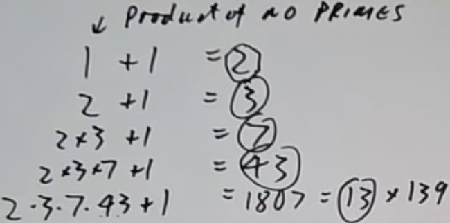

# 数论学习

我又来学数论了，因为抽象代数真的太难了，英语又差，听又听不懂，学也学不好。撑了一会还是决定放弃转数论。使用这个[课程](https://www.youtube.com/watch?v=EzE6it9kAsI&list=PL8yHsr3EFj53L8sMbzIhhXSAOpuZ1Fov8)，仍然和学群论时是一个教授。虽然我群论啥也没听懂，但是听不懂数学顶级教授的课绝对是我太菜的问题。现在开始吧。

### Introduction to number theory

说到数论不得不提到质数。先介绍一种名叫Eratosthenes的方法。这个方法非常简单粗暴，把所有数字写在一张纸上，然后排除一定不是质数的0和1，于是第一个质数是2。接着把之后所有是2的倍数的数字全部划掉，它们不可能再是质数了。划完后找下一个没有被划掉的数字3，圈起来并继续划掉3的倍数。下一个圈起来的数是5……如此往复找质数就很容易了。但是一共有多少个质数呢？由此牵扯到数论的第一个定理：质数的数量是无限的。

这最早由Euclid提出，不过他最开始不是这么说的。希腊人不喜欢“无限”的概念，于是他换了一种说法：取有限的质数$P_1...P_n$，可以找到另外一个不在此集合中的质数。他求出这些质数的乘积后加1，$P_1*P_2*...*P_n+1$，然后找到这个数的一个素数因子$P_{n+1}$。会发现这个素数因子不可能在已有的质数集合$P_1...P_n$中，因为在已有的质数集合中的质数无论如何都不可能整除于其乘积+1。由此得出$P_{n+1}$是一个新质数。

上图展示了这一流程。注意所有已知质数的乘积+1不一定是一个质数，比如最后一步。目前我们有了找质数的稳定方法，可是这个方法生成的质数不一定一个比一个大，怎么找大质数呢？有种Mersenne质数，其形如$2^n-1$。试一下，$2^2-1=3,2^3-1=7,2^4-1=15=3*5$,不对啊，这哪是质数？确实不是，因为使用的n不是质数。$2^{ab}-1=(2^a-1)*(2^{ab-a}+...+1)$，会被$2^a-1$整除。好，从现在开始我们只取n为质数，$2^5-1=31,2^4-1=127,2^11-1=2047=23*199$。又不是质数了。没错这个方法就是这样，虽然$2^n-1$，n为质数时很多时候都是质数，不过总有一些例外。其实也是个不错的生成质数的方法了。不过这个方法可以一直用吗？换句话说，是否有无数多个Mersenne质数？这个问题目前还没有被解决，所以我就等着各位在国际数学界一展风采了:D

另一种长得很像的质数是费马质数，形如$2^n+1$。$2^0+1=2,2^1+1=3,2^2+1=5,2^3+1=9=3*3$。这个不是质数，因为当$2^{ab}+1$的a是奇数时，整个式子整除$2^a+1$。为了防止这种情况发生，我们可以取这种质数，$2^{2^m}+1$。$2^{2^0}+1=3,2^{2^1}+1=5,2^{2^2}+1=17,2^{2^3}+1=257,2^{2^4}+1=65537$。这些数都被称为费马质数。费马曾经以为所有形如$2^{2^m}+1$构建的数都是质数，但是$2^{2^5}+1$整除641。我们都知道费马也算数学界的传奇人物了，这个小错误完全有可能是因为他算错了，就这么朴实无华。至于费马质数的应用，你会在一个八杆子打不着的地方发现它们的身影——哪些正多边形可以只用尺子和圆规来构造？高斯发现如果一个数是费马质数，那么就可以。甚至说，所有你可以只用尺子和圆规来构造的多边形都是不同的费马质数于2的幂的乘积。人们往后推了几个情况，都没有再发现新的费马质数。关于费马质数是否有无限多个的问题仍然值得探讨，不过我们可以笃定，费马提出的这种方法并不是那么容易找质数。

到底有没有简单的方法来生成大质数？比如一个多项式f(n),结果永远是质数。这个多项式不能是f(n)=3这种无聊的玩意，即不能为常数项。欧拉找到一个，$n^2+n+41$，然而仅适用于41之前的情况。当n=41时，整个多项式自然就能整除41了。事实证明这样的多项式不存在。让$f(n)=an^k+...+bn+c$，假如常数项c大于1，那么在n=c时f(n)绝对整除c，毕竟整个式子每一个项都是c的倍数。说明常数项只能等于1。但是常数项等于1时我们可以将$f(n)$转为$f(n+j)$，让常数项不等于1，重复刚才的论点。至此我们知道没有非平凡的多项式能永远生成质数。甚至说，人们到现在还没有找到能稳定生成质数的捷径，搞到最后第一种看起来傻瓜的方法竟然是最好用的。

看了这么久“是否有无限质数”，不如把目光放到有限的世界上来。有多少小于x的质数？这个问题可以用$\Pi(x)$表示，此处的$\Pi$不是3.14159那个，而是希腊字母里表示P的字母。正如无法找到永远生成质数的多项式，我们也无法准确知道$\Pi(x)$的值，但是我们可以粗略估计。高斯提出了一个式子，$\Pi(x)\cong \frac{x}{log(x)}$。注意在数学的世界里，log总是代表以e为底的对数。这个式子直到19世纪才被证明，高斯确实牛逼。用不正规的理解就是，n是质数的几率大概为$\frac{1}{log(n)}$。你可能会觉得，n要么就是质数，要么不是，怎么还有机率的？说n是质数的机率是xxx多少有点毛病。也对，这就靠意会了。

这个公式可以应用于刚刚提到的Mersenne质数：Mersenne质数的数量是无限的吗？按照公式和Mersenne质数的定义，$\frac{1}{log(2^n-1)}=\frac{k}{n}$,这是其中一个Mersenne数是质数的机率。把所有机率加起来，$\sum_n \frac{k}{n}=k(1+\frac{1}{2}+\frac{1}{3}+...)=\infin$，微积分经典调和级数，和为无限，那一共就有无限个Mersenne质数？有点问题，这个论点假设Mersenne质数是随机的，可是它们显然不是，都是$2^n-1$结构的。更离谱的问题在于，当我们拿同样的方法找形如$2^n-2$的数中有多少是质数时，结果应该也是无限个。这不是在搞笑吗，$2^n-2$明显整除2，除了n=2的情况时是个质数。所以这种机率只能用做一个方向指导，实际证明时要谨慎使用，你不知道能搞出来什么幺蛾子。这也是数论中的一个经验法则，所有用上概率参数的证明都非常简单，然而完全不严谨，还有可能给出错误答案，基本没用。

到底有多不严谨和模糊呢？拿费马质数举例子。$2^{2^n}+1$，$\sum \frac{1}{log(2^{2^n}+1)}\approx k\frac{1}{2^n}<\infin$。这说明费马质数的数量应该是有限的。但是我们换种说法，$2^n+1$,$\sum \frac{1}{log(2^n+1)}\approx k\frac{1}{n}=\infin$,这回又有无限多个了。两种形式都是费马质数，所以到底哪个是对的？谁也不知道。