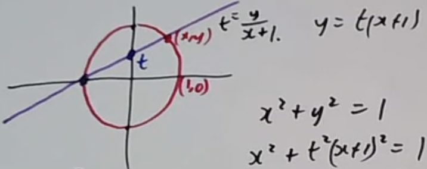
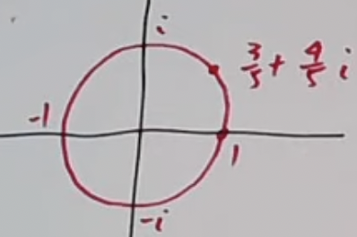

# 数论学习

## Examples of positive definite forms

(前面又卡掉了一部分,过程没记录下来,这里直接记结果了)

任何判别式d=-3的正定二元二次式都与 $x^2+xy+y^2$ 同等。以及，n可被 $x^2+xy+y^2$ 原始表示，当且仅当d=-3模n是一个平方。

比如我们让n=某个素数p，当-3模p是平方时，p可被 $x^2+xy+y^2$ 表示，说明 $p\equiv 0,1\mod 3$ 。再仔细看一下，我们是不是能得到更简单的式子呢？如果x是偶数，我们就能把p写成 $4(\frac{x}{2})^2+2(\frac{x}{2})y+y^2=3(\frac{x}{2})^2+(\frac{x}{2}+y)^2=3x^2+y^2$  ；如果y是偶数，我们也能使用相同的步骤找到更简式子；如果两者都是奇数，我们还能变形为 $(x+y)^2+(x+y)(-y)+(-y)^2$ ，发现x+y是偶数了，又能使用刚才的步骤了。看来无论x和y是什么，能被 $x^2+xy+y^2$ 表示的n也能被 $3x^2+y^2$ 表示。

总结一下就能得到一条定理：质数p可被 $x^2+3y^2$ 表示，当且仅当 $p\equiv 0,1\mod 3$ 。

接下来是d=-4。推理与d=-3的情况差不多，得出a=1，b=0，最简式子为 $x^2+y^2$ 。根据二元二次式表示数的规律，得到来自费马的一条定理: 质数p可被 $x^2+y^2$ 表示，当且仅当 $p\equiv 1,2\mod 4$ 。

然后d=-7。复制粘贴d=-3的推导过程，得到a=1， $b=\pm 1$ ，于是有两个式子 $x^ 2+xy+2y^2$ 和 $x^2-xy+2y^2$ 。注意到 $x\rightarrow -x$ 就能转换式子，于是我们只看 $x^2+xy+2y^2$ 。质数p能被该式子表示的前提是-7模4n是平方。这个没有前面几个明显，借用一下二次互反律。要让 $(\frac{-7}{p})=1$ ，等于要让 $(\frac{p}{7})=1$ ，说明 $p\equiv 1,2,4\mod 7$ 。此时就能得出 $p=x^2+xy+2y^2$ ,当且仅当 $p\equiv 0,1,2,4$ 。

有没有感觉 $x^2+xy+2y^2$ 还是太繁琐了？能不能得到更简的式子呢？当然可以。如果我们要表示的p是奇数的话，y就只能是偶数。如果非要让y是奇数，原式就只能表达偶数了，结合p是质数的条件，p只能为2。既然y是偶数，我们就能把y除以2，原式可被写为 $(x+\frac{y}{2})^2+7(\frac{y}{2})^2$ 。也就是说，当p不等于2， $p=x^2+7y^2,p\equiv 0,1,2,4\mod 7$ 。

d=-8。梅开四度，得到a=1，b=0，简化式为 $x^2+2y^2$ 。如果式子可表示质数p，说明-8模4p是平方，即 $(\frac{-2}{p})=1\Leftrightarrow p\equiv 1,3\mod 8$ 。

d=-11。我都懒得写了，总之a=1， $b=\pm 1$ ，简化式为 $x^2+xy+3y^2$ 和 $x^2-xy+3y^2$ 。跟之前一样，划掉第二个式子， $x\rightarrow -x$ 即可转换。 $p=x^2+xy+3y^2$ 说明-11模4p是平方，即 $(\frac{-11}{p})=1,0$ ，二次互反律得 $(\frac{p}{11})=1,0$ ，最后得到 $p\equiv 0,1,4,9,5,3\mod 11$ 。

事情终于在d=-12时有些不一样了。还是之前的推理方式，但这次我们发现a可以等于1或者2。那就分类讨论吧，a=1时b=0，c=3，简化式为 $x^2+3y^2$ 。a=2时b能等于-2，0，2，简化式为 $2x^2+2xy+2y^2$ 。得出结论，任何d=-12的正定二元二次式都与两者中的一个等价。如果想用两者之一表示n，-12模4n必须是平方。至于怎么区分两者，其实之前的课已经看过了，一个永远表达偶数，一个时偶时奇。所以如果n是奇数， $p\equiv 0,1\mod 3$ ，则 $p=x^2+3y^2$ 。

## More examples of binary quadratic

上节课看了判别式较小的几个正定式子，这节课继续往后看较大的情况,还是那个 $ax^2+bxy+cy^2$ 。

d=-15，根据最简式的定义 $|b|\leq |a|\leq |c|$ ， $b^2-4ac=-15$ ，得到 $3a^2\leq |-15|$ ，a可能等于1或者2。当a=1时，b等于正负1，就有 $x^2+xy=4y^2$ 和 $x^2-xy+4y^2$ 。此处|a|=|b|，可以划去第二个。当a=2时，b等于正负1，就有 $2x^2+xy+2y^2$ 和 $2x^2-xy+2y^2$ 。因为|a|=|c|，可以划去第二个。那么质数p可被两者其一所原始表示的前提是-15模4p是平方，即 $(\frac{-15}{p})=1$ 。二次互反律得到 $(\frac{p}{15})=1,p\equiv 1,3,4,8\mod 15$ 。注意 $(\frac{p}{15})$ 是雅可比符号，结果等于1不一定是代表p模15是平方。需要排除p=3和5的情况，因为这俩整除15。

至于p到底被哪个原始表示，要从两个式子的特征入手。 $x^2+xy=4y^2$ 模3同余0和1； $2x^2+xy+2y^2$ 模3同余0和2。因此当 $p\equiv 1\mod 3$ 时， $p=x^2+xy=4y^2$ ,对应 $p\equiv 1,2,4,8\mod 15$ 中的1和4。另外一个式子自然在 $p\equiv 2\mod 3$ 时表示了，对应 $p\equiv 2,8\mod 15$ 的情况。

d=-16的情况与d=-4相似，d=-12与d=-3的那种相似。a=1，2，分类讨论。a=1时，b=0，简化式为 $x^2+4y^2$ 。a=2时，b可能等于0，2。但是b=2这种情况是不可能的，尝试计算判别式时会发现 $2^2-4\*2\*c=-16$ 这个c找不到合适的值。因此只能是b=0的情况，简化式为 $2x^2+2y^2$ 。所以p想被两者之一表示的条件为-1模4p是平方，即 $p\equiv 1,2\mod 4$ 。这时我们注意到，如果 $p\equiv 1\mod 4$ ，它就只能被 $x^2+4y^2$ 表示。这也不是一个新结果，因为之前学 $x^2+y^2$ 时就注意到x和y中必须有一个偶数，否则它们加起来就不是奇数了。假设y是偶数，就能把原式变形为 $x^2+4(\frac{y}{2})^2$ ，得到我们刚才学的内容。一般来说，当我们把某个判别式乘上一个平方时，这两个判别式的式子通常是相关的。

d=-20，a=1，2。当a=1时，b=0，最简式为 $x^2+5y^2$ 。当a=2时，b=0，2。b=0的情况不可能，故只能为2，最简式为 $2x^2+2xy+3y^2$ 。当-20模4n是平方时，n可被两者之一原始表示。 $(\frac{-20}{p})=1$ ，则 $(\frac{-5}{p})=1$ ，得到 $p\equiv 1,3,7,9\mod 20$ 。如果把两个式子分别模5，会发现 $x^2+5y^2\equiv 1,4\mod 5$ ，而 $2x^2+2xy+3y^2\equiv 2,3\mod 5$ 。告诉我们当 $p\equiv 1,9\mod 20$ 时，p由前者表示；当 $p\equiv 3,7\mod 20$ 时，p由后者表示。

p=-23，a=1，2。当a=1时，b等于正负1，负一的情况被划掉，剩下 $x^2+xy+6y^2$ 。当a=2时，b也等于正负1，但这次的两个式子 $2x^2+xy+3y^2$ 和 $2x^2-xy+3y^2$ improperly equivalent，意味着我们无法直接划掉，要将其算在内。p可被三者之一原式表示的必要条件是-23模4p是平方， $(\frac{-23}{p})=1$ 。之前我们可以通过同余将几种式子区别开来，然而这次不可以。看来不同判别式的最简式之间有一下几种情况：

1. 只有1个等价类。如d=-3，-4，-7...-19
2. 大于1个等价类，但是可以通过同余区分开来。如d=-15,-20。
3. 大于1个等价类，且无法进行区分。正是刚才看的d=-23。

当判别式的值越来越大，第三种情况会经常发生。那么接下来看一个判别式值较大却只有一种等价类的例子。

d=-163。a的取值范围为0< $a\leq 7$ 。相应的， $|b|\leq 7$ 。通过判别式 $b^2-4ac=-163$ 可以看出，b必须是奇数，还剩下1，3，5，7。变形一下得到 $ac=\frac{163+b^2}{4}$ ，代入不同的b求得可能值为41，43，47，53。这些数字都是质数， $|a|\leq |c|$ ，则a只能等于1，b也只能等于1，c就是41。唯一的简化式为 $x^2+xy+41y^2$ 。

## Examples of indefinite binary quadratic forms

这节课来看不定式。不定式的判别式 $d=b^2-4ac\geq 0$ ，我们可以用与证明确定式类似的方法来证明不定式的简化式数量有限。根据简化式的定义 $|b|\leq |a|\leq |c|(a\not ={0})$ ，则 $|b^2|\leq |ac|$ ，也有 $|4ac|\geq |b^2|$ 。 $b^2-4ac\geq 0$ 告诉我们 $ac\leq 0$ ，取绝对值就能变形为 $b^2+4|ac|=d$ ，最终得到 $4a^2\leq d$ 。a的取值是有限的，进而b的取值也是有限的 $(a\not ={0})$ ，最后简化式的数量是有限的。

判别式总是满足 $d\equiv 0,1\mod 4$ 。d=0的情况不是特别有趣，回忆 $ax^2+bx+c=0$ ，这种情况代表两个根都是有理数。 $ax^2+bxy+cy^2$ 可被分解为 $m(nx+ky)^2$ ，比如 $5(3x+4y)^2$ ，改变常数5就能得到无数个类似的式子，况且探寻某个数字乘上一个平方好像不是很有意义。

d=1也不是特别好玩。 $4a^2\leq d=1$ ，说明a=0。 $b^2-4ac=1$ ，说明b等于正负1。这样构造出来的式子是 $\pm xy+cy^2$ ，或者说xy。解决xy=n这类问题也很无趣。

d=4没有好到哪里去。 $4a^2\leq d=4$ ，推算出a=0或正负1。这就有3种情况， $\pm 2xy+cy^2,x^2-y^2,-x^2+y^2$ 。但是这些情况都可以被分解， $\pm 2xy+cy^2=\pm y(2x+cy),x^2-y^2=(x-y)(x+y)$ 。其实任何 $d=n^2$ 的简化式都是这样，可以被分解，今后可以跳过这些值了。

d=5时，根据 $4a^2\leq d=5$ 可以得出a=0或者正负1。又结合 $d=b^2-4ac=5$ ，看出b等于正负1且a=0的情况应该被舍去。排列组合几种可能，得到4种情况： 

$x^2+xy-y^2$ 
$x^2-xy-y^2$ 
$-x^2+xy-y^2$ 
$-x^2-xy-y^2$

发现它们都是等价的。那么我们可以得出，任何判别式d=5的式子都与 $x^2+xy-y^2$ 等价。经验告诉我们，n可被这个式子原始表示的前提是5模4n是平方。让n等于质数p，我们就需要看5模4p是不是平方。注意到5模4是平方，那只用看5模p了。利用二次互反律，p=5或者 $p\equiv 1,4\mod 5$ 。

d=8时，a可能等于0或者正负1。 $b^2-4ac=8$ ，b是偶数且排除a=0的情况。有两种可能， $x^2-2y^2$ 和 $-x^2+2y^2$ 。其实两种是等价的（ $x^2-2y^2=-(x+2y)^2+2(y-x)^2$ ），等于说任何d=8的式子都与 $x^2-2y^2$ 等价。n可被这个式子原始表示的前提是8模4n是平方。让n等于质数p，则现在要求解 $(\frac{8}{p})=1$ ，得到 $p\equiv \pm 1\mod 8$ 。因此 $p=x^2-2y^2$ 这个方程可解的前提是p=2或者 $p\equiv \pm 1\mod 8$ 。

不定式和确定式有截然不同的特点。确定式中有时会得到两个最简式，不过只要|a|=|b|或者|a|=|c|，两者就是等价的，通过 $b=\rightarrow -b$ 转换。确定式表示数字的方式也是有限的。而不定式有多个等价的最简式，且表示数字的方式是无限的。

## Gaussian integers

之前总是将要表示的数字n选为质数，是时候看看非质数的情况了。为了不让事情太复杂，规定 $n=x^2+y^2,n\geq 0,d=b^2-4ac=-4$ 。也就是说，n被 $x^2+y^2$ 原始表示的前提是d=-4模4n是个平方。让 $n=p^k$ ，当 $p\equiv 3\mod 4$ 时，无解；当 $p\equiv 1\mod 4$ 时，有解；当p=2时，需要分类讨论。-4模8是平方，-4模16却不是，说明n=2可以被表示，但n=4不可以。

至此我们有了更严格的前提。n被 $x^2+y^2$ 原始表示的前提是n的质因数模4都是1或2，且 $2^2$ 不整除n。至于非原始表示，我们可以求出x和y的最大公因数gcd(x,y)=g，x和y就能被写成gX=x以及gY=y,那么表示的n就能被写做 $g^2(X^2+Y^2)$ ，看起来n=某个平方\*某个可被原始表示的数字。得出结论，n被这样表示的前提是n所有模3余4的质因数是偶数次幂(all primes dividing n that are 3 mod 4 divide n to an even power)。比如我们想查看3060能不能被非原始表示，只需要做个质因数分解， $3060=2^2\*3^2\*5\*17$ 。 $3^2$ 是偶数次幂，因此3060可被非原始表示成 $x^2+y^2$ 。

有一条定理：如果m，n都可以被写成两个平方的和，则mn也可以。证明很简单，让 $m=x_1^2+y_1^2,n=x_2^2+y_2^2$ ，乘起来就得到 $mn=(x_1^2+y_1^2)(x_2^2+y_2^2)=(x_1x_2-y_1y_2)^2+(x_1y_2+x_2y_1)^2$ 。问题在于，教授是怎么知道的？答案就是这节课的标题——高斯整数。

高斯整数形如m+ni， $m,n\in Z,i^2=-1$ 。根据其定义， $m^2+n^2=(m+ni)(m-ni)$ 。那么原有的条件 $m=x_1^2+y_1^2$ 就能被写为 $(x_1+iy_1)(x_1-iy_1)$ ，同理 $n=x_2^2+y_2^2=(x_2+iy_2)(x_2-iy_2)$ 。两者相乘就得到了 $mn=(x_1+iy_1)(x_2+iy_2)(x_1-iy_1)(x_2-iy_2)$ 。前半部分 $(x_1+iy_1)(x_2+iy_2)=\left(x_1x_2-y_1y_2\right)+\left(x_1y_2+y_1x_2\right)i$ ,后半部分 $(x_1-iy_1)(x_2-iy_2)=\left(x_1x_2-y_1y_2\right)+\left(-x_1y_2-y_1x_2\right)i$ 。注意到取 $\left(x_1x_2-y_1y_2\right)^2+\left(x_1y_2+y_1x_2\right)^2$ 就能得到mn了，这就是刚才那个等式的由来。

有了高斯整数就能更简单地将一个数写为两个平方的和。比如76500，先质因数分解， $76500=2^2\*5^3\*3^2\*17$ 。再把能够写为两个平方和的质因数写为平方和，即 $(1+i)^2(1-i)^2(2+i)^3(2-i)^3\*3^2\*(4+i)(4-i)$ 。我们的目标是构造(m+ni)(m-ni)，从每个因子里面抽一半，得到乘积后乘上i，得到 $m+ni=i(1+i)^2(2+i)^3\*3\*(4-i)=-114-252i$ 。根据 $(a^2+b^2)=(a+bi)(a-bi)$ ，得到 $76500=114^2+252^2$ 。

还能进一步推广到四个平方和的情况。如果两个数都可以被4个平方的和表示，则它们的乘积也可以。 $(a^2+b^2+c^2+d^2)(e^2+f^2+g^2+h^2)$ 的结果同样可以被4个平方的和表示。此处的 $a^2+b^2+c^2+d^2$ 可被分解为(a+bi+cj+dk)(a-bi-cj-dk)。其中i，j，k满足：

$i^2=j^2=k^2=-1$ 
$ij=-ji=k$ 
$jk=-kj=i$ 
$ki=-ik=j$

这就是著名的哈密顿四元数（hamiltonian quaternions）。具体怎么表示这里就不介绍了。

有没有发现我们跳过了3个平方和的情况？主要是因为 $(a^2+b^2+c^2)(d^2+e^2+f^2)=(\*^2+\*^2+\*^2)$ 不一定成立， 看3和5的例子就懂了。这种性质仅在2个平方和和4个平方和时成立。

假设 $p\equiv 1\mod 4$ ，有没有什么办法可以快速找到 $p=x^2+y^2$ ？当然有，首先我们先解 $x^2\equiv -1\mod p$ ，之前学过一个概率算法 $g^{(p-1)/4}$ ，有50%的概率是解。这里不再多说，总之找到解后可以构造出 $x^2+1=pn$ ，这里的p可以被分解为(y+iz)(y-iz), $x^2+1$ 可被分解为 $(x+i)(x-i)$ 。又有一个概率算法能找到y+iz：在高斯整数中求gcd(x+i,p)，有概率直接得到(y+iz),进而得出 $p=(y+iz)(y-iz)=y^2+z^2$ 。

举个简单的例子,p=13。第一步解 $x^2\equiv -1\mod 13$ ，得到x=5， $5^2+1=13\*2,(5+i)(5-i)=13\*2$ 。然后求gcd(5+i,13)，得到3-2i。立刻就能发现 $13=3^2+2^2$ 。

不过高斯整数上的欧几里德法怎么用？根据平常的定义，两个数a和b，带余除法可被写为 $a=bp+r,b\not ={0}$ ，r小于b。但是高斯整数值的大小怎么定义呢？答案是与原点的距离，(distance to 0) 。一个高斯整数r=s+it，算出点(s,t)到原点的距离，就是 $\sqrt{s^2+t^2}$ ，为了方便可以只算 $s^2+t^2$ 。a=bp+r整体除以b，得到 $\frac{a}{b}=q+|\frac{r}{b}|$ ， $|\frac{r}{b}|$ 按照定义应该是小于1的，q是一个高斯整数， $\frac{a}{b}$ 则是一个复数。如果我们能证明任何一个复数都可以被写为一个高斯整数+某个绝对值最多是1的形式，欧几里得的问题就迎刃而解了。答案是肯定的，画个图就知道了。

在每个高斯整数周围画一个半径为1的圆，可以完美覆盖整个复数平面，说明欧几里得法存在。注意平时的质数在高斯整数中不一定是质数，比如5。

来看个高斯整数的应用场景。假如我们想解 $x^2+y^2=n$ ，有多少种解法？这等同于问n=(x+iy)(x-iy)多少种写法。还是把n质因数分解，得到 $n=2^a\*3^b\*5^c\*7^d...$ 。 $2^a=(1+i)^a(1-i)^a,5^c=(2+i)^c(2-i)^c$ ， $3^b$ 和 $7^d$ 没有高斯整数分解形式。每个因子取一半，得到 $\*(1+i)^a,3^{b/2},(2+i)^{\*}(2-i)^{c-\*},7^{d/2}$ 。 $(1+i)^a(1-i)^a$ 的情况有些特别，因为 $(1-i)i=(1+i)$ 两者仅区别于符号，\*代表的就是变化的符号。 $\*(1+i)^a$ 有4种情况， $3^{b/2}$ 一种情况， $(2+i)^{\*}(2-i)^{c-\*}$ c+1种情况， $7^{d/2}$ 一种情况。因此当我们尝试找n的分解方法的次数时，先看n的质因数分解中所有模4同余1的质数的指数是不是偶数，如果不是就无解（因为要除以2）；然后4乘上模4同余1的质数的指数+1，就是解的数量。

实操一下， $x^2+y^2=65$ 有多少种解法？ $65=5^1\*13^1$ ，按照我们的方法算出 $4\times (1+1)\times(1+1)=16$ 。可是想破脑袋也只能得出 $65=8^2+1^2$ 和 $65=7^2+4^2$ ，难道是算法有误？当然不是，还有 $(\pm 8)^2+(\pm 1)^2$ ，调换位置等操作呢，都算上刚好是16种解法。

## Pythagorean triangles

毕达哥拉斯方程为 $x^2+y^2=z^2$ ，如果x，y和z两两互质（ $z\not ={0}$ ）且g|x,g|y，就有g|z，进而得到更小的解 $(\frac{x}{g})^2+(\frac{y}{g})^2=(\frac{z}{g})^2$ 。注意到 $x^2+y^2=z^2$ 是一种特殊的三元二次式 $x^2+y^2-z^2=0$ 。接下来介绍几种通用解法。

回顾之前学的 $x^2+y^2=n$ ，n可被原始表示的前提是n没有满足 $p\equiv 3\mod 4$ 的质数因子p且4不整除n。回到 $x^2+y^2=z^2$ ，注意到如果z可被2整除，那么z的平方就可被4整除，进而 $x^2+y^2$ 可被4整除，那么x和y一定都是偶数，就没有原始表示了。可以得出该式有原始解的条件是z的质数因子模4余1，反过来同理。

第二种方法是几何方法。 $x^2+y^2=z^2$ ，两边除以 $z^2$ ，得到 $X^2+Y^2=1$ ，X和Y都是有理数。很明显这个式子会形成一个圆：

圆与x轴和y轴的交点是原方程的平凡解，没意思。过其中两个交点作一条线，查看其与y轴的交点，斜率为t。计算这条线的斜率： $t=\frac{\Delta y}{\Delta x}=\frac{y}{x+1}$ ，变形一下得到y=t(x+1)，代入 $X^2+Y^2=1$ ，得到 $x^2+t^2(x+1)^2=1$ 。分别解X和Y，得到 $x=\frac{1-t^2}{1+t^2},y=\frac{2t}{1+t^2}$ 。如果我们取 $x=\frac{1}{2}$ ，则 $x=\frac{3}{5},y=\frac{4}{5},(\frac{3}{5})^2+(\frac{4}{5})^2=1$ ，这便是 $3^2+4^2=5^2$ 了。取t的其他有理数值即可得到别的方程的解， $\frac{1}{3},\frac{1}{4}$ 什么的。

第三种方法和上一种很像，不过使用高斯整数。同样的方式构造出 $X^2+Y^2=1$ ，画个圆：

X和Y都是有理数，且X+iY是一个复数。我们的目标是找到绝对值为1的复数，且整数部分和虚数部分都是整数。如果我们有两个满足的复数a和b，|a|=|b|=1，则|ab|=1。看来只要有两个毕达哥拉斯方程的解，两者相乘又是一个新的解。比如已知解 $3^2+4^2=5^2$ ，自己乘自己: $(\frac{3}{5}+\frac{4}{5}i)(\frac{3}{5}+\frac{4}{5}i)$ ，得到 $(\frac{-7}{25}+\frac{24}{25}i)$ ，这就是另一个解 $7^2+24^2=25^2$ 。

第4种方法偏向代数。对于方程 $x^2+y^2=z^2$ ，不如假定x，y和z两两互质。如果z是偶数，意味着x和y都是偶数，就能整体除以2，不妨直接设定z为奇数。既然z都是奇数了，x和y不能都是奇数或者都是偶数，不然结果就是偶数了，只能一奇一偶。那么让x为偶数，y为奇数。变形一下：

$x^2=z^2-y^2=(z-y)(z+y)$

根据我们的条件，可以两边除以2，得到 $(\frac{x}{2})^2=\frac{z-y}{2}\frac{z+y}{2}$ 。因为z和y都是奇数，所以它们互质。z-y和z+y会创造出公因子2，我们又除了个2，那么 $\frac{z-y}{2}$ 和 $\frac{z+y}{2}$ 一定是互质的。注意到两个互质的数乘积是平方，意味着它们都是质数。让 $\frac{z-y}{2}=s^2,\frac{z+y}{2}=r^2$ ，r和s互质，就给了我们通解：

$x=2rs$ 
$y=r^2-s^2$ 
$z^2=r^2+s^2$

该解法来自于一个恒等式： $(r^2+s^2)^2=(r^2-s^2)^2r(2rs)^2$ 。随便选r和s就能生成不同的解了。

第四种方法还有别的应用。费马大定理说， $X^n+Y^n=Z^n$ 在n大于等于3，X，Y，Z均不等于0时无解。费马当时用无穷递降法证明了n=4的情况： $X^4+Y^4=Z^4$ ,后面发现证明 $X^4+Y^4=Z^2$ 就行了。我们把式子做个变形，得到 $(X^2)^2+(Y^2)^2=Z^2$ 。代入方法4的到的结论，假设 $X^2=r^2-s^2,y^2=2rs$ ，r和s互质。r是个奇数，因为 $X^2+s^2=r^2$ 。如果我们有两倍的两个互质数的乘积是个平方，那么2乘上其中一个数也是平方，另外一个数也是。则得出r是平方，2s也是平方。让 $r=a^2,s=2b^2$ 。把这些值代入 $X^2=r^2-s^2$ ，得到 $X^2=a^4-4b^4$ 。当我们有 $X^4+Y^4=Z^2$ 的解时， $X^2=a^4-4b^4$ 也有解。后者也很像毕达哥拉斯方程啊，还能继续变形： $(2b^2)^2+X^2=(a^2)^2$ 。重复这一步（教授把这里当作课后练习了），能得到 $a^2=e^4+f^4$ 更小的解。这不就是原来的方程吗？我们可以把 $x^4+y^4=z^2$ 降到 $x^4-4y^4=z^2$ ，又能降回去得到 $x^4+y^4=z^2$ 。如果该方程有解，不可能可以这一无限降下去，只能说明原方程无解。

## Dirichlet series

这节课要学的东西和生成函数有关。首先回忆一下生成函数：有 $C_0,C_1,C_2...$ ，构造一个函数 $f(x)=C_0+C_1x+C_2x^2+...$ 将上方 $C_0,C_1,C_2...$ 序列的特征套用进函数，尝试找到一种生成的方法。

例如斐波那契数列，我们知道其数字满足 $f_{n+2}=f_{n+1}+f_n$ ，并有 $f_0=0,f_1=1$ 。构造：

$F(x)=f_0x^0+f_1x^1+f_2x^2...$ 
$xF(x)=$ &nbsp;&nbsp;&nbsp;&nbsp;&nbsp;&nbsp;&nbsp;&nbsp;&nbsp;&nbsp;&nbsp;    $f_0x+f_1x_2...$ 
$x^2F(x)=$ &nbsp;&nbsp;&nbsp;&nbsp;&nbsp;&nbsp;&nbsp;&nbsp;&nbsp;&nbsp;&nbsp;&nbsp;&nbsp;&nbsp;&nbsp;&nbsp;&nbsp;&nbsp;&nbsp;&nbsp;&nbsp;&nbsp; $f_0+f_1...$

根据递归公式定义，如果我们将上面的函数相减（ $f_2x^2-f_1x^2-f_0$ 等），只会剩下中间 $f_1x^1,f_0x$ 这段，即 $(1-x-x^2)F(x)=x$ 。现在我们就能借此构造出函数了。 $F(x)=\frac{x}{1-x-x^2}$ ， $\frac{x}{1-x-x^2}$ 的根为 $\frac{\sqrt{5}+1}{2}$ 。定义 $\phi=\frac{\sqrt{5}+1}{2}$ ,那么 $F(x)=\frac{x}{(1-\phi x)(1-(1-\phi)x)}$ 。换一种方式写就是 $\frac{1}{\sqrt{5}}(\frac{1}{1-\phi x}-\frac{1}{1-(1-\phi)x})$ ，写为级数就是 $\frac{1}{\sqrt{5}}\sum_n x^n(\phi^n-(1-\phi)^n)$ 。这就是斐波那契函数了： $f_n=\frac{1}{\sqrt{5}}(\phi^n-(1-\phi)^n)$ 。生成函数的典型步骤就是这样，先从一个有规律的数字序列开始，然后将其转换为函数，识别函数的特征，最后往回推得到最终函数。

幂级数不是生成函数的唯一方法，由此引入狄利克雷级数。假如我们有一个序列 $C_1,C_2,C_3$ ，狄利克雷级数就是 $f(s)=\frac{C_1}{1^s}+\frac{C_2}{2^s}+\frac{C_3}{3^s}$+... 。假如我们有序列1，1，1，1...，就有 $\zeta(s)=\frac{1}{1^s}+\frac{1}{2^s}+\frac{1}{3^s}+...$ ，臭名昭著的黎曼zeta函数。如果s大于1，该级数收敛；如果s=1，该级数发散。它的无限乘积展开(infinite product expansion)也很重要： $\zeta(s)=\frac{1}{1-2^{-s}}\frac{1}{1-3^{-s}}\frac{1}{1-5^{-s}}...=\prod_p \frac{1}{1-p^{-s}}$ 。 

欧拉函数就可以用狄利克雷展开了。 $\frac{1}{1^s}+\frac{\phi(p)}{p^s}+\frac{\phi(p^2)}{p^{2s}}...$ ，我们知道 $\phi(p)=p-1,\phi(p^2)=p(p-1)$ ，那么原式就等于 $\frac{1}{1^s}+\frac{p-1}{p^s}+\frac{p^2-p}{p^{2s}}=\frac{1-p^{-s}}{1-p^{1-s}}$ 。看来 $\sum \phi(n)n^s=\prod_p \frac{1-p^{-s}}{1-p^{1-s}}=\frac{\zeta(s-1)}{\zeta(s)}$ 。

$\tau$ 也可以这么展开。 $\tau(n)=$ n的所有因数数量，用狄利克雷展开就是 $\frac{\tau(1)}{1^s}+\frac{\tau(2)}{2^s}+...$ 。注意 $\tau(p^k)=k+1$ ，那么 $\frac{1}{1^s}+\frac{\tau(p)}{p^s}+\frac{\tau(p^2)}{p^{2s}}+...=\frac{1}{1^s}+\frac{2}{p^s}+\frac{3}{p^{2s}}+...=\frac{1}{(1-p^{-s})^2}$ 。根据微积分里学的内容： $1+2x+3x^2+...=\frac{1}{(1-x)^2}$ ，那么 $\prod_p \frac{1}{(1-p^{-s})^2}=\zeta(s)^2$ 。

$\sigma$ 稍微有点复杂。 $\frac{\sigma(1)}{1^s}+\frac{\sigma(2)}{2^s}+\frac{\sigma(3)}{3^s}+...$ ，其中 $\sigma(p^k)=1+p+p^2+...+p^k=\frac{p^{k+1}-1}{p-1}$ ，那么就有 $\frac{1}{1^s}+\frac{1+p}{p^s}+\frac{1+p+p^2}{p^{2s}}=\frac{1}{(1-p^{-s})(1-p^{1-s})}=(1+\frac{1}{p^s}+\frac{1}{2s}+...)(1+\frac{p}{p^s}+\frac{p^2}{p^{2s}}+...)$ 。最后就得到 $\sum \frac{\sigma(n)}{n^s}=\prod_p \frac{1}{(1-p^{-s})(1-p^{1-s})}=\zeta(s)\zeta(s-1)$ 。

$\mu(n)$ 等于0，如果n可被任何大于1的平方数整除；等于 $(-1)^k$ ，如果n是k个不同质数的乘积。尝试狄利克雷展开： $\sum \frac{\mu(n)}{n^s}$ ，等于 $1+\frac{\mu(p)}{p^s}+\frac{\mu(p^2)}{p^{2s}}+...=1-\frac{1}{p^s}$ ，告诉我们原式就等于 $\prod_p (1-p^{-s})=\frac{1}{\zeta(s)}$ 。

定义一个狄利克雷特征（dirichlet character）为 $\chi(n)=1$ ，如果 $n\equiv 1\mod 4$ ;等于-1，如果 $n\equiv 3\mod 4$ ；等于0，如果n是偶数。那么 $L(s)=\sum \frac{\chi(n)}{n^s}=\frac{1}{1^s}-\frac{1}{3^s}+\frac{1}{5^s}-\frac{1}{7^s}...$ 。如果让n=p，则 $\frac{1}{1^s}+\frac{\chi(p)}{p^s}+\frac{\chi(p^2)}{p^{2s}}...$ 。如果p=2，结果为1；如果 $p\equiv 1\mod 4$ ，结果为 $1+\frac{1}{p^s}+\frac{1}{p^{2s}}+...=\frac{1}{1-p^{-s}}$ ；如果 $p\equiv 3\mod 4$ ，结果为 $1-\frac{1}{p^s}+\frac{1}{p^{2s}}...=\frac{1}{1+p^{-s}}$ 。所有的情况都有因子 $\frac{1}{1-\chi(p)p^{-s}}$ ，那么 $L(s)=\prod_p \frac{1}{1-\chi(p)p^{-s}}$ 。

最后是一个不满足multiplicative性质的函数 $\Lambda(n)$ ，该函数等于log(p)，如果 $n=p^k,k\geq 1$ ，p是质数。

## Products of Dirichlet series

如果我们把两个幂级数相乘：

$(a_0+a_1x+a_2x^2+...)(b_0+b_1x+b_2x^2+...)$ 
$=c_0+c_1x+..$

其中 $c_0=a_0b_0,c_1=a_1b_0+a_0b_1,c_2=a_2b_0+a_1b_1+a_0b_2...$ ，不难看出 $c_n=\sum_i a_ib_{n-i}$ 。 $c_n=\sum_i a_ib_{n-i}$ 这个表达式有时候被称为a和b两个级数的卷积（convolution）。

又有两个级数：

$F(s)=\frac{f_1}{1^s}+\frac{f_2}{2^s}+...$ 
$G(s)=\frac{g_1}{1^s}+\frac{g_2}{2^s}+...$

把它们相乘，得到：

$F(s)G(s)=\frac{f_1g_1}{1^s}+\frac{f_1g_2+f_2g_1}{2^s}+\frac{f_1g_3+f_3g_1}{3^s}+\frac{f_1g_4+f_2g_2+f_4g_1}{4^s}...$ 
$=\sum_n \frac{1}{n^s}\*\sum_{d|n}f(d)g(\frac{n}{d})$

注意到后半部分 $\sum_{d|n}f(d)g(\frac{n}{d})$ 是乘法卷积（multiplicative convolution），与最开始看的那种加法卷积区别在于，加法卷积中n和i的关系是相加（i，n-i）；而乘法卷积中d和n的关系是相乘，（d，n/d）。

来一次实战。

$F(s)=\zeta(s)=\frac{1}{1^s}+\frac{1}{2^s}+...$ 
$G(s)=\frac{g_1}{1^s}+\frac{g_2}{2^s}+...$

能看出F(s)的系数是f(n)=1。那么 $\zeta(s)G(s)=\sum \frac{h_n}{n^s}$ ，其中 $h_n=\sum_{d|n} gd$ 。如果我们让 $g(n)=\phi(n)$ ， $G(s)=\frac{\phi(1)}{1^s}+\frac{\phi(2)}{2^s}+...$ ，结合之前学的 $\sum_{d|n} \phi(d)=n$ ，就得到了 $\zeta(s)G(s)=\frac{1}{1^s}+\frac{2}{2^s}+\frac{3}{3^s}+...=\zeta(s-1)$ ,结果中的1，2，3......来自于 $\sum_{d|n} \phi(d)=n$ 的n。最后得到 $G(s)=\zeta(s-1)/\zeta(s)$ 。

接下来要看一个叫做mobius inversion formula的东西。该公式说： 如果有 $G(s)=\zeta(s)F(s)$ ，则 $F(s)=\zeta(s)^{-1}G(s)$ 。乍一看有点废话，如果我们换成这两个函数的系数函数f和g的写法可就不一样了。系数函数版本如下：

$g(n)=\sum_{d|n} f(d)$ 
$f(n)=\sum_{d|n} g(d)\mu (\frac{n}{d})$

$\mu$ 并不是凭空出现的，毕竟 $\zeta(s)^{-1}=\sum \frac{\mu(n)}{n^s}$ 。

关于这玩意怎么用，我们让 $n=\sum_{d|n} \phi(n)$ ，系数函数分别为 $g(n)=n,f(n)=\phi(n)$ 。那么应用mobius inversion formula就能得到 $\phi(n)=\sum_{d|n} d\*\mu(\frac{n}{d})$ 。套用这个表达式算 $\phi(6)=6-3-2+1$ ，嗯，没问题。

另外一个例子则是 $\zeta(s)\*L(s)$ ，其中 $L(s)=\frac{1}{1^s}-\frac{1}{3^s}+\frac{1}{5^s}-\frac{1}{7^s}...$ 。最后乘出来会得到 $\frac{1}{4}\sum_n \frac{R(n)}{n^s}$ ，R(n)等于满足 $n=a^2+b^2$ 的解的数量。这个函数有multiplicative的性质，并且取决于n的质因数模4是1还是3。这里我们让n=p，展开来得到 $\frac{1}{4}\frac{R(1)}{1^s}+\frac{R(p)}{p^s}+\frac{R(p^2)}{p^{2s}}+...$ ，有3种情况：

p=2，等于 $\frac{1}{1-2^s}$ 
$p\equiv 1\mod 4$ ，等于 $\frac{1}{(1-p^{-s})^s}$ 
$p\equiv 3\mod 4$ ，等于 $\frac{1}{1-p^{-2s}}=\frac{1}{1^{-s}}\frac{1}{1+p^{-s}}$ 

其实 $\frac{1}{4}\sum_n \frac{R(n)}{n^s}$ 也被称为高斯整数上的zeta函数（zeta of gaussian integers）。

我们甚至可以对狄利克雷级数求导。比如有这么一个级数： $F(s)=\frac{f(1)}{1^s}+\frac{f(2)}{2^s}+...$ ， $\frac{d}{ds}F(s)$ 等于多少？我们知道 $\frac{d}{ds}n^{-s}=-log(n)\*n^{-s}$ ，因此求级数的导数相当于乘上个系数log(n)，再把负号放在前面。于是就有 $-\frac{d}{ds}F(s)=\frac{log(1)f(1)}{1^s}+\frac{log(2)f(2)}{2^s}+...$  。换个函数 $\Lambda(n)$ ，该函数等于log(p)，如果 $n=p^k$  ；其他情况下都等于0。此时就能发现 $\sum \Lambda(n)n^{-s}=\frac{d}{ds}log(\zeta(s))$ ,求了一个狄利克雷级数的导数。

最后看个selberg's identity。这玩意长得有点恐怖：

$\Lambda(n)log(n)+\sum_{d|n}\Lambda(d)\Lambda(n/d)=\sum_{d|n}\mu(d)(log(\frac{n}{d}))^2$

需要用生成函数法来证明。尝试找到系数分别为这些部分的函数。

$\Lambda(n)\rightarrow \frac{\zeta'(s)}{\zeta(s)}$

加上我们之前学的，乘上个log(n)等于求导数，于是：

$\Lambda(n)log(n)=-(\frac{\zeta'(s)}{\zeta(s)})'$

继续看剩下的：

$\Lambda(d)\rightarrow \frac{\zeta'(s)}{\zeta(s)}$ 
$\Lambda(n/d)\rightarrow \frac{\zeta'(s)}{\zeta(s)}$ 
$(log\frac{n}{d})^2\rightarrow \zeta''(s)$ 
$\mu(d)(log\frac{n}{d})^2\rightarrow \frac{\zeta''(s)}{\zeta(s)}$

这样转换一下就有了一个常见的事实：

$-(\frac{\zeta'(s)}{\zeta(s)})'+\frac{(\zeta'(s))^2}{\zeta(s)^2}=\frac{\zeta''(s)}{\zeta(s)}$
