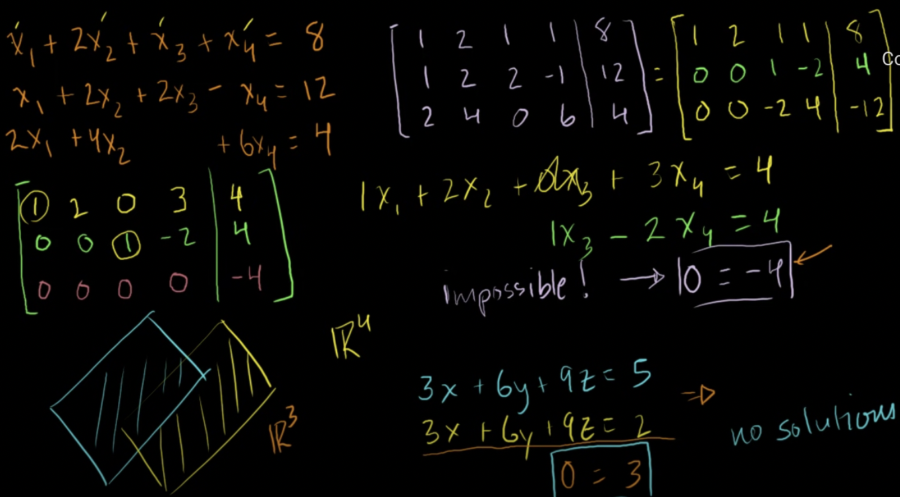
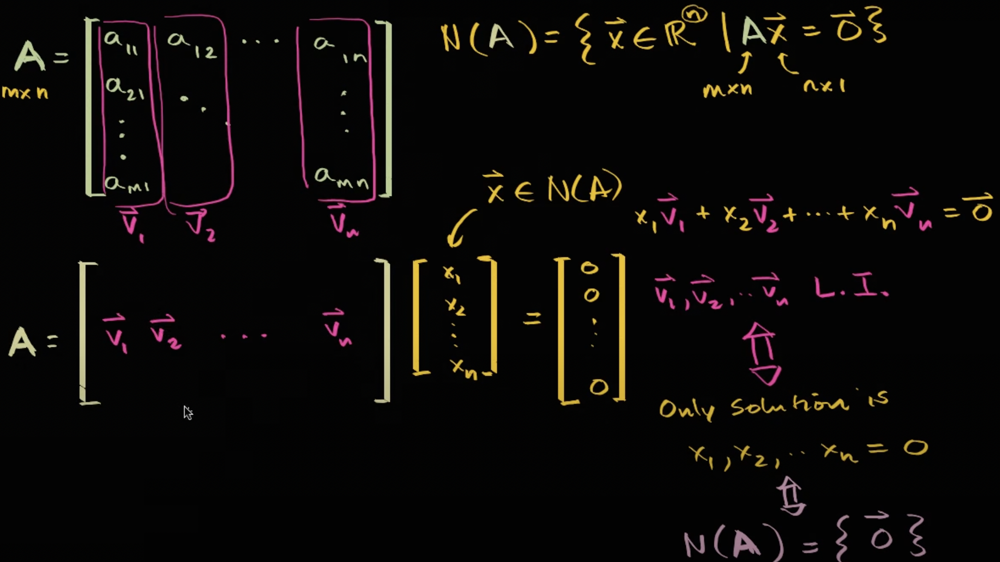
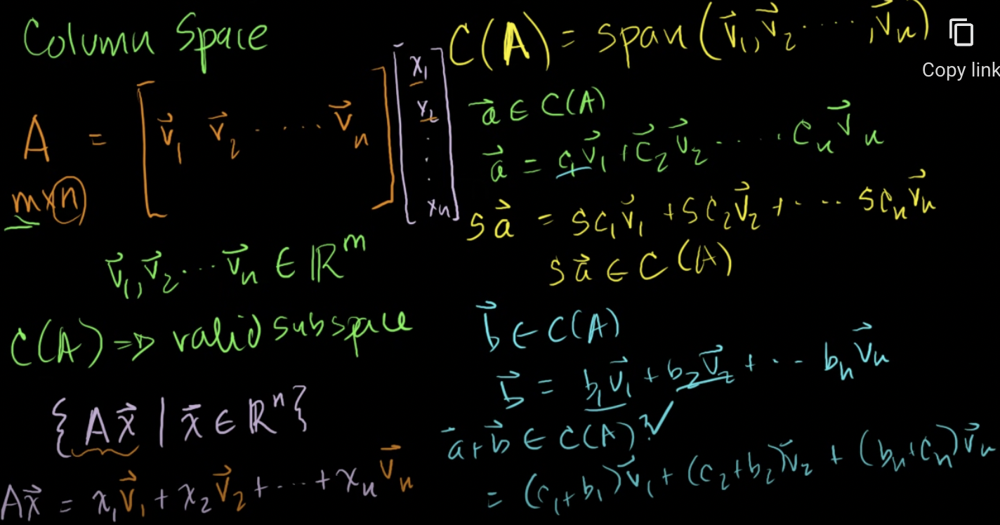

# 线性代数学习

没找到别的适合我这个水平的数论课程了，所以来学线性代数。

### Cauchy-Schwarz 不等式

如果$\vec{x},\vec{y}\in \real^n$，那么$|\vec{x}·\vec{y}|<=||\vec{x}||\vec{y}||$

$|\vec{x}·\vec{y}|=||\vec{x}||\vec{y}||\iff\vec{x}=c\vec{y}$

在向量的运算中，·表示点乘，x表示叉乘，和平时的理解有点不一样。

点乘中，交换律和分配律这类运算规律同样适用。一个n维向量的模长为$||\vec{v}||=\sqrt{v^2+v^2+v^2+...v+v^2}$，v表示v1，v2，v3，vn……也就是等于v这个向量与自己的点乘的开方。$||\vec{v}||^2=\vec{v}·\vec{v}$
 
### 三角不等式

$||\vec{x}+\vec{y}||<=||\vec{x}||+||\vec{y}||$

加上这张图会更简单。其实就是初中学的三角形三条边的性质：两边之和大于第三边。这里还多了个等于的情况，因为向量y和向量x可能共线。

$(\vec{a}·\vec{b})=||\vec{a}||||\vec{b}||cos\theta$。$\theta$为两个向量之间的夹角。证明要用余弦定理，视频里的证明有点乱就不放了。这个公式在二维向量的情况下相信大家已经都用过很多次了，推广到多维同样适用。

另外还有一点新概念。当夹角为90度的时候，上面公式的值为0，因为cos 90等于0。如果x向量和y向量都不是0，则我们说两者垂直并正交。如果两者中有一个是0，则我们说两者正交。0向量与任何向量都正交，包括自己。

这张图讲了如何利用法向量和一个点在r3中定义一个平面。方法就是把表示那个点的向量与向量x相减，结果再与法向量进行点乘，最终结果化简就是所求的方程。

关于平面标准方程的补充。通过标准方程找法向量很简单。标准方程为$Ax+By+Cz=D$，那么$\vec{n}=Ai+Bj+Ck$,其中i，j和k是标准向量。

上图展示了如何找到不在平面上的点与平面的距离。

### 叉乘

叉乘的使用范围没有点乘广。点乘在任意维度的向量中都被定义，而叉乘仅存在于三维向量，即$R^3$。叉乘表示为$\vec{a}$ x $\vec{b}$,结果是一个三维向量，这个向量与a和b都正交。如何计算图中有写，稍微有点复杂。同时还有个跟点乘相对的公式:$||\vec{a}$ x $\vec{b}||=||\vec{a}||||\vec{b}||sin\theta$。

???怎么突然就用矩阵来解方程了？还是不定方程，我都还没学……会。没事以后还能补。

这个正常了，使用矩阵解3元一次方程组。思路也很简单，首先把第一个方程的x作为主元，剩下两行在x的位置需要利用相加相减等方法消去数字，得到0。第二个方程的y作为主元，第三个方程的z作为主元。最后得到的矩阵就是这个方程组的解。其实和平常解的方法是一样的，都是尽量消元，只是矩阵解法要保证主元所在的列只有自己不是0。

这种情况下方程组无解。此方程的增广矩阵消元到最后得到了0=-4，而这是不可能的，从而无解。有解的情况是0=0。如果一个方程组消元后的矩阵最后一行全是0且等于0，并有无关主元的自由变量，那么该方程组有无数个解；如果没有则恰好有一个解。

以上是如何求一个矩阵的向量的乘积。矩阵的列数必须和向量的标量的数量相同。

首先先来复习一下子空间的定义。子空间S满足$\vec{0}\in S;\vec{v1},\vec{v2}\in S\rArr \vec{v1}+\vec{v2}\in S;C\in \real,C\vec{v}\in S$。即子空间S中有向量0；如果向量v1和v2都在S中，则v1+v1也在S中，对加法封闭；C是任意实数，向量v1在S中，C乘v1在S中，对乘法封闭。N(A)指的是找到满足方程$A\vec{x}=0$的$\vec{x}$所构成的集合，即零空间。

这张图算出来矩阵A的零空间是两个矩阵张成的空间，而那两个矩阵由矩阵A的增广矩阵得来.我看不懂但我大受震撼。

如何利用矩阵A的零空间来判断矩阵A是否线性无关？如果矩阵A得零空间仅包含一个元素，即向量0，意味着方程的解只有0，因此矩阵线性无关。线性相关代表一组向量中的一部分可以用各种线性组合来构成这组向量中的另一个向量；线性无关代表无论如何线性组合都无法构成另一个。

一个矩阵的列空间是其所有列向量所张成的空间。