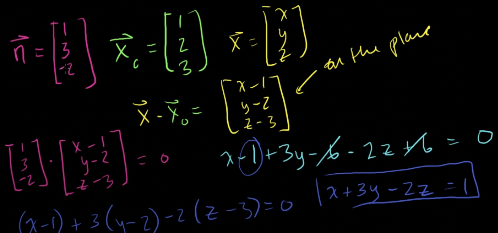

# 线性代数学习

没找到别的适合我这个水平的数论课程了，所以来学线性代数。

### Cauchy-Schwarz 不等式

如果$\vec{x},\vec{y}\in \real^n$，那么$|\vec{x}·\vec{y}|<=||\vec{x}||\vec{y}||$

$|\vec{x}·\vec{y}|=||\vec{x}||\vec{y}||\iff\vec{x}=c\vec{y}$

在向量的运算中，·表示点乘，x表示叉乘，和平时的理解有点不一样。

点乘中，交换律和分配律这类运算规律同样适用。一个n维向量的模长为$||\vec{v}||=\sqrt{v^2+v^2+v^2+...v+v^2}$，v表示v1，v2，v3，vn……也就是等于v这个向量与自己的点乘的开方。$||\vec{v}||^2=\vec{v}·\vec{v}$
 
### 三角不等式

$||\vec{x}+\vec{y}||<=||\vec{x}||+||\vec{y}||$

加上这张图会更简单。其实就是初中学的三角形三条边的性质：两边之和大于第三边。这里还多了个等于的情况，因为向量y和向量x可能共线。

$(\vec{a}·\vec{b})=||\vec{a}||||\vec{b}||cos\theta$。$\theta$为两个向量之间的夹角。证明要用余弦定理，视频里的证明有点乱就不放了。这个公式在二维向量的情况下相信大家已经都用过很多次了，推广到多维同样适用。

另外还有一点新概念。当夹角为90度的时候，上面公式的值为0，因为cos 90等于0。如果x向量和y向量都不是0，则我们说两者垂直并正交。如果两者中有一个是0，则我们说两者正交。0向量与任何向量都正交，包括自己。

这张图讲了如何利用法向量和一个点在r3中定义一个平面。方法就是把表示那个点的向量与向量x相减，结果再与法向量进行点乘，最终结果化简就是所求的方程。

