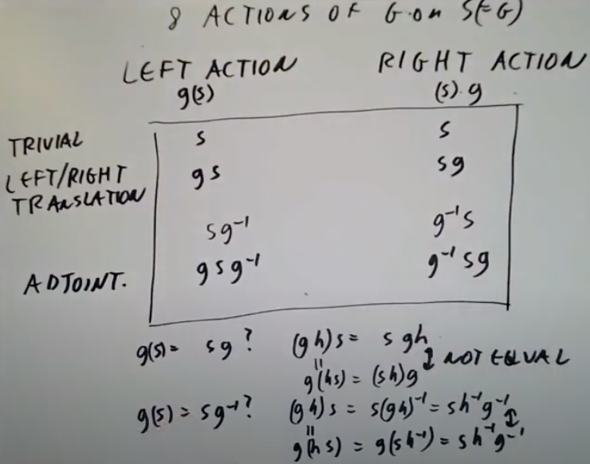
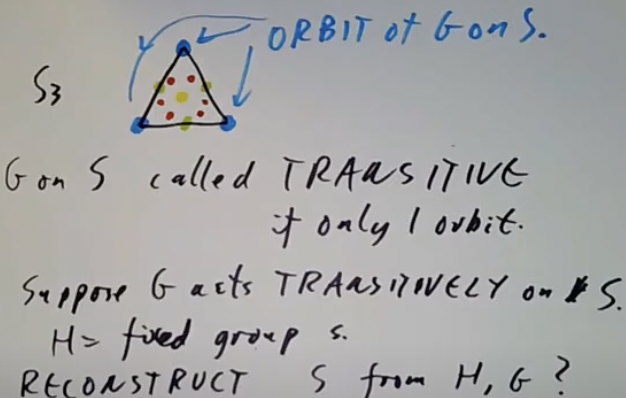

# 群论学习

发现了个很牛逼的群论介绍[视频](https://www.youtube.com/watch?v=mH0oCDa74tE),推荐大家看看。不过这个视频不是教程，只是一个关于群论的“预告片”。

### Introduction

接下来真正要学习的是这个[视频](https://www.youtube.com/watch?v=KufsL2VgELo)。

群是元素的集合，可包含任何数学对象。对象之间的操作可以是基本的加减乘除，也可以是完全不同的其他东西。但群需要满足一下四个公理：

1. 封闭性（closure）
2. 结合性（associativity）
3. neutral（不知道怎么翻译了）
4. 可逆性（inverse）

封闭性（closure）：对群内任意两个元素执行操作，得到的元素同样在群内。

结合性（associativity）：$(a\circ b)\circ c=a\circ (b\circ c)$。不是很好描述，大概就是运算的顺序不重要，最后得到的结果是一样的。

neutral（不知道怎么翻译了）：群中一定包含一个neutral的元素，通常用e表示，$a\circ e=a,e\circ a=a$，群中任意一个元素a与e元素执行变换，结果仍然为a，顺序不重要。

可逆性（inverse）：每个元素都在群中存在一个对应的逆元素，一般用指数-1表示，比如a的逆元素是$a^{-1}$。元素与其逆元素进行操作返回e元素。$a\circ a^{-1}=e$。

举个例子，$\Z$，或者整数集合，使用+操作时是一个群，可以自己验证一下是否符合上面4个公理。但是同样的$\Z$，使用乘法操作时却不是一个群。因为前3条都满足，e元素为1，因为任何数乘上1都等于其本身。所以为了满足可逆性，我们需要找到，比如4，的逆元素，而$\frac{1}{4}$这个明显的答案是不存在在$\Z$中的。因此$\Z^+$是一个群，$\Z^*$不是一个群。

一个群中有多少元素成为群的阶，用||表示。上面提到的$\Z^+$，还有$Q^+$（实数）和$Q^*$，其阶都是无限。$|\Z|=|Q^+|=|Q^*|=\infin$。

除了无限群，有限群也很常见。群的名称通常有下标，表示该群的阶。$|\Z_n|=n,|\Z_6|=6$。只有6个元素的$\Z_6$群长什么样呢？里面的元素只有0，1，2，3，4，5。这时候问题就来了，怎么保证封闭性呢？5+1=6，但是这个群里并没有6啊？注意在这个群里的运算中，达到6会变为0，很合理毕竟群里没有6以上的元素，从头开始也不失为一种好办法。5+1=0，对于其他元素同理，保证了封闭性。剩下几条公理自己可以验证了，很容易发现全部符合，故这是一个群。对于有限群来说，元素a的逆元素是群的阶n减去a。$a+n-a=e$。

介绍一个新群，$D_n$，代表dihedral group（[二面体群](https://zh.wikipedia.org/wiki/%E4%BA%8C%E9%9D%A2%E9%AB%94%E7%BE%A4))。二面体群是正n边形的对称群。比如选择一个六边形，这个六边形的二面体群是$D_6$，每种元素是保持六边形不变的一种变换。比如旋转0度，60度，120度等。正好有6种，转360度及以上不算，因为360度旋转和0度旋转结果一致。所以$|D_6|=6$吗？想象一下，我们可以把六边形翻个面，是不是也得到了原来的模样？翻转一下，然后拼接旋转，不又是一种变换了吗？因为有6种旋转，因此组合后的结果也有6种。6+6=12，此时群里就有12种变换了。$|D_6|=12$。推广到别的情况，$|D_n|=2n$。都是旋转和反转组合的结果。

既然看了这么多例子了，是时候该证明一下重要的公理了。问题1:群内可以不可以有多个e元素呢？设有两个e元素$e_1$和$e_2$，对两者进行操作，$e_1\circ e_2$。这时候就会发现问题：根据e元素的定义，与e元素操作的元素得到自身。$e_1\circ e_2=e_1,e_1\circ e_2=e_2,e_1=e_1\circ e_2=e_2$，这种情况只有可能在$e_1=e_2$时发生。故只有一个e元素。

还有其他的公理都可以用类似的方法证明，比如某元素a在群内的逆元素只有一个，a的逆元素的逆元素是本身，等等。

说到逆元素只有1个，$a^{-2}$表示什么呢？根据初中学的指数定律，这个式子等同于$(a^{-1})^2$或者$(a^2)^{-1}$，即a的逆元素的二次方和a的二次方的逆元素。很明显这两者是一个意思，所以$a^{-2}$就是个缩写罢了。同理$a^{-3},a^{-4}$等。

如果从群中截取一部分，这一部分正好也是一个群，那么截取出来的部分就是原本群的子群。比如偶数包含在$Z$中，全部偶数本身也符合群的定义，所以偶数集也是一个群，是$Z$的子群。然而奇数集并不是一个子群，太明显了就不用说为啥了。

$D_6$中所有旋转操作本身也构成一个子群，$D_3$也可以是$D_6$的子群，因为$D_3$中的所有操作都不会超出$D_6$的范围，且自身是一个群。

$Z$的子群偶数集，或者用$<2>$表示，因为群中的所有元素都是由2偏移而来的（可能不太准确但是那个意思差不多了……吧）。不难发现群关于它们的子群是高度对称的，指子群的偏移也会出现在群中。举个例子，上面的$<2>$子群和奇数集——虽然奇数集并不是一个子群——两者相差1，<2>偏移1可以得到奇数集。这种情况下，奇数集是$<2>$的一个陪集。不能说陪群(coset)，因为不一定是个群，但是也不能随便取个名字，毕竟也是有规律的。$1+<2>$表示了一个偏移1的陪集，也就是奇数集。$2+<2>$和$3+<2>$同样合法，只是把不同元素偏移到不同地方罢了。我们也可以不偏移,$0+<2>$，说明子群本身也是子群的陪集之一。

很好理解，对吧？根据这个性质，你会发现$D_6$群也有这样的对称性。把旋转操作看成一个群，翻转操作看作偏移，那旋转搭配翻转本身就会形成一个陪集。不好描述，直接看图。

反过来，把翻转看作一个群，把旋转看作偏移，这样又出现了一个高度对称群与其陪集。

为什么群内的子群和陪集总是这么巧妙地搭配在一起呢？这要问拉格朗日定理了。有一个群G和其子群H，则$|H| divides |G|$，即H的阶整除于G。$|D_6|=12$，其子群阶为6，6｜12，符合定理。

ps：拉格朗日是什么魔鬼，我感觉我已经在很多领域看见他了。

那个视频好像没有后续了。可能是我没找到。没关系我又找到了[一个](https://www.youtube.com/watch?v=RnqwFpyqJFw&list=PL8yHsr3EFj51pjBvvCPipgAT3SYpIiIsJ)。

一个五角星是一个阶为5的循环群。因为将其旋转五次会回到原点。在平面上随机放6个点，我们可以对其进行置换。把第一个点放到第二点的位置，把第二点的位置放到第一点，或者4个点之间互相换，或者自己换自己，也就是不变。第一个点有六种变换可能性，自己和其他5个点，第二点有5种可能性，第三点有4种可能性，所有的可能性就是6的阶乘720。我们把这种群叫做对称群$S_n$，此处为$S_6$。

向量空间中也有对称性。比如$\R^3$是一个3维向量空间，针对实数域。$\R^3$中的所有变换都可以用一个3\*3矩阵表示。但不是所有矩阵都符合我们的要求，有些矩阵不是对称的，即没有逆矩阵。回顾线性代数，矩阵有逆的条件是其行列式不为0。在$\R^3$中所有具有逆矩阵的3\*3矩阵集合，被称为$GL_3(\R)$。GL表示general linear group，一般线性群，也即所有行列式不为0的矩阵集合；3表示处理的是一个三维向量空间；$\R$表示研究的是实数域。

学了这么久了（两天也很久ʕ •ᴥ•ʔ），群论的终极目标是什么？

1. 将所有群按照同构进行分类。
2. 分类所有“群”是某种东西的对称性的方式(Classify all ways "group" is symmertries of something),这条感觉看英文更容易懂，用中文感觉卡在嘴边说不出来。

当我们发现了某种东西的对称性时，我们总是可以将其抽象成一个群，满足上面提到的公理。好的，那反过来呢？我们知道了一个满足公理的抽象群，这个群可以表达某个对象的对称性吗？其实这个问题等同于问“我们是否找到了表达一个群的所有公理？”。

### Cayley's theorem

Cayley‘s theorem，告诉我们答案是“没错”。首先要理解什么叫“作用于集合的群“。群G作用于集合S，意味着我们有一个函数，$G*S\rArr S$。更常见的写法是从G中取一个元素g，从S中取一个元素s，映射得到的S也可以写为$g(s)$。同时还要满足这些条件：$(gh)s=g(hs),1*s=s$。别忘了G表示了S的对称性，那条件1不过就是函数间的组合，条件2表示了恒等元素。

当G作用于S等于G时，$g(s)=gs$。$g(s)$是G作用于S的定义，gs是群积(group product)。这种情况发生时，意味着G是集合S的排列中的一个子群。集合S的所有排列都是群，跟之前看到的定义一致。这次我们有了个更严谨（高级）的子群定义：当G是H的子集，且拥有相同积，包含恒等元素，对群积闭合时，G是H的子群。

以上是Cayley‘s theorem的迷你版本，说明了任何群都是某个集合的排列中的子群。我们找到的映射（action）是左映射（left action），即$G*S\rArr S$和$g,s\rArr g(s)$。有左就有右。右映射（right action），表示$S*G\rArr S$和$s,g=(s)g$。同样满足一些条件:$(s)(gh)=((s)g)h,(s)*1=s$。完全就是左映射的镜像版本，连符号也镜像了。

虽然两种变换，左和右很像，两者却不一定相等。gs=sg?这个问题总是要打问号。如果s,g commute（这个单词的字面意思是通勤，放到这里大概意思就是两者可以交换位置），那我们说G是可交换的（commutative），或者是一个阿贝尔群(Abelian)。来看个三角形的小例子吧。

三角形中有两个对称群，A和B。A将三角形以过第3点的直线作为中轴进行翻转，B则是将三角形按顺时针旋转。数学家们非常懒，懒到不想写函数，所以他们把A表示为(12)，意思就是，执行A的变换后1点和2点交换了位置。同理B=(123)就是1点到2点，2点到3点，3点到1点。现在AB=(23)，注意AB表示先执行B再执行A；而BA=(13)。两者显然不同，故这是一个不可交换群。

G在左变换作用于S(=G)，意味着保留了G的右变换。（原文G acts on S(=G) on left preserves right action of G，为了不误解大佬们还是放出来英文吧，我英语不是特别好。)可能有点云里雾里，但它实际的意思是，g(sh)=(gs)h，就是个结合律而已。即使g和(sh)这项以及(gs)和h这项之间不一定可交换。

我写英文了，真的疯了这哪是数论课分明就是英语课。G=All symmetries of object with structure.其中symmetries代表actions on left，object就是集合S，本质上还是G，只要我们忽略G的群结构。structure代表right action of G on S。到这里开始绕起来了。Suppose f is symmetries of S preserving right action，意味着f(s)=f(1\*s)=f(1)\*s。那么这时的f=MULT by $f(1)\in G$。注意对G的变换不会保留作用于S的群变换（group
action），因为这相当于说g(ab)=(ga)(gb)，一般情况下都是错误的。总结就是，G对S的作用不会保留S的群结构，但是会保留G对S的右变换。我疑惑了这段看了好多遍都没懂。

这章很懵，让我们用一张记录8种G对S的变换的表来结束这一切。

### Homomorphisms

这章的视频有点糊。同态可以被表达为一个函数f从G到H的映射，并保留了乘法。意味着f(ab)=f(a)*f(b)。我没还能根据这个特性进行推广，f(1)=1,f(1)是G的恒等元素，1是H的恒等元素;$f(a^{-1})=(f(a))^{-1}$。同态可以视为保留群结构的函数。如果两个群G和H之间同态，意味着G和H某种意义上是同一个群，只是群内的元素被重新标记了。

同态的定义懂了（希望如此），别忘了一个名字特别像的兄弟：同构（isomorphism）。当上面提到的函数f为双射（bijection）时，也就是G对H满射，且有逆元素($f^{-1}$)，这个函数同构。同构代表着群的对称性

快乐造词时刻。如果函数f是从G到自身的同构，则称为自同构（automorphism）。

最后一个定义。f的核（kernel），是所有满足g(a)=1的元素a的集合。

来点线性代数例子（之前还有一个关于指数函数的，我不是很懂）。一个矩阵的行列式为ad-bc。det(AB)=det(a)\*det(B)。说明行列式det这个函数从$GL_n(\R)$到$R^*$的映射同态。$GL_n(\R)$表示从$\R^n$到$\R^n$的映射是可逆的，之前提过。这个例子中的核称为$SL_n(\R)$，特殊线性群(special linear group)。

群到处都有，比如数论。$\Z/4\Z$，表示模4下的所有整数，只有4个数字，0，1，2，3，操作符号用+表示。$(\Z/5\Z)^*$，表示乘法操作下模5的所有非0整数。也只有4个元素，1，2，3，4，符号为*。两个群之间的元素不一样，但两个群实际上是同构的。假设有一个函数f，它的作用是把一个群内的元素映射到另一个群内的元素。

$0\rArr 1$ $1\rArr 2=2^1$ $2\rArr 4=2^2$ $3\rArr 3=2^3\mod 5$

这个函数满足f(a+b)=f(a)\*f(b)，$f(a)=2^a$。同构满足。还不止，注意$\Z/4\Z\equiv (\Z/5\Z)^*$，那么$Z/4\Z$中的元素关于$\Z/5\Z$自同构（毕竟$\Z/4\Z$中的元素某种意义上也是$\Z/5\Z$中的元素，所以符合到自身的映射这一定义）。函数映射$g\rArr 2g$对于$\Z/5\Z$自同构，因为我们可以找到这个函数的逆$g\rArr 3g$，$2*3g=6g=g$，对于$\Z/5\Z$。

两个例子对我来说都有点难，来点高中就出现的圆。圆群（circle group）$S^1$，每个元素(x,y)满足$x^2+y^2=1$，圆曲线的基本定义。群内运算定义为$(x_1,y_1)(x_2,y_2)=(x_1x_2-y_1y_2,x_1y_2+x_2y_1)$。如果你跟我一样忘了，可以直接从头开始推。我们知道单位圆坐标可表示为$(x,y)=(cos\theta,sin\theta)$。那上面的运算定义的坐标x部分也可以写为$(cos\theta_1cos\theta_2-sin\theta_1sin\theta_2)$。根据[三角恒等式](https://zh.wikipedia.org/wiki/%E4%B8%89%E8%A7%92%E6%81%92%E7%AD%89%E5%BC%8F)，这一堆东西完全等同于$cos(\theta_1+\theta_2)$。到这里就很明显了，y部分同理。怎么看出来同态呢？$\R\rArr S^1$的变换函数为f，等同于$\theta\rArr(cos\theta,sin\theta)$。上面已经推算出了这个f的性质，$f(\theta_1+\theta_2)=f(\theta_1)f(\theta_2)$。同态了，好耶！顺便找个核吧。核集合中的所有元素$\theta$满足$cos(\theta)=1,sin(\theta)=0$，也就是$2\pi$的所有整数倍。

### Lagrange‘s theorem

一些有限群如下。

order 1:Trivial group 
order 2:$\Z/2\Z$ cyclic 
order 3:$\Z/3\Z$

怎么说呢，有点无聊。复习一下拉格朗日定理：群G的子群H的阶整除于G的阶。|H| divides |G|。复习肯定是有用处的，这不就来了个根据拉格朗日推出来的理论。

Corollary：群G中的元素g的阶整除于G的阶。元素的阶是什么鬼？指的是满足$g^n=1,n>=0$的最小数n。当你有一个n阶元素时，$\{1,g^2,...,g^{n-1}\}$是G的子群H，具有n阶。也就是说，G生成的子群的阶，与元素G的阶相同，进而一定符合拉格朗日定理。

说了这么多，有什么用呢？假设有一个群G，阶为p（p是质数），G中的元素g的阶一定整除于p，那g的阶只能是1或者p。当g的阶是1时，g是单位元素(identity element)。当g的阶为p时，代表G中有一个元素阶为p，根据Corollary，$G=\{1,g,g^2,...,g^{p-1}\}$，这个G不就是循环群了吗？（别忘了循环群的定义：只由一个元素的各种幂次生成）我们还能简单找到G的同构群$\Z/p\Z$（整数模p的剩余群），0对应G的1，1对应G的g，2对应G的$g^2$。这样我们就对所有质数阶的群做好分类了。

假设G作用于集合S，选择S中的一个元素s，查看H（满足gs=s的元素g的集合），明显为s的固定子群(H=fixed subgroup of s)。不止这一个子群，因为我们还可以挑选S中任意的其他元素s，继续找满足$gs=s$的元素g的集合，又是一个子群。

正着来记住了，反着来呢？假设H是G的子群，我们能否找到一个固定集合S，和$s\in S$，使H为s的固定子群？都这么问了，答案肯定是“可以”。我们需要借助H的陪集（coset）。

orbit，中文名轨迹（感觉群论里不能这么翻吧，啥玩意啊），指的是上面那个三角形中的点，比如那三个蓝点为G在集合S（三角形中所有的点）上的轨迹。不难看出集合上的所有映射（action）都会分裂成各个轨迹。所以3个蓝点之间有多少轨迹？1个，因为蓝点之间可以轻松映射到另一个，代表几个蓝点是等价的。（我是这么理解的，轨迹听起来有种连续的感觉，连接几个蓝点就得到了一个轨迹。红点也同理，不同的点其实都是1个点到处变换得到的像）对S的映射G是传递的（transitive，感觉这里翻译也不对啊），如果只有一个轨迹。所以G对蓝点的映射是传递的，G对红点的映射也是传递的。

假如已知G对S形成传递性映射，H是s的固定群，能不能从H，G中重构出S？这个问题太简单了（不是我说的，教授说的ಠ_ಠ），选择一个s，H是s的固定群。再选一个任意其他点t，使得t=gs，对于某些g。不排除不同的g会得到相同的t的可能性，因此:

$t=g_1s$ 
$t=g_2s$

继续推论,$g_2^{-1}g_1s=s$,因此$g_2^{-1}g_1\in H$,最后得到$g_1\in g_2H$。$g_2H$就是H的左陪集，当你从H中取出每个元素乘以相同的元素$g_2$时可得到。那为什么不能乘以$g_2$呢？确实可以，$g_1H=g_2H$。集合S中的元素s和H的左陪集是相互对应的，当我们有t时，可以找到其左陪集$t\rArr \{g | gs=t\}$；反过来，如果我们有一个gH形式的左陪集，我们也能找到对应的gs，$gs\lArr gH$。按照之前的传统，有左就有右。右陪集就是Hg，反过来。当g对H进行左映射时，形成的gH是左陪集；当g对H进行右映射时，形成的Hg是右陪集。

重述问题：H，G已知，重构出集合S，使得S为H的左陪集。要注意一个细节：

1. 任意取两个陪集$g_1H,g_2H$，它们只能相等或不相交（disjoint）。如果它们相交，意味着$g_1h_1=g_2h_2$,$g_1H=g_2H$。因为$g_1=g_2h_3$,$h_3$是$h_2$与H的逆元素的乘积。得到$g_1H=g_2h_3H$,$h_3H$又等于H，$g_1H=g_2H$。结论：如果两个陪集拥有一个相同的元素，那么它们实际上是相等的。G等于其陪集gH的不相交并集，G作用于其陪集，$g(g_1H)=(gg_1)H$。

任意陪集都拥有相同的大小，那么gH与H(=1H)拥有相同大小。这是因为当你有gH和H，gH中的元素t可以映射到H的$g^{-1}t$；H中的元素h也可以映射到gH的$gh$。注意这利用了群的逆，如果群中的映射的逆存在，我们可以得到半群（semigroup），典型例子是正整数群。半群中也有陪集，不过不一定具有相同大小。（建议看原视频，到这我真的懵了，英语也听不懂，机翻更是要命）

总结一下，毕竟真的太繁琐了。

1. G等于其陪集gH的不相交并集（G=disjoint union of cosets of H)
2. 所有的陪集都是同样大小的，由此可得|G|=|H|*陪集数量，自然|H|整除于|G|。

证明起来很痛苦，用起来是真的舒服。想象一个二十面体，固定其中一个三角形面，那么这个子群里有3个元素，因为有三种方式旋转一个三角形使其恢复原样。一个二十面体有20个三角形，这些三角形就是陪集。|H|=3，陪集数量=20，|G|=3*20=60。

几何不是我们熟悉的领域，再介绍一个数论例子，绝对每个人都知道的费马小定理：$x^p\equiv x\mod p$，p为质数。等同于$x^p-x$可被p整除。拉格朗日怎么和费马扯上关系？G中的元素g的阶整除于|G|，所以$g^{|G|}=1$，因为|G|是g阶的倍数，g的倍数幂等于1。这个式子怎么转换为费马小定理？如果我们让$G=(\Z/p\Z)^*$，也就是整数模p的剩余群中的非0整数。既然集合中没有非0元素，且一定与p互质，那么可以找到其逆元素，满足ax+bp=1，x是a模p的逆元素。G的阶是p-1，所以如果对于$\Z/p\Z$中的x满足$x\not ={0}$，那么$x^{p-1}\equiv 1\mod p$。熟悉的东西又出现了！欧拉定理同理，毕竟费马定理就是欧拉定理的一种特殊情况。

### products

上节课看了1-3阶群，那这节课就从4阶群开始引入吧。

4阶群G，根据拉格朗日定理，其中的元素阶只能为1，2，4。如果这个元素有4阶，那么形成的子群中有元素$1,g,g^2,g^3$，一个循环群，并且于$\Z/4\Z$同构。不妨假设$x^2=1$，对于所有$x\in G$。这意味着xy=yx，证明如下，注意x的逆元素是自身（$x=x^{-1}$），前面提到的$x^2=1$说明了这点；y等于其逆元素，同理。

$xyxy=(xy)^2=1$ 
两边乘以x的逆元素，得$yxy=x$ 
两边乘以y的逆元素，得$yx=xy$ 。该群是可交换的。

2是一个质数，我们在这种情况下证明了群可交换。现在让我们分类所有可交换群G，其元素x满足$x^p=1$，p是一个质数。我们要做的是把群操作写为加法而不是乘法，然后G就是$F_p$(p个元素的有限域)上的向量空间了。（完了我对域一无所知，继续写吧）$F_p$代表了$(\Z/p\Z)$。根据域上向量空间的定义，G与$F_p^n$同构。$F_p^n$是一个n维的向量空间。总结为，G的阶为$p^n$（对于某些n），G与$F_p^n$同构。拥有这些定义的群G被称为基本阿贝尔p群(elementary abelian p-groups)。