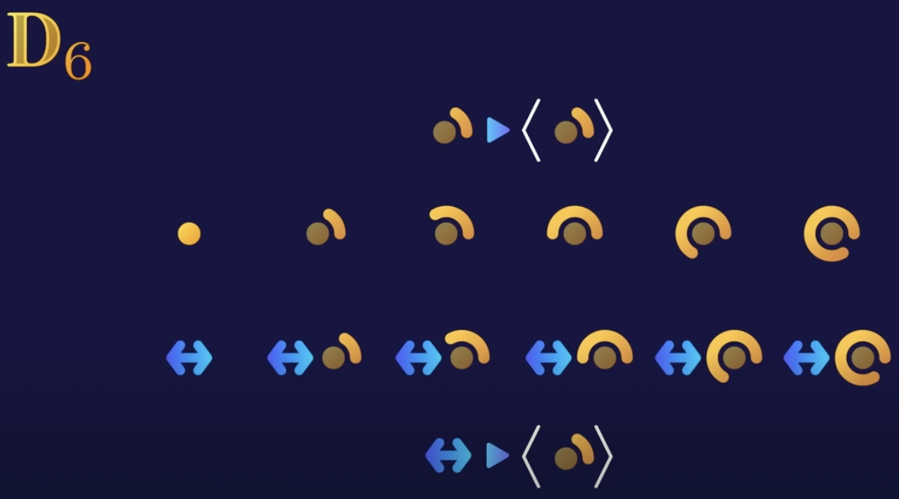
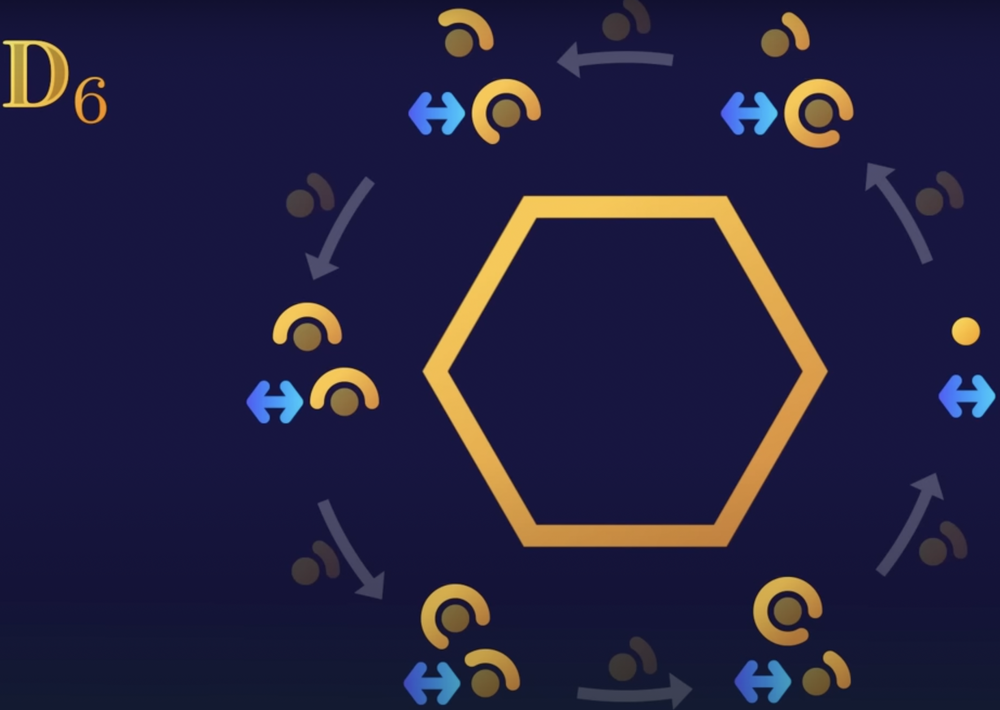

# 群论学习

发现了个很牛逼的群论介绍[视频](https://www.youtube.com/watch?v=mH0oCDa74tE),推荐大家看看。不过这个视频不是教程，只是一个关于群论的“预告片”。

### Introduction

接下来真正要学习的是这个[视频](https://www.youtube.com/watch?v=KufsL2VgELo)。

群是元素的集合，可包含任何数学对象。对象之间的操作可以是基本的加减乘除，也可以是完全不同的其他东西。但群需要满足一下四个公理：

1. 封闭性（closure）
2. 结合性（associativity）
3. neutral（不知道怎么翻译了）
4. 可逆性（inverse）

封闭性（closure）：对群内任意两个元素执行操作，得到的元素同样在群内。

结合性（associativity）：$(a\circ b)\circ c=a\circ (b\circ c)$。不是很好描述，大概就是运算的顺序不重要，最后得到的结果是一样的。

neutral（不知道怎么翻译了）：群中一定包含一个neutral的元素，通常用e表示，$a\circ e=a,e\circ a=a$，群中任意一个元素a与e元素执行变换，结果仍然为a，顺序不重要。

可逆性（inverse）：每个元素都在群中存在一个对应的逆元素，一般用指数-1表示，比如a的逆元素是$a^{-1}$。元素与其逆元素进行操作返回e元素。$a\circ a^{-1}=e$。

举个例子，$\Z$，或者整数集合，使用+操作时是一个群，可以自己验证一下是否符合上面4个公理。但是同样的$\Z$，使用乘法操作时却不是一个群。因为前3条都满足，e元素为1，因为任何数乘上1都等于其本身。所以为了满足可逆性，我们需要找到，比如4，的逆元素，而$\frac{1}{4}$这个明显的答案是不存在在$\Z$中的。因此$\Z^+$是一个群，$\Z^*$不是一个群。

一个群中有多少元素成为群的阶，用||表示。上面提到的$\Z^+$，还有$Q^+$（实数）和$Q^*$，其阶都是无限。$|\Z|=|Q^+|=|Q^*|=\infin$。

除了无限群，有限群也很常见。群的名称通常有下标，表示该群的阶。$|\Z_n|=n,|\Z_6|=6$。只有6个元素的$\Z_6$群长什么样呢？里面的元素只有0，1，2，3，4，5。这时候问题就来了，怎么保证封闭性呢？5+1=6，但是这个群里并没有6啊？注意在这个群里的运算中，达到6会变为0，很合理毕竟群里没有6以上的元素，从头开始也不失为一种好办法。5+1=0，对于其他元素同理，保证了封闭性。剩下几条公理自己可以验证了，很容易发现全部符合，故这是一个群。对于有限群来说，元素a的逆元素是群的阶n减去a。$a+n-a=e$。

介绍一个新群，$D_n$，代表dihedral group（[二面体群](https://zh.wikipedia.org/wiki/%E4%BA%8C%E9%9D%A2%E9%AB%94%E7%BE%A4))。二面体群是正n边形的对称群。比如选择一个六边形，这个六边形的二面体群是$D_6$，每种元素是保持六边形不变的一种变换。比如旋转0度，60度，120度等。正好有6种，转360度及以上不算，因为360度旋转和0度旋转结果一致。所以$|D_6|=6$吗？想象一下，我们可以把六边形翻个面，是不是也得到了原来的模样？翻转一下，然后拼接旋转，不又是一种变换了吗？因为有6种旋转，因此组合后的结果也有6种。6+6=12，此时群里就有12种变换了。$|D_6|=12$。推广到别的情况，$|D_n|=2n$。都是旋转和反转组合的结果。

既然看了这么多例子了，是时候该证明一下重要的公理了。问题1:群内可以不可以有多个e元素呢？设有两个e元素$e_1$和$e_2$，对两者进行操作，$e_1\circ e_2$。这时候就会发现问题：根据e元素的定义，与e元素操作的元素得到自身。$e_1\circ e_2=e_1,e_1\circ e_2=e_2,e_1=e_1\circ e_2=e_2$，这种情况只有可能在$e_1=e_2$时发生。故只有一个e元素。

还有其他的公理都可以用类似的方法证明，比如某元素a在群内的逆元素只有一个，a的逆元素的逆元素是本身，等等。

说到逆元素只有1个，$a^{-2}$表示什么呢？根据初中学的指数定律，这个式子等同于$(a^{-1})^2$或者$(a^2)^{-1}$，即a的逆元素的二次方和a的二次方的逆元素。很明显这两者是一个意思，所以$a^{-2}$就是个缩写罢了。同理$a^{-3},a^{-4}$等。

如果从群中截取一部分，这一部分正好也是一个群，那么截取出来的部分就是原本群的子群。比如偶数包含在$Z$中，全部偶数本身也符合群的定义，所以偶数集也是一个群，是$Z$的子群。然而奇数集并不是一个子群，太明显了就不用说为啥了。

$D_6$中所有旋转操作本身也构成一个子群，$D_3$也可以是$D_6$的子群，因为$D_3$中的所有操作都不会超出$D_6$的范围，且自身是一个群。

$Z$的子群偶数集，或者用$<2>$表示，因为群中的所有元素都是由2偏移而来的（可能不太准确但是那个意思差不多了……吧）。不难发现群关于它们的子群是高度对称的，指子群的偏移也会出现在群中。举个例子，上面的$<2>$子群和奇数集——虽然奇数集并不是一个子群——两者相差1，<2>偏移1可以得到奇数集。这种情况下，奇数集是$<2>$的一个陪集。不能说陪群(coset)，因为不一定是个群，但是也不能随便取个名字，毕竟也是有规律的。$1+<2>$表示了一个偏移1的陪集，也就是奇数集。$2+<2>$和$3+<2>$同样合法，只是把不同元素偏移到不同地方罢了。我们也可以不偏移,$0+<2>$，说明子群本身也是子群的陪集之一。

很好理解，对吧？根据这个性质，你会发现$D_6$群也有这样的对称性。把旋转操作看成一个群，翻转操作看作偏移，那旋转搭配翻转本身就会形成一个陪集。不好描述，直接看图。

反过来，把翻转看作一个群，把旋转看作偏移，这样又出现了一个高度对称群与其陪集。

为什么群内的子群和陪集总是这么巧妙地搭配在一起呢？这要问拉格朗日定理了。有一个群G和其子群H，则$|H| divides |G|$，即H的阶整除于G。$|D_6|=12$，其子群阶为6，6｜12，符合定理。

ps：拉格朗日是什么魔鬼，我感觉我已经在很多领域看见他了。

那个视频好像没有后续了。可能是我没找到。没关系我又找到了[一个](https://www.youtube.com/watch?v=RnqwFpyqJFw&list=PL8yHsr3EFj51pjBvvCPipgAT3SYpIiIsJ)。

一个五角星是一个阶为5的循环群。因为将其旋转五次会回到原点。在平面上随机放6个点，我们可以对其进行置换。把第一个点放到第二点的位置，把第二点的位置放到第一点，或者4个点之间互相换，或者自己换自己，也就是不变。第一个点有六种变换可能性，自己和其他5个点，第二点有5种可能性，第三点有4种可能性，所有的可能性就是6的阶乘720。我们把这种群叫做对称群$S_n$，此处为$S_6$。

向量空间中也有对称性。比如$\R^3$是一个3维向量空间，针对实数域。$\R^3$中的所有变换都可以用一个3\*3矩阵表示。但不是所有矩阵都符合我们的要求，有些矩阵不是对称的，即没有逆矩阵。回顾线性代数，矩阵有逆的条件是其行列式不为0。在$\R^3$中所有具有逆矩阵的3\*3矩阵集合，被称为$GL_3(\R)$。GL表示general linear group，一般线性群，也即所有行列式不为0的矩阵集合；3表示处理的是一个三维向量空间；$\R$表示研究的是实数域。

学了这么久了（两天也很久ʕ •ᴥ•ʔ），群论的终极目标是什么？

1. 将所有群按照同构进行分类。
2. 分类所有“群”是某种东西的对称性的方式(Classify all ways "group" is symmertries of something),这条感觉看英文更容易懂，用中文感觉卡在嘴边说不出来。

当我们发现了某种东西的对称性时，我们总是可以将其抽象成一个群，满足上面提到的公理。好的，那反过来呢？我们知道了一个满足公理的抽象群，这个群可以表达某个对象的对称性吗？其实这个问题等同于问“我们是否找到了表达一个群的所有公理？”。

### Cayley's theorem

Cayley‘s theorem，告诉我们答案是“没错”。首先要理解什么叫“作用于集合的群“。群G作用于集合S，意味着我们有一个函数，$G*S\rArr S$。更常见的写法是从G中取一个元素g，从S中取一个元素s，映射得到的S也可以写为$g(s)$。同时还要满足这些条件：$(gh)s=g(hs),1*s=s$。别忘了G表示了S的对称性，那条件1不过就是函数间的组合，条件2表示了恒等元素。

当G作用于S等于G时，$g(s)=gs$。$g(s)$是G作用于S的定义，gs是群积(group product)。这种情况发生时，意味着G是集合S的排列中的一个子群。集合S的所有排列都是群，跟之前看到的定义一致。这次我们有了个更严谨（高级）的子群定义：当G是H的子集，且拥有相同积，包含恒等元素，对群积闭合时，G是H的子群。

以上是Cayley‘s theorem的迷你版本，说明了任何群都是某个集合的排列中的子群。我们找到的映射（action）是左映射（left action），即$G*S\rArr S$和$g,s\rArr g(s)$。有左就有右。右映射（right action），表示$S*G\rArr S$和$s,g=(s)g$。同样满足一些条件:$(s)(gh)=((s)g)h,(s)*1=s$。完全就是左映射的镜像版本，连符号也镜像了。

虽然两种变换，左和右很像，两者却不一定相等。gs=sg?这个问题总是要打问号。如果s,g commute（这个单词的字面意思是通勤，放到这里大概意思就是两者可以交换位置），那我们说G是可交换的（commutative），或者是一个阿贝尔群(Abelian)。来看个三角形的小例子吧。

三角形中有两个对称群，A和B。A将三角形以过第3点的直线作为中轴进行翻转，B则是将三角形按顺时针旋转。数学家们非常懒，懒到不想写函数，所以他们把A表示为(12)，意思就是，执行A的变换后1点和2点交换了位置。同理B=(123)就是1点到2点，2点到3点，3点到1点。现在AB=(23)，注意AB表示先执行B再执行A；而BA=(13)。两者显然不同，故这是一个不可交换群。

G在左变换作用于S(=G)，意味着保留了G的右变换。（原文G acts on S(=G) on left preserves right action of G，为了不误解大佬们还是放出来英文吧，我英语不是特别好。)可能有点云里雾里，但它实际的意思是，g(sh)=(gs)h，就是个结合律而已。即使g和(sh)这项以及(gs)和h这项之间不一定可交换。

我写英文了，真的疯了这哪是数论课分明就是英语课。G=All symmetries of object with structure.其中symmetries代表actions on left，object就是集合S，本质上还是G，只要我们忽略G的群结构。structure代表right action of G on S。到这里开始绕起来了。Suppose f is symmetries of S preserving right action，意味着f(s)=f(1\*s)=f(1)\*s。那么这时的f=MULT by $f(1)\in G$。注意对G的变换不会保留作用于S的群变换（group
action），因为这相当于说g(ab)=(ga)(gb)，一般情况下都是错误的。总结就是，G对S的作用不会保留S的群结构，但是会保留G对S的右变换。我疑惑了这段看了好多遍都没懂。

这章很懵，让我们用一张记录8种G对S的变换的表来结束这一切。

### Homomorphisms

这章的视频有点糊。同态可以被表达为一个函数f从G到H的映射，并保留了乘法。意味着f(ab)=f(a)*f(b)。我没还能根据这个特性进行推广，f(1)=1,f(1)是G的恒等元素，1是H的恒等元素;$f(a^{-1})=(f(a))^{-1}$。同态可以视为保留群结构的函数。如果两个群G和H之间同态，意味着G和H某种意义上是同一个群，只是群内的元素被重新标记了。

同态的定义懂了（希望如此），别忘了一个名字特别像的兄弟：同构（isomorphism）。当上面提到的函数f为双射（bijection）时，也就是G对H满射，且有逆元素($f^{-1}$)，这个函数同构。同构代表着群的对称性

快乐造词时刻。如果函数f是从G到自身的同构，则称为自同构（automorphism）。

最后一个定义。f的核（kernel），是所有满足g(a)=1的元素a的集合。

来点线性代数例子（之前还有一个关于指数函数的，我不是很懂）。一个矩阵的行列式为ad-bc。det(AB)=det(a)\*det(B)。说明行列式det这个函数从$GL_n(\R)$到$R^*$的映射同态。$GL_n(\R)$表示从$\R^n$到$\R^n$的映射是可逆的，之前提过。这个例子中的核称为$SL_n(\R)$，特殊线性群(special linear group)。

群到处都有，比如数论。$\Z/4\Z$，表示模4下的所有整数，只有4个数字，0，1，2，3，操作符号用+表示。$(\Z/5\Z)^*$，表示乘法操作下模5的所有非0整数。也只有4个元素，1，2，3，4，符号为*。两个群之间的元素不一样，但两个群实际上是同构的。假设有一个函数f，它的作用是把一个群内的元素映射到另一个群内的元素。

$0\rArr 1$ $1\rArr 2=2^1$ $2\rArr 4=2^2$ $3\rArr 3=2^3\mod 5$

这个函数满足f(a+b)=f(a)\*f(b)，$f(a)=2^a$。同构满足。还不止，注意$\Z/4\Z\equiv (\Z/5\Z)^*$，那么$Z/4\Z$中的元素关于$\Z/5\Z$自同构（毕竟$\Z/4\Z$中的元素某种意义上也是$\Z/5\Z$中的元素，所以符合到自身的映射这一定义）。函数映射$g\rArr 2g$对于$\Z/5\Z$自同构，因为我们可以找到这个函数的逆$g\rArr 3g$，$2*3g=6g=g$，对于$\Z/5\Z$。

两个例子对我来说都有点难，来点高中就出现的圆。圆群（circle group）$S^1$，每个元素(x,y)满足$x^2+y^2=1$，圆曲线的基本定义。群内运算定义为$(x_1,y_1)(x_2,y_2)=(x_1x_2-y_1y_2,x_1y_2+x_2y_1)$。如果你跟我一样忘了，可以直接从头开始推。我们知道单位圆坐标可表示为$(x,y)=(cos\theta,sin\theta)$。那上面的运算定义的坐标x部分也可以写为$(cos\theta_1cos\theta_2-sin\theta_1sin\theta_2)$。根据[三角恒等式](https://zh.wikipedia.org/wiki/%E4%B8%89%E8%A7%92%E6%81%92%E7%AD%89%E5%BC%8F)，这一堆东西完全等同于$cos(\theta_1+\theta_2)$。到这里就很明显了，y部分同理。怎么看出来同态呢？$\R\rArr S^1$的变换函数为f，等同于$\theta\rArr(cos\theta,sin\theta)$。上面已经推算出了这个f的性质，$f(\theta_1+\theta_2)=f(\theta_1)f(\theta_2)$。同态了，好耶！顺便找个核吧。核集合中的所有元素$\theta$满足$cos(\theta)=1,sin(\theta)=0$，也就是$2\pi$的所有整数倍。

### Lagrange‘s theorem

一些有限群如下。

order 1:Trivial group 
order 2:$\Z/2\Z$ cyclic 
order 3:$\Z/3\Z$

怎么说呢，有点无聊。复习一下拉格朗日定理：群G的子群H的阶整除于G的阶。|H| divides |G|。复习肯定是有用处的，这不就来了个根据拉格朗日推出来的理论。

Corollary：群G中的元素g的阶整除于G的阶。元素的阶是什么鬼？指的是满足$g^n=1,n>=0$的最小数n。当你有一个n阶元素时，$\{1,g^2,...,g^{n-1}\}$是G的子群H，具有n阶。也就是说，G生成的子群的阶，与元素G的阶相同，进而一定符合拉格朗日定理。

说了这么多，有什么用呢？假设有一个群G，阶为p（p是质数），G中的元素g的阶一定整除于p，那g的阶只能是1或者p。当g的阶是1时，g是单位元素(identity element)。当g的阶为p时，代表G中有一个元素阶为p，根据Corollary，$G=\{1,g,g^2,...,g^{p-1}\}$，这个G不就是循环群了吗？（别忘了循环群的定义：只由一个元素的各种幂次生成）我们还能简单找到G的同构群$\Z/p\Z$（整数模p的剩余群），0对应G的1，1对应G的g，2对应G的$g^2$。这样我们就对所有质数阶的群做好分类了。

假设G作用于集合S，选择S中的一个元素s，查看H（满足gs=s的元素g的集合），明显为s的固定子群(H=fixed subgroup of s)。不止这一个子群，因为我们还可以挑选S中任意的其他元素s，继续找满足$gs=s$的元素g的集合，又是一个子群。

正着来记住了，反着来呢？假设H是G的子群，我们能否找到一个固定集合S，和$s\in S$，使H为s的固定子群？都这么问了，答案肯定是“可以”。我们需要借助H的陪集（coset）。

orbit，中文名轨迹（感觉群论里不能这么翻吧，啥玩意啊），指的是上面那个三角形中的点，比如那三个蓝点为G在集合S（三角形中所有的点）上的轨迹。不难看出集合上的所有映射（action）都会分裂成各个轨迹。所以3个蓝点之间有多少轨迹？1个，因为蓝点之间可以轻松映射到另一个，代表几个蓝点是等价的。（我是这么理解的，轨迹听起来有种连续的感觉，连接几个蓝点就得到了一个轨迹。红点也同理，不同的点其实都是1个点到处变换得到的像）对S的映射G是传递的（transitive，感觉这里翻译也不对啊），如果只有一个轨迹。所以G对蓝点的映射是传递的，G对红点的映射也是传递的。

假如已知G对S形成传递性映射，H是s的固定群，能不能从H，G中重构出S？这个问题太简单了（不是我说的，教授说的ಠ_ಠ），选择一个s，H是s的固定群。再选一个任意其他点t，使得t=gs，对于某些g。不排除不同的g会得到相同的t的可能性，因此:

$t=g_1s$ 
$t=g_2s$

继续推论,$g_2^{-1}g_1s=s$,因此$g_2^{-1}g_1\in H$,最后得到$g_1\in g_2H$。$g_2H$就是H的左陪集，当你从H中取出每个元素乘以相同的元素$g_2$时可得到。那为什么不能乘以$g_2$呢？确实可以，$g_1H=g_2H$。集合S中的元素s和H的左陪集是相互对应的，当我们有t时，可以找到其左陪集$t\rArr \{g | gs=t\}$；反过来，如果我们有一个gH形式的左陪集，我们也能找到对应的gs，$gs\lArr gH$。按照之前的传统，有左就有右。右陪集就是Hg，反过来。当g对H进行左映射时，形成的gH是左陪集；当g对H进行右映射时，形成的Hg是右陪集。

重述问题：H，G已知，重构出集合S，使得S为H的左陪集。要注意一个细节：

1. 任意取两个陪集$g_1H,g_2H$，它们只能相等或不相交（disjoint）。如果它们相交，意味着$g_1h_1=g_2h_2$,$g_1H=g_2H$。因为$g_1=g_2h_3$,$h_3$是$h_2$与H的逆元素的乘积。得到$g_1H=g_2h_3H$,$h_3H$又等于H，$g_1H=g_2H$。结论：如果两个陪集拥有一个相同的元素，那么它们实际上是相等的。G等于其陪集gH的不相交并集，G作用于其陪集，$g(g_1H)=(gg_1)H$。

任意陪集都拥有相同的大小，那么gH与H(=1H)拥有相同大小。这是因为当你有gH和H，gH中的元素t可以映射到H的$g^{-1}t$；H中的元素h也可以映射到gH的$gh$。注意这利用了群的逆，如果群中的映射的逆存在，我们可以得到半群（semigroup），典型例子是正整数群。半群中也有陪集，不过不一定具有相同大小。（建议看原视频，到这我真的懵了，英语也听不懂，机翻更是要命）

总结一下，毕竟真的太繁琐了。

1. G等于其陪集gH的不相交并集（G=disjoint union of cosets of H)
2. 所有的陪集都是同样大小的，由此可得|G|=|H|*陪集数量，自然|H|整除于|G|。

证明起来很痛苦，用起来是真的舒服。想象一个二十面体，固定其中一个三角形面，那么这个子群里有3个元素，因为有三种方式旋转一个三角形使其恢复原样。一个二十面体有20个三角形，这些三角形就是陪集。|H|=3，陪集数量=20，|G|=3*20=60。

几何不是我们熟悉的领域，再介绍一个数论例子，绝对每个人都知道的费马小定理：$x^p\equiv x\mod p$，p为质数。等同于$x^p-x$可被p整除。拉格朗日怎么和费马扯上关系？G中的元素g的阶整除于|G|，所以$g^{|G|}=1$，因为|G|是g阶的倍数，g的倍数幂等于1。这个式子怎么转换为费马小定理？如果我们让$G=(\Z/p\Z)^*$，也就是整数模p的剩余群中的非0整数。既然集合中没有非0元素，且一定与p互质，那么可以找到其逆元素，满足ax+bp=1，x是a模p的逆元素。G的阶是p-1，所以如果对于$\Z/p\Z$中的x满足$x\not ={0}$，那么$x^{p-1}\equiv 1\mod p$。熟悉的东西又出现了！欧拉定理同理，毕竟费马定理就是欧拉定理的一种特殊情况。

### products

上节课看了1-3阶群，那这节课就从4阶群开始引入吧。

4阶群G，根据拉格朗日定理，其中的元素阶只能为1，2，4。如果这个元素有4阶，那么形成的子群中有元素$1,g,g^2,g^3$，一个循环群，并且于$\Z/4\Z$同构。不妨假设$x^2=1$，对于所有$x\in G$。这意味着xy=yx，证明如下，注意x的逆元素是自身（$x=x^{-1}$），前面提到的$x^2=1$说明了这点；y等于其逆元素，同理。

$xyxy=(xy)^2=1$ 
两边乘以x的逆元素，得$yxy=x$ 
两边乘以y的逆元素，得$yx=xy$ 。该群是可交换的。

2是一个质数，我们在这种情况下证明了群可交换。现在让我们分类所有可交换群G，其元素x满足$x^p=1$，p是一个质数。我们要做的是把群操作写为加法而不是乘法，然后G就是$F_p$(p个元素的有限域)上的向量空间了。（完了我对域一无所知，继续写吧）$F_p$代表了$(\Z/p\Z)$。根据域上向量空间的定义，G与$F_p^n$同构。$F_p^n$是一个n维的向量空间。总结为，G的阶为$p^n$（对于某些n），G与$F_p^n$同构。拥有这些定义的群G被称为基本阿贝尔p群(elementary abelian p-groups)。

有点跑题了。4阶群有两种，$\Z/4\Z$和$\Z/2\Z*\Z/2\Z$。根据之前的经验，不能靠肉眼判断群是否不一样，这两个群有没有可能是同构的呢？如果两个群之间是同构的，那么它们每个阶的元素数量相同。$\Z/4\Z$有1个2阶元素，而$\Z/2\Z*\Z/2\Z$有3个2阶元素。在这里就已经不一样了，自然没有同构，它们就是两个群。可以用箭头来表示这种关系。

$0\rArr \Z/2\Z\rArr \Z/4\Z\rArr \Z/2\Z\rArr 0$ 
$0\rArr \Z/2\Z\rArr \Z/2\Z*\Z/2\Z\rArr \Z/2\Z\rArr 0$

这些箭头是什么意思呢？拿第一个箭头图距离，把左半部分盖上，留下$\Z/4\Z\rArr \Z/2\Z\rArr 0$，这里表达$\Z/4\Z$这个群与$\Z/2\Z\$是同态的；盖住右半部分，得到$0\rArr \Z/2\Z\rArr \Z/4\Z$,说明了$\Z/4\Z$的内核只是一组2阶群。第一个式子是不可分裂的(nonsplit)，因为你无法把中间那项写为左右两项的乘积；反之第二个式子是可分裂的(split)，因为中间项是左右两项的乘积。可分裂式子一般长这样：

$0\rArr A\rArr A*B\rArr B\rArr 0$

并不是所有的可分裂群都像上面的例子那样这么明显。不过我们是不是还没学过群乘积的定义？非常简单，群G和H的乘积表示为：

$G*H=(g_1*h_1)(g_2*h_2)=g_1g_2*h_1h_2$。

假设群G有子群A，B，A和B可交换，G中的所有元素都由一种ab的独特组合而成，$a\in A,b\in B$。那么，G同构与与A*B，$A*B\rArr G,a,b\rArr ab$。看点例子吧。

1. $\R^*$同构$\{1,-1\}*\R>0$（非负实数）
2. $\Complex^*$（复数）同构$S^1*\R>0$。$S^1$代表绝对值为1的圆群（跟单位圆很像）。后一种表达其实就是复数的极性分解（polar decomposition）。
3. $\Z/mn\Z$同构$\Z/m\Z*\Z/n\Z$，m，n为互质数。这是中国剩余定理啊，连起来了。这个群的核是m和n的倍数。既然m和n互质，那核只能是mn的倍数，因此$0$在$\Z/mn\Z$中。
4. $(\Z/mn\Z)^*$同构$(\Z/m\Z)^**(\Z/n\Z)^*$。这里带星号表示群中的元素全部与mn互质，群操作为乘法。例子中的例子：mn=15,$(\Z/15\Z)^*$同构$(\Z/5\Z)^**(\Z/3\Z)^*$。$(\Z/15\Z)^*$是一个4阶循环群，与$\Z/4\Z$同构；$(\Z/3\Z)^*$是一个2阶循环群，与$\Z/2\Z$同构。那么原群$(\Z/mn\Z)^*$也与$(\Z/4\Z)*(\Z/2\Z)$。
5. 有关8面体的旋转群的例子。8面体旋转群中共有48个元素，这48种元素可以被拆分为24种旋转与(1,-1)的乘积，说明48同构(24个旋转)*(1,-1)，8面体旋转群可分裂。20面体同理，但4面体不是。

### normal subgroups and quotient groups

假设H是G的子群，我们能不能构成G/H群？（商群，quotient）如果我们能找到，那这几个群之间应该构成下面的序列：

$1\rArr H\rArr G\rArr G/H\rArr 1$

G应该与G/H自同构，核是H。为了满足这个条件，G/H必须是H的左陪集的集合。但是H的左陪集的集合一定是一个群吗？拿出两个陪集实验一下不就知道了。$g_1H$和$g_2H$，两者相乘的结果最有可能为$g_1g_2H$。为什么是“最有可能”？因为还不知道啊，陪集相乘是否有明确定义？假设有元素$g_3=g_1h$，那么$g_3g_2H=g_1g_2H$。继续等量代换，刚刚的式子又等于$g_1hg_2H=g_1g_2H$，还能变形，$g_1g_2(g_2^{-1}hg_2)H=g_1g_2H$。至此，整个式子成立的条件只剩下$(g_2^{-1}hg_2)$是否在H中？如果在，那我们就有了陪集相乘的定义。考虑一下接下来几条等价性质：

1. 对于某些群G，$G\rArr X$，H是G的核。
2. 对于G中的所有g，$gHg^{-1}=H$
3. 对于G中所有g，gH=Hg
4. 左陪集和右陪集相等
5. 商群G/H存在

由以上5条，我们给出了H是平凡子群的定义（normal subgroup）。额外地，如果G是阿贝尔群，它的所有子群都是平凡子群。

讲完理论肯定要来点例子，这次是6阶群$S_3$。$s_3$的那些子群是平凡的？首先1和$S_3$本身肯定是平凡的。其次是集合$\{1,(123),(132)\}$，它们的索引是2。这个索引可不是编程里的索引，代表的是其陪集的数量。可能会有疑惑，是那种陪集，左还是右？注意这里左右不重要，因为左陪集$gH\rArr (gH)^{-1}=H^{-1}g^{-1}=Hg^{-1}$，变换一下就变为右陪集了。变换过程中注意$(ab)^{-1}=b^{-1}a^{-1}$。左陪集的数量一定和右陪集相等，故索引指的是那种陪集的数量就不重要了。

有一个小结论可以记一下。H中所有索引为2的子群都是平凡的。因为H中的所有索引2子群的陪集只能是H或者不在H里的元素，和右陪集完全一致。左陪集=右陪集。

回到刚刚的例子。子群${1,(12)}$，2阶索引3，是平凡的吗？答案是否。这个子群的左陪集是$\{1,(12)\},\{(123),(13)\},\{(132),(23)\}$，而右陪集是$\{1,(12)\},\{(123),(23)\},\{(132),(13)\}$。明显不一样。记录一下教授找左陪集的步骤。

$(123)*1,(12)$ 
$(123)*1=(123)$ 
$(123)(12)=(13),1\rArr 3,2\rArr 2,3\rArr 1$

我们要寻找陪集的子群是${1,(12)}$，那就把$S_3$中剩下的元素与子群元素一一相乘。首先是（123），和1相乘是本身；和（12）相乘相当于先做（123）转换，再做（12）转换，整体效果等同于（13），这是第一个左陪集。$S_3$还剩下两个元素，那这两个元素必定是另一个左陪集。右陪集同理。

如果H是一个子群，那么$gHg^{-1}$也是一个子群。因为$gag^{-1}*gbg^{-1}=gabg^{-1}$,在乘法下是封闭的。此时的$gHg^{-1}$称为H在g下的共轭（conjugate of H by g)。

G作用于子群集合H，定义G在H上的映射$g(H)=gHg^{-1}$。还是那个$S_3$群，有<12>,<13>,<23>,尖括号表示由括号内元素生成的组，换句话说，它们包含的最小子群。当我们尝试找共轭时，$(13)^{-1}(12)(13)=(23)$，也就是(12)和（13）共轭得到（23）；同理，（23）和（12）共轭得到（13）。这三个子群是互相共轭的。共轭代表了群的对称性，意味着当其中一个子群不是平凡子群时，其他两个看都不用看就知道也不是平凡的，因为它们在群的对称性下都是等价的。

这节课的总结。如果G有平凡子群H，$1\rArr H\rArr G\rArr G/H\rArr 1$。H和G/H通常小于G。还有要注意的一点，在知道H和G/H的情况下是无法确定G的。回想一下上节课的例子：

$0\rArr \Z/2\Z\rArr \Z/4\Z\rArr \Z/2\Z\rArr 0$ 
$0\rArr \Z/2\Z\rArr \Z/2\Z*\Z/2\Z\rArr \Z/2\Z\rArr 0$

两个群的$\Z/2\Z$是同构的，商群也是同构的，但中间项却不一定是同构的。

### Semidirect products

一个奇怪的定义：$y^x=x^{-1}yx$。写为指数的原因是这个运算满足幂法则。$(y_1y_2)^x=y_1^xy_2^x,y^{(x_1x_2)}=(y^{x_1})^{x_2}$。

现在我们有一个子群A，平凡子群B，G=AB，且是唯一定义。不难找到A对B的右映射。数学就是从抽掉一个条件开始的。现在我们还是有一个子群A，平凡子群B，以及A对B的右映射。问可以找到G吗？

让G为A*B的集合，定义$(a_1b_1)(a_2b_2)$为$(a_1a_2)(b_1^{a_2}b_2)$。这样足够让G成为一个群了吗？我们需要解决的问题是结合律（associative law）。从G中抽出3个元素，分别为$a_1b_1,a_2b_2,a_3b_3$。我们可以先乘前两项，然后乘上最后一项；或者反过来，先乘后两项，然后乘上第一项。要确认两种方式得到的答案是否一致。

$(a_1b_1*a_2b_2)*a_3b_3$ 
$=a_1a_2b_1^{a_2}b_2*a_3b_3$ 
$=a_1a_2a_3(b_1^{a_2}b_2)^{a_3}b_3$

注意对$(a_1b_1)(a_2b_2)$的定义。先乘后面两项会得到另一个结果。

$a_1b_1*(a_2b_2*a_3b_3)$ 
$=a_1b_1*a_2a_3b_2^{a_3}b_3$ 
$=a_1a_2a_3b_1^{a_2a_3}b_2^{a_3}b_3$

两者其实是一样的，因为第二个式子得到的值可以通过第一个式子进行幂法则得到。总结一下，给予A，B，A对B的右映射，我们可以得到半直接乘积（semidirect product），表示为$A\ltimes B$。B是平凡子群，A是子群。$A\ltimes B$中的映射$b\rightarrow a^{-1}ba$与给定的A对B的右映射相同。A对B的左映射表示为$B\rtimes A$（终于知道VS code图标是什么东西了）。数学家们太喜欢发明符号了，记住这个符号的竖线永远不对着平凡子群。

$S_3\cong \Z/2\Z \ltimes \Z/3\Z$,$\cong$表示同构，$\Z/2\Z\rightarrow 1,(12),\Z/3\Z \rightarrow 1,(132),(123)$。尝试分类6阶群G。

1. G有3阶元素g，那么一定有3阶子群$1,g,g^2$。这个子群为平凡子群，因为所有索引为2的子群都是平凡的。
2. G有2阶子群。如果G没有2阶子群，那除恒等元素之外G必定有3阶元素。然而3阶元素是可逆的，所以它们总是成对出现，意味着G有偶数个3阶元素。问题是G有奇数个非恒等元素的元素，那么G中肯定有2阶或6阶元素。如果是6阶，将其立方就又得到了一个2阶元素。

由上，G是$A\rtimes B$的半直接乘积，其中A为3阶，B为2阶。B在A上的映射是什么？$\Z/2\Z$如何作用于$\Z/3\Z$？$\Z/3\Z$的同态只有两种，$g\rightarrow g,g\rightarrow g^{-1}$，可以形成一个2阶群。$\Z/2\Z$刚好也是2阶，就有了以下两种情况：

1. $\Z/2\Z$平凡作用于$\Z/3\Z$（$\Z/2\Z$ acts trivially on $\Z/3\Z$）。这种情况下我们得到直接乘积（direct product），$\Z/2\Z*\Z/3\Z=\Z/6\Z$
2. 由h生成的$\Z/2\Z$非平凡作用于由g生成的$\Z/3\Z$,($\Z/2\Z$ acts nontrivially $\Z/3\Z$ generated by g)。$g^h=g^{-1}$，这种情况下与$S_3$同构。

这节课同样用几个例子来结束。

1. ax+b群。这是一个包含R中形式为$x\rightarrow ax+b(a\not ={0})$的所有变换的群。也可以写成矩阵形式$\begin{pmatrix}
    a&b\\
    0&1
\end{pmatrix}$。R中的平凡子群b为$x\rightarrow x+b$，$R^*$中的子群a为$x\rightarrow ax$。这里的取幂符号有点奇怪，$[b^a=ba]$。

2. （后面就是照抄了，懵逼了）$R^n$下的等距变换（跟刚才的差不多，只是这个扩展到n维了）。变换的平凡子群与$R^n4同构，正交变换的子群$O_n(R)$作用于$R^n$。

### Extensions

这节课来看8阶群。由拉格朗日定理可得，G中的元素g的阶有可能是1，2，4，8。如果G中只有阶为1，2的元素，$G=\Z/2\Z*\Z/2\Z*\Z/2\Z$。我们假设G有一个4阶元素g，则$G=\{1,g,g^2,g^3\}$。H为2阶，所以在G中是平凡的，同时H同构$\Z/4\Z$。得到下面的表达式：

$1\rightarrow \Z/4\Z\rightarrow G\rightarrow \Z/2\Z\rightarrow 1$

这个式子形如以下：

$1\rightarrow A\rightarrow G\rightarrow B\rightarrow 1$

这是一个典型的求扩展（extension）问题。扩展问题指的是我们知道A和B两个群，想要求出来中间的群是什么。可以说G是B在A下的扩展（G is extension of B by A)。其实也能说是A在B下的扩展，毕竟记不住啊。在之前我们知道无法找到特定的一个G，但是我们能不能把所有可能的扩展进行分类呢？先在A群——也就是$\Z/4\Z$群——找一个a，使得$a^4=1$。再在G中找一个b，使其映射到B群的像阶为2，不过b在G中本身阶不必为2。

B标准化A，所以$b^{-1}ab=a$或者$a^3(a^{-1})$。$b^2\in A$在B中的像为1(b^2 in A as image 1 in B，看不懂了啊)，则$b^2=1,a,a^2,a^3$。如果$b=a^3$，将a变为$a^{-1}(=a^3)$。可以排除，直接假设$b^2=1,a,a^2$。我们之前还有一个条件，$a^4=1$，这几个式子就是需要的方程，共有6种可能性。

1. $b^{-1}ab=a,b^2=1$:这种情况由于$b^2=1$，b其实生成了一个2阶的子群，所以我们得到了一个半直接乘积。如果a和b可交换，$\Z/2\Z*\Z/4\Z$是这种情况下唯一的可能性，也就是B*A。
2. $b^{-1}ab=a^{-1},b^2=1$:这种情况下我们有$\Z/4\Z\rtimes\Z/2\Z$。
3. $b^{-1}ab=a^{-1},b^2=a$:这种情况不存在，因为$b^2=a$代表ba=ab，a和b是可交换的，那$b^{-1}ab=a^{-1}$的情况不可能出现。
4. $b^{-1}ab=a,b^2=a$：这种比较简单，意味着$b^8=1$，由b生成了一个8阶循环群$\Z/8\Z$，同时$A=\{1,b^2,b^4,b^6\}$。
5. $b^{-1}ab=a,b^2=a^2$:其实这种情况和第一种是一样的。让$c=ab,c^2=1,c^{-1}ac=a$。我们说一个扩展是可拆分的，如果它是一个半直接乘积。
6. $b^{-1}ab=a^{-1},b^2=a^2$:有这些条件，$b^4=1,a^4=1,b^{-1}ab=a^{-1}$。从其中一种情况中我们知道有可能没有群满足这些条件。不过这里是有的，有一种四元数群$Q_8$。所以现在的任务是找到这个四元数群。

让$a=\begin{pmatrix}
    i&0\\
    0&-i
\end{pmatrix},[i^2=-1]$,$b=\begin{pmatrix}
    0&1\\
    -1&0
\end{pmatrix}$,$c=\begin{pmatrix}
    0&i\\
    i&0
\end{pmatrix}$。此时我们发现满足了$a^4=1,b^4=1,b^{-1}ab=a^{-1}$。然而还有一个问题，找到符合条件的矩阵没问题，但是这些矩阵形成的群是8阶吗？之前不成立的情况中是可以找到满足条件的群的，可是它们只有4阶。检查一下，发现$G=\{\pm a,\pm b,\pm c,\pm \begin{pmatrix}
    1&0\\
    0&1
\end{pmatrix}\}$确实是8阶群，且四元数群存在。下节课就来仔细看看这个四元数群究竟是什么东西。

### Quaternions

定义四元数群$Q_8$为$\pm 1,\pm I,\pm J,\pm K$，且满足以下条件，$IJ=K,JK=I,KI=J,I^2=J^2=K^2=-1$。群中的所有元素都可以用矩阵表示，$I=\begin{pmatrix}
    i& \\
     &-i
\end{pmatrix}$,$J=\begin{pmatrix}
     &1\\
    -1& 
\end{pmatrix}$,$K=\begin{pmatrix}
     &i\\
    i& 
\end{pmatrix}$,$1=\begin{pmatrix}
    1&0\\
    0&1
\end{pmatrix}$,$-1=\begin{pmatrix}
    -1&0\\
    0&-1
\end{pmatrix}$。可形成四元数环，a+bI+cJ+dK，a，b，c，d均为实数，与$R^4$同构。注意环上乘法不可交换，因为IJ=-JI，其他同理。四元数是一种复数的模拟，$\Complex=a+bi,a,b\in \R,i^2=-1$。可以取a+bi的共轭a-bi，使复数与其共轭相乘等于$a^2+b^2\geq 0$。这也被称为复数Z的范数（norm），N(Z)。范数满足$N(Z_1Z_2)=N(Z_1)N(Z_2)$。复数Z的范数只是Z绝对值的平方。

四元数的共轭概念和复数很相似。有复数Z为a+bI+cJ+dK，则复数Z的共轭为a-bI-cJ-dK。两者相乘，得$a^2+b^2+c^2+d^2\geq 0$。四元数的范数同样满足$N(Z_1Z_2)=N(Z_1)N(Z_2)$。由范数的定义，是不是想到了圆的曲线定义？没错，只不过现在我们把它看作群。然而有关圆的群不多，只有3种。

1. $S^0：N(Z)=1\in R(\pm 1)$
2. $S^1：N(Z)=1\in \Complex$
3. $S^3：N(Z)=1\in H$

分别是实数域，复数和四元数。四元数形成了$S^3$中的圆，正巧四元数也是一种表达三维中旋转的办法。让三维空间表示为$R^3=\{bI_cJ+dK\}(a=0)$，一种虚构的四元数，实数部分a为0。从这个三维空间中取出向量$v\in R^3$，再从$S^3$中取一个四元数$g\in S^3\subseteq H$，为四元数的子集。做一个四元数乘法(quaternion multiplication)，$gvg^{-1}\in R^3$。积也在$R^3$中，同时保留长度，因为$N(g)N(g^{-1})=1$,因此$N(gvg^{-1})=N(v)$。$N(v)$本身只是其长度的平方，保留了长度。$gvg^{-1}$表示了$R^3$中的旋转变换。

根据旋转的定义，你可能会以为$S^3$是三维空间中的旋转群。这个想法并不是特别准确，可以写一个表达式。

$1\rightarrow\pm 1\rightarrow S^3\rightarrow SO_3(R)\rightarrow 1$

$SO_3(R)$表示实数上三维空间的特殊正交群，简单说就是3*3正交矩阵。在线性代数中我们知道这个群代表了$R^3$中的旋转。此处的$S^3$有了个新名字，双重覆盖（double cover of $SO_3(R)$）。这在数学中很常见，指的是A群映射到B群且A群的核是2阶。可以试一下“汤盘技巧”来体会一下双重覆盖。

想象手里托着一个汤盘（其实杯子也行，什么都行，只要你托着个东西就行），然后你把托着的东西逆时针旋转360度。这样你的手臂也会顺带逆时针旋转360度。按照一般的经验，把手臂恢复就要把东西顺时针旋转360度，也就是反过来。但现在你再来一次逆时针360度，你会发现手臂仍然回到了原样。

这和$SO_3$有什么关系？$SO_3$表达了三维空间的旋转，可以用其中的元素来任意旋转手上的东西。某种意义上$SO_3$和物品的位置有关。$\pm 1$这个2阶群对应了你在拿着东西的时候可以360度旋转手臂，然而再次旋转360度时，这个集合中的元素平方为1，原本的旋转也消失了。

我们可以在$SO_3(R)$中找到一些有限的旋转群，虽然很多都是无聊的循环群，但是其中3个比较有趣的相信大家都知道：4，8，20面体的旋转群，阶分别为12，24，60。我们可以取这些群在$S^3$中的逆像（inverse image），就有了阶为24，48，120的群。这些群被称为二元4面体，8面体，20面体群，都是原来群的双重覆盖。

数学讲究的就是理论，四元数名字里有个4，怎么能不拿来表示4维旋转呢？$R^4=a+bI+cJ+dK$。现在我们有2个元素，$g\in S^3$和$h\in S^3$。再从$R^4$里拿一个元素，$v=R^4$，让$v\rightarrow gvh^{-1}$。对于任意g和h，$gvh^{-1}$一定在$SO_4(R)$中，且不难验证保留长度，是旋转变换。给了我们下面的表达式：

$1\rightarrow (-1,-1)\rightarrow S^3*S^3\rightarrow SO_4(R)\rightarrow 1$

说明两者同构：$SO_4(R)=\frac{S^3*S^3}{(\Z/2\Z)}$。

### Burnside's lemma

这节课要从一个很多人都见过的脑力小问题开始。有一个8*8的国际象棋棋盘，请在上面放8个车，让车之间不会互相攻击（国际象棋里的车跟中国象棋一样，可以攻击同行或者同列的棋子）。教授看都不看就写出了一种解法，但都已经是学群论的人了，怎么能只满足于一种解法？真正的问题是，到底有多少种解法？

这个问题很简单，甚至不需要用群论，只用排列组合的知识就能知道。放下一个车，代表8列棋盘中只剩下7列可以放车；放下两个车，代表8列棋盘中只剩下6列可以放车。每放一个车，剩下的车的可能放置列就少一个，故可能性为8的阶乘，40320种。真正问题中的真正问题：有多少种摆法是对称的？可以通过旋转之前的摆法得到的摆法不算。由此引入了这节课的主题：Burnside's lemma。

还记得orbit吗？我们知道orbit的定义是将群中的元素带到另一个元素，那orbit就代表了一种对称，询问“有多少种对称方法”就是询问“有多少个orbit”。因此我们可以把问题转换为更数学层面的表达：群$D_8$作用于大小为40320的集合，有多少个orbit？

Burnside's lemma的叙述直接提到了群中orbit的数量。orbit的数量=群中固定点的平均数。$\frac{1}{|G|}\sum S^g$，$S^g$代表被g固定的元素S的数量,换句话说就是gs=s。按照之前的传统，必须证明一下。

注意看满足gs=s，$g\in G，s\in S$的(g,s)对的数量。我们有两种方法来计算数量，一种是$\sum_g S^g$,$S^g$是g固定的点的数量；另一种是$\sum_s |G_s|$,$G_s$是固定s元素的子群。$G_s=\frac{G}{|s的orbit大小|}$，注意当G作用于一个集合时，G=集合的大小*固定某一个元素的子群。因此还可以这样写，$\sum_s |G_s|=\sum_{orbits} |orbit|\frac{|G|}{|orbit|}$。后面的式子本质上等于$\sum_{orbits}|G|=|G|*$orbit的数量。现在把这个式子和第一个式子$\sum_g S^g$进行比对，$\sum_g S^g$=|G|*orbit的数量，两边除以G的阶，orbit的数量=$\frac{1}{|G|}\sum_g S^g$，也就是固定点的平均数，得证。

为了应用这个定理，首先需要找到$D_8$群的元素。一个正方形，可以左右翻转，上下翻转，沿着两个对角线翻转，顺时针转，逆时针转，同时沿两个对角线翻转。这样就得到了8个元素。但我们根本不需要全部的8个元素，因为左右翻转得到的两个元素具有相同数量的不动点，也就是等价的。两个对角线，顺逆时针同理。这两种元素称为共轭类（conjugate class）。共轭类的非正式定义比较随意：两个元素是共轭类，如果它们看起来差不多。明显不是严谨的数学定义，但是在大多数情况下很好用。

不过我们还是需要更严谨的数学定义的。想一下，是什么决定了两种元素“看起来差不多”？左右翻转是沿垂直轴，上下翻转是沿水平轴。我们可以应用一些转换将垂直轴变为水平轴，比如把左右翻转称为a，上下翻转称为b，顺时针旋转称为g。可以上下翻转b再逆时针旋转（也就是顺时针反过来，逆变换）得到a，写为数学就是$a=gbg^{-1}$,这就是为什么两种看起来很像，因为它们可以靠这样相关起来。这也是共轭的官方定义：a和b共轭，如果对于某些$g\in G$,$a=gbg^{-1}$。这种关系也可以用$\equiv$来表达，等价类（equivalent classes）的定义等同于共轭类（conjugate classes）。我们利用共轭类将群中的元素从8个缩减到5个，看起来不是什么大的突破，但是在更大的群中效果就非常明显了。

正式开始解题。以下内容按照 共轭类 元素数量 固定点数量 排列。

1. 恒等元素 1 8！=40320。不做任何变换，放上的车一定不会改变。之前算出来有40320种方法放车，那在这种变换下40320种都是固定点。
2. 上下/左右翻转 2 0。所有放上的车都会被翻转，由于是8*8，双数，翻转后位置肯定会改变，故固定点数量为0。
3. 同时按两个对角线翻转 1 8\*6\*4\*2=384。
4. 顺逆时针转 2 6*2=12
5. 分别按两个对角线旋转 2 764。这种情况比较棘手，让$C_n$=n*n棋盘上排列的数量，$C_n=C_{n-1}+(n-1)C_{n-2}$。$C_8=764$。

求平均数。40320\*1+0\*2+384\*2+12\*2+764\*2=42256。（固定点数量\*元素数量，但不知道为什么是384\*2，明明384那一栏只有1个元素）。整体除以阶数，$\frac{42256}{|G|=8}=5282$。

### Groups of prime power order

给群分类分到哪了？这次来9阶群。分类一个9阶的阿贝尔群，那么它只可能有1，3，9阶的元素。如果G有9阶元素，说明它是一个循环群，与$\Z/9\Z$同构。如果G没有9阶元素，那么G就是域$F_3$上的向量空间，同构$F^2_3$同构$\Z/3\Z*\Z/3\Z$。

上面这套规则适用于所有阶为$p^2$的群，p为质数。但是怎么能告诉你就直接信了呢，肯定要自己证明一下。请证明$p^2$阶，p为质数的群G是阿贝尔群。分几个部分证明。

1. 所有$p^n$阶，n>0，p为质数的群都有非平凡中心。(has nontrivial center)。当有一个元素g为中心时，对于所有的h，gh=hg。非平凡指的是不止一个元素。比如恒等元素一定满足中心的概念，但是只有恒等元素一个中心就很无聊了。

怎么证明呢？关注G对G的一个伴随映射$g(h)=ghg^{-1}$，轨迹=共轭类（Look at a adjoint action of G on G,$g(h)=ghg^{-1}$,orbits=conj.classes)。中心=大小为1的轨迹，因为大小为1的轨道相当于说h和g可交换。接着又有所有轨道的大小为$\frac{|G|}{|G_s|}$，G的阶数除以固定轨道元素的子群的阶数。这个式子的结果一定是p的某个幂，因为我们之前假设了G的阶数是p的某次幂（p是质数，根据拉格朗日定理，其子群只能有整除于原本群的阶，整除于p的n次幂的数只有p的n次方和1，故结果一定也是p的某次幂）。变换一下，得到$|G|=$大小为1的轨道的数量+$\sum_{大小大于1的轨道}（轨道大小）$。用文字表达就是所有尺寸大于1的轨道乘上轨道大小的总和。想一下这个公式，当n>0时，p一定整除于|G|。p也整除于大小大于1的轨道，因为它的每个项都是p的幂。p同样整除于大小为1的轨道的数量，意味着大小为1的轨道的数量>=p。到这里就证明一定有不止一个非平凡中心了，最少要p个，正整数中质数最小为2。

2. 如果$G/\Z(G)$是循环的，那么$G=\Z(G)$。$\Z(G)$表示G的中心，显然G的中心是一个平凡子群，因为随便找一个元素代入$ghg^{-1}$，结果都等于h。又可以形成一个商群，如果G等于它的中心，那商群就是循环的。这种情况下群是普通群（trivial，咋翻译啊）。不过还有别的情况，比如四元数群$G=Q_8.\Z(G)=(\pm 1),\frac{G}{\Z(G)}=(\Z/2\Z)*(\Z/2\Z)$,既不是循环群也不是普通群，是其他群的乘积。

假设$G\Z(G)$是循环的，选一个$g\in G$,使其像生成$\Z/G(\Z)$。那么G中的所有元素都是$g^n\Z$的形式，$\Z\in \Z(G),n\in \Z$。$g^nZ_1$和$g^nZ_2$可交换，因为$Z_1$和$Z_2$都是中心，当然可交换;两个$g^n$互相也可交换，因为它们都是G的幂。换句话说，G中的所有元素都与G中的其他元素互相可交换。由此得$G=Z(G)$。

总结目前得到的两条内容。p群的中心是非平凡的，p群指的是阶为p次幂的群；除以中心得到的商群不能为非普通循环群。让$|G|=p^2$，$|Z(G)|$除以|G|=$p^2$，那么Z(G)可能为阶1，p，$p^2$。1是不可能的，因为第一条理论告诉我们$Z(G)>1$。p也不可能，因为这就意味着$|G/Z(G)|=p$，所以G/Z(G)是普通的，第二条理论告诉我们不可能。唯一的可能是$p^2$，那么Z(G)=G,G为阿贝尔群。

最终总结：任何阶为$p^2$的群同构$Z/p^2Z$或者(Z/pZ)*(Z/pZ)。这也说明了所有p群（阶为$p^n$,p为质数的群）都是幂零的（all p-groups are nilpotent)。幂零指的是可以通过重复去除中心来普通化群（can kill group by repeatedly killing center)。举个例子，有一个群$G_0$,让$G_1=\frac{G_0}{Z(G_0)},G_2=\frac{G_1}{Z(G_1)},G_3=\frac{G_2}{Z(G_2)}...$。如果$G_n$在某个n的时候成为了普通群，群G就称为幂零群。继续拿例子，$G_0=Q,G_1=\frac{Q}{(\pm 1)},G_2=trivial$。

### Cauchy's theorem

应该能猜到这节课要干什么吧？没错，分类10阶群。10=2\*5，所以这节课相当于分类阶为2p的群，p是质数。科西定理告诉我们，如果p（质数）整除于|G|,那么G拥有p阶的元素。质数这点很重要，比如G=Z/2Z\*Z/2Z,那么|G|=4，但是G没有4阶元素。这个定理相当于拉格朗日定理逆定理的一半，现在让我们用两种方法来证明，一种是群论里证明的通用方法，另一种则是更巧妙的证明。

假设p（质数）整除于|G|，证明目标是G有p阶元素。假定这个结论对于所有更小的群成立。

第一种情况，G是阿贝尔群。选择阶为质数q的元素$g\in G$。如果q=p，直接成立。如果不等于，关注G/\<g\>群，\<g\>表示g生成的群。之前假定G为阿贝尔群，那么G的所有子群都是平凡的，且阶数小于G。用[归纳法](https://zh.m.wikipedia.org/zh-cn/%E6%95%B0%E5%AD%A6%E5%BD%92%E7%BA%B3%E6%B3%95)可以找到元素$h\in G/<g>$，h阶为p。$G/<g>$的阶整除于p。提高h到$a\in G$，a的阶是p的倍数，详细点看，a可能有阶p或者pq。如果是p，证明结束；如果是pq，那么$a^q$的阶为p。无论哪种情况，我们都找到了G中阶为p的元素。G是阿贝尔群的情况证明完成。

如果G不是阿贝尔群呢？假设每一个恰当的子群都有和p互质的阶数，“恰当”代表子群不为G本身。要求是互质阶数是因为如果子群有可被p整除的阶数，那么我们可以利用刚才的归纳法在其中选一个阶为p的元素，就又回到上一种情况了。